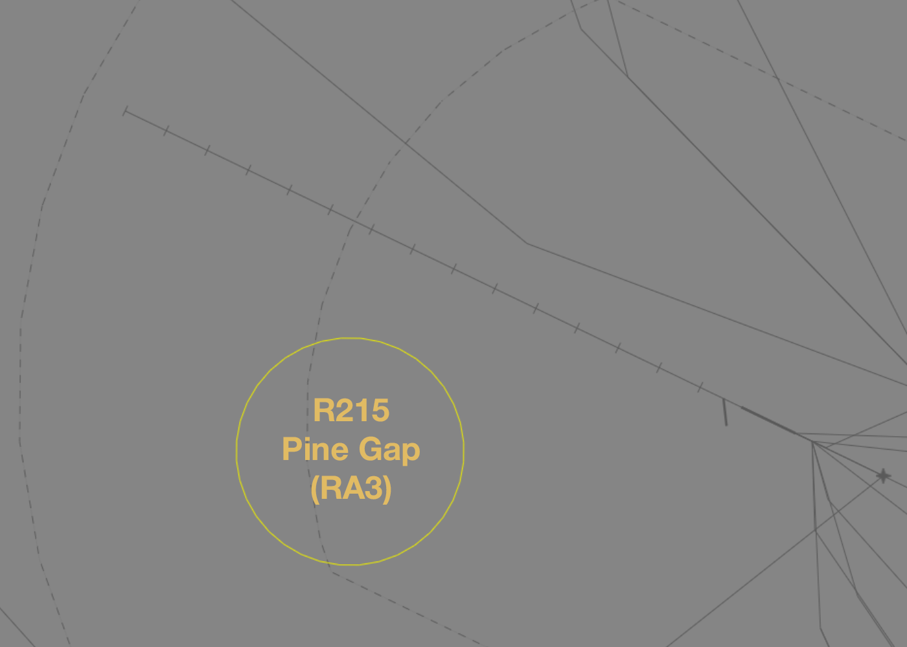
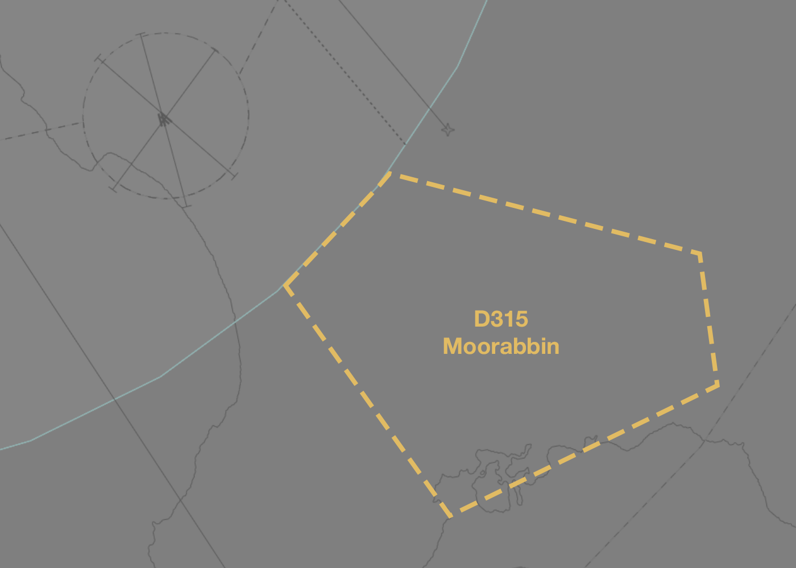
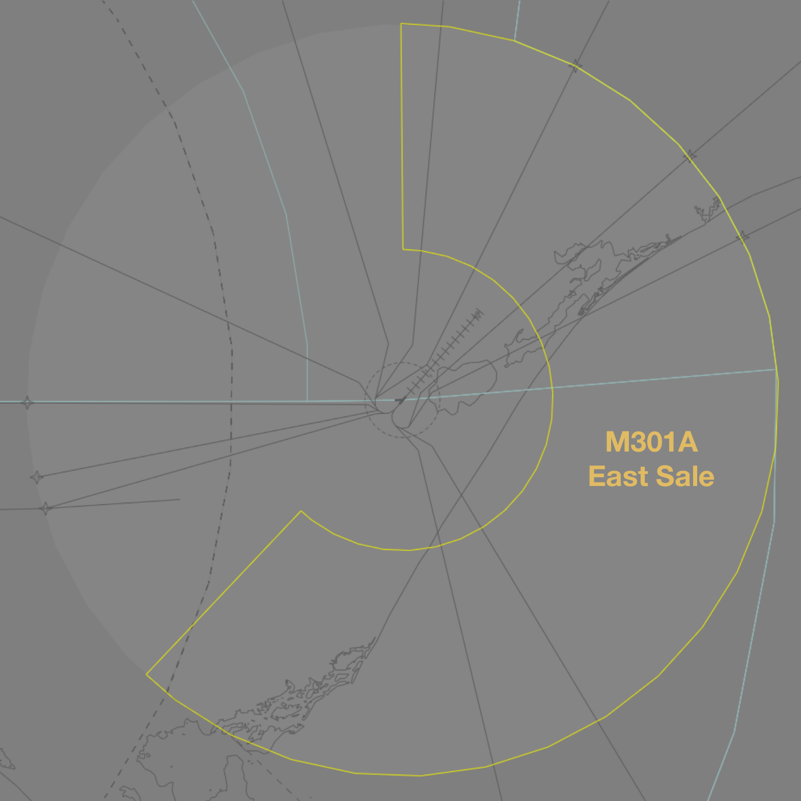
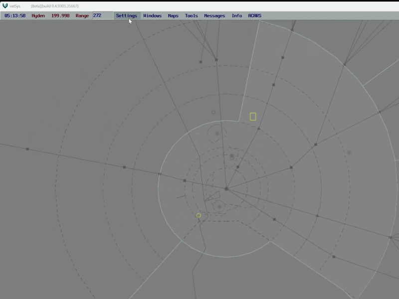
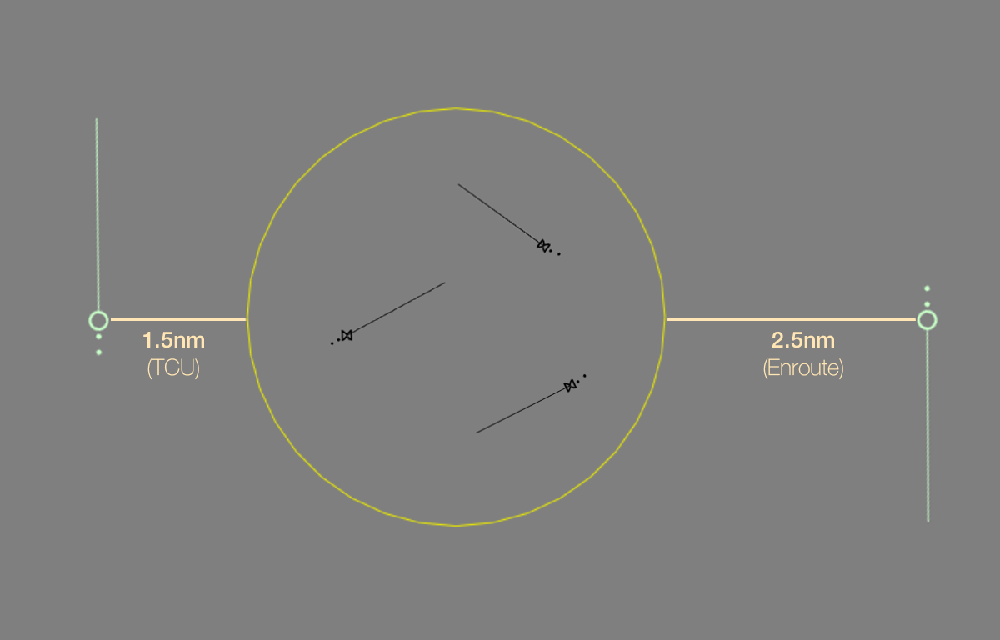

--8<-- "includes/abbreviations.md"

## Types of Special Use Airspace
Special Use Airspace (SUA) is airspace designated for specific operations that may impose limitations on access or use of airspace for non-participating aircraft. These special use airspace blocks are designated as [danger areas](#danger-areas), [restricted areas](#restricted-areas), and [military operating areas](#military-operating-areas).

SUAs are only operational when **activated**. In the real world, SUAs are activated according to the  published operational hours in the ERSA, or by NOTAM. On VATSIM, SUAs that are associated with flying areas are considered to be inactive unless [activated](#activation-of-sua), either by [NOTAM](#activation-by-notam) or [ad hoc approval of a request](#ad-hoc-activations).

Approval is required to operate in a restricted or military operating area, but not to operate in a danger area. The activation of SUAs can modify procedures at different airports, including precluding the use of certain approaches, SIDs, or STARs.

!!! note
    In the real world, details of SUA activations are distributed widely to ensure that filed flight plans already include the necessary diversions before they reach ATC. Online, pilots are very unlikely to be aware of the rerouting requirements, and may have difficulty adjusting to a reroute on short notice. Nearby controllers (particularly those performing the role of ACD) are also unlikely to be aware that some flight plans may require adjustments.
    
    Unless an activation has been [advertised by local NOTAM](../../sua/#activation-by-notam), controllers should work with pilots patiently and, where a pilot is unable to comply with a reroute, attempt to facilitate the safe transit of the SUA. Controllers should also follow best practice by announcing activations in vatSys' controller chat, amending voiceless coordination requirements, and proactively assisting other controllers.
    
    In all cases, controllers should display professional behaviour to other controllers and pilots when facilitating SUA operations.

### Restricted Areas
Restricted areas are established to restrict the passage of aircraft through hazardous or sensitive areas. They are labelled with the **R** prefix (e.g. R215, the restricted area around Pine Gap, near Alice Springs). Approval *is* required to enter. Pilots who do not have approval to enter a restricted area must remain either laterally or vertically clear.

Restricted airspace is classified based on three levels of severity which impact the flight planning requirements surrounding them. The classification of each restricted area can be found in the `ERSA SUA` section.

| Classification | Flight Planning Requirements |
| -------------- | ---------------------------- |
| RA1 | Pilots may flight plan through the restricted area and under normal circumstances expect a clearance from ATC |
| RA2 | Pilots must not flight plan through the restricted area *unless* on a route specified in the ERSA Flight Plan Route (FPR) section |
| RA3 | Pilots must not flight plan through the restricted area and clearance **will not** be available |

<figure markdown>
{ width="800" }
  <figcaption>R215 Restricted Area</figcaption>
</figure>

### Danger Areas
Danger areas are established to discourage pilots from transiting a hazardous area. In real life they can be used to delinate airspace around many different types of hazards, including high-intensity flight training, parachuting, blasting, exhaust plumes, and more.

Approval is *not* required to enter, however pilots should be aware of the risk in doing so. They are labelled with the **D** prefix (e.g. D315, a training area south-east of Melbourne used by flights from Moorabbin).  Most major terminal areas include designated training areas which may be labelled as danger areas.

<figure markdown>
{ width="800" }
  <figcaption>D315 Danger Area</figcaption>
</figure>

Danger Areas are not visible by default on vatSys. They can be made visible by changing the 'Map Line' when [activating](#activation-of-sua) the area in the Restricted Area Setup menu.

### Military Operating Areas
Military operating areas are a subset of danger areas which are established to facilitate a range of military operations. They are labelled with the **M** prefix (e.g. M301A, which makes up part of the military airspace within the East Sale TMA). Inside Australian territory, approval *is* required to enter an MOA.

On VATSIM, MOAs are generally assumed to be deactivated unless being actively used for a military exercise or other purpose. ATC (when online) will generally try to reroute civil aircraft around these activities or will otherwise organise a transit clearance from the station responsible for the airspace.

<figure markdown>
{ width="800" }
  <figcaption>M301A Military Operating Area</figcaption>
</figure>

## Activation of SUA
Responsibility for activation of an SUA lies with the controller with jurisdiction over the airspace, regardless of the operations normally conducted within it.

!!! example
    The R586B restricted area is used for military operations associated with YWLM. Activation of the SUA is the responsibility of ARL(MNN) who controls the airspace, regardless of the online status of WLM TCU.

Where an SUA spans across multiple boundaries, the relevant controllers should coordinate any activations.

!!! warning "Important"
    Controllers are not permitted to extend beyond their lateral boundaries to offer control services to aircraft within a restricted area.

### Activation by NOTAM
NOTAMs are published on the [Local NOTAMs](https://vatpac.org/publications/notam){target=new} page of the VATPAC website. Approved VSOAs may arrange for SUA to be activated by NOTAM for preplanned operations.

Each NOTAM will contain details of the SUA being activated and the procedures to be followed by controllers managing the airspace.

### Ad hoc Activations
SUA may also be activated by controllers **upon request** of an aircraft performing operations in compliance with the [VATSIM Code of Conduct](https://vatsim.net/docs/policy/code-of-conduct){target=new}.

!!! tip
    Activation of SUA can have significant repurcussions for aircraft in the surrounding airspace. Before agreeing to a request to activate SUA, controllers should make a detailed assessment of all aspects of the request.
    
    Some of the **key considerations** include:
    
    - **Dimensions of SUA**: How big is the SUA being requested? What are the lateral and vertical limits.
    - **Nature of Request**: Is the extent fo the activation necessary for the aircraft to perform their requested operations? Is the request compliant with the VATSIM Code of Conduct? Could operations be safely conducted without the activation of SUA?
    - **Airspace**: What are the classes of airspace involved? 
    - **Separation**: What are the separation implications for aircraft in the area? 
    - **Coordination**: Is any coordination required with adjacent units?
    - **Workload**: Does the current workload allow you to facilitate this request? Would separating aircraft from the SUA significantly increase your workload?
    
    Where a requested airspace release would impact a large number of pilots, consider working with the aircraft to establish a mutually beneficial solution. The full extent of the requested airspace can be released at a later time when the traffic picture allows.
    
Controllers shall ensure that SUA activation is limited to the **smallest extent necessary** to enable the requested operations. 

!!! warning "Important"
    Activation of SUA in excess of operational requirements, or when there is no active/planned operations at all, is unreasonable and not permitted.

### Activating SUA in vatSys
Controllers should **always** ensure SUAs are activated in vatSys when in use. This allows the dimensions of the SUA to be displayed on the scope and ensures that a DAIW alert is triggered if an aircraft is about to violate the area.

<figure markdown>
{ width="600" }
</figure>

!!! note
    SUAs that are not associated with flying activities, and have published operating hours, do not need to be manually activated. vatSys will activate and deactivate those areas automatically.

## Separation from SUA
### Uncontrolled Airspace
It is the pilots responsibility to remain clear of SUAs when OCTA. Controllers should provide safety alerts to aircraft that will shortly enter, or have already entered, active restricted areas.

!!! phraseology
    **CBW**: "Safety Alert, VFR aircraft overhead COTR tracking southbound `A025`, you will shortly be entering R430 restricted area, clearance not available, suggest immediate left turn to avoid."

!!! phraseology
    **CNK**: "VFR aircraft overhead YCNK `A035` tracking westbound, confirm you will be remaining clear of the R564 restricted area?"  

    To which they will almost always reply with either *"Affirm"* or *"Huh?"*

For aircraft unfamiliar with the restricted area, provide *suggested* headings to avoid.

!!! warning "Important"
    Remember, controllers cannot vector an aircraft that is OCTA.

### Controlled Airspace
Aircraft must be separated from the SUA by *half the applicable lateral standard* (ie, **1.5nm** for TCU, **2.5nm** for Enroute).

<figure markdown>
{ width="600" }
  <figcaption>Diagram of separation with an SUA</figcaption>
</figure>

As the boundary between two classes of airspace takes the form of the *least* restrictive class, Aircraft operating at the vertical limits of an SUA are considered to be separated from it.

!!! example
    A restricted area with a vertical definition of `SFC-A085` may be overflown **at** `A085`, as the aircraft will be deemed to be in the least restrictive class of airspace at that level.