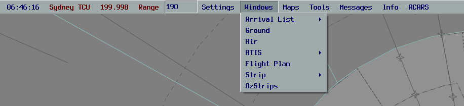

--8<-- "includes/abbreviations.md"

In the real world, aerodrome controllers use strips to provide a visual representation of aerodrome activity, beyond what looking out the window or at a radar screen can provide.

Within vatSys, this can be emulated using the OzStrips plugin. Strip state is shared between controllers operating at the same aerodrome.

## Setup

The OzStrips plugin can be downloaded using the [vatSys Plugin Manager](https://github.com/badvectors/PluginManager){target=new}.  

If the client is installed correctly, there will be an *OzStrips* option in the Window dropdown menu.

<figure markdown>
{ width="700" }
</figure>

## Usage

After logging onto the network, open the plugin from the dropdown menu, and select the desired aerodrome, or type the ICAO code into the field.

<figure markdown>
{ width="700" }
</figure>

### Stripboard

<figure markdown>
{ width="700" }
</figure>

The stripboard is divided into multiple bays, each representing a stage in an aircraft's flight thread.

Strips can be moved in between strip bays by clicking on their callsign, and clicking the bay where you want them to go, or by clicking on the green *SID Trigger*.

Selecting a track on the Ground Radar or ASD will select the relevant strip in OzStrips, and vice versa.

!!! Note
    **Strips can not be *SID triggered* from Holding Point to Runway**

    This is to prevent incidental placement onto the runway.

#### Control Bar

The bottom of the window holds the Control Bar. This panel contains the server connection status, aerodrome selected and ATIS code among other elements.

The *INHIBIT* and *FOR STP* button respectively remove and add selected aircraft from the strip board as required. 

### Strips

The background colour of the strip corresponds to its status as an arrival or a departure. Departing aircraft have a blue strip, while arrivals have a yellow strip.

<figure markdown>
{ width="700" }
</figure>

| Number | Content | Action |
|---------|-------------|--------------|
| 1 | Bay Number | Change |
| 2 | Filed Off Blocks Time | Cock Strip |
| 3 | Aircraft Type | Open Flightplan |
| 4 | Destination | Open Flightplan |
| 5 | Route Indicator | Show Route |
| 6 | Flight Rules | |
| 7 | Correct SSR Code + Mode C Received | |
| 8 | SSR Code | Autogenerate Code |
| 9 | Wake Turbulence Category | |
| 10 | Callsign | Select Strip |
| 11 | Runway | Change |
| 12 | Holding Point / Clearance Limit | Change |
| 13 | SID | Move strip to next bay |
| 14 | First Waypoint | Open flightplan |
| 15 | Departure Heading | Change |
| 16 | Requested Level | Open flightplan |
| 17 | Cleared Level | Change |
| 18 | Takeoff Timer | Start / Reset |
| 19 | Global Ops Data | Change |
| 20 | Local Remarks | Change |

### Queueing and Reordering

A strip can be placed into the queue by selecting the strip and then pressing "Add to Queue". Strips can be moved vertically by pressing the keyboard arrow keys while a strip is selected.