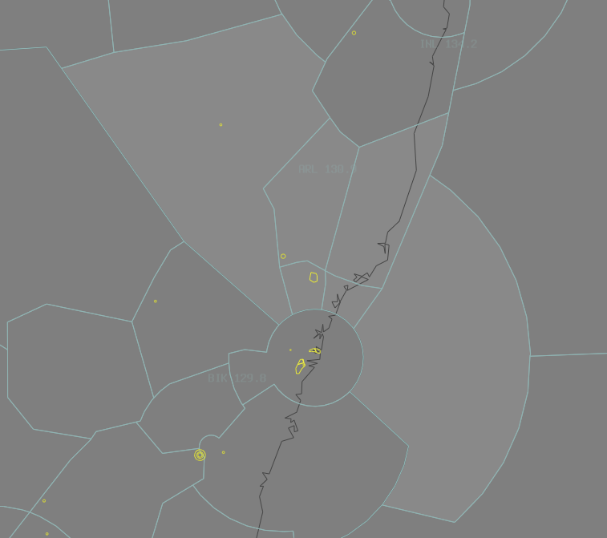

--8<-- "includes/abbreviations.md"
## Positions

| Name | Callsign | Frequency | Login ID |
| ---- | -------- | --------- | -------- |
| **Armidale** | **Brisbane Centre** | **130.900** | **BN-ARL_CTR** |
| Mudgee† | Brisbane Centre | 133.000 | BN-MDE_CTR |
| Cessnock† | Brisbane Centre | 123.400 | BN-CNK_CTR |
| Manning† | Brisbane Centre | 130.100 | BN-MNN_CTR |
| Maitland† | Brisbane Centre | 123.350 | BN-MLD_CTR |
| Ocean† | Brisbane Centre | 128.600 | BN-OCN_CTR |

† *Non-standard positions* may only be used in accordance with [VATPAC Ratings and Controller Positions Policy](https://vatpac.org/publications/policies)
## Airspace

When **TW ADC** is offline, TW CTR (Class D and C `SFC` to `A085`) reverts to Class G, and is administered by ARL and MDE. Alternatively, ARL (not MDE) may provide a [top-down procedural service](../../../aerodromes/tamworth) if they wish (not recommended).  

When **CFS ADC** is offline, CFS CTR (Class D `SFC` to `A045`) reverts to Class G, and is administered by MNN and INL. MNN is **not permitted** to provide a [top-down procedural service](../../../aerodromes/Coffs), only INL can do this, and they must coordinate with MNN if they are doing so.

<figure markdown>
{ width="700" }
  <figcaption>Armidale Airspace</figcaption>
</figure>

## Sector Responsibilities
### Armidale (ARL) / Manning (MNN)
ARL and MNN are responsible for initial sequencing, issuing STAR Clearances, and issuing initial descent for aircraft bound for YSSY, via BOREE and MEPIL respectively.
### Cessnock (CNK) / Maitland (MLD)
CNK and MLD are responsible for final sequencing for aircraft bound for YSSY, via BOREE and MEPIL respectively.
### Mudgee (MDE)
Just keeping them separated!
### Ocean (OCN)
OCN responsible for sequencing, issuing STAR Clearances, and issuing descent for aircraft bound for YSSY via MARLN.
## Coordination
### ARL (All) / SY TCU

The Standard Assignable level from ARL(All) to SY TCU is:  
`A100` for aircraft tracking via BOREE or MARLN, and assigned the relevant STAR  
`A090` for aircraft tracking via MEPIL, and assigned the MEPIL STAR  

All other aircraft must be voice coordinated to SY TCU prior to **20nm** from the boundary.

The Standard Assignable level from SY TCU to ARL(All) is the lower of `F280` or the `RFL`, and tracking via a SID terminus.

Refer to [Sydney TCU Airspace Division](../../terminal/sydney/#airspace-division) for information on airspace divisions when **SAS**, **SDN** and/or **SDS** are online.

### ARL (All) / ENR

As per [Standard coordination procedures](../../controller-skills/coordination/#enr-enr), Voiceless, no changes to route or CFL within **20nm** to boundary.

### ARL/MDE/CNK/MNN/MLD/OCN Internal

As per [Standard coordination procedures](../../controller-skills/coordination/#enr-enr), Voiceless, no changes to route or CFL within **20nm** to boundary.

That being said, it is *advised* that ARL(All) gives **Heads-up Coordination** in the following scenarios:   
- MNN to ARL for all aircraft  
- ARL to MNN for all aircraft  
- CNK to MLD for all aircraft  
- MLD to CNK for all aircraft

### ARL/MDE / TW ADC
#### Airspace
When **TW ADC** is online, **ARL** owns the Class C airspace from `A065` upwards. **TW ADC** owns the Class D airspace `SFC` to `A045` and Class C airspace `A045` to `A065`.

#### Departures
Departures from YSTW in to ARL/MDE Class C will be coordinated at taxi, and ready for departure. If a level other than the Standard Assignable is required from ARL/MDE, they will coordinate this at the "Next" call.

!!! example
    **TW ADC** -> **MDE**: "Taxi, SKV for YMOR DCT"  
    **MDE** -> **TW ADC**: "SKV"  
    ...  
    **TW ADC** -> **MDE**: "Next, SKV"  
    **MDE** -> **TW ADC**: "SKV"  

The Standard Assignable level from **TW ADC** to ARL/MDE is the lower of `A070` or the `RFL`.

#### Arrivals
The Standard Assignable level from ARL/MDE to **TW ADC** is `A080`. Any aircraft that will not be assigned the Standard Assignable level must have that level concurred by **TW ADC**.  
As per [Standard coordination procedures](../../controller-skills/coordination/#enrtcu-class-d-twr), YSTW arrivals shall be coordinated to **TW ADC** from ARL/MDE prior to transfer of jurisdiction.

!!! example
    **ARL** -> **TW ADC**: "QLK6D, via MATLA DCT STWWD, Number 1"  
    **TW ADC** -> **ARL**: "QLK6D, Number 1"  

### MNN / CFS ADC
#### Airspace
When **CFS ADC** is online, **INL** and **MNN** owns the Class C airspace from A045 upwards, and **CFS ADC** owns the Class D airspace SFC-A045.

#### Departures
Departures from YCFS in to MNN Class C will be coordinated at taxi, and ready for departure. If a level other than the Standard Assignable is required from MNN, they will coordinate this at the "Next" call.

!!! example
    **CFS ADC** -> **MNN**: "Taxi, CFH21 for YSTW via LOSKU"  
    **MNN** -> **CFS ADC**: "CFH21"  
    
    **CFS ADC** -> **MNN**: "Next, CFH21"  
    **MNN** -> **CFS ADC**: "CFH21"  

The Standard Assignable level from **CFS ADC** to MNN is the lower of `A070` or the `RFL`.

#### Arrivals
The Standard Assignable level from MNN to **CFS ADC** is `A080`. Any aircraft that will not be assigned the Standard Assignable level must have that level concurred by **CFS ADC**.  
YCFS arrivals shall be coordinated to **CFS ADC** from MNN prior to transfer of jurisdiction.

!!! example
    **MNN** -> **CFS ADC**: "RXA6438, via KADSI, Number 1"  
    **CFS ADC** -> **MNN**: "RXA6438, Number 1"  
### CNK/MND/MNN / WLM TCU
#### Airspace
By default, **WLM TCU** owns the airspace within the **R578A-G** restricted areas, unless stated otherwise by ad-hoc release or NOTAM.
#### Departures
Departures from YWLM in to CNK/MND/MNN Class C will be coordinated at taxi, and will be requesting a level.

!!! example
    **WLM TCU** -> **MNN**: "Taxi, WGTL33 for YPTN via BUBRI1A departure, Requesting F380"  
    **MNN** -> **WLM TCU**: "WGTL33, F120"  
    **WLM TCU** -> **MNN**: "F120, WGTL33"  

#### Arrivals/Overfliers
All aircraft transiting from CNK/MND/MNN to **WLM TCU** must be heads-up coordinated prior to **20nm** from the boundary. Operations within **WLM TCU** are fairly ad-hoc, so there are no standard assignable levels, simply whatever the CNK/MND/MNN and **WLM TCU** controller agree on.

!!! example
    **MNN** -> **WLM TCU**: "via SANAD, JST458, DCT BLAFF, will be assigned F130"  
    **WLM TCU** -> **MNN**: "JST458, F130"  

### OCN/MNN / TSN/HWE (Oceanic)
As per [Standard coordination procedures](../../controller-skills/coordination/#enr-oceanic), Voice coordinate estimate and level prior to **15 mins** to boundary.