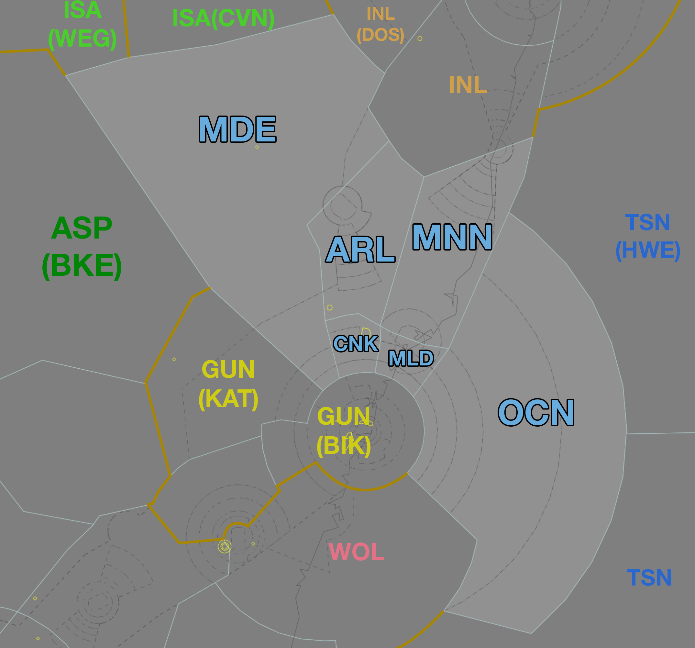

--8<-- "includes/abbreviations.md"
## Positions

| Name | Callsign | Frequency | Login ID |
| ---- | -------- | --------- | -------- |
| **Armidale** | **Brisbane Centre** | **130.900** | **BN-ARL_CTR** |
| Mudgee† | Brisbane Centre | 133.000 | BN-MDE_CTR |
| Cessnock† | Brisbane Centre | 123.400 | BN-CNK_CTR |
| Manning† | Brisbane Centre | 130.100 | BN-MNN_CTR |
| Maitland† | Brisbane Centre | 132.350 | BN-MLD_CTR |
| Ocean† | Brisbane Centre | 128.600 | BN-OCN_CTR |

† *Non-standard positions* may only be used in accordance with [VATPAC Ratings and Controller Positions Policy](https://vatpac.org/publications/policies)
## Airspace
When **TW ADC** is offline, TW CTR (Class D and C `SFC` to `A085`) reverts to Class G, and is administered by ARL and MDE. Alternatively, ARL (not MDE) may provide a [top-down procedural service](../../../aerodromes/tamworth) if they wish (not recommended).  

When **CFS ADC** is offline, CFS CTR (Class D `SFC` to `A045`) reverts to Class G, and is administered by MNN and INL. MNN is **not permitted** to provide a [top-down procedural service](../../../aerodromes/Coffs), only INL can do this, and they must coordinate with MNN if they are doing so.

When **WLM TCU** is offline, WLM MIL CTR (Class C `SFC` to `A065`) reverts to Class G, and WLM MIL CTR (Class C `A065` to `F125`) reverts to Class E. This airspace is administered by the appropriate ARL subsector. Alternatively, ARL(MLD) may provide a [top-down service](../../../military/williamtown) if they wish.  

<figure markdown>
{ width="700" }
  <figcaption>Armidale Airspace</figcaption>
</figure>

## Sector Responsibilities
### Armidale (ARL) / Manning (MNN)
ARL and MNN are responsible for initial sequencing, issuing STAR Clearances, and issuing initial descent for aircraft bound for YSSY, via BOREE and MEPIL respectively. Aircraft cruising above `F250` should be assigned *no lower* than `F250` and handed to CNK for further descent. Aircraft cruising below `F250` should be transferred to CNK at their cruise level.

Refer to the [Sequencing into YSSY](#sequencing-into-yssy) notes below for runway and STAR selection notes.

ARL is also responsible for aircraft operating into/out of YSTW from the south/east when TW ADC is operating.

!!! note
    ARL and MDE share a joint responsibility to build the final sequence of arrivals into YSTW when the tower is open. Coordination with MDE should be conducted to ensure that aircraft from each sector are sequenced appropriately with each other.

### Cessnock (CNK) 
CNK is responsible for final sequencing and descent for aircraft bound for YSSY, via BOREE and MEPIL.

Refer to the [Sequencing into YSSY](#sequencing-into-yssy) notes below for runway and STAR selection notes.

### Maitland (MLD)
MLD is responsible for handling northbound departures from YSSY and arrivals into YWLM from the south.

### Mudgee (MDE)
MDE is responsible for aircraft operating into/out of YSTW from the north/west when TW ADC is operating.

!!! note
    ARL and MDE share a joint responsibility to build the final sequence of arrivals into YSTW when the tower is open. Coordination with ARL should be conducted to ensure that aircraft from each sector are sequenced appropriately with each other.

### Ocean (OCN)
OCN is responsible for sequencing, issuing STAR Clearances, and issuing descent for aircraft bound for YSSY via MARLN.

Refer to the [Sequencing into YSSY](#sequencing-into-yssy) notes below for runway selection notes.

### YWLM Operations
All ARL subsectors are responsible for assigning STARs to aircraft inbound to YWLM, and the STAR shall be issued by the first ARL subsector to take jurisdiction of the aircraft.

### Sequencing into YSSY
Sequencing arrivals from the north/east into YSSY is a joint responsibility of the subsectors of ARL. Initial sequencing actions for aircraft from the north should be performed by ARL and MNN, with fine tuning and any holding required issued by CNK. 

Aircraft from the north/east shall be assigned **runway 16L/34R** during PROPS. However, some situations may warrant the use of the main runway (16R/34L), such as heavy aircraft operationally requiring the longer runway or large volumes of traffic requiring the use of both runways to minimise delay. In this case, coordination must be conducted with Melbourne Centre or Sydney Flow (if operating) to ensure that the sequence is built in an efficient and orderly way.

!!! example
    **ARL** -> **BIK**: "North of Sydney, CPA21, with your concurrence will be assigned runway 34L due operational requirement"  
    **BIK** -> **ARL**: "Concur, CPA21 runway 34L, required landing time 43 due sequence from the west"  
    **ARL** -> **BIK**: "Runway 34L, landing time 43, CPA21"

Jet aircraft for YSSY shall be assigned the **BOREE** STAR.  
Non-jet aircraft for YSSY shall be assigned the **MEPIL** STAR.

!!! tip
    Whilst the preference is to keep jet/non-jet aircraft assigned the default STAR as above, there are situations where the sequence may be improved by assigning the adjacent STAR (e.g. a jet assigned the MEPIL STAR). This is most common when assigning the alternate runway to an arrival.  
    
    Either **SY TCU** or **ARL** may propose utilising the adjacent STAR where two aircraft with significantly different cruise/descent speeds will be required to overtake or pass abeam each other to achieve a sequenced landing time, or if assigned different runways. This technique can allow aircraft to be processed for different runways independently with minimal delay by using the built-in separation afforded by the STAR height requirements.  

    In this case, coordination should be conducted to ensure that both controllers agree and no additional conflicts are created as a result (particularly with aircraft inbound from the south/west).

!!! example
    **BIK:** "RXA6417, amended tracking and STAR available"  
    **RXA6417:** "RXA6417, go ahead"  
    **BIK:** "RXA6417, recleared direct BOREE for the BOREE3A arrival, runway 34L, maintain FL180"  
    **RXA6417:** "Recleared direct BOREE for the BOREE3A arrival, runway 34L, maintain FL180, RXA6417"

## STAR Clearance Expectation
### Handoff
Aircraft being transferred to the following sectors shall be told to Expect STAR Clearance on handoff:

| Transferring Sector | Receiving Sector | ADES | Notes |
| ---- | -------- | --------- | --------- |
| MNN | INL | YBBN, YBCG | |
| MDE | YWE(KAT) | YSCB | |
| MNN | ARL | YSSY | |

### First Contact
Aircraft being transferred from the following sectors shall be given STAR Clearance on first contact:

| Transferring Sector | Receiving Sector | ADES | Notes |
| ---- | -------- | --------- | --------- |
| INL, MNN | ARL | YSSY | |
| TSN/HWE | OCN | YSSY | |

## Coordination
### SY TCU
The Standard Assignable level from ARL(All) to SY TCU is:  
`A100` for aircraft tracking via BOREE or MARLN, and assigned the relevant STAR  
`A090` for aircraft tracking via MEPIL, and assigned the MEPIL STAR  

All other aircraft must be voice coordinated to SY TCU prior to **20nm** from the boundary.

The Standard Assignable level from SY TCU to ARL(All) is the lower of `F280` or the `RFL`, and tracking via a SID terminus.

Refer to [Sydney TCU Airspace Division](../../terminal/sydney/#airspace-division) for information on airspace divisions when **SAS**, **SDN**, **SDS** and/or **SRI** are online.

### Enroute
As per [Standard coordination procedures](../../../controller-skills/coordination/#enr-enr), Voiceless, no changes to route or CFL within **50nm** to boundary.

### ARL Internal
As per [Standard coordination procedures](../../../controller-skills/coordination/#enr-enr), Voiceless, no changes to route or CFL within **50nm** to boundary.

That being said, due to their small sizes and frequent random-track traffic, it is *advised* that ARL(All) gives **Heads-up Coordination** in the following scenarios:   
- MNN to ARL for all aircraft  
- ARL to MNN for all aircraft  
- CNK to MLD for all aircraft  
- MLD to CNK for all aircraft

### TW ADC
#### Airspace
When **TW ADC** is online, **ARL** owns the Class C airspace from `A065` upwards. **TW ADC** owns the Class D airspace `SFC` to `A045` and Class C airspace `A045` to `A065`.

When **TW ADC** is closed, the Class C airspace `A085` and below is reclassified Class G.

#### Departures
Departures from YSTW in to ARL/MDE Class C will be coordinated when ready for departure.

!!! example
    **TW ADC** -> **MDE**: "Next, SKV"  
    **MDE** -> **TW ADC**: "SKV, Unrestricted"  
    **TW ADC** -> **MDE**: "SKV"  

The Standard Assignable level from **TW ADC** to ARL/MDE is the lower of `A070` or the `RFL`.

#### Arrivals
YSTW arrivals shall be heads-up coordinated to **TW ADC** from ARL/MDE prior to **5 mins** from the boundary.

!!! example
    **ARL** -> **TW ADC**: "QLK6D, via MATLA DCT STWWD"  
    **TW ADC** -> **ARL**: "QLK6D"  

The Standard Assignable level from ARL/MDE to **TW ADC** is `A080`, any other level must be prior coordinated.

### CFS ADC
#### Airspace
**INL** and **MNN** own the Class C airspace from **A045** upwards, and **CFS ADC** (when online) owns the Class D airspace **SFC-A045**.

#### Departures
Departures from YCFS in to MNN Class C will be coordinated when ready for departure.

!!! example
    **CFS ADC** -> **MNN**: "Next, CFH21"  
    **MNN** -> **CFS ADC**: "CFH21, Unrestricted"  
    **CFS ADC** -> **MNN**: "CFH21"  

The Standard Assignable level from **CFS ADC** to MNN is the lower of `A070` or the `RFL`.

#### Arrivals
YCFS arrivals shall be heads-up coordinated to **CFS ADC** from MNN prior to **5 mins** from the boundary.

!!! example
    **MNN** -> **CFS ADC**: "Via KADSI, RXA6438"  
    **CFS ADC** -> **MNN**: "RXA6438"  

The Standard Assignable level from MNN to **CFS ADC** is `A080`, any other level must be prior coordinated.

#### Overfliers
Any aircraft that will enter CFS ADC airspace, and not landing at YCFS, must be Heads-up coordinated prior to **5 mins** from the boundary.

!!! example
    **MNN** -> **CFS ADC**: "via CFS, GNP, Overflier"  
    **CFS ADC** -> **MNN**: "GNP, A030"

### WLM TCU
#### Airspace
By default, **WLM TCU** (when online) owns the airspace within the WLM MIL CTR `SFC` to `F125`, unless stated otherwise by ad-hoc release or NOTAM. It is the responsibility of the **WLM TCU** controller to inform ARL(All) of what airspace they are assuming.

Refer to [Airspace](#airspace) for operations when WLM TCU is offline.

#### Departures
Voiceless coordination is in place from WLM TCU to ARL(All) for aircraft assigned the lower of `F120` or the `RFL`, and tracking via a Procedural SID terminus.

!!! example
    **WLM TCU** -> **MLD**: "QJE1597, request DCT OMGAB"  
    **MLD** -> **WLM TCU**: "QJE1597, concur DCT OMGAB"  

#### Arrivals/Overfliers
The Standard assignable level from ARL(All) to WLM TCU is `A090`, and assigned a STAR. All other aircraft must be prior coordinated.

!!! example
    **CNK** -> **WLM TCU**: "QFA1968, request DCT UPTEB"  
    **WLM TCU** -> **CNK**: "QFA1968, concur DCT UPTEB"  

### TSN/HWE (Oceanic)
As per [Standard coordination procedures](../../../controller-skills/coordination/#enr-oceanic), Heads-up coordinate prior to **15 mins** to boundary.