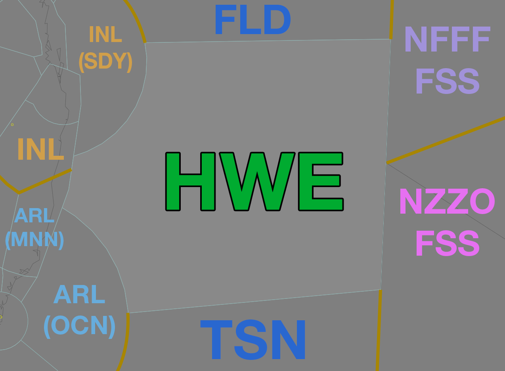

--8<-- "includes/abbreviations.md"
## Positions

| Name | Callsign | Frequency | Login ID |
| ---- | -------- | --------- | -------- |
| Howe | Brisbane Centre | 124.950 | BN-HWE_CTR |

### CPDLC

The Primary Communication Method for HWE is [CPDLC](../../controller-skills/cpdlc.md).

The CPDLC Station Code is `YHWE`.

Voice may be used in lieu when applicable.

## Airspace

<figure markdown>
{ width="700" }
  <figcaption>Howe Airspace</figcaption>
</figure>

## Surveillance Coverage
Limited surveillance coverage exists for aircraft in CTA greater than **250nm** from LHI. [Procedural Standards](../../../separation-standards/procedural/) must be implemented **prior** to losing surveillance coverage

## STAR Clearance Expectation
### Handoff
Aircraft being transferred to the following sectors shall be told to Expect STAR Clearance on handoff:

| Transferring Sector | Receiving Sector | ADES | Notes |
| ---- | -------- | --------- | --------- |
| HWE | ARL(OCN) | YSSY | |
| HWE | INL(SDY) | YBBN, YBCG, YBSU | |

## Coordination
### Enroute
As per [Standard coordination procedures](../../../controller-skills/coordination/#enr-enr), Voiceless, no changes to route or CFL within **50nm** to boundary.

### TSN/FLD (Oceanic)
As per [Standard coordination procedures](../../../controller-skills/coordination/#pacific-units), Voiceless, no changes to route or CFL within **15 mins** to boundary.

### International (NFFF/NZZO)
As per [Standard coordination procedures](../../../controller-skills/coordination/#pacific-units), Voiceless, no changes to route or CFL within **15 mins** to boundary.