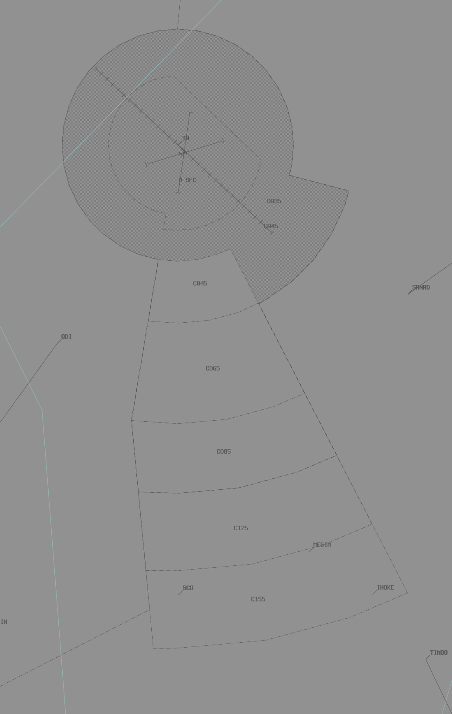

--8<-- "includes/abbreviations.md"
## Positions

| Name | Callsign | Frequency | Login ID |
| ---- | -------- | --------- | -------- |
| **Inverell** | **Brisbane Centre** | **134.200** | **BN-INL_CTR** |
| Downs† | Brisbane Centre | 135.600 | BN-DOS_CTR |
| Gold Coast† | Brisbane Centre | 130.400 | BN-GOL_CTR |
| Straddy† | Brisbane Centre | 134.300 | BN-SDY_CTR |
| Burnett† | Brisbane Centre | 123.000 | BN-BUR_CTR |
| Noosa† | Brisbane Centre | 124.100 | BN-NSA_CTR |
| Keppel† | Brisbane Centre | 125.900 | BN-KPL_CTR |

† **Non-standard position** – may only be used in accordance with [VATPAC Ratings and Controller Positions Policy](https://cdn.vatpac.org/documents/policy/Controller+Positions+and+Ratings+Policy+v5.2.pdf){target=new}

## Airspace

GOL is responsible for the BN TCU when **BN APP** is offline.  
GOL is responsible for the RK TCU when **RK APP** is offline.  
INL is responsible for **DOS**, **GOL**, **SDY**, **BUR**, **NSA**, and **KPL** when they are offline.  

When **SU TWR** is offline, SU CTR (Class D SFC-A045) reverts to Class G, and is administered by NSA and BUR. Alternatively, NSA may provide a top-down procedural service if they wish, and this must be coordinated to BUR.  
When **CFS TWR** is offline, CFS CTR (Class D SFC-A045) reverts to Class G, and is administered by MNN and INL. Alternatively, INL may provide a top-down procedural service if they wish, and this must be coordinated to ARL(MNN).  

(vatsys map)

## Sector Responsibilities
### Inverell (INL) / Downs (DOS) / Straddy (SDY) / Burnett (BUR)
INL, DOS, SDY and BUR are responsible for initial sequencing, issuing STAR Clearances, and issuing initial descent for aircraft bound for YBBN and YBCG.
### Gold Coast (GOL)
GOL is responsible for final sequencing for aircraft bound for YBBN, YBCG, and issuing of STAR Clearances and descent for YBSU.
### Noosa (NSA)
NSA is responsible for facilitating YBSU traffic.
### Keppel (KPL)
KPL is responsible for issuing STAR Clearances and descent for YBSU.

## Coordination

### INL (All) / ENR

As per [Standard coordination procedures](http://sops.vatpac.org/controller-skills/coordination/#enr-enr){target=new}, Voiceless, no changes to route or CFL within **20nm** to boundary.

### INL/DOS/GOL/SDY/BUR/NSA/KPL Internal

As per [Standard coordination procedures](http://sops.vatpac.org/controller-skills/coordination/#enr-enr){target=new}, Voiceless, no changes to route or CFL within **20nm** to boundary.

### NSA / SU TWR
#### Airspace
When **TW TWR** is online, **ARL** owns the Class C airspace from A045 upwards. **TW TWR** owns the Class D airspace SFC-A045, and is shown **shaded** in the image below
<figure markdown>
{ width="800" }
  <figcaption>Tamworth Tower Airspace</figcaption>
</figure>

#### Departures
Departures from YSTW in to ARL/MDE Class C will be coordinated at taxi, and ready for departure. If a level other than the Standard Assignable is required from ARL/MDE, they will coordinate this at the "Next" call.

!!! example
    **TW TWR** -> **MDE**: "Taxi, SKV for YMOR DCT"  
    **MDE** -> **TW TWR**: "SKV"  
    ...  
    **TW TWR** -> **MDE**: "Next, SKV"  
    **MDE** -> **TW TWR**: "SKV"  

The Standard Assignable level from **TW TWR** to ARL/MDE is the lower of `A070` or the `RFL`.

#### Arrivals
The Standard Assignable level from ARL/MDE to **TW TWR** is `A080`. Any aircraft that will not be assigned the Standard Assignable level must have that level concurred by **TW TWR**.  
YSTW arrivals shall be coordinated to **TW TWR** from ARL/MDE prior to transfer of jurisdiction.

!!! example
    **ARL** -> **TW TWR**: "QLK6D, via MATLA DCT STWWD, Number 1"  
    **TW TWR** -> **ARL**: "QLK6D, Number 1"  

### KPL / RK APP
#### Airspace
When **TW TWR** is online, **ARL** owns the Class C airspace from A045 upwards. **TW TWR** owns the Class D airspace SFC-A045, and is shown **shaded** in the image below
<figure markdown>
{ width="800" }
  <figcaption>Tamworth Tower Airspace</figcaption>
</figure>

#### Departures
Departures from YSTW in to ARL/MDE Class C will be coordinated at taxi, and ready for departure. If a level other than the Standard Assignable is required from ARL/MDE, they will coordinate this at the "Next" call.

!!! example
    **TW TWR** -> **MDE**: "Taxi, SKV for YMOR DCT"  
    **MDE** -> **TW TWR**: "SKV"  
    ...  
    **TW TWR** -> **MDE**: "Next, SKV"  
    **MDE** -> **TW TWR**: "SKV"  

The Standard Assignable level from **TW TWR** to ARL/MDE is the lower of `A070` or the `RFL`.

#### Arrivals
The Standard Assignable level from ARL/MDE to **TW TWR** is `A080`. Any aircraft that will not be assigned the Standard Assignable level must have that level concurred by **TW TWR**.  
YSTW arrivals shall be coordinated to **TW TWR** from ARL/MDE prior to transfer of jurisdiction.

!!! example
    **ARL** -> **TW TWR**: "QLK6D, via MATLA DCT STWWD, Number 1"  
    **TW TWR** -> **ARL**: "QLK6D, Number 1"  

### GOL/DOS/BUR/NSA / OK APP and AMB APP
#### Airspace
By default, **WLM APP** owns the airspace within the R578A-G restricted areas, unless stated otherwise by ad-hoc release or NOTAM.
#### Departures
Departures from YWLM in to CNK/MND/MNN Class C will be coordinated at taxi, and will be requesting a level.

!!! example
    **WLM APP** -> **MNN**: "Taxi, WGTL33 for YPTN via BUBRI1A departure, Requesting F380"  
    **MNN** -> **WLM APP**: "WGTL33, F120"  
    **WLM APP** -> **MNN**: "F120, WGTL33"  

#### Arrivals/Overfliers
All aircraft transiting from CNK/MND/MNN to **WLM APP** must be heads-up coordinated prior to **20nm** from the boundary. Operations within **WLM APP** are fairly ad-hoc, so there are no standard assignable levels, simply whatever the CNK/MND/MNN and **WLM APP** controller agree on.

!!! example
    **MNN** -> **WLM APP**: "via SANAD, JST458, DCT BLAFF, will be assigned F130"  
    **WLM APP** -> **MNN**: "JST458, F130"  

### INL/SDY/KPL / TSN (Oceanic)

As per [Standard coordination procedures](http://sops.vatpac.org/controller-skills/coordination/#enr-oceanic){target=new}, Voice coordinate estimate and level prior to **15 mins** to boundary.