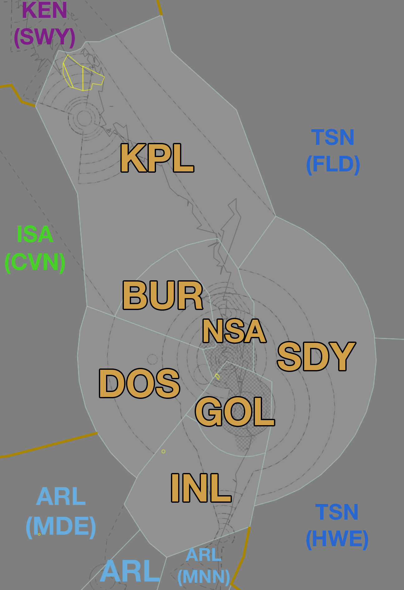

--8<-- "includes/abbreviations.md"
## Positions

| Name | Callsign | Frequency | Login ID |
| ---- | -------- | --------- | -------- |
| **Inverell** | **Brisbane Centre** | **134.200** | **BN-INL_CTR** |
| Downs† | Brisbane Centre | 135.600 | BN-DOS_CTR |
| Gold Coast† | Brisbane Centre | 130.400 | BN-GOL_CTR |
| Straddy† | Brisbane Centre | 134.300 | BN-SDY_CTR |
| Burnett† | Brisbane Centre | 123.000 | BN-BUR_CTR |
| Noosa† | Brisbane Centre | 124.100 | BN-NSA_CTR |
| Keppel† | Brisbane Centre | 125.900 | BN-KPL_CTR |

† *Non-standard positions* may only be used in accordance with [VATPAC Ratings and Controller Positions Policy](https://vatpac.org/publications/policies)

## Airspace

GOL is responsible for the [BN TCU](../../../terminal/brisbane) when **BN TCU** is offline.  
KPL is responsible for the [RK TCU](../../../terminal/coral) when **RKA** is offline.  
INL is responsible for **DOS**, **GOL**, **SDY**, **BUR**, **NSA**, and **KPL** when they are offline.  

When **SU ADC** is offline, SU CTR (Class D `SFC` to `A045`) reverts to Class G, and is administered by NSA and BUR. Alternatively, NSA may provide a [top-down procedural service](../../../aerodromes/sunshinecoast) if they wish (not recommended), and this must be coordinated to BUR.  
When **CFS ADC** is offline, CFS CTR (Class D `SFC` to `A045`) reverts to Class G, and is administered by MNN and INL. Alternatively, INL may provide a [top-down procedural service](../../../aerodromes/Coffs) if they wish (not recommended), and this must be coordinated to ARL(MNN).  

Whilst the **RKA** controller is expected to provide a [top-down service](../../../aerodromes/Rockhampton) to YBRK when **RK ADC** is offline, this is not expected of a GOL controller when both **RKA** and **RK ADC** are offline. If electing not to provide a top-down service to YBRK, the RK CTR Class D is reclassified to Class G `SFC` to `A007`, and Class E `A007` to `A045`.

<figure markdown>
{ width="700" }
  <figcaption>Inverell Airspace</figcaption>
</figure>

## Sector Responsibilities

### Inverell (INL)
INL is responsible for initial sequencing, issuing STAR Clearances, and issuing initial descent for aircraft bound for YBBN and YBCG.
### Downs (DOS) / Straddy (SDY)
DOS and SDY are responsible for sequencing, issuing STAR Clearances, and issuing descent for aircraft bound for YBBN and YBCG.
### Burnett (BUR)
BUR is responsible for final sequencing, issuing descent, and issuing STAR Clearances for Non-jets bound for YBBN and YBCG.
### Gold Coast (GOL)
GOL is responsible for final sequencing for aircraft bound for YBBN, YBCG, and issuing of STAR Clearances and descent for YBSU.
### Noosa (NSA)
NSA is responsible for facilitating YBSU traffic.
### Keppel (KPL)
KPL is responsible for issuing STAR Clearances (Jets only) and initial descent for aircraft bound for YBSU, YBBN and YBCG.

## STAR Clearance Expectation
### Handoff
Aircraft being transferred to the following sectors shall be told to Expect STAR Clearance on handoff:

| Transferring Sector | Receiving Sector | ADES | Notes |
| ---- | -------- | --------- | --------- |
| INL | ARL | YSSY | |
| INL | GOL | YBSU | |
| KPL | BUR | YBBN, YBCG | Non-jets only |
| NSA | KPL | YBRK, YBMK | |
| KPL | KEN(SWY) | YBTL | |

### First Contact
Aircraft being transferred from the following sectors shall be given STAR Clearance on first contact:

| Transferring Sector | Receiving Sector | ADES | Notes |
| ---- | -------- | --------- | --------- |
| ARL/MNN/MDE | INL, DOS | YBBN, YBCG | |
| KEN(SWY), ISA(CVN) | KPL | YBBN, YBCG | Jets only |
| ISA(CVN) | DOS | YBBN, YBCG | |
| TSN(HWE, FLD) | SDY | YBBN, YBCG | |
| KPL | BUR | YBBN, YBCG | Non-jets only |
| INL | GOL | YBSU | |
| NSA | KPL | YBRK, YBMK | |

## Coordination
### BN TCU

The Standard assignable level from INL(All) to BN TCU is:  
`A090` for YBBN arrivals, and assigned a STAR  
`F130` for YBCG arrivals via BERNI, and assigned a STAR  

All other aircraft must be voice coordinated to BN TCU prior to **20nm** from the boundary.

The Standard Assignable level for YBBN departures from BN TCU to **INL(All)** is the lower of `F180` or the `RFL`.  
The Standard Assignable level for YBCG departures from BN TCU to **GOL/SDY** is the lower of `F120` or the `RFL`, and tracking via APAGI.  
The Standard Assignable level for YBCG departures from BN TCU to **NSA/BUR/DOS** is the lower of `F180` or the `RFL`.  
The Standard Assignable level for YBSU arrivals from BN TCU to **NSA** is `F130`, and tracking via ITIDE.  

Refer to [Brisbane TCU Airspace Division](../../../terminal/brisbane/operations/#airspace-division) for information on airspace divisions when **BAS**, **BDN** and/or **BDS** are online.
### Enroute

As per [Standard coordination procedures](../../../controller-skills/coordination/#enr-enr), Voiceless, no changes to route or CFL within **50nm** to boundary.

### INL Internal
As per [Standard coordination procedures](../../../controller-skills/coordination/#enr-enr), Voiceless, no changes to route or CFL within **20nm** to boundary.

That being said, it is *advised* that INL(All) give **Heads-up Coordination** to the relevant sector prior to **20nm** from the boundary in the following scenarios:  
- INL to DOS for all aircraft  
- DOS to BUR, NSA, GOL and INL for all aircraft  
- SDY to NSA, GOL and INL for all aircraft  

### SU ADC
#### Airspace
When **SU ADC** is online, **NSA** owns the Class C airspace from `A045` upwards. **SU ADC** owns the Class D airspace `SFC` to `A045`.

#### Departures
Departures from YBSU in to NSA Class C will be coordinated when ready for departure.

!!! example
    **SU ADC** -> **NSA**: "Next, BNZ123"  
    **NSA** -> **SU ADC**: "BNZ123, Unrestricted"  
    **SU ADC** -> **NSA**: "BNZ123"

The Standard Assignable level from **SU ADC** to NSA is the lower of `A050` or the `RFL`.

#### Arrivals
NSA must ensure all YBSU arrivals have been assigned a STAR, unless the pilot is unable to accept one.  
YBSU arrivals shall be coordinated to **SU ADC** from NSA prior to **5 mins** from the boundary.

!!! example
    **NSA** -> **SU ADC**: "via ITIDE2W Arrival, JST731"  
    **SU ADC** -> **NSA**: "JST731"

The Standard Assignable level from NSA to **SU ADC** is `A060`, any other level must be prior coordinated.

#### Overfliers
Any aircraft that will enter SU ADC airspace, and not landing at YBSU, must be Heads-up coordinated prior to **5 mins** from the boundary.

!!! example
    **NSA** -> **SU ADC**: "via HOLIS, CXB, Overflier"  
    **SU ADC** -> **NSA**: "CXB, A025"

### RKA
The Standard assignable level from KPL to **RKA** is `A070`, and assigned the ABVAS STAR or DADBO STAR.

All other aircraft must be voice coordinated to **RKA** prior to **20nm** from the boundary.

The Standard Assignable level from **RKA** to KPL is `F150`, and tracking via BUDGI or TARES.
### CFS ADC
#### Airspace
When **CFS ADC** is online, **INL** and **MNN** owns the Class C airspace from `A045` upwards, and **CFS ADC** owns the Class D airspace `SFC` to `A045`.

#### Departures
Departures from YCFS in to INL Class C will be coordinated when ready for departure.

!!! example 
    **CFS ADC** -> **INL**: "Next, BNZ185"  
    **INL** -> **CFS ADC**: "BNZ185, Unrestricted"  
    **CFS ADC** -> **INL**: "BNZ185"  

The Standard Assignable level from **CFS ADC** to INL is the lower of `A070` or the `RFL`.

#### Arrivals
YCFS arrivals shall be coordinated to **CFS ADC** from INL prior to **5 mins** from the boundary.

!!! example
    **INL** -> **CFS ADC**: "via IDNER, VET"  
    **CFS ADC** -> **INL**: "VET"  

The Standard Assignable level from INL to **CFS ADC** is `A080`, any other level must be prior coordinated.

#### Overfliers
Any aircraft that will enter CFS ADC airspace, and not landing at YCFS, must be Heads-up coordinated prior to **5 mins** from the boundary.

!!! example
    **INL** -> **CFS ADC**: "via CFS, XFC, Overflier"  
    **CFS ADC** -> **INL**: "XFC, A040"

### OK TCU / AMB TCU
#### Airspace
By default, **OK TCU** owns the airspace within the **R654A-D** restricted areas, and **AMB TCU** owns the airspace within the **R625A-D** restricted areas, unless stated otherwise by ad-hoc release or NOTAM.

#### Departures
Departures from YBOK and YAMB in to GOL/DOS/BUR Class C will be coordinated at taxi, and will be requesting a level.

!!! example
    **OK TCU** -> **DOS**: "Taxi, VLAN48 for YBOK via MATVI, Requesting F140"  
    **DOS** -> **OK TCU**: "VLAN48, F140"  
    **OK TCU** -> **DOS**: "F140, VLAN48"  

#### Arrivals/Overfliers
All aircraft transiting from GOL/DOS/BUR to **OK TCU** and **AMB TCU** must be heads-up coordinated prior to **20nm** from the boundary. Operations within **OK TCU** and **AMB TCU** are fairly ad-hoc, so there are no standard assignable levels, simply whatever the GOL/DOS/BUR and **WLM TCU** controller agree on.

!!! example
    **GOL** -> **AMB TCU**: "via HUUGO, PUMA11, will be assigned A080"  
    **AMB TCU** -> **GOL**: "PUMA11, A080"  

### TSN(FLD/HWE) (Oceanic)
As per [Standard coordination procedures](../../../controller-skills/coordination/#enr-oceanic), Heads-up coordinate prior to **15 mins** to boundary.