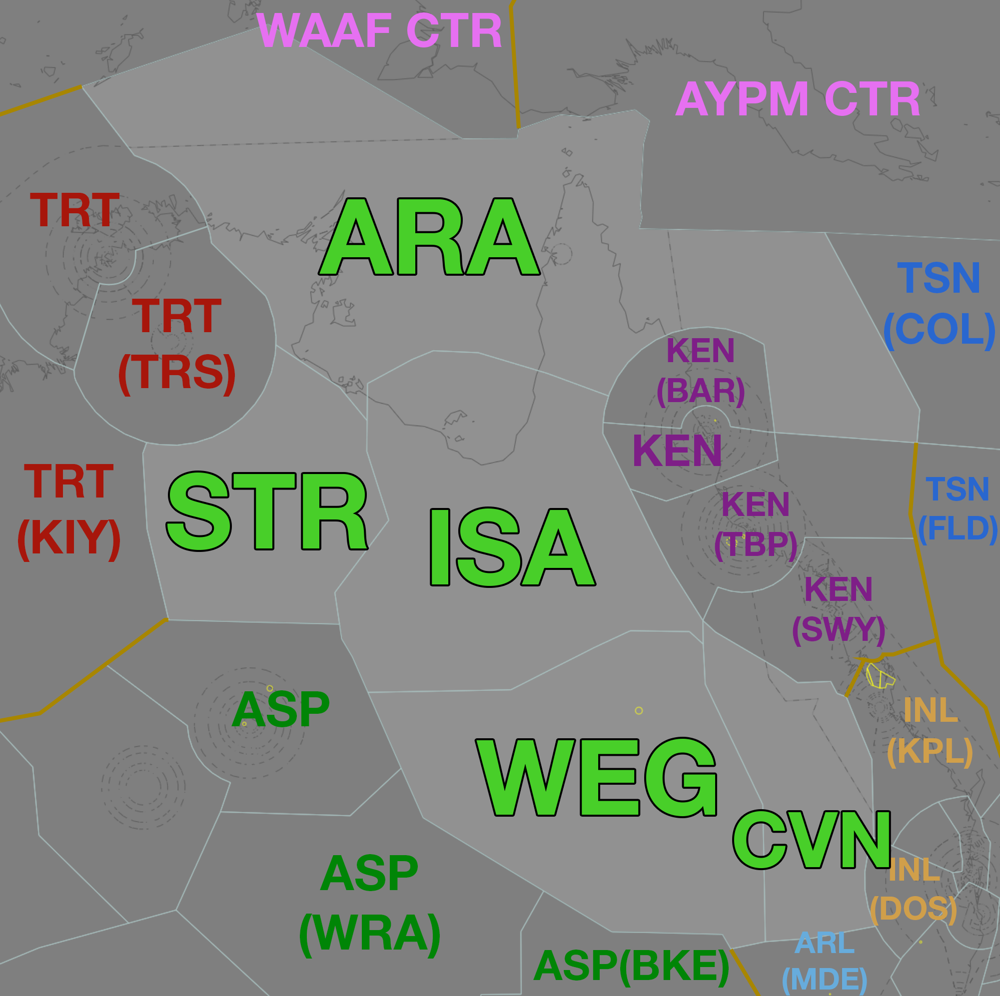

--8<-- "includes/abbreviations.md"

## Positions

| Name | Callsign | Frequency | Login ID |
| ---- | -------- | --------- | -------- |
| **Isa** | **Brisbane Centre** | **125.700** | **BN-ISA_CTR** |
| Arafura† | Brisbane Centre | 133.700 | BN-ARA_CTR |
| Sturt† | Brisbane Centre | 134.400 | BN-STR_CTR |
| Warrego† | Brisbane Centre | 132.450 | BN-WEG_CTR |
| Carnarvon† | Brisbane Centre | 133.800 | BN-CVN_CTR |

† *Non-standard positions* may only be used in accordance with [VATPAC Air Traffic Services Policy](https://vatpac.org/publications/policies){target=new}

### CPDLC

The Primary Communication Method for ISA is [CPDLC](../../../client/cpdlc).

The CPDLC Station Code is `YISA`.

Voice may be used in lieu when applicable.

## Airspace

<figure markdown>
{ width="700" }
  <figcaption>Mt Isa Airspace</figcaption>
</figure>

ISA is responsible for **ARA**, **STR**, **WEG**, and **CVN** when they are offline.  

## Extending

!!! Warning
    BN-ISA_CTR is only permitted to extend to adjacent **YBBB** sectors.

## Sector Responsibilities
ISA and its subsectors are purely Classes A, E and G of airspace. [Standard separation procedures](../../../separation-standards) apply.
ARA is responsible for sequencing and issuing descent to aircraft bound for YBSG.

## STAR Clearance Expectation
### Handoff
Aircraft being transferred to the following sectors shall be told to Expect STAR Clearance on handoff:

| Transferring Sector | Receiving Sector | ADES | Notes |
| ---- | -------- | --------- | --------- |
| CVN | INL(KPL) | YBBN, YBCG | Jets only |
| CVN | INL(DOS) | YBBN | |
| ARA | TRT | YPDN | |
| ARA, ISA | KEN(BAR, KEN) | YBCS | |
| ISA | KEN(TBP) | YBTL | |

## Coordination

### Enroute
As per [Standard coordination procedures](../../../controller-skills/coordination/#enr-enr), Voiceless, no changes to route or CFL within **50nm** to boundary.

### SG TCU
#### Airspace
The limits of the SG TCU are `SFC` to `F245` within 40 NM of the YBSG ARP. This may be amended by NOTAM.

#### Arrivals/Overfliers
The Standard assignable level from ARA to SG TCU is `F130`, tracking via WP VOR.

All other aircraft must be voice coordinated to SG TCU prior to **20nm** from the boundary.

#### Departures
The Standard Assignable level from SG TCU to ARA is `F240`, and tracking via their planned route.

#### SG ADC
When SG TCU is offline, coordination is not required between ISA(ARA) and SG ADC. Aircraft entering SG ADC airspace shall be handed off, and instructed to contact SG ADC for onwards clearance.

SG ADC owns the Class C airspace within the SG CTR from `SFC` to `A015`.

### ISA Internal
As per [Standard coordination procedures](../../../controller-skills/coordination/#enr-enr), Voiceless, no changes to route or CFL within **50nm** to boundary.

### TSN(COL) (Oceanic)
As per [Standard coordination procedures](../../../controller-skills/coordination/#pacific-units), Voiceless, no changes to route or CFL within **15 mins** to boundary.

### International (AYPM)
As per [Standard coordination procedures](../../../controller-skills/coordination/#pacific-units), Voiceless, no changes to route or CFL within **15 mins** to boundary.

### International (WAAF)
As per [Standard coordination procedures](../../../controller-skills/coordination/#other-units), Heads-up Coordination required for all aircraft prior to **30 mins** from boundary.

!!! example
    **ARA** -> **WAAF CTR**: "Estimate, CEB40, TOREX time 59, F360"  
    **WAAF CTR** -> **ARA**: "CEB40, F360"