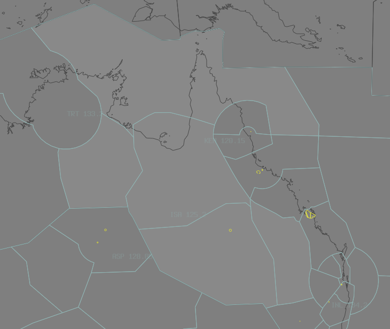

--8<-- "includes/abbreviations.md"

## Positions

| Name | Callsign | Frequency | Login ID |
| ---- | -------- | --------- | -------- |
| **Isa** | **Brisbane Centre** | **125.200** | **BN-ISA_CTR** |
| Arafura† | Brisbane Centre | 133.700 | BN-ARA_CTR |
| Sturt† | Brisbane Centre | 134.400 | BN-STR_CTR |
| Warrego† | Brisbane Centre | 132.450 | BN-WEG_CTR |
| Carnarvon† | Brisbane Centre | 133.800 | BN-CVN_CTR |

† *Non-standard positions* may only be used in accordance with [VATPAC Ratings and Controller Positions Policy](https://vatpac.org/publications/policies)

## Airspace

ISA is responsible for **ARA**, **STR**, **WEG**, and **CVN** when they are offline.  

<figure markdown>
{ width="700" }
  <figcaption>Mt Isa Airspace</figcaption>
</figure>

## Sector Responsibilities
ISA is purely Classes A, E and G of airspace. [Standard seperation procedures](../../controller-skills/SepStandards.md/#enroute) apply.
## Coordination

### ISA (All) / ENR (Including WAAF & AYPM)

As per [Standard coordination procedures](../../controller-skills/coordination/#enr-enr), Voiceless, no changes to route or CFL within **20nm** to boundary.
### ARA / COL (Oceanic)

As per [Standard coordination procedures](../../controller-skills/coordination/#enr-oceanic), Voice coordinate estimate and level prior to **15 mins** to boundary.