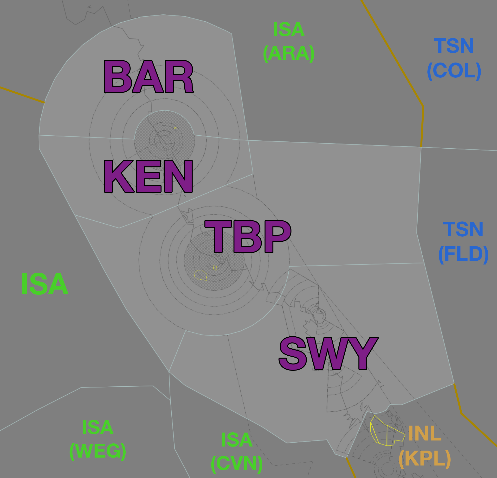

--8<-- "includes/abbreviations.md"

## Positions

| Name | Callsign | Frequency | Login ID |
| ---- | -------- | --------- | -------- |
| **Kennedy** | **Brisbane Centre** | **120.150** | **BN-KEN_CTR** |
| Barra :material-information-outline:{ title="Non-standard position"} | Brisbane Centre | 123.800 | BN-BAR_CTR |
| Tabletop :material-information-outline:{ title="Non-standard position"} | Brisbane Centre | 120.550 | BN-TBP_CTR |
| Willis :material-information-outline:{ title="Non-standard position"} | Brisbane Centre | 127.600 | BN-WIL_CTR |

!!! abstract "Non-Standard Positions"
    :material-information-outline: Non-standard positions may only be used in accordance with [VATPAC Air Traffic Services Policy](https://vatpac.org/publications/policies){target=new}.  
    Approval must be sought from the **bolded parent position** prior to opening a Non-Standard Position, unless [NOTAMs](https://vatpac.org/publications/notam){target=new} indicate otherwise (eg, for events).

## Airspace

<figure markdown>
{ width="700" }
  <figcaption>Kennedy Airspace</figcaption>
</figure>

KEN is responsible for **BAR**, **TBP**, and **WIL** when they are offline.  
BAR is responsible for the [CS TCU](../../../terminal/cairns) when **CS TCU** is offline.  

### Reclassifications
#### TL CTR
When **TL TCU** is offline, TL CTR (Class C `SFC` to `A085`) reverts to Class G, and is administered by TBP. Alternatively, TBP may provide a [top-down approach service](../../../military/townsville) if they wish.

!!! tip
    If choosing *not* to provide a top down service, consider publishing an **ATIS Zulu** for the aerodrome, to inform pilots about the airspace reclassification. The *More ATIS* plugin has a formatted Zulu ATIS message.

### CPDLC
The Primary Communication Method for KEN is Voice.

[CPDLC](../../../client/cpdlc) may be used in lieu when applicable.

The CPDLC Station Code is `YKEN`.

!!! tip
    Even though KEN's Primary Communication Method is Voice, CPDLC may be used for Overfliers.

## Sector Responsibilities
All subsectors are responsible for issuing STAR Clearances for YBTL and YBCS on first contact.

### YBCS STAR Clearances
YBCS has specific visual approach procedures for use when VMC exists below `A030` in the terminal area. As such, **light & medium category aircraft (B737/A320 and below)**, tracking via the following waypoints, shall be issued the relevant Victor STAR.

Heavy aircraft, and any aircraft not meeting the criteria below, must be issued the Instrument STAR.

!!! note
    Due to the complex nature of the visual procedures, it may be helpful to ask inexperienced pilots if they are familiar with the Creek Corridor (runway 15) or are able to accept a visual circuit (runway 33), and otherwise issue the Instrument STAR.

#### Runway 15
| Waypoint | STAR |
| -------- | ---- |
| UPOLO | UPOLO Victor STAR |
| NONUM | NONUM Victor STAR |
| ZANEY | KASPI Victor STAR |
| LOCKA | KASPI Victor STAR |
| AVDAN | KASPI Victor STAR |
| OVLET | KASPI Victor STAR |
| ANDOP | KASPI Victor STAR |
| PUNIT | KASPI Victor STAR |

#### Runway 33
| Waypoint | STAR |
| -------- | ---- |
| ZANEY | KEEWI Victor STAR |
| LOCKA | KEEWI Victor STAR |
| AVDAN | KEEWI Victor STAR |
| OVLET | KEEWI Victor STAR |

#### Sequencing in to YBCS
Aircraft assigned the **same runway** inbound via:

- ANDOP and PUNIT  
- OVLET, AVDAN and LOCKA

Must be considered to be on the **same STAR** for sequencing purposes. That is, they must be at least **2 minutes** apart at their respective Feeder fixes.

## STAR Clearance Expectation
### Handoff
Aircraft being transferred to the following sectors shall be told to Expect STAR Clearance on handoff:

| Transferring Sector | Receiving Sector | ADES | Notes |
| ---- | -------- | --------- | --------- |
| TBP | KPL(SWY) | YBRK, YBMK | |
| BAR | KEN | YBTL | |
| WIL | BAR | YBCS | |

### First Contact
Aircraft being transferred from the following sectors shall be given STAR Clearance on first contact:

| Transferring Sector | Receiving Sector | ADES | Notes |
| ---- | -------- | --------- | --------- |
| ISA | TBP | YBTL | |
| ARA/ISA | BAR, KEN | YBCS | |
| WIL | BAR | YBCS | |
| KPL(SWY) | TBP | YBCS | |
| BAR | KEN | YBTL | |
| TSN(All) | KEN(All) | YBCS, YBTL | |

See [Cairns STAR Clearance](#ybcs-star-clearances) for instructions on issuing STAR clearances.

## Terminal Handover Frequencies
Aircraft being transferred from enroute to a TCU with multiple frequencies shall be given the frequency for the revelant TCU position.

=== "CS TCU"
	=== "15AD"
		<figure markdown>
		{ width="500" }
		  <figcaption>CS TCU Handover Frequencies - 15AD Mode</figcaption>
		</figure>
		
		| ADES | STAR  | Transition | Frequency (Controller) |
		| ---- | ----- | ---------- | ---------------------- |
		| YBCS | CODIE | ANDOP AVDAN OVLET PUNIT | **126.100** (CS2) |
		|      |       | LOCKA ZANEY | **118.400** (CS1) |
		| YBCS | KASPI | ANDOP OVLET PUNIT | **126.100** (CS2) |
		|      |       | AVDAN LOCKA ZANEY | **118.400** (CS1) |
		| YBCS | NONUM | **126.100** (CS2)      |
		| YBCS | UPOLO | **118.400** (CS1)      |
		
	=== "33AD"
		<figure markdown>
		{ width="500" }
		  <figcaption>CS TCU Handover Frequencies - 33AD Mode</figcaption>
		</figure>
		
		| ADES | STAR  | Transition | Frequency (Controller) |
		| ---- | ----- | ---------- | ---------------------- |
		| YBCS | HENDO | ANDOP ISNER NORMA OVLET PUNIT VEKBI | **126.100** (CS2) |
		|      |       | BARIA | **118.400** (CS1) |
		| YBCS | KEEWI | ANDOP PUNIT VEKBI ISNER  | **126.100** (CS2) |
		|      |       | AVDAN LOCKA OVLET ZANEY | **118.400** (CS1) |
		| YBCS | TOTTY | All | **126.100** (CS2) |
		
	!!! tip
		The quick reference tables above only include scenarios for which there is [voiceless coordination](#cs-tcu). Refer to the diagram for the appropriate position/frequency for coordination and handoff for all other situations.

## Coordination
### CS TCU
#### Airspace
The Vertical limits of the CS TCU are `SFC` to `F180`.  

Refer to [Cairns TCU Airspace Division](../../../terminal/cairns/#airspace-division) for information on airspace divisions when **CS2** is online.

#### Arrivals/Overfliers
Voiceless for all aircraft:

- With ADES **YBCS**; and  
- Assigned a STAR; and  
- Assigned the Standard Assignable level of:  
  - Radials 055° clockwise through to 355°: `A070`  
  - Radials 355° clockwise to 055°: `A090`

All other aircraft coming from KEN CTA must be **Heads-up** Coordinated to CS TCU prior to **20nm** from the boundary.

#### Departures
Voiceless for all aircraft:

- Tracking via a Procedural SID terminus; and  
- Assigned the lower of `F180` or the `RFL`

All other aircraft going to KEN CTA will be **Heads-up** Coordinated by CS TCU.

### TL TCU
#### Airspace
TL TCU owns the Class C and G airspace within 36 DME TL from `SFC` to `F180`.

Refer to [Reclassifications](#tl-ctr) for operations when TL TCU is offline.

#### Arrivals/Overfliers
Voiceless for all aircraft:

- With ADES **YBTL**; and  
- Assigned a STAR; and  
- Assigned `A090`

All other aircraft coming from TBP CTA must be **Heads-up** Coordinated to TL TCU prior to **20nm** from the boundary.

#### Departures
Voiceless for all aircraft:

- Tracking via a Procedural SID terminus; and  
- Assigned the lower of `F180` or the `RFL`

All other aircraft going to TBP CTA will be **Heads-up** Coordinated by TL TCU.

### Enroute
As per [Standard coordination procedures](../../../controller-skills/coordination/#enr-enr), Voiceless, no changes to route or CFL within **50nm** to boundary.

### KEN Internal
As per [Standard coordination procedures](../../../controller-skills/coordination/#enr-enr), Voiceless, no changes to route or CFL within **50nm** to boundary.

TBP may make changes to CFL up to the boundary with KEN for the purposes of issuing descent for YBCS.

### TSN(FLD/COL) (Oceanic)
As per [Standard coordination procedures](../../../controller-skills/coordination/#pacific-units), Voiceless, no changes to route or CFL within **15 mins** to boundary.

Aircraft must have their identification terminated and be instructed to make a position report on first contact with the next (procedural) sector.

!!! phraseology
    **ISA**: "QFA121, identification terminated, report position to Brisbane Radio, 126.45"

### International (AYPM)
As per [Standard coordination procedures](../../../controller-skills/coordination/#enr-enr), Voiceless, no changes to route or CFL within **50nm** to boundary.