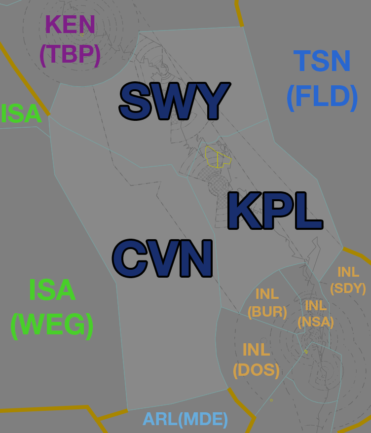

--8<-- "includes/abbreviations.md"
## Positions

| Name | Callsign | Frequency | Login ID |
| ---- | -------- | --------- | -------- |
| **Keppel**  | **Brisbane Centre** | **125.900** | **BN-KPL_CTR** |
| Swampy :material-information-outline:{ title="Non-standard position"} | Brisbane Centre | 133.200 | BN-SWY_CTR |
| Carnarvon :material-information-outline:{ title="Non-standard position"} | Brisbane Centre | 133.800 | BN-CVN_CTR |

!!! abstract "Non-Standard Positions"
    :material-information-outline: Non-standard positions may only be used in accordance with [VATPAC Air Traffic Services Policy](https://vatpac.org/publications/policies){target=new}.  
    Approval must be sought from the **bolded parent position** prior to opening a Non-Standard Position, unless [NOTAMs](https://vatpac.org/publications/notam){target=new} indicate otherwise (eg, for events).

## Airspace

<figure markdown>
{ width="700" }
  <figcaption>Keppel Airspace</figcaption>
</figure>

KPL is responsible for the [RK TCU](../../../terminal/coral) when **RKA** is offline.  
SWY is responsible for the [MK TCU](../../../terminal/coral) when **MKA** is offline.  
KPL is responsible for **SWY** and **CVN** when they are offline.  

### Reclassifications
#### RK CTR
Whilst the **RKA** controller is expected to provide a [top-down service](../../../aerodromes/Rockhampton) to YBRK when **RK ADC** is offline, this is not expected of a KPL controller when both **RKA** and **RK ADC** are offline. If electing not to provide a top-down service to YBRK, the RK CTR Class D is reclassified to Class G `SFC` to `A007`, and Class E `A007` to `A045`.

!!! tip
    If choosing *not* to provide a top down service, consider publishing an **ATIS Zulu** for the aerodrome, to inform pilots about the airspace reclassification. The *More ATIS* plugin has a formatted Zulu ATIS message.

#### HM CTR
When **HM ADC** is offline, HM CTR (Class D `SFC` to `A045`) reverts to Class G, and is administered by SWY. Alternatively, SWY may provide a [top-down procedural service](../../../aerodromes/Hammo) if they wish (not recommended).  

!!! tip
    If choosing *not* to provide a top down service, consider publishing an **ATIS Zulu** for the aerodrome, to inform pilots about the airspace reclassification. The *More ATIS* plugin has a formatted Zulu ATIS message.

#### MK CTR
Whilst the **MKA** controller is expected to provide a [top-down service](../../../aerodromes/Mackay) to YBMK when **MK ADC** is offline, this is not expected of a SWY controller when both **MKA** and **MK ADC** are offline. If electing not to provide a top-down service to YBMK, the RK CTR Class D is reclassified to Class G `SFC` to `A007`, and Class E `A007` to `A045`.

!!! tip
    If choosing *not* to provide a top down service, consider publishing an **ATIS Zulu** for the aerodrome, to inform pilots about the airspace reclassification. The *More ATIS* plugin has a formatted Zulu ATIS message.

### CPDLC
The Primary Communication Method for KPL is Voice.

[CPDLC](../../../client/cpdlc) may be used in lieu when applicable.

The CPDLC Station Code is `YKPL`.

!!! tip
    Even though KPL's Primary Communication Method is Voice, CPDLC may be used for Overfliers.

## Sector Responsibilities
### Keppel (KPL)
#### YBRK Arrivals
KPL is responsible for issuing STAR Clearances and descent.

#### YBMK Arrivals
KPL is responsible for issuing STAR Clearance and initial descent to not below `F160`.

#### YBSU Arrivals
KPL is responsible for issuing STAR Clearance and initial descent to not below `F190`.

#### YBBN/YBCG Arrivals
KPL has no requirements to issue STAR clearances or descent for YBBN/YBCG arrivals. However, due to the proximity of the border with INL(BUR) to YBBN/YBCG, KPL should endeavour to handoff aircraft to INL(BUR) **as soon as possible**, ie, **>50nm** to the boundary if there are no restrictions.

### Swampy (SWY)
#### YBMK Arrivals
SWY is responsible for issuing STAR Clearances and descent.

#### YBRK Arrivals
SWY is responsible for issuing STAR Clearance and initial descent to not below `F160`.

#### YBHM Arrivals
SWY is responsible for issuing descent.

#### YBTL Arrivals
SWY is responsible for issuing STAR Clearance and initial descent to not below `F190`.

### Carnarvon (CVN)
CVN is purely Classes A, E and G of airspace. [Standard separation procedures](../../../separation-standards) apply.

## STAR Clearance Expectation
### Handoff
Aircraft being transferred to the following sectors shall be told to Expect STAR Clearance on handoff:

| Transferring Sector | Receiving Sector | ADES | Notes |
| ---- | -------- | --------- | --------- |
| KPL, CVN | INL(BUR/DOS) | YBBN, YBCG | |
| KPL | SWY | YBTL | |
| SWY | KPL | YBSU | |
| SWY | KEN(TBP) | YBCS | |

!!! tip
    Refer to [KPL Sector Responsibilities](#ybbnybcg-arrivals) for information regarding early handoffs from KPL to INL(BUR)

### First Contact
Aircraft being transferred from the following sectors shall be given STAR Clearance on first contact:

| Transferring Sector | Receiving Sector | ADES | Notes |
| ---- | -------- | --------- | --------- |
| INL(NSA) | KPL | YBRK, YBMK | |
| KEN(TBP) | SWY | YBRK, YBMK | |
| KPL | SWY | YBTL | |
| SWY | KPL | YBSU | |

## Terminal Handover Frequencies
Each of the Coral TCUs has its own frequency. When a controller is [extending](../../../controller-skills/extending/#terminal-area) to cover both TCUs both frequencies will be primed but the callsign remains the same.

| TCU | Frequency (Controller) |
| ---- | --------------------- |
| MKA | **125.650** (MKA)      |
| RKA | **123.750** (RKA)      |

## Coordination
### RKA
#### Airspace
RKA is responsible for the airspace within the 'RK keyhole' `SFC` to `F150`.

Refer to [Reclassifications](#rk-ctr) for operations when RKA is offline.

#### Arrivals/Overfliers
Voiceless for all aircraft:

- With ADES **YBRK**; and  
- Assigned the **ABVAS** or **DADBO** STAR; and  
- Assigned `A090`

All other aircraft coming from KPL CTA must be **Heads-up** Coordinated to RKA prior to **20nm** from the boundary.

#### Departures
Voiceless for all aircraft:

- Tracking via **BUDGI** or **TARES**; and  
- Assigned the lower of `F150` or the `RFL`

All other aircraft going to KPL CTA will be **Heads-up** Coordinated by RKA.

### MKA
#### Airspace
MKA is responsible for the airspace within the 'MK keyhole' `SFC` to `F150`.

Refer to [Reclassifications](#mk-ctr) for operations when MKA is offline.

#### Arrivals
Voiceless for all aircraft:

- With ADES **YBMK**; and  
- Assigned the **DAGSI** or **WELKE** STAR; and  
- Assigned `A090`

All other aircraft coming from SWY CTA must be **Heads-up** Coordinated to MKA prior to **20nm** from the boundary.

#### Departures
Voiceless for all aircraft:

- Tracking via **CLIFT** or **MUNAR**; and  
- Assigned the lower of `F150` or the `RFL`

All other aircraft going to SWY CTA will be **Heads-up** Coordinated by MKA.

#### Airspace
When **MKA** is online, they own up to `F150` in the **shaded** are shown below:
<figure markdown>
{ width="800" }
  <figcaption>Mackay TCU Airspace</figcaption>
</figure>

### Enroute
As per [Standard coordination procedures](../../../controller-skills/coordination/#enr-enr), Voiceless, no changes to route or CFL within **50nm** to boundary.

### KPL Internal
As per [Standard coordination procedures](../../../controller-skills/coordination/#enr-enr), Voiceless, no changes to route or CFL within **50nm** to boundary.

Additionally, changes to CFL are permitted up to the boundary between KPL and SWY, for the purposes of issuing descent in to YBRK and YBMK.

### HM ADC
#### Airspace
HM ADC is responsible for the Class D airspace in the HM CTR `SFC` to `A045`.

Refer to [Reclassifications](#hm-ctr) for operations when HM ADC is offline.

#### Departures
[Next](../../controller-skills/coordination.md#next) coordination is required from HM ADC to SWY for all aircraft **entering SWY CTA**.

The Standard Assignable level from **HM ADC** to **SWY** is:

| Aircraft | Level |
| ---- | ---- |
| All | The lower of `A050` and `RFL` |

#### Arrivals
YBHM arrivals shall be heads-up coordinated to **HM ADC** from SWY prior to **5 mins** from the boundary.

!!! phraseology
    **SWY** -> **HM ADC**: "Via OPOSI for RNP-U, JST848”  
    **HM ADC** -> **SWY**: "JST848, A060"  

The Standard Assignable level from SWY to HM ADC is `A060`, any other level must be prior coordinated.

### TSN(HWE/FLD) (Oceanic)
As per [Standard coordination procedures](../../../controller-skills/coordination/#pacific-units), Voiceless, no changes to route or CFL within **15 mins** to boundary.

Aircraft must have their identification terminated and be instructed to make a position report on first contact with the next (procedural) sector.

!!! phraseology
    **INL**: "QFA121, identification terminated, report position to Brisbane Radio, 126.45"