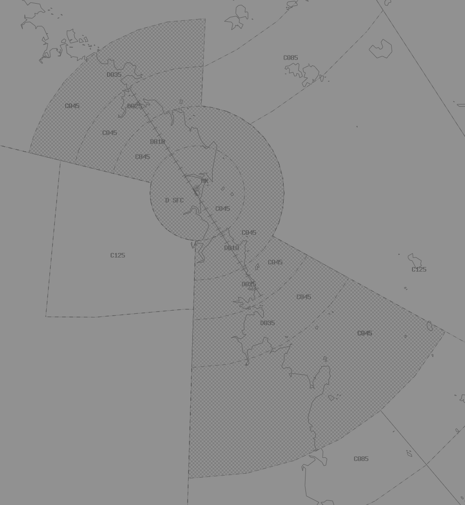

--8<-- "includes/abbreviations.md"
## Positions

| Name | Callsign | Frequency | Login ID |
| ---- | -------- | --------- | -------- |
| **Keppel** | **Brisbane Centre** | **125.900** | **BN-KPL_CTR** |
| Swampy† | Brisbane Centre | 133.200 | BN-SWY_CTR |
| Carnarvon† | Brisbane Centre | 133.800 | BN-CVN_CTR |

† *Non-standard positions* may only be used in accordance with [VATPAC Air Traffic Services Policy](https://vatpac.org/publications/policies){target=new}

### CPDLC
The Primary Communication Method for KPL is Voice.

[CPDLC](../../../client/cpdlc) may be used in lieu when applicable.

The CPDLC Station Code is `YKPL`.

!!! tip
    Even though KPL's Primary Communication Method is Voice, CPDLC may be used for Overfliers.

## Airspace

<figure markdown>
{ width="700" }
  <figcaption>Keppel Airspace</figcaption>
</figure>

KPL is responsible for the [RK TCU](../../../terminal/coral) when **RKA** is offline.  
SWY is responsible for the [MK TCU](../../../terminal/coral) when **MKA** is offline.  
KPL is responsible for **CVN** and **SWY** when they are offline.  

### Reclassifications
#### RK CTR
Whilst the **RKA** controller is expected to provide a [top-down service](../../../aerodromes/Rockhampton) to YBRK when **RK ADC** is offline, this is not expected of a KPL controller when both **RKA** and **RK ADC** are offline. If electing not to provide a top-down service to YBRK, the RK CTR Class D is reclassified to Class G `SFC` to `A007`, and Class E `A007` to `A045`.

!!! tip
    If choosing *not* to provide a top down service, consider publishing an **ATIS Zulu** for the aerodrome, to inform pilots about the airspace reclassification. The *More ATIS* plugin has a formatted Zulu ATIS message.

#### HM CTR
When **HM ADC** is offline, HM CTR (Class D `SFC` to `A045`) reverts to Class G, and is administered by SWY. Alternatively, SWY may provide a [top-down procedural service](../../../aerodromes/Hammo) if they wish (not recommended).  

!!! tip
    If choosing *not* to provide a top down service, consider publishing an **ATIS Zulu** for the aerodrome, to inform pilots about the airspace reclassification. The *More ATIS* plugin has a formatted Zulu ATIS message.

#### MK CTR
Whilst the **MKA** controller is expected to provide a [top-down service](../../../aerodromes/Mackay) to YBMK when **MK ADC** is offline, this is not expected of a SWY controller when both **MKA** and **MK ADC** are offline. If electing not to provide a top-down service to YBMK, the RK CTR Class D is reclassified to Class G `SFC` to `A007`, and Class E `A007` to `A045`.

!!! tip
    If choosing *not* to provide a top down service, consider publishing an **ATIS Zulu** for the aerodrome, to inform pilots about the airspace reclassification. The *More ATIS* plugin has a formatted Zulu ATIS message.

## Sector Responsibilities
### Keppel (KPL)
KPL is responsible for issuing STAR Clearances and initial descent for aircraft bound for YBBN and YBCG (Jets only), and YBSU.  
KPL is also reponsible for sequencing, and descent for aircraft bound for YBRK.  
KPL is responsible for issuing STAR Clearances for aircraft bound for YBRK and YBMK.

#### YBBN PROPS Runway Assignment
When operating the PROPS Runway Mode at YBBN, Arrivals shall be assigned the appropriate 'ALPHA' STAR (or other STAR on pilot request) for **Runway 01L/19R**.

### Swampy (SWY)
SWY is responsible for issuing STAR Clearances and initial descent for aircraft bound for YBTL.  
SWY is also reponsible for sequencing, and descent for aircraft bound for YBMK.  
SWY is responsible for issuing STAR Clearances for aircraft bound for YBRK and YBMK.

### Carnarvon (CVN)
CVN is purely Classes A, E and G of airspace. [Standard separation procedures](../../../separation-standards) apply.

## STAR Clearance Expectation
### Handoff
Aircraft being transferred to the following sectors shall be told to Expect STAR Clearance on handoff:

| Transferring Sector | Receiving Sector | ADES | Notes |
| ---- | -------- | --------- | --------- |
| KPL | INL(BUR) | YBBN, YBCG | Non-jets only |
| KPL | SWY | YBTL | |
| SWY | KEN(TBP) | YBCS | |
| SWY, CVN | KPL | YBBN, YBCG | Jets only |
| SWY | KPL | YBSU | |
| CVN | INL(DOS) | YBBN | |

### First Contact
Aircraft being transferred from the following sectors shall be given STAR Clearance on first contact:

| Transferring Sector | Receiving Sector | ADES | Notes |
| ---- | -------- | --------- | --------- |
| INL(NSA) | KPL | YBRK, YBMK | |
| KEN(TBP) | SWY | YBRK, YBMK | |
| SWY, CVN | KPL | YBBN, YBCG | Jets only |
| CVN | DOS | YBBN, YBCG | |

## Coordination
### Enroute
As per [Standard coordination procedures](../../../controller-skills/coordination/#enr-enr), Voiceless, no changes to route or CFL within **50nm** to boundary.

### KPL Internal
As per [Standard coordination procedures](../../../controller-skills/coordination/#enr-enr), Voiceless, no changes to route or CFL within **50nm** to boundary.

### RKA
#### Airspace
RKA is responsible for the airspace within the 'RK keyhole' `SFC` to `F150`.

Refer to [Reclassifications](#rk-ctr) for operations when RKA is offline.

#### Arrivals/Overfliers
Voiceless for all aircraft:

- With ADES **YBRK**; and  
- Assigned the **ABVAS** or **DADBO** STAR; and  
- Assigned `A090`

All other aircraft coming from KPL CTA must be **Heads-up** Coordinated to RKA prior to **20nm** from the boundary.

#### Departures
Voiceless for all aircraft:

- Tracking via **BUDGI** or **TARES**; and  
- Assigned the lower of `F150` or the `RFL`

All other aircraft going to KPL CTA will be **Heads-up** Coordinated by RKA.

### MKA
#### Airspace
MKA is responsible for the airspace within the 'MK keyhole' `SFC` to `F150`.

{ width="800" }
  <figcaption>Mackay TCU Airspace</figcaption>
</figure>

Refer to [Reclassifications](#mk-ctr) for operations when MKA is offline.

#### Arrivals
Voiceless for all aircraft:

- With ADES **YBMK**; and  
- Assigned the **DAGSI** or **WELKE** STAR; and  
- Assigned `A090`

All other aircraft coming from SWY CTA must be **Heads-up** Coordinated to MKA prior to **20nm** from the boundary.

#### Departures
Voiceless for all aircraft:

- Tracking via **CLIFT** or **MUNAR**; and  
- Assigned the lower of `F150` or the `RFL`

All other aircraft going to SWY CTA will be **Heads-up** Coordinated by MKA.

### HM ADC
#### Airspace
HM ADC is responsible for the Class D airspace in the HM CTR `SFC` to `A045`.

Refer to [Reclassifications](#hm-ctr) for operations when HM ADC is offline.

#### Departures
Departures from YBHM in to SWY Class C will be coordinated when ready for departure.  

!!! example
    **HM ADC** -> **SWY**: "Next, QFA797"  
    **SWY** -> **HM ADC**: "QFA797, Unrestricted"  
    **HM ADC** -> **SWY**: "QFA797"  

The Standard Assignable level from HM ADC to SWY is the lower of `A050` or the `RFL`, any other level must be prior coordinated.

#### Arrivals
YBHM arrivals shall be heads-up coordinated to **JM ADC** from SWY prior to **5 mins** from the boundary.

!!! example
    **SWY** -> **HM ADC**: "Via OPOSI for RNP U RWY 32, JST848”  
    **HM ADC** -> **SWY**: "JST848, RNP U RWY 32"  

The Standard Assignable level from KEN(SWY) to HM ADC is `A060`, any other level must be prior coordinated.

### TSN(FLD) (Oceanic)
As per [Standard coordination procedures](../../../controller-skills/coordination/#pacific-units), Voiceless, no changes to route or CFL within **15 mins** to boundary.

Aircraft must have their identification terminated and be instructed to make a position report on first contact with the next (procedural) sector.

!!! example
    **INL**: "QFA121, identification terminated, report position to Brisbane Radio, 126.45"