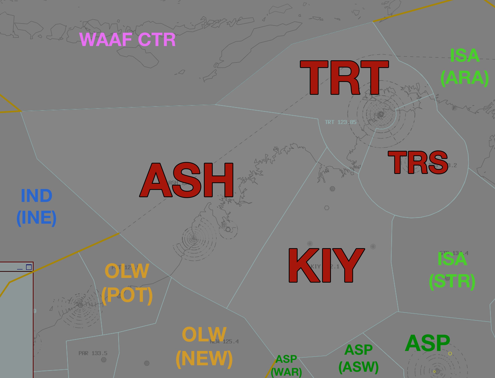

--8<-- "includes/abbreviations.md"

## Positions
| Name | Callsign | Frequency | Login ID |
| ---- | -------- | --------- | -------- |
| **Territory North** | **Brisbane Centre** | **123.850** | **BN-TRT_CTR** |
| Territory South :material-information-outline:{ title="Non-standard position"} | Brisbane Centre | 133.200 | BN-TRS_CTR |
| Ashmore :material-information-outline:{ title="Non-standard position"} | Brisbane Centre | 133.400 | BN-ASH_CTR |
| Kimberley :material-information-outline:{ title="Non-standard position"} | Brisbane Centre | 132.100 | BN-KIY_CTR |

!!! abstract "Non-Standard Positions"
    :material-information-outline: Non-standard positions may only be used in accordance with [VATPAC Air Traffic Services Policy](https://vatpac.org/publications/policies){target=new}.  
    Approval must be sought from the **bolded parent position** prior to opening a Non-Standard Position, unless [NOTAMs](https://vatpac.org/publications/notam){target=new} indicate otherwise (eg, for events).

### CPDLC
The Primary Communication Method for ISA is [CPDLC](../../../client/cpdlc).

The CPDLC Station Code is `YISA`.

Voice may be used in lieu when applicable.

## Airspace

<figure markdown>
{ width="700" }
  <figcaption>Territory Airspace</figcaption>
</figure>

TRT is responsible for **TRS**, **ASH**, and **KIY**,  when they are offline.  

### Reclassifications
#### BRM CTR
When **BRM ADC** is offline, BRM CTR (Class D/E `SFC` to `A055`) reverts to Class G, and is administered by ASH. Alternatively, ASH may provide a [top-down procedural service](../../../aerodromes/Broome) if they wish.

!!! tip
    If choosing *not* to provide a top down service, consider publishing an **ATIS Zulu** for the aerodrome, to inform pilots about the airspace reclassification. The *More ATIS* plugin has a formatted Zulu ATIS message.

#### TN TCU
TN TCU being online will activate the following Airspace by default:

- TN MIL CTR `SFC`-`A025`
- R249A `A015`-`A025`
- R249B `A025`-`F190`
- R238 `A035`-`F190`

All of which are reclassified as **Class C** when active, and TN APP has Control Authority of.

!!! note
    TN APP may negotiate with TRS for an increase to the upper limit of the Restricted Areas and their airspace, if required for military operations. This limit may also be changed by NOTAM.

## Extending
!!! warning "Important"
    Due to the large geographical area covered by this sector and it's neighbours, controllers are reminded of their obligations under the [ATS Policy](https://vatpac.org/publications/policies) when extending. Ensure that you have sufficiently placed visibility points to cover your primary sector and any secondary, extended sectors in their entirety.
    
## Sector Responsibilities
TRT and TRS are responsible for sequencing, issuing STAR Clearances, and issuing descent for aircraft bound for YPDN.  
ASH is responsible for issuing descent and ascertaining arrival intentions for aircraft bound for YBRM.
ASH is also responsible for sequencing and issuing descent to aircraft bound for YCIN.

## STAR Clearance Expectation
### Handoff
Aircraft being transferred to the following sectors shall be told to Expect STAR Clearance on handoff:

| Transferring Sector | Receiving Sector | ADES | Notes |
| ---- | -------- | --------- | --------- |
| ASH, KIY | TRT, TRS | YPDN | |

### First Contact
Aircraft being transferred from the following sectors shall be given STAR Clearance on first contact:

| Transferring Sector | Receiving Sector | ADES | Notes |
| ---- | -------- | --------- | --------- |
| KIY, ASH, ISA(ARA/STR) | TRT, TRS | YPDN | |

## Coordination

### Enroute
As per [Standard coordination procedures](../../../controller-skills/coordination/#enr-enr), Voiceless, no changes to route or CFL within **50nm** to boundary.

### TRT Internal
As per [Standard coordination procedures](../../../controller-skills/coordination/#enr-enr), Voiceless, no changes to route or CFL within **50nm** to boundary.

### DN TCU
#### Airspace
DN TCU owns the airspace within a 40NM radius of the DN DME from `SFC`–`F180`  

DN TCU is also responsible for Active Restricted Area R264 A-K and R230 A-F  

DAW may request DN TCU (`SFC`–`F240`) from TRT to facilitate military transits to/from R264 A-K and R230 A-F  

Refer to [Darwin TCU Airspace Division](../../../terminal/darwin/#airspace-division) for information on airspace divisions when **DAW** is online.

#### Arrivals/Overfliers
Voiceless for all aircraft:

- With ADES **YPDN**; and  
- Assigned a STAR; and  
- Assigned `A100`

All other aircraft coming from TRT CTA must be **Heads-up** Coordinated to DN TCU prior to **20nm** from the boundary.

#### Departures
Voiceless for all aircraft:

- Tracking via a Procedural SID terminus; and  
- Assigned the lower of `F180` or the `RFL`

All other aircraft going to TRT CTA will be **Heads-up** Coordinated by DN TCU.

### BRM ADC
#### Airspace
BRM ADC is responsible for the Class D airspace `SFC` to `A055`, as well as the Class E airspace `1200ft AGL` to `A055`, within the BRM CTR.

#### Departures
[Next](../../controller-skills/coordination.md#next) coordination is required from BRM ADC to TRT(ASH) for all aircraft **entering TRT(ASH) CTA**.

The Standard Assignable level from **BRM ADC** to **TRT(ASH)** is:

| Aircraft | Level |
| ---- | ---- |
| All | The lower of `A050` and `RFL` |

#### Arrivals
YBRM arrivals shall be heads-up coordinated to **BRM ADC** from TRT prior to **5 mins** from the boundary.

!!! phraseology
    **TRT** -> **BRM ADC**: "Via SAFIR, FD621”  
    **BRM ADC** -> **TRT**: "FD621"  

The Standard Assignable level from TRT(ASH) to BRM ADC is `A060`, any other level must be prior coordinated.

### CIN TCU
#### Airspace
The limits of the CIN TCU are `SFC` to `F200` within 25 DME CIN. This may be amended by NOTAM.

#### Arrivals/Overfliers
The Standard assignable level from ASH to CIN TCU is `F130`, tracking via CIN VOR.

All other aircraft must be voice coordinated to CIN TCU prior to **20nm** from the boundary.

#### Departures
The Standard Assignable level from CIN TCU to ASH is `F190`, and tracking via their planned route.

#### CIN ADC
When CIN TCU is offline, coordination is not required between ASH and CIN ADC. Aircraft entering CIN ADC airspace shall be handed off, and instructed to contact CIN ADC for onwards clearance.

CIN ADC owns the Class C airspace within the CIN MIL CTR from `SFC` to `A015`.

### TN TCU
#### Airspace
Any airspace releases from the default setup must be coordinated and agreed upon with TRT(TRS). It is also good practice to remind them of any airspace releases that may be active due to NOTAMs.

#### Departures
Voiceless for all aircraft:

- Tracking via a Procedural SID terminus; and  
- Assigned the lower of `F180` or the `RFL`

All other aircraft going to TRS CTA must be **Heads-up** Coordinated by TN TCU prior to the boundary.

!!! phraseology
    **TN TCU** -> **TRS**: "DRGN48, request DCT BEBEX"  
    **TRS** -> **TN TCU**: "DRGN48, concur DCT BEBEX"  

#### Arrivals/Overfliers
Voiceless for all aircraft:

- Tracking via **TN**; and  
- Assigned the lower of `F130` or the `RFL`.

All other aircraft coming from TRS CTA will be **Heads-up** Coordinated to TN TCU.

!!! phraseology
    **TRS** -> **TN TCU**: "via NOLEK, FD858"  
    **TN TCU** -> **TRS**: "FD858, F150" 

### IND(INE) (Oceanic)
As per [Standard coordination procedures](../../../controller-skills/coordination/#pacific-units), Voiceless, no changes to route or CFL within **15 mins** to boundary.

Aircraft must have their identification terminated and be instructed to make a position report on first contact with the next (procedural) sector.

!!! phraseology
    **ISA**: "QFA121, identification terminated, report position to Brisbane Radio, 129.25"

### International (WAAF)
As per [Standard coordination procedures](../../../controller-skills/coordination/#other-units), Heads-up Coordination required for all aircraft prior to **30 mins** from boundary.

!!! phraseology
    **TRT** -> **WAAF CTR**: "Estimate, SIA236, KIKEM time 21, F320"  
    **WAAF CTR** -> **TRT**: "SIA236, F320"