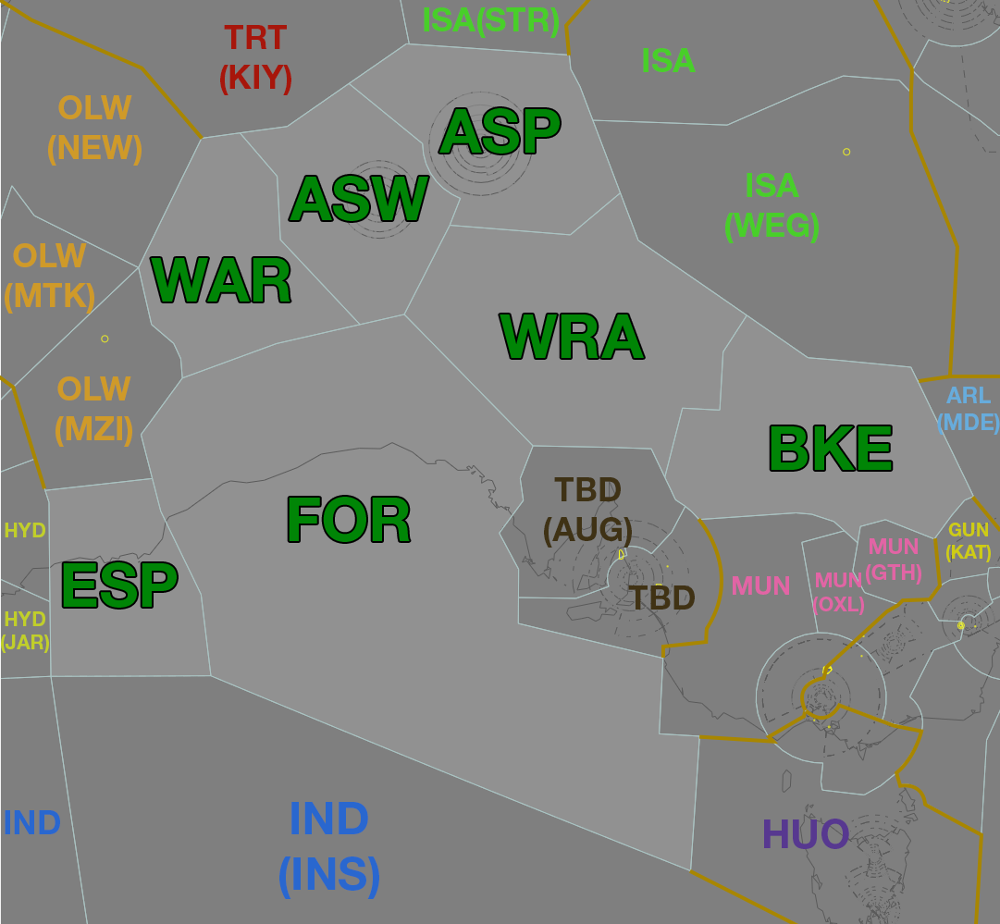

--8<-- "includes/abbreviations.md"
## Positions

| Name | Callsign | Frequency | Login ID |
| ---- | -------- | --------- | -------- |
| **Alice Springs** | **Melbourne Centre** | **128.850** | **ML-ASP_CTR** |
| Alice Springs West† | Melbourne Centre | 131.800 | ML-ASW_CTR |
| Warburton† | Melbourne Centre | 124.900 | ML-WAR_CTR |
| Forest† | Melbourne Centre | 132.700 | ML-FOR_CTR |
| Woomera† | Melbourne Centre | 132.900 | ML-WRA_CTR |
| Bourke† | Melbourne Centre | 128.200 | ML-BKE_CTR |
| Esperance† | Melbourne Centre | 123.950 | ML-ESP_CTR |

† *Non-standard positions* may only be used in accordance with [VATPAC Air Traffic Services Policy](https://vatpac.org/publications/policies){target=new}

## Airspace

<figure markdown>
{ width="700" }
  <figcaption>Alice Springs Airspace</figcaption>
</figure>

**AS ADC** is responsible for the Class D airspace `SFC` to `A045`, as well as the Class C airspace `A045` to `A065`, within the AS CTR.

### Reclassifications

When **AS ADC** is offline, AS CTR (Class D and C `SFC` to `F125`) within 80 DME AS reverts to Class G, and AS CTR (Class C `F125` to `F245`) within 80 DME AS reverts to Class E, and both are administered by ASP. Alternatively, ASP may provide a [top-down procedural service](../../../aerodromes/Alice) if they wish.

## Extending
!!! Warning
    ML-ASP_CTR is only permitted to extend to adjacent **YMMM** sectors.

## STAR Clearance Expectation
### Handoff
Aircraft being transferred to the following sectors shall be told to Expect STAR Clearance on handoff:

| Transferring Sector | Receiving Sector | ADES | Notes |
| ---- | -------- | --------- | --------- |
| FOR, WRA, BKE | TBD(AUG) | YPAD, YPED | Jets only |
| BKE | TBD | YPAD, YPED | |
| ESP | PIY(HYD) | YPPH, YPEA | Jets only |
| BKE | YWE(KAT) | YSSY | |

## Coordination
### Enroute
As per [Standard coordination procedures](../../../controller-skills/coordination/#enr-enr), Voiceless, no changes to route or CFL within **50nm** to boundary.

### ASP Internal
As per [Standard coordination procedures](../../../controller-skills/coordination/#enr-enr), Voiceless, no changes to route or CFL within **50nm** to boundary.

### AS ADC
#### Airspace
AS ADC is responsible for the Class D airspace `SFC` to `A045`, as well as the Class C airspace `A045` to `A065`, within the AS CTR.

#### Departures
Departures from YBAS in to ASP Class C will be coordinated when ready for departure.

!!! example
    **AS ADC** -> **ASP**: "Next, QFA797"  
    **ASP** -> **AS ADC**: "QFA797, Unrestricted"  
    **AS ADC** -> **ASP**: "QFA797"  

The Standard Assignable level from **AS ADC** to ASP is the lower of `A070` or the `RFL`, any other level must be prior coordinated.
#### Arrivals
YBAS arrivals shall be heads-up coordinated to **AS ADC** from ASP prior to **5 mins** from the boundary.

!!! example
    **ASP** -> **AS ADC**: "Via SADEL, QFA1956”  
    **AS ADC** -> **ASP**: "QFA1956"  

The Standard Assignable level from ASP to **AS ADC** is `A080`, any other level must be prior coordinated.

### WR ADC
By default, WR ADC owns the **R222F** Restricted Area. This airspace has vertical limits of `SFC` to `F120`. When WR ADC is active, this airspace is classified as Class D.

Coordination is not required between ASP(WRA) and WR ADC. Aircraft entering WR ADC airspace shall be handed off, and instructed to contact WR ADC for onwards clearance.

### IND(INS) (Oceanic)
As per [Standard coordination procedures](../../../controller-skills/coordination/#pacific-units), Voiceless, no changes to route or CFL within **15 mins** to boundary.