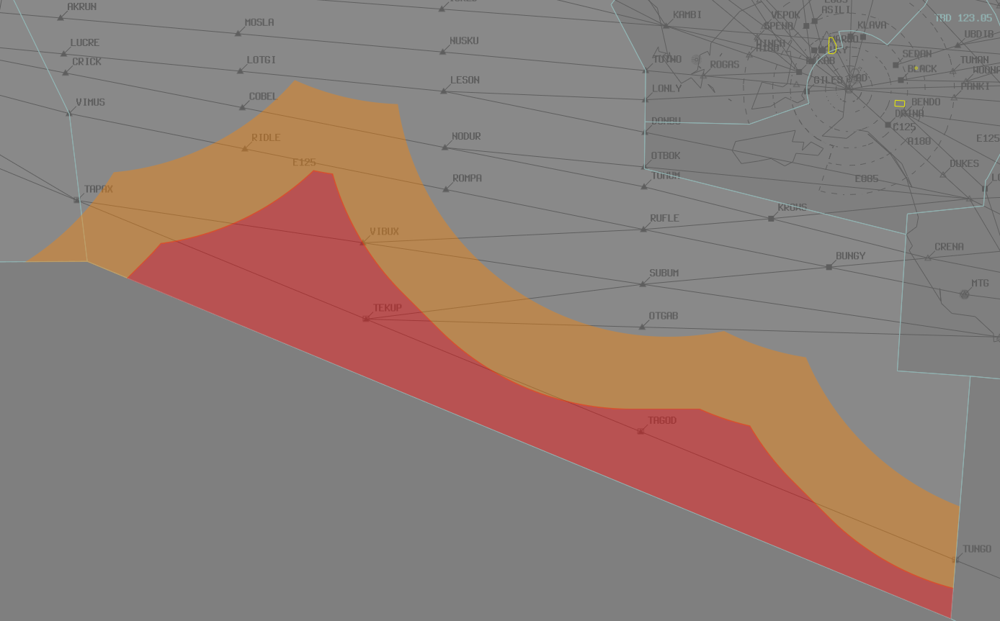

--8<-- "includes/abbreviations.md"
## Positions

| Name | Callsign | Frequency | Login ID |
| ---- | -------- | --------- | -------- |
| **Alice Springs** | **Melbourne Centre** | **128.850** | **ML-ASP_CTR** |
| Alice Springs West :material-information-outline:{ title="Non-standard position"} | Melbourne Centre | 131.800 | ML-ASW_CTR |
| Warburton :material-information-outline:{ title="Non-standard position"} | Melbourne Centre | 124.900 | ML-WAR_CTR |
| Forest :material-information-outline:{ title="Non-standard position"} | Melbourne Centre | 132.700 | ML-FOR_CTR |
| Woomera :material-information-outline:{ title="Non-standard position"} | Melbourne Centre | 132.900 | ML-WRA_CTR |
| Bourke :material-information-outline:{ title="Non-standard position"} | Melbourne Centre | 128.200 | ML-BKE_CTR |
| Esperance :material-information-outline:{ title="Non-standard position"} | Melbourne Centre | 123.950 | ML-ESP_CTR |

!!! abstract "Non-Standard Positions"
    :material-information-outline: Non-standard positions may only be used in accordance with [VATPAC Air Traffic Services Policy](https://vatpac.org/publications/policies){target=new}.  
    Approval must be sought from the **bolded parent position** prior to opening a Non-Standard Position, unless [NOTAMs](https://vatpac.org/publications/notam){target=new} indicate otherwise (eg, for events).

### CPDLC
The Primary Communication Method for ASP is [CPDLC](../../../client/cpdlc).

The CPDLC Station Code is `YASP`.

Voice may be used in lieu when applicable.

## Airspace

<figure markdown>
{ width="700" }
  <figcaption>Alice Springs Airspace</figcaption>
</figure>

**AS ADC** is responsible for the Class D airspace `SFC` to `A045`, as well as the Class C airspace `A045` to `A065`, within the AS CTR.

### Reclassifications
#### AS CTR
When **AS ADC** is offline, AS CTR (Class D and C `SFC` to `F125`) within 80 DME AS reverts to Class G, and AS CTA (Class C `F125` to `F245`) within 80 DME AS reverts to Class E, and both are administered by ASP. Alternatively, ASP may provide a [top-down procedural service](../../../aerodromes/Alice) if they wish.

!!! tip
    If choosing *not* to provide a top down service, consider publishing an **ATIS Zulu** for the aerodrome, to inform pilots about the airspace reclassification. The *More ATIS* plugin has a formatted Zulu ATIS message.

## Extending
!!! warning "Important"
    Due to the large geographical area covered by this sector and it's neighbours, controllers are reminded of their obligations under the [ATS Policy](https://vatpac.org/publications/policies) when extending. Ensure that you have sufficiently placed visibility points to cover your primary sector and any secondary, extended sectors in their entirety.

## Surveillance Coverage
Limited surveillance coverage exists in the FOR sector greater than **250nm** from ADSB stations. [Procedural Standards](../../../separation-standards/procedural/) must be implemented **prior** to losing surveillance coverage

The **Orange** shaded areas will have limited surveillance coverage **Below F330**.  
The **Red** shaded areas will have limited surveillance coverage at **All Levels**.

<figure markdown>
{ width="700" }
  <figcaption>Forest Surveillance Coverage</figcaption>
</figure>

## STAR Clearance Expectation
### Handoff
Aircraft being transferred to the following sectors shall be told to Expect STAR Clearance on handoff:

| Transferring Sector | Receiving Sector | ADES | Notes |
| ---- | -------- | --------- | --------- |
| FOR, WRA, BKE | TBD(AUG) | YPAD, YPED | Jets only |
| BKE | TBD | YPAD, YPED | |
| ESP | HYD | YPPH, YPEA | Jets only |
| BKE | GUN(KAT), MUN(GTH) | YSSY | |

## Coordination
### Enroute
As per [Standard coordination procedures](../../../controller-skills/coordination/#enr-enr), Voiceless, no changes to route or CFL within **50nm** to boundary.

### ASP Internal
As per [Standard coordination procedures](../../../controller-skills/coordination/#enr-enr), Voiceless, no changes to route or CFL within **50nm** to boundary.

### AS ADC
#### Airspace
AS ADC is responsible for the Class D airspace `SFC` to `A045`, as well as the Class C airspace `A045` to `A065`, within the AS CTR.

Refer to [Reclassifications](#as-ctr) for operations when AS ADC is offline.

#### Departures
[Next](../../controller-skills/coordination.md#next) coordination is required from AS ADC to ASP for all aircraft **entering ASP CTA**.

The Standard Assignable level from **AS ADC** to **ASP** is:

| Aircraft | Level |
| ---- | ---- |
| All | The lower of `A070` and `RFL` |

#### Arrivals
YBAS arrivals shall be heads-up coordinated to **AS ADC** from ASP prior to **5 mins** from the boundary.

!!! phraseology
    **ASP** -> **AS ADC**: "Via SADEL, QFA1956”  
    **AS ADC** -> **ASP**: "QFA1956"  

The Standard Assignable level from ASP to **AS ADC** is `A080`, any other level must be prior coordinated.

### WR ADC
By default, WR ADC owns the **R222F** Restricted Area. This airspace has vertical limits of `SFC` to `F120`. When WR ADC is active, this airspace is classified as Class D.

Coordination is not required between ASP(WRA) and WR ADC. Aircraft entering WR ADC airspace shall be handed off, and instructed to contact WR ADC for onwards clearance.

### IND(INS) (Oceanic)
As per [Standard coordination procedures](../../../controller-skills/coordination/#pacific-units), Voiceless, no changes to route or CFL within **15 mins** to boundary.

Aircraft must have their identification terminated and be instructed to make a position report on first contact with the next (procedural) sector.

!!! phraseology
    **ASP**: "QFA121, identification terminated, report position to Brisbane Radio, 129.25"