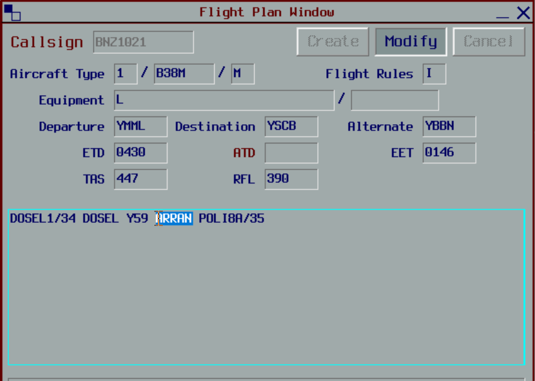
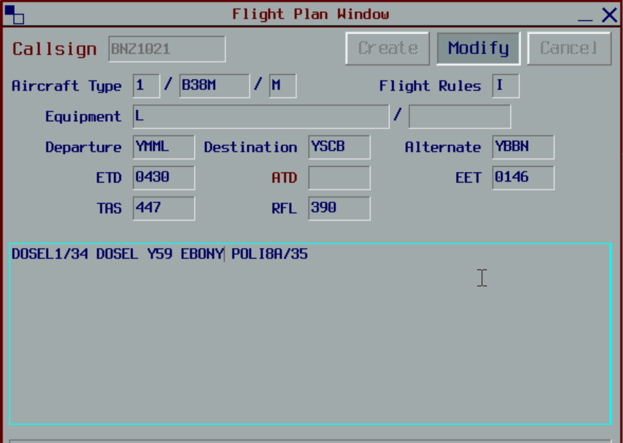

--8<-- "includes/abbreviations.md"
## Positions

| Name | Callsign | Frequency | Login ID |
| ---- | -------- | --------- | -------- |
| **Eildon Weir** | **Melbourne Centre** | **123.750** | **ML-ELW_CTR** |
| Benalla† | Melbourne Centre | 132.200 | ML-BLA_CTR |

† *Non-standard positions* may only be used in accordance with [VATPAC Air Traffic Services Policy](https://vatpac.org/publications/policies){target=new}

### CPDLC
The Primary Communication Method for ELW is Voice.

[CPDLC](../../../client/cpdlc) may be used in lieu when applicable.

The CPDLC Station Code is `YELW`.

!!! tip
    Even though ELW's Primary Communication Method is Voice, CPDLC may be used for Overfliers.

## Airspace

<figure markdown>
{ width="700" }
  <figcaption>Eildon Weir Airspace</figcaption>
</figure>

### Reclassifications
#### CB CTR
When **CB TCU** is offline, CB TCU (Class C `SFC` to `A085`) reverts to Class G, and is administered by WOL.

!!! note
    BLA does not assume the CB TCU in the absence of a CB TCU controller. Assumption of the CB TCU is the responsibility of WOL. Controllers may choose to verbally coordinate the release of the CB TCU to either sector/subsector.

#### AY CTR
When **AY ADC** is offline, AY CTR (Class D and C `SFC` to `A085`) reverts to Class G, and is administered by BLA. Alternatively, BLA may provide a [top-down procedural service](../../../aerodromes/Albury) if they wish.

!!! tip
    If choosing *not* to provide a top down service, consider publishing an **ATIS Zulu** for the aerodrome, to inform pilots about the airspace reclassification. The *More ATIS* plugin has a formatted Zulu ATIS message.

## Sector Responsibilities
### Eildon Weir (ELW)
ELW is responsible for the final sequencing actions in to YMML, and issuing STAR clearances to Non-jets bound for YMML and YMAV.

### Benalla (BLA)
BLA is reponsible for issuing STAR clearances and initial descent for aircraft bound for YMML (Jets only), YMAV (Jets only), and YSCB. BLA is also responsible for sequencing in to YSCB, and initial sequencing in to YMML.

#### YSCB STARs
When Runway 35 is in use at YSCB, by default, vatSys will select the POLLI STAR with the **ARRAN** transition. Aircraft that have planned via EBONY and ARRAN (ie, aircraft on the Y59 airway) need to be assigned the POLLI STAR with the **EBONY** transition. This can be manually overridden in the aircraft's flight plan as shown below:

<figure markdown>
{ width="500" }
  <figcaption>POLLI STAR with ARRAN transition</figcaption>
</figure>

<figure markdown>
{ width="500" }
  <figcaption>POLLI STAR with EBONY transition</figcaption>
</figure>

### Sequencing in to YMML
Aircraft assigned the **same runway** inbound via **LIZZI** and **BOYSE**, must be considered to be on the **same STAR** for sequencing purposes. That is, they must be at least **2 minutes** apart at their respective Feeder fixes.

## STAR Clearance Expectation
### Handoff
Aircraft being transferred to the following sectors shall be told to Expect STAR Clearance on handoff:

| Transferring Sector | Receiving Sector | ADES | Notes |
| ---- | -------- | --------- | --------- |
| BLA | BIK(GUN) | YSSY | |
| ELW | BLA | YSCB | |
| BLA | ELW | YMML | Non-Jets only |

### First Contact
Aircraft being transferred from the following sectors shall be given STAR Clearance on first contact:

| Transferring Sector | Receiving Sector | ADES | Notes |
| ---- | -------- | --------- | --------- |
| YWE(OXL,GTH) | BLA | YSCB | |
| BIK(WOL) | BLA | YMML, YMAV | Jets Only |
| ELW | BLA | YSCB | |
| BLA | ELW | YMML | Non-Jets only |

## Coordination
### CB TCU
#### Airspace
The Vertical limits of the CB TCU are `SFC` to `F245`.

Refer to [Canberra TCU Airspace Division](../../../terminal/canberra/#airspace-division) for information on airspace divisions when **CBW** is online.

Refer to [Reclassifications](#cb-ctr) for operations when CB TCU is offline.

#### Arrivals/Overfliers
Voiceless for all aircraft:

- With ADES **YSCB**; and  
- Assigned a STAR; and  
- Assigned `F130`

All other aircraft coming from BLA CTA must be **Heads-up** Coordinated to CB TCU prior to **20nm** from the boundary.

!!! note
    These coordination requirements apply to aircraft entering the CB TCU, even if the airspace is owned by WOL

#### Departures
Voiceless for all aircraft:
 
- Tracking via a Procedural SID terminus; and  
- Assigned the lower of `F240` or the `RFL`

All other aircraft going to BLA CTA will be **Heads-up** Coordinated by CB TCU.

### ML TCU
#### Airspace
The Vertical limits of the ML TCU are `SFC` to `F245`.

Refer to [Melbourne TCU Airspace Division](../../../terminal/melbourne/#airspace-division) for information on airspace divisions when **MDN** and/or **MDS** are online.

#### Arrivals/Overfliers
Voiceless for all aircraft:

- With ADES **YMML**; and  
- Assigned a STAR; and  
- Assigned `A090`

All other aircraft coming from ELW CTA must be **Heads-up** Coordinated to ML TCU prior to **20nm** from the boundary.

#### Departures
Voiceless for all aircraft:

- Tracking via **MNG**, **NONIX**, or **DOSEL**; and  
- Assigned the lower of `F240` or the `RFL`

All other aircraft going to ELW CTA will be **Heads-up** Coordinated by ML TCU.

### Enroute
As per [Standard coordination procedures](../../../controller-skills/coordination/#enr-enr), Voiceless, no changes to route or CFL within **50nm** to boundary.

That being said, it is *advised* that ELW give **Heads-up Coordination** prior to **50nm** from the boundary in the following scenarios:  
- BLA to BIK(GUN) for aircraft **not** on the Y59 or W817 airway*  
- ELW to YWE and WON for all aircraft  
- BLA to YWE(All) and BIK(WOL) for all aircraft  

!!! tip
    **BLA** should aim to handoff aircraft as soon as possible to **GUN**, so they can issue STAR clearance and commence sequencing. Remember, As per [Standard coordination procedures](../../../controller-skills/coordination/#handoffs), the Receiving sector may turn the aircraft 45° left or right and climb/descend to any level. So if required, nominate a restriction.

### ELW Internal
As per [Standard coordination procedures](../../../controller-skills/coordination/#enr-enr), Voiceless, no changes to route or CFL within **20nm** to boundary.

That being said, it is *advised* that ELW/BLA give **Heads-up Coordination** prior to **20nm** from the boundary in the following scenarios:  
- ELW to BLA for aircraft **not** on the Y59, H66, or W569 airway (Changes permitted up to boundary for sequencing/descent purposes)  
- BLA to ELW for aircraft **not** on the Q29 or V169 airway (Changes permitted up to boundary for sequencing/descent purposes)  

### ES TCU
Reserved.

### AY ADC
#### Airspace
AY ADC is responsible for the Class D airspace in the AY CTR `SFC` to `A045`.

Refer to [Reclassifications](#ay-ctr) for operations when AY ADC is offline.

#### Departures
Departures from YMAY in to BLA Class C will be coordinated when ready for departure.

!!! example
    **AY ADC** -> **BLA**: "Next, RXA6772"  
    **BLA** -> **AY ADC**: "RXA6772, Unrestricted"  
    **AY ADC** -> **BLA**: "RXA6772"  

The Standard Assignable level from **AY ADC** to BLA is the lower of `A070` or the `RFL`.

#### Arrivals
YMAY arrivals shall be heads-up coordinated to **AY ADC** from BLA prior to **5 mins** from the boundary.

!!! example
    **BLA** -> **AY ADC**: "via VEGRU1 arrival, QLK38"  
    **AY ADC** -> **BLA**: "QLK38, VEGRU1 arrival" 

The Standard Assignable level from BLA to **AY ADC** is `A080`.