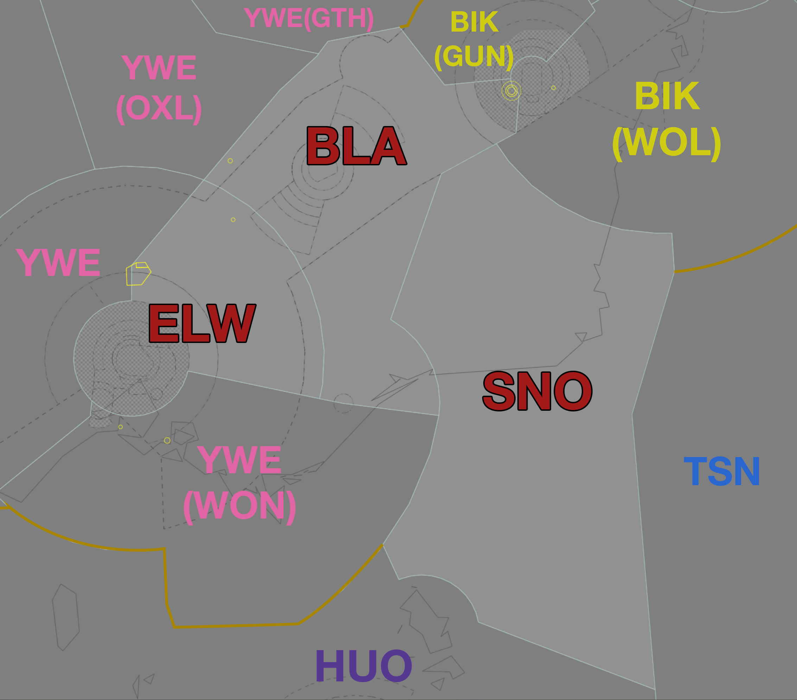

--8<-- "includes/abbreviations.md"
## Positions

| Name | Callsign | Frequency | Login ID |
| ---- | -------- | --------- | -------- |
| **Eildon Weir** | **Melbourne Centre** | **123.750** | **ML-ELW_CTR** |
| Benalla† | Melbourne Centre | 132.200 | ML-BLA_CTR |
| Snowy† | Melbourne Centre | 124.000 | ML-SNO_CTR |

† *Non-standard positions* may only be used in accordance with [VATPAC Ratings and Controller Positions Policy](https://vatpac.org/publications/policies)

## Airspace
When **CB TCU** is offline, CB TCU (Class C `SFC` to `F245`) reverts to Class G, and is administered by BLA. Alternatively, BLA may provide a [top-down approach service](../../../terminal/canberra) if they wish.  
When **AY ADC** is offline, AY CTR (Class D and C `SFC` to `A085`) reverts to Class G, and is administered by BLA. Alternatively, BLA may provide a [top-down procedural service](../../../aerodromes/Albury) if they wish.

<figure markdown>
{ width="700" }
  <figcaption>Eildon Weir Airspace</figcaption>
</figure>

## Sector Responsibilities
### Eildon Weir (ELW)
ELW is responsible for the final sequencing actions in to YMML.
### Benalla (BLA)
BLA is reponsible for issuing STAR clearances and initial descent for aircraft bound for YMML, YMAV, and YSCB. BLA is also responsible for sequencing in to YSCB, and initial sequencing in to YMML.
### Snowy (SNO)
SNO is reponsible for issuing STAR clearances and initial descent for aircraft bound for YSCB.
## Coordination
### BLA / CB TCU
The Standard assignable level from BLA to CB TCU is `F130`, and assigned the POLLI STAR or MANDA STAR.  

All other aircraft must be voice coordinated to CB TCU prior to **20nm** from the boundary.

The Standard Assignable level from CB TCU to BLA is the lower of `F240` or the `RFL`, and tracking via HOWLY, WG, NONUP, TANTA, or DUBUS.

### ELW / ML TCU
The Standard assignable level from ELW to ML TCU is `A090`, and assigned the LIZZI STAR or BOYSE STAR.  

All other aircraft must be voice coordinated to ML TCU prior to **20nm** from the boundary.

The Standard Assignable level from ML TCU to ELW is the lower of `F240` or the `RFL`, and tracking via MNG, NONIX, or DOSEL.

Refer to [Melbourne TCU Airspace Division](../../../terminal/melbourne/#airspace-division) for information on airspace divisions when **MDN** and/or **MDS** are online.
### ELW (All) / ENR
As per [Standard coordination procedures](../../../controller-skills/coordination/#enr-enr), Voiceless, no changes to route or CFL within **50nm** to boundary.

That being said, it is *advised* that ELW give **Heads-up Coordination** prior to **50nm** from the boundary in the following scenarios:  
- BLA to BIK(GUN) for aircraft **not** on the Y59 or W817 airway*  
- ELW to YWE and WON for all aircraft  
- BLA to YWE(All) and BIK(WOL) for all aircraft  
- SNO to BIK(WOL) for all aircraft

!!! tip
    **BLA** should aim to handoff aircraft as soon as possible to **GUN**, so they can issue STAR clearance and commence sequencing. Remember, As per [Standard coordination procedures](../../../controller-skills/coordination/#handoffs), the Receiving sector may turn the aircraft 45° left or right and climb/descend to any level. So if required, nominate a restriction.

### ELW/BLA/SNO Internal
As per [Standard coordination procedures](../../../controller-skills/coordination/#enr-enr), Voiceless, no changes to route or CFL within **20nm** to boundary.

That being said, it is *advised* that ELW/BLA/SNO give **Heads-up Coordination** prior to **20nm** from the boundary in the following scenarios:  
- ELW to BLA for aircraft **not** on the Y59, H66, or W569 airway (Changes permitted up to boundary for sequencing/descent purposes)  
- BLA to ELW for aircraft **not** on the Q29 or V169 airway (Changes permitted up to boundary for sequencing/descent purposes)  
- SNO to BLA for all aircraft

### ELW(All) / ESL TCU
#### Airspace
By default, **ESL TCU** owns the airspace within 30nm ESL, `SFC` to `F200`, unless stated otherwise by ad-hoc release or NOTAM.
#### Departures
Departures from YMES in to ELW(All) Class C will be coordinated at taxi, and will be requesting a level.

!!! example
    **ESL TCU** -> **SNO**: "Taxi, ALDN14 for YSWG via VALDU, Requesting F210"  
    **SNO** -> **ESL TCU**: "ALDN14, F210"  
    **ESL TCU** -> **SNO**: "F210, ALDN14"  

#### Arrivals/Overfliers
All aircraft transiting from ELW(All) to **ESL TCU** must be heads-up coordinated prior to **20nm** from the boundary. Operations within **ESL TCU** are fairly ad-hoc, so there are no standard assignable levels, simply whatever the ELW(All) and **ESL TCU** controller agree on.

!!! example
    **ELW** -> **ESL TCU**: "via MNG, BFRT21, will be assigned F220, BLA and myself have no restrictions on descent"  
    **ESL TCU** -> **ELW**: "BFRT21, F220"  

### BLA / AY ADC
#### Airspace
**AY ADC** own the Class D airspace up to `A045`. BLA own the Class C steps in the "AY keyhole" between `A045` and `A085`.
#### Departures
Departures from YMAY in to BLA Class C will be coordinated when ready for departure.

!!! example
    **AY ADC** -> **BLA**: "Next, RXA6772"  
    **BLA** -> **AY ADC**: "RXA6772, Unrestricted"  
    **AY ADC** -> **BLA**: "Unrestricted, RXA6772"  

The Standard Assignable level from **AY ADC** to BLA is the lower of `A070` or the `RFL`.

#### Arrivals
As per [Standard coordination procedures](../../../controller-skills/coordination/#enrtcu-class-d-twr). BLA must coordinate the sequence prior to **5 mins** from the boundary

!!! example
    **BLA** -> **AY ADC**: "QLK38, via VEGRU1 arrival"  
    **AY ADC** -> **BLA**: "QLK38" 

The Standard Assignable level from BLA to **AY ADC** is `A080`.

#### Overfliers
Any aircraft that will enter AY ADC airspace, and not landing at YMAY, must be Heads-up coordinated prior to **5 mins** from the boundary.

!!! example
    **BLA** -> **AY ADC**: "via AY, NGJ"  
    **AY ADC** -> **BLA**: "NGJ, A040"

### SNO / TSN (Oceanic)
As per [Standard coordination procedures](../../controller-skills/coordination/#enr-oceanic), Heads-up coordinate prior to **15 mins** to boundary.