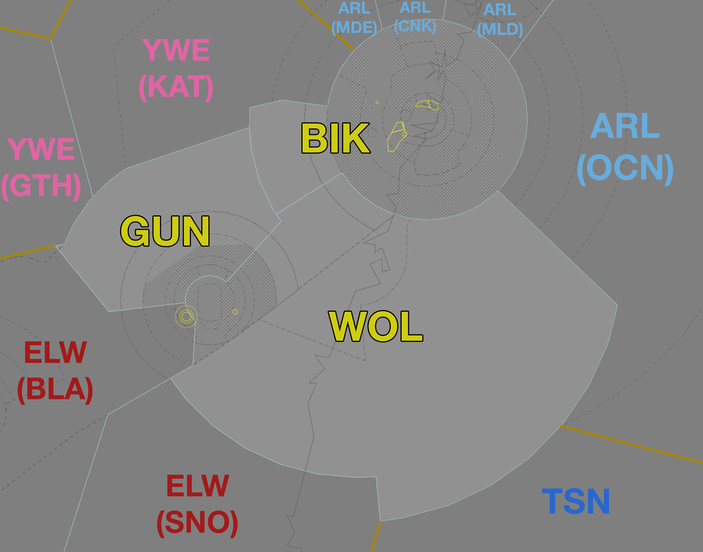

--8<-- "includes/abbreviations.md"
## Positions

| Name | Callsign | Frequency | Login ID |
| ---- | -------- | --------- | -------- |
| **Gundagai** | **Melbourne Centre** | **128.400** | **ML-GUN_CTR** |
| Bindook† | Melbourne Centre | 129.800 | ML-BIK_CTR |
| Katoomba† | Melbourne Centre | 133.500 | ML-KAT_CTR |

† *Non-standard positions* may only be used in accordance with [VATPAC Air Traffic Services Policy](https://vatpac.org/publications/policies){target=new}

### CPDLC
The Primary Communication Method for GUN is Voice.

[CPDLC](../../../client/cpdlc) may be used in lieu when applicable.

The CPDLC Station Code is `YGUN`.

!!! tip
    Even though GUN's Primary Communication Method is Voice, CPDLC may be used for Overfliers.

## Airspace

<figure markdown>
{ width="700" }
  <figcaption>Bindook Airspace</figcaption>
</figure>

BIK assumes responsibility of the airspace within 45nm of SY DME above `F285`.  
GUN assumes responsibility of the airspace to the North-West of the CB TCU above `F245`.

!!! note
    GUN does not assume the CB TCU in the absence of a CB TCU controller. Assumption of the CB TCU is the responsibility of WOL. Controllers may choose to verbally coordinate the release of the CB TCU to either sector/subsector.

### Reclassifications
#### CB TCU
When **CB TCU** is offline, CB TCU (Class C `SFC` to `A085`) reverts to Class G, and is administered by WOL.

## Sector Responsibilities
### Bindook (BIK)
BIK will provide final sequencing actions and descent into YSSY.

For aircraft overflying the SY TMA, place *'O/FLY'* in the LABEL DATA field.

Refer to the [Sequencing into YSSY](#sequencing-into-yssy) notes below for runway and STAR selection notes.
    
### Gundagai (GUN)
GUN is reponsible for issuing STAR clearances and initial descent for aircraft inbound to YSSY. 
    
GUN is also responsible for initial sequencing actions into YSSY. Aircraft cruising above `F250` should be assigned *no lower* than `F250` and handed to BIK for further descent. Aircraft cruising below `F250` should be transferred to BIK at their cruise level.

Refer to the [Sequencing into YSSY](#sequencing-into-yssy) notes below for runway and STAR selection notes.

### Katoomba (KAT)
KAT is responsible for issuing STAR Clearances for YSCB and YSSY.

### Sequencing into YSSY
Sequencing arrivals from the west into YSSY is a joint responsibility of GUN and BIK. Initial sequencing actions should be performed by GUN, with fine tuning and any holding required issued by BIK.

Aircraft from the south/west shall be assigned **runway 16R/34L** during PROPS. However, some situations may warrant the use of the alternate runway (16L/34R), such as heavy aircraft operationally requiring the longer runway from the north or large volumes of traffic requiring the use of both runways to minimise delay. In this case, coordination must be conducted with Brisbane Centre or Sydney Flow (if operating) to ensure that the sequence is built in an efficient and orderly way.

!!! example
    **GUN** -> **ARL**: "Southwest of Sydney, VOZ421, with your concurrence will be assigned runway 34R for sequencing"  
    **ARL** -> **GUN**: "Concur, VOZ421 runway 34R, required landing time 22 due sequence from the north"  
    **GUN** -> **ARL**: "Runway 34R, landing time 22, VOZ421"

Jet aircraft for YSSY shall be assigned the **RIVET** STAR.  
Non-jet aircraft for YSSY shall be assigned the **ODALE** STAR.

!!! tip
    Whilst the preference is to keep jet/non-jet aircraft assigned the default STAR as above, there are situations where the sequence may be improved by assigning the adjacent STAR (e.g. a non-jet assigned the RIVET STAR). This is most common when assigning the alternate runway to an arrival.   
    
    Either **SY TCU** or **GUN** may propose utilising the adjacent STAR where two aircraft with significantly different cruise/descent speeds will be required to overtake or pass abeam each other to achieve a sequenced landing time, or if assigned different runways. This technique can allow aircraft to be processed for different runways independently with minimal delay by using the built-in separation afforded by the STAR height requirements.  

    In this case, coordination should be conducted to ensure that both controllers agree and no additional conflicts are created as a result (particularly with aircraft inbound from the north/east).

!!! example
    **GUN:** "JST421, amended tracking and STAR available"  
    **JST421:** "JST421, go ahead"  
    **GUN:** "JST421, recleared direct AKMIR thence WELSH, ODALE, for the ODALE7 arrival, runway 34R, maintain FL350"  
    **JST421:** "Recleared direct AKMIR, WELSH, ODALE, for the ODALE7 arrival, runway 34R, maintain FL350, JST421"

#### Adjacent Feeder Fixes
Aircraft assigned the **same runway** inbound via **RIVET** and **ODALE**, must be considered to be on the **same STAR** for sequencing purposes. That is, they must be at least **2 minutes** apart at their respective Feeder fixes.

## STAR Clearance Expectation
### First Contact
Aircraft being transferred from the following sectors shall be given STAR Clearance on first contact:

| Transferring Sector | Receiving Sector | ADES | Notes |
| ---- | -------- | --------- | --------- |
| BLA, MUN(GTH), WOL | GUN | YSSY | |

## Coordination
### SY TCU
#### Airspace
SY TCU is responsible for the airspace within a 45nm radius of TESAT, `SFC` to `F285`.

Refer to [Sydney TCU Airspace Division](../../../terminal/sydney/#airspace-division) for information on airspace divisions when **SAS**, **SDN**, **SDS** and/or **SRI** are online.

#### Arrivals/Overfliers
Voiceless for all aircraft:

- With ADES **YSSY**; and  
- Assigned a STAR; and  
- Tracking via **RIVET**, assigned `A100`; or  
- Tracking via **ODALE**, assigned `A090`

All other aircraft coming from BIK/KAT CTA must be **Heads-up** Coordinated to SY TCU prior to **20nm** from the boundary.

#### Departures
Voiceless for all aircraft:

- Assigned the lower of `F280` or the `RFL`; and
- that enter BIK/KAT airspace via any of the *Green Shaded Corridors* below

<figure markdown>
{ width="700" }
  <figcaption>SY TCU Voiceless Coordination Corridors</figcaption>
</figure>

All other aircraft going to BIK/KAT CTA will be **Heads-up** Coordinated by SY TCU.

### CB TCU
#### Airspace
The Vertical limits of the CB TCU are `SFC` to `F245`.

Refer to [Canberra TCU Airspace Division](../../../terminal/canberra/#airspace-division) for information on airspace divisions when **CBW** is online.

Refer to [Reclassifications](#cb-tcu) for operations when CB TCU is offline.

#### Arrivals/Overfliers
Voiceless for all aircraft:

- With ADES **YSCB**; and  
- Assigned the **AVBEG** STAR; and  
- Assigned `F130`

All other aircraft coming from GUN CTA must be **Heads-up** Coordinated to CB TCU prior to **20nm** from the boundary.

!!! note
    These coordination requirements apply to aircraft entering the CB TCU, even if the airspace is owned by WOL

#### Departures
Voiceless for all aircraft:
 
- Tracking via **AVBEG**, **AKMIR**, or **CULIN**; and  
- Assigned the lower of `F240` or the `RFL`

All other aircraft going to GUN CTA will be **Heads-up** Coordinated by CB TCU.

### Enroute
As per [Standard coordination procedures](../../../controller-skills/coordination/#enr-enr), Voiceless, no changes to route or CFL within **50nm** to boundary.

### GUN Internal
Changes to the CFL are permitted up to the boundary for aircraft transiting BIK/GUN airspace internally. It is *advised* that BIK/GUN give **Heads-up Coordination** to the relevant sector, prior to **20nm** from the boundary, for **any aircraft not on the Y59 or W113 airways**. 

It is also advised that KAT give Heads-up Coordination to BIK/GUN for aircraft **not** planned via MAKKA, prior to **20nm** from boundary.