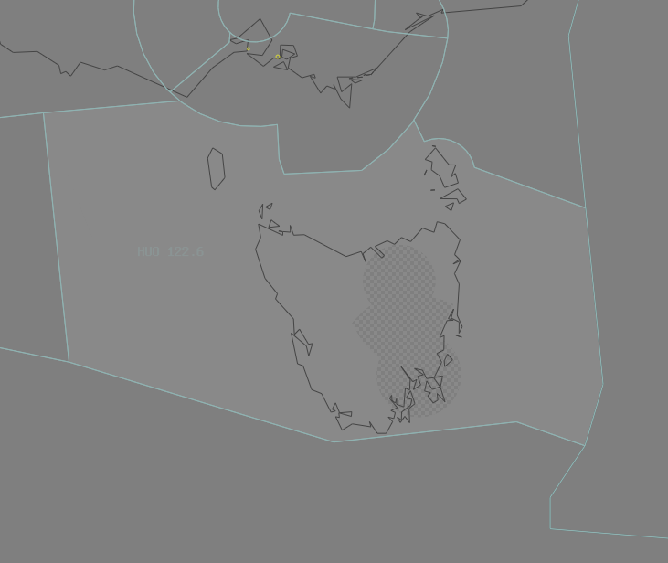

--8<-- "includes/abbreviations.md"
## Positions

| Name | Callsign | Frequency | Login ID |
| ---- | -------- | --------- | -------- |
| Huon | Melbourne Centre | 122.600 | ML-HUO_CTR |

<figure markdown>
{ width="700" }
  <figcaption>Huon Airspace</figcaption>
</figure>

## Responsibilities

Whilst the **HBA** controller is expected to provide a [top-down service](../../../aerodromes/Hobart) to YMHB when **HB ADC** is offline, this is not expected of a HUO controller when both **HBA** and **HB ADC** are offline. If electing not to provide a top-down service to YMHB, the HB CTR Class D `SFC` to `A015` reverts to Class G.  
Whilst the **LTA** controller is expected to provide a [top-down service](../../../aerodromes/Launceston) to YMLT when **LT ADC** is offline, this is not expected of a HUO controller when both **LTA** and **LT ADC** are offline. If electing not to provide a top-down service to YMLT, the LT CTR Class D `SFC` to `A015` reverts to Class G.  

HUO is reponsible for issuing STAR clearances, initial descent, and sequencing for aircraft bound for YMLT and YMHB.
## HB/LT ADC Offline
When **HB ADC** or **LT ADC** is offline, the relevant CTR (Class D `SFC` to `A015`) airspace reverts to Class G, and is administered by HUO. Alternatively, HUO may provide a top-down service if they wish.

If not providing a top-down service, due to the low level of CTA at these aerodromes, it is best practice to give airways clearance to aircraft at the holding point, to ensure departing aircraft can have uninterrupted climb.

!!! example
    **JST718:** "Melbourne Centre, JST718, A320, IFR, Taxiing YMHB for YSSY, Runway 12"
    **HUO:** "JST718, Melbourne Centre, Squawk 3601, Expect clearance via the LATUM2 departure Runway 12, No Reported IFR Traffic, Call me Ready at the Holding Point for Airways Clearance"  
    **JST718:** "Squawk 3601, Wilco, JST718"  

    **JST718:** "JST718, Ready Runway 12, Request clearance"  
    **HUO:** "JST718, Cleared to YSSY via the LATUM2 departure Runway 12, LATUM, Flight Planned Route. Climb to A050"  
    **JST718:** "Cleared to YSSY via the LATUM2 departure Runway 12, LATUM, Flight Planned Route. Climb to A050, JST718"  
    `AIP GEN 3.4`  

## Coordination
### HUO / TAS TCU
The Standard assignable level from HUO to TAS TCU TCU is:  
`A090` for YMLT arrivals, tracking IRSOM DCT LT, or NUNPA DCT LT.  
`F130` for YMHB arrivals, and assigned the IPLET STAR or MORGO STAR.

All other aircraft must be voice coordinated to HBA/LTA prior to **20nm** from the boundary.

The Standard Assignable level from HB/LT TCU to HUO is the lower of `F240` or the `RFL`, and tracking via a SID terminus.
### HUO / ENR
As per [Standard coordination procedures](../../../controller-skills/coordination/#enr-enr), Voiceless, no changes to route or CFL within **20nm** to boundary.

### HUO / TSN/IND(INS) (Oceanic)
As per [Standard coordination procedures](../../../controller-skills/coordination/#enr-oceanic), Voice coordinate estimate and level prior to **15 mins** to boundary.