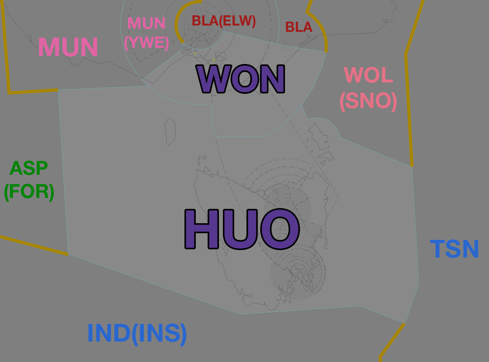

--8<-- "includes/abbreviations.md"
## Positions

| Name | Callsign | Frequency | Login ID |
| ---- | -------- | --------- | -------- |
| Huon | Melbourne Centre | 122.600 | ML-HUO_CTR |

<figure markdown>
{ width="700" }
  <figcaption>Huon Airspace</figcaption>
</figure>

## Responsibilities
HUO is reponsible for issuing STAR clearances, sequencing, and descent for aircraft bound for YMLT and YMHB.

### Top Down Extension
When **HBA** and/or **LTA** are offline, the class C and D airspace `SFC` to `A085` in the relevant TMA is reclassified as class G.

HUO may choose to operate either YMHB or YMLT (or both) aerodromes top down, including the terminal airspace within the Tasmania TMA. Due to limited surveillence coverage and the complex airspace setup, **extending top down to one or both aerodromes is not compulsory.**

If HUO chooses to operate top down to either aerodrome, they must administer all relevant airspace within the appropriate TMA, including the class D CTR.

!!! important
    Ensure you are familiar with the aerodrome procedures for [Launceston](../../aerodromes/Launceston.md) and [Hobart](../../aerodromes/Hobart.md) before extending top down, and are aware of the limited surveillence coverage available in the lower levels of the TMA.

## Coordination
### HUO / TAS TCU
The Standard assignable level from HUO to TAS TCU TCU is:  
`A090` for YMLT arrivals, tracking IRSOM DCT LT, or NUNPA DCT LT.  
`F130` for YMHB arrivals, and assigned the IPLET STAR or MORGO STAR.

All other aircraft must be voice coordinated to HBA/LTA prior to **20nm** from the boundary.

The Standard Assignable level from HBA and LTA to HUO is the lower of `F240` or the `RFL`, and tracking via a SID terminus.

!!! note
    LTA owns the terminal airspace within a 30nm radius of LT VOR. HBA owns the remainder of the TCU.

### HUO / ENR
As per [Standard coordination procedures](../../../controller-skills/coordination/#enr-enr), Voiceless, no changes to route or CFL within **50nm** to boundary.

### HUO / TSN,IND(INS) (Oceanic)
As per [Standard coordination procedures](../../../controller-skills/coordination/#enr-oceanic), Heads-up coordinate prior to **15 mins** to boundary.