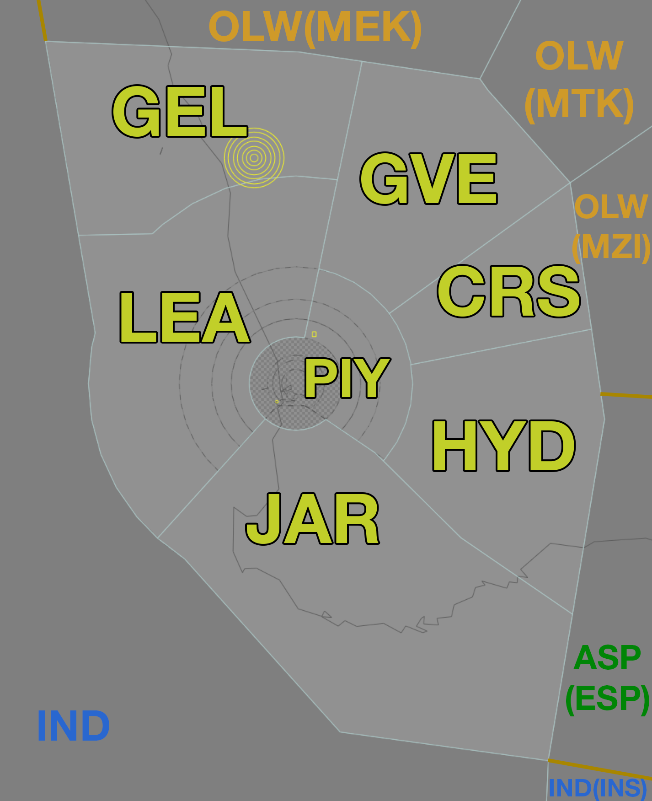

--8<-- "includes/abbreviations.md"
## Positions

| Name | Callsign | Frequency | Login ID |
| ---- | -------- | --------- | -------- |
| **Hyden** | **Melbourne Centre** | **118.200** | **ML-HYD_CTR** |
| Pingelly :material-information-outline:{ title="Non-standard position"} | Melbourne Centre | 133.900 | ML-PIY_CTR |
| Cross :material-information-outline:{ title="Non-standard position"} | Melbourne Centre | 135.800 | ML-CRS_CTR |
| Jarrah :material-information-outline:{ title="Non-standard position"} | Melbourne Centre | 120.300 | ML-JAR_CTR |
| Leeman :material-information-outline:{ title="Non-standard position"} | Melbourne Centre | 122.400 | ML-LEA_CTR |
| Grove :material-information-outline:{ title="Non-standard position"} | Melbourne Centre | 133.800 | ML-GVE_CTR |
| Geraldton :material-information-outline:{ title="Non-standard position"} | Melbourne Centre | 134.200 | ML-GEL_CTR |

!!! abstract "Non-Standard Positions"
    :material-information-outline: Non-standard positions may only be used in accordance with [VATPAC Air Traffic Services Policy](https://vatpac.org/publications/policies){target=new}.  
    Approval must be sought from the **bolded parent position** prior to opening a Non-Standard Position, unless [NOTAMs](https://vatpac.org/publications/notam){target=new} indicate otherwise (eg, for events).

### CPDLC
The Primary Communication Method for HYD is Voice.

[CPDLC](../../../client/cpdlc) may be used in lieu when applicable.

The CPDLC Station Code is `YHYD`.

!!! tip
    Even though HYD's Primary Communication Method is Voice, CPDLC may be used for Overfliers.

## Airspace
<figure markdown>
{ width="700" }
  <figcaption>Pingelly Airspace</figcaption>
</figure>

## Sector Responsibilities
### Pingelly (PIY)
#### YPPH Arrivals
PIY is responsible for final sequencing actions, final descent, and STAR Clearances (for Non-jets).

#### YPJT Arrivals
PIY is responsible for issuing STAR Clearances, final descent, and ascertaining arrival intentions.

See [YPJT Arrivals](#ypjtypea-arrivals) for STAR assignment.

#### YPEA Arrivals
PIY is responsible for issuing STAR Clearances (for Non-Jets), final descent and ascertaining arrival intentions.

See [YPJT Arrivals](#ypjtypea-arrivals) for STAR assignment.

#### Overfliers
For aircraft overflying the PH TCU place `O/FLY` in the LABEL DATA field.

### Leeman (LEA)
!!! note
    Controllers should be aware that VHF coverage near the LEA/IND border may be limited. Controllers should strive to issue HF frequencies and transfer of communications instruction prior to 160 NM PH DME.

#### YPPH Arrivals
LEA is responsible for issuing STAR clearance and final descent for aircraft inbound via `IPMOR`.

See [Perth Runway Modes](#ypph-runway-modes) for runway assignment.

#### YPJT Arrivals
LEA is responsible for issuing STAR Clearances, final descent, and ascertaining arrival intentions.

See [YPJT Arrivals](#ypjtypea-arrivals) for STAR assignment.

#### YPEA Arrivals
LEA is responsible for issuing STAR Clearances, final descent and ascertaining arrival intentions.

See [YPEA Arrivals](#ypjtypea-arrivals) for STAR assignment.

#### Overfliers
For aircraft overflying the PH TCU place `O/FLY` in the LABEL DATA field.

### Grove (GVE)
#### YPPH Arrivals
GVE is responsible for issuing STAR clearance to Jets inbound via `JULIM` and `SAPKO`, and initial descent to not below `F190`.

See [Perth Runway Modes](#ypph-runway-modes) for runway assignment.

#### YPEA Arrivals
GVE is responsible for issuing STAR Clearances (for Jets), and initial descent to not below `F190`.

See [YPEA Arrivals](#ypjtypea-arrivals) for STAR assignment.

### Hyden (HYD)
#### YPPH Arrivals
HYD is responsible for issuing STAR clearance to Jets inbound via `KABLI`/`MALUP`, `DAYLR` and `LAVEX`, and initial descent to not below `F190`.

See [Perth Runway Modes](#ypph-runway-modes) for runway assignment.

#### YPEA Arrivals
HYD is responsible for issuing STAR Clearances (for Jets), and initial descent to not below `F190`.

See [YPEA Arrivals](#ypjtypea-arrivals) for STAR assignment.

### Cross (CRS) / Geraldton (GEL)
Just keeping them separated!

### Jarrah (JAR)
!!! note
    Controllers should be aware there may be limited ADS-B coverage around Albany (YABA). Expect some areas of Class E airspace to be outside surveillance coverage. [Procedural Standards](../../../separation-standards/procedural) may need to be used in these cases.

#### YPPH Arrivals
JAR is responsible for issuing STAR clearance to aircraft inbound via `SOLUS`.

See [Perth Runway Modes](#ypph-runway-modes) for runway assignment.

#### YPJT Arrivals
JAR is responsible for issuing descent and ascertaining arrival intentions.

#### YPEA Arrivals
JAR is responsible for issuing descent and ascertaining arrival intentions.

#### Overfliers
For aircraft overflying the PH TCU place `O/FLY` in the LABEL DATA field.

### Sequencing in to YPPH
Aircraft assigned the **same runway** inbound via **JULIM** and **SAPKO**, must be considered to be on the **same STAR** for sequencing purposes. That is, they must be at least **2 minutes** apart at their respective Feeder fixes.

#### Predictable Sequencing Waypoints
There are ten [Predictable Sequencing](../../controller-skills/sequencing.md#predictable-sequencing) waypoints available for aircraft inbound YPPH  via **Q10**, **Q32**, **Q27** and **Z38**. These waypoints are south of **Q10** and north of **Q27**. 

The table below contains the estimated time from the initial waypoint to the final waypoint **via the CDO waypoint**. 

=== "Q10"
    | Initial Waypoint | CDO Waypoint | Final Waypoint | Delay (in mins) |
    | ---------------- | ------------ | -------------- | --------------- |
    | URGEX | TEKUD | MALUP | +1 |
    | URGEX | BEMPI | MALUP | +2 |
    | URGEX | AGTOD | MALUP | +3 |
    | URGEX | DUKOR | MALUP | +4 |
    | URGEX | IPGER | MALUP | +5 |
    | URGEX | TODOS | MALUP | +7 |
    | URGEX | IVPIL | MALUP | +9 |
 
=== "Q27"
    | Initial Waypoint | CDO Waypoint | Final Waypoint | Delay (in mins) |
    | ---------------- | ------------ | -------------- | --------------- |
    | IVPIL | URGEX | MALUP | +6 |
    | IVPIL | TEKUD | MALUP | +5 |
    | IVPIL | BEMPI | MALUP | +4 |
    | IVPIL | AGTOD | MALUP | +3 |
    | IVPIL | DUKOR | MALUP | +2 |
    | IVPIL | IPGER | MALUP | +2 |
    | IVPIL | TODOS | MALUP | +1 |
 
=== "Q32"
    | Initial Waypoint | CDO Waypoint | Final Waypoint | Delay (in mins) |
    | ---------------- | ------------ | -------------- | --------------- |
    | TEKUD | URGEX | MALUP | +1 |
    | TEKUD | BEMPI | MALUP | +1 |
    | TEKUD | AGTOD | MALUP | +2 |
    | TEKUD | DUKOR | MALUP | +3 |
    | TEKUD | IPGER | MALUP | +4 |
    | TEKUD | TODOS | MALUP | +6 |
    | TEKUD | IVPIL | MALUP | +8 |
 
=== "Q41"
    | Initial Waypoint | CDO Waypoint | Final Waypoint | Delay (in mins) |
    | ---------------- | ------------ | -------------- | --------------- |
    | NALAR | URGEX | MALUP | +2 |
    | NALAR | TEKUD | MALUP | +3 |
    | NALAR | BEMPI | MALUP | +4 |
    | NALAR | AGTOD | MALUP | +5 |
    | NALAR | DUKOR | MALUP | +6 |
    | NALAR | IPGER | MALUP | +7 |
    | NALAR | TODOS | MALUP | +9 |
    | NALAR | IVPIL | MALUP | +11 |
 
=== "Z38"
    | Initial Waypoint | CDO Waypoint | Final Waypoint | Delay (in mins) |
    | ---------------- | ------------ | -------------- | --------------- |
    | BUNGL | IGROB | MALUP | 4 |
    | BUNGL | KINAB | MALUP | 7 |

#### Holding Fixes
Refer to the vatSys Enroute Holds map for details of published holds on the airways inbound to YPPH. Where delays necessitate holding, aircraft should be instructed to hold at the following positions. The listed time should be subtracted from an aircraft's assigned feeder fix time to determine when they should leave the hold.

| Feeder Fix | Holding Fix | Time from Hold to Feeder Fix |
| ---- | ---- | ---- |
| JULIM | CALIG | Jets: 4 min Non-Jets: 6 min |
| Others | Feeder Fix | - |

!!! tip
    Additional holding may be performed at upstream holding fixes to reduce controller workload. This is particularly useful when non-standard child sectors have been opened, allowing aircraft to absorb some of their delay in the previous sector. 

## YPPH Runway Modes
Generally, YPPH operates on either the Southwest or Northeast runway plan, as below. Where strong winds dictate the use of only a single runway, this will be nominated in the ATIS.

### Southwest Plan
With the Southwest Plan active, arrivals shall be processed to either runway 21 or 24 based on their feeder fix, as per the table below:

| Feeder Fix | Assigned Runway |
| --- | --- |
| JULIM | 21 |
| SAPKO | 21 |
| IPMOR | 21 |
| KABLI | 24 |
| LAVEX | 24 |
| SOLUS | 24 |

!!! note
    Where an aircraft operationally requires runway 21, they shall be assigned that runway regardless of feeder fix.

### Northeast Plan
With the Northeast Plan active (runways 03 and 06 in use), all arrivals shall be processed to runway 03.

## YPJT/YPEA Arrivals
To facilitate smooth movement of traffic in the Perth TCU, IFR Arrivals to YPJT and YPEA shall be assigned a STAR in accordance with the *YPPH Runway Mode*:

| Feeder Fix | 03/06 | 21/24 |
| ------------------- | ----- | ----- |
| WOORA (YPJT) | Golf | WOORA PH JT (No STAR) |
| JULIM (YPEA) | JULIM PEA (No STAR) | JULIM PEA (No STAR) |
| LAVEX | Golf | Romeo |
| KABLI (Jet) | Golf | Romeo | 
| MALUP (Non-Jet) | Whiskey | Romeo (via KABLI) | 

!!! note
    Assigning a STAR to YPJT/YPEA Arrivals still does not meet [voiceless coordination requirements](#arrivalsoverfliers) to PH TCU. All YPJT/YPEA Arrivals must be **heads-up coordinated**, including those assigned a STAR.

## STAR Clearance Expectation
### Handoff
Aircraft being transferred to the following sectors shall be told to Expect STAR Clearance on handoff:

| Transferring Sector | Receiving Sector | ADES | Notes |
| ---- | -------- | --------- | --------- |
| GVE, CRS, HYD | PIY | YPPH, YPEA | Non-jets only |
| GVE, CRS, HYD | PIY | YPJT | |
| GEL | LEA | YPPH | |

### First Contact
Aircraft being transferred from the following sectors shall be given STAR Clearance on first contact:

| Transferring Sector | Receiving Sector | ADES | Notes |
| ---- | -------- | --------- | --------- |
| OLW(MEK, MTK, MZI) | GVE, HYD | YPPH, YPEA | Jets only |
| ASP(ESP) | HYD | YPPH, YPEA | Jets only |
| GVE, CRS, HYD | PIY | YPPH, YPEA | Non-jets only |
| GVE, CRS, HYD | PIY | YPJT | |
| GEL, IND | LEA | YPPH | |
| IND | LEA, JAR | YPPH | |

## Coordination
### PH TCU
#### Airspace
The PH TCU is responsible for the airspace within 36 DME of the PH VOR, `SFC` to `F245`. 

Refer to [Perth TCU Airspace Division](../../../terminal/perth/#airspace-division) for information on airspace divisions when **PHD** is online.

!!! note
    A significant portion of the TMA airspace south of the PH VOR (roughly 20 DME onwards) is classified Class E with a lower limit of `F125`. Aircraft arriving from this direction from `F130` and above shall be instructed to leave and re-enter controlled airspace on descent to the standard assignable level (or other appropriate altitude).

#### Arrivals/Overfliers
Voiceless for all aircraft:

- With ADES **YPPH**; and  
- Assigned a STAR; and  
- Assigned `A090`

All other aircraft coming from PIY CTA must be **Heads-up** Coordinated to PH TCU prior to **20nm** from the boundary.

#### Departures
Voiceless for all aircraft:
 
- Tracking via a Procedural SID terminus; and  
- Assigned the lower of `F180` or the `RFL`

All other aircraft going to PIY CTA will be **Heads-up** Coordinated by PH TCU.

### Enroute
As per [Standard coordination procedures](../../../controller-skills/coordination/#enr-enr), Voiceless, no changes to route or CFL within **50nm** to boundary.

### HYD Internal
Changes to CFL are permitted up to the boundary from GVE, CRS and HYD to PIY.

All else is Voiceless, no changes to route or CFL within **20nm** (reduced from 50nm) to boundary.

That being said, it is *advised* that HYD(All) gives **Heads-up Coordination** prior to **20nm** in the following scenarios:  
- JAR to PIY for all aircraft  
- LEA to PIY for all aircraft  

### IND (Oceanic)
As per [Standard coordination procedures](../../../controller-skills/coordination/#pacific-units), Voiceless, no changes to route or CFL within **15 mins** to boundary.

Aircraft must have their identification terminated and be instructed to make a position report on first contact with the next (procedural) sector.

!!! phraseology
    **LEA**: "QFA121, identification terminated, report position to Brisbane Radio, 129.25"

### PE TCU
#### Airspace
The PE TCU is responsible for the airspace within **20 TACAN** of PEA (that is continained within **Pearce SUA**), `SFC` to `A050`. By default, PE TCU does not border any HYD CTA.

This is all reclassified to **Class C** when PE TCU is online.

!!! abstract "Reference"
    A helpful diagram can be found in [Pearce FIHA AD2 Supp](https://ais-af.airforce.gov.au/australian-aip){target=new}, Section 2.2.2.

Additional airspace releases may be NOTAM'd, or coordinated between PE TCU, PH TCU and HYD, to facilitate Military Operations.

!!! phraseology
    **PE TCU** -> **PH TCU**: "Request release of R155 Alpha and Bravo, SFC to F180, for Military Operations. My onwards with HYD"   
    **PH TCU** -> **PE TCU**: "R155 Alpha and Bravo, SFC to F180, Released to you. Your onwards with HYD"  

    **PE TCU** -> **HYD**: "Request release of R155 Alpha and Bravo, SFC to F180, for Military Operations. My onwards with PH TCU"   
    **HYD** -> **PE TCU**: "R155 Alpha and Bravo, SFC to F180, Released to you. Your onwards with PH TCU"  

#### Departures
Voiceless for all aircraft:

- Tracking via **AVNEX**; and  
- Assigned the lower of `F180` or the `RFL`

All other aircraft going to PIY CTA will be **Heads-up** Coordinated by PE TCU, if coming from CTA (ie, only if PE TCU has assumed more airspace than the default setup).

#### Arrivals/Overfliers
If PE TCU has assumed additional airspace from the default, and as such, PE TCU CTA borders PIY CTA, then:

Voiceless for all aircraft:

- Tracking from **JULIM** or **SAPKO** DCT **PEA**; and 
- Assigned `A090`

All other arrivals/overfliers coming from PIY CTA must be **Heads-up** Coordinated to PE TCU prior to **20nm** from the boundary.
