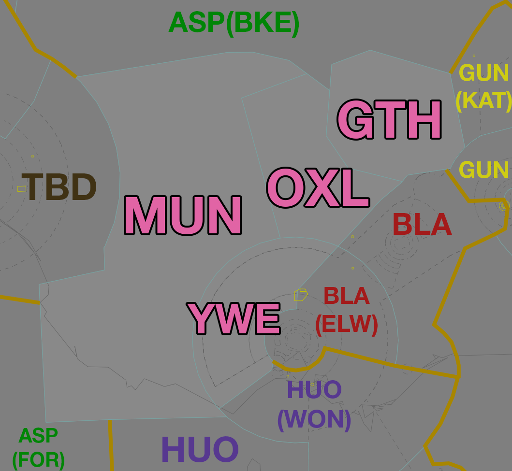

--8<-- "includes/abbreviations.md"
## Positions

| Name | Callsign | Frequency | Login ID |
| ---- | -------- | --------- | -------- |
| **Mungo** | **Melbourne Centre** | **132.600** | **ML-MUN_CTR** |
| Yarrowee :material-information-outline:{ title="Non-standard position"} | Melbourne Centre | 134.325 | ML-YWE_CTR |
| Oxley :material-information-outline:{ title="Non-standard position"} | Melbourne Centre | 128.500 | ML-OXL_CTR |
| Griffith :material-information-outline:{ title="Non-standard position"} | Melbourne Centre | 122.750 | ML-GTH_CTR |

!!! abstract "Non-Standard Positions"
    :material-information-outline: Non-standard positions may only be used in accordance with [VATPAC Air Traffic Services Policy](https://vatpac.org/publications/policies){target=new}.  
    Approval must be sought from the **bolded parent position** prior to opening a Non-Standard Position, unless [NOTAMs](https://vatpac.org/publications/notam){target=new} indicate otherwise (eg, for events).

## Airspace

<figure markdown>
{ width="700" }
  <figcaption>Yarrowee Airspace</figcaption>
</figure>

### CPDLC
The Primary Communication Method for MUN is Voice.

[CPDLC](../../../client/cpdlc) may be used in lieu when applicable.

The CPDLC Station Code is `YMUN`.

!!! tip
    Even though MUN's Primary Communication Method is Voice, CPDLC may be used for Overfliers.

## Sector Responsibilities
### Yarrowee (YWE)
#### YMML Arrivals
YWE is responsible for final sequencing and descent.

#### YMEN Arrivals
YWE is responsible for issuing final descent, and ascertaining arrival intentions.

### Mungo (MUN)
#### YMML Arrivals
MUN is reponsible for issuing STAR clearances, initial sequencing, and initial descent to not below `F250` for Jets.

### Oxley (OXL)
#### YMML Arrivals
OXL is reponsible for issuing STAR clearances, initial sequencing, and initial descent to not below `F250` for Jets.

### Griffith (GTH)
#### YSSY Arrivals
GTH is responsible for issuing STAR Clearances for Jets.

### Sequencing in to YMML
#### Predictable Sequencing Waypoints
There are four [Predictable Sequencing](../../controller-skills/sequencing.md#predictable-sequencing) waypoints available for aircraft inbound YMML via **Q346** and **Q35**.

The table below contains the estimated time from the initial waypoint to the final waypoint **via the CDO waypoint**. 

=== "Y33/Q35"
    | Initial Waypoint | CDO Waypoint | Final Waypoint | Delay (in mins) |
    | ---------------- | ------------ | -------------- | --------------- |
    | DUBED | LEGOM | DORSU | +2 |
    | DUBED | IDVIL | DORSU | +4 |
    | DUBED | GUGIX | DORSU | +6 |
    | DUBED | AVKOG | DORSU | +8 | 
    
#### Holding Fixes
Refer to the vatSys Enroute Holds map for details of published holds on the airways inbound to YMML. Where delays necessitate holding, aircraft should be instructed to hold at the following positions. The listed time should be subtracted from an aircraft's assigned feeder fix time to determine when they should leave the hold.

| Feeder Fix | Holding Fix | Time from Hold to Feeder Fix |
| ---- | ---- | ---- |
| ARBEY | METES DORSU | 4 min 4 min |
| Others | Feeder Fix | - |

!!! tip
    Additional holding may be performed at upstream holding fixes to reduce controller workload. This is particularly useful when non-standard child sectors have been opened, allowing aircraft to absorb some of their delay in the previous sector. 

#### LAHSO
!!! warning "Important"
    Due to its operational complexity, LAHSO **must be authorised by a senior VATPAC staff member or a nominated event coordinator**.

In accordance with the authorisation requirements above, YMML may utilise LAHSO during exceptionally busy events. Detailed procedures exist to ensure that controllers are aware of their responsibilities when performing LAHSO. See [Controller Skills](../../controller-skills/runwaymanagement.md#lahso) for more information.

## STAR Clearance Expectation
### Handoff
Aircraft being transferred to the following sectors shall be told to Expect STAR Clearance on handoff:

| Transferring Sector | Receiving Sector | ADES | Notes |
| ---- | -------- | --------- | --------- |
| MUN | TBD | YPAD, YPED | |
| GTH | OXL | YMML, YMAV | |
| OXL | BLA | YSCB | |
| GTH | GUN | YSSY | Non-Jets only |
| OXL | GTH | YSSY | Jets only |

### First Contact
Aircraft being transferred from the following sectors shall be given STAR Clearance on first contact:

| Transferring Sector | Receiving Sector | ADES | Notes |
| ---- | -------- | --------- | --------- |
| TBD | MUN | YMML, YMAV | |
| ASP(BKE), GTH | OXL | YMML, YMAV | |
| ASP(BKE) | GTH, GUN(KAT) | YSSY | Jets only |
| OXL | GTH | YSSY | Jets only |
| ARL(MDE) | GUN(KAT) | YSCB | |

## Terminal Handover Frequencies
Aircraft being transferred from enroute to a TCU with multiple frequencies shall be given the frequency for the revelant TCU position.

=== "ML TCU"
	=== "09AD"
		<figure markdown>
		{ width="500" }
		  <figcaption>ML TCU Handover Frequencies - 09AD Mode</figcaption>
		</figure>

		| ADES | STAR  | Frequency (Controller) |
		| ---- | ----- | ---------------------- |
		| YMML | ALAXO | **129.400** (MDS)      |
		| YMML | ARBEY | **132.000** (MAE)      |
		| YMML | BOOIN | **132.000** (MAE)      |
		| YMML | BOYSE | **132.000** (MAE)      |
		| YMML | PORTS | **129.400** (MDS)      |
		| YMML | RAZZI | **129.400** (MDS)      | 

	=== "09A16D"
		<figure markdown>
		{ width="500" }
		  <figcaption>ML TCU Handover Frequencies - 09A16D Mode</figcaption>
		</figure>
		
		| ADES | STAR  | Frequency (Controller) |
		| ---- | ----- | ---------------------- |
		| YMML | ALAXO | **129.400** (MDS)      |
		| YMML | ARBEY | **132.000** (MAE)      |
		| YMML | BOOIN | **132.000** (MAE)      |
		| YMML | BOYSE | **132.000** (MAE)      |
		| YMML | PORTS | **129.400** (MDS)      |
		| YMML | RAZZI | **129.400** (MDS)      | 

	=== "16AD"
		<figure markdown>
		{ width="500" }
		  <figcaption>ML TCU Handover Frequencies - 16AD Mode</figcaption>
		</figure>
		
		| ADES | STAR  | Frequency (Controller) |
		| ---- | ----- | ---------------------- |
		| YMML | ALAXO | **129.400** (MDS)      |
		| YMML | ARBEY | **118.900** (MDN)      |
		| YMML | BOOIN | **132.000** (MAE)      |
		| YMML | BOYSE | **132.000** (MAE)      |
		| YMML | RAZZI | **132.000** (MAE)      | 

	=== "16A27D"
		<figure markdown>
		{ width="500" }
		  <figcaption>ML TCU Handover Frequencies - 16A27D Mode</figcaption>
		</figure>
		
		| ADES | STAR  | Frequency (Controller) |
		| ---- | ----- | ---------------------- |
		| YMML | ALAXO | **129.400** (MDS)      |
		| YMML | ARBEY | **118.900** (MDN)      |
		| YMML | BOOIN | **132.000** (MAE)      |
		| YMML | BOYSE | **132.000** (MAE)      |
		| YMML | RAZZI | **132.000** (MAE)      | 

	=== "27AD"
		<figure markdown>
		{ width="500" }
		  <figcaption>ML TCU Handover Frequencies - 27AD Mode</figcaption>
		</figure>
		
		| ADES | STAR  | Frequency (Controller) |
		| ---- | ----- | ---------------------- |
		| YMML | ALAXO | **129.400** (MDS)      |
		| YMML | ARBEY | **118.900** (MDN)      |
		| YMML | BOOIN | **132.000** (MAE)      |
		| YMML | BOYSE | **132.000** (MAE)      |
		| YMML | RAZZI | **132.000** (MAE)      | 

	=== "27AD34D"
		<figure markdown>
		{ width="500" }
		  <figcaption>ML TCU Handover Frequencies - 27AD34D Mode</figcaption>
		</figure>
		
		| ADES | STAR  | Frequency (Controller) |
		| ---- | ----- | ---------------------- |
		| YMML | ALAXO | **129.400** (MDS)      |
		| YMML | ARBEY | **118.900** (MDN)      |
		| YMML | BOOIN | **132.000** (MAE)      |
		| YMML | BOYSE | **132.000** (MAE)      |
		| YMML | RAZZI | **132.000** (MAE)      | 

	=== "34AD"
		<figure markdown>
		{ width="500" }
		  <figcaption>ML TCU Handover Frequencies - 34AD Mode</figcaption>
		</figure>
		
		| ADES | STAR  | Frequency (Controller) |
		| ---- | ----- | ---------------------- |
		| YMML | ALAXO | **129.400** (MDS)      |
		| YMML | ARBEY | **118.900** (MDN)      |
		| YMML | BOOIN | **132.000** (MAE)      |
		| YMML | BOYSE | **132.000** (MAE)      |
		| YMML | PORTS | **129.400** (MDS)      |
		| YMML | RAZZI | **132.000** (MAE)      | 

	=== "27A34AD (LAHSO)"
		<figure markdown>
		{ width="500" }
		  <figcaption>ML TCU Handover Frequencies - 27A34AD Mode</figcaption>
		</figure>
		
		| ADES | STAR  | Frequency (Controller) |
		| ---- | ----- | ---------------------- |
		| YMML | ALAXO | **129.400** (MDS)      |
		| YMML | ARBEY | **118.900** (MDN)      |
		| YMML | BOOIN | **132.000** (MAE)      |
		| YMML | BOYSE | **132.000** (MAE)      |
		| YMML | PORTS | **129.400** (MDS)      |
		| YMML | RAZZI | **132.000** (MAE)      |

	!!! tip
		The quick reference tables above only include scenarios for which there is [voiceless coordination](#ml-tcu). Refer to the diagram for the appropriate position/frequency for coordination and handoff for all other situations.

## Coordination
### ML TCU
#### Airspace
The Vertical limits of the ML TCU are `SFC` to `F245`.

Refer to [Melbourne TCU Airspace Division](../../../terminal/melbourne/#airspace-division) for information on airspace divisions when **MDN** and/or **MDS** are online.

#### Arrivals/Overfliers
Voiceless for all aircraft:

- With ADES **YMML**; and  
- Assigned a STAR; and  
- Assigned `A090`

All other aircraft coming from YWE CTA must be **Heads-up** Coordinated to ML TCU prior to **20nm** from the boundary.

#### Departures
Voiceless to all surrounding Enroute sectors for all aircraft:
 
- Assigned the lower of `F240` or the `RFL`; and
- Tracking via any of the following:
    - a Procedural SID terminus
    - **DOTPA**
    - **OMKON**
    - **AV**

All other aircraft going to YWE CTA will be **Heads-up** Coordinated by ML TCU.

### Enroute
As per [Standard coordination procedures](../../../controller-skills/coordination/#enr-enr), Voiceless, no changes to route or CFL within **50nm** to boundary.

That being said, it is *advised* that MUN(All) gives **Heads-up Coordination** prior to **50nm** from the boundary in the following scenarios:  
- YWE to ELW/BLA for all aircraft  
- GTH to BLA for all aircraft  
- YWE to HUO(WON) for all aircraft

!!! tip
    **MUN** should aim to handoff aircraft as soon as possible to **TBD**, so they can issue STAR clearance and commence sequencing. Remember, As per [Standard coordination procedures](../../../controller-skills/coordination/#handoffs), the Receiving sector may turn the aircraft 45° left or right and climb/descend to any level. So if required, nominate a restriction.

### MUN Internal
As per [Standard coordination procedures](../../../controller-skills/coordination/#enr-enr), Voiceless, no changes to route or CFL within **50nm** to boundary.

That being said, it is *advised* that MUN(All) gives **Heads-up Coordination** prior to **50nm** in the following scenarios:  
- MUN to YWE for aircraft **not** on the Y12 or H119 airway (Changes permitted up to boundary for sequencing/descent purposes)  
- OXL to YWE for aircraft **not** tracking via DORSU (Changes permitted up to boundary for sequencing/descent purposes)
