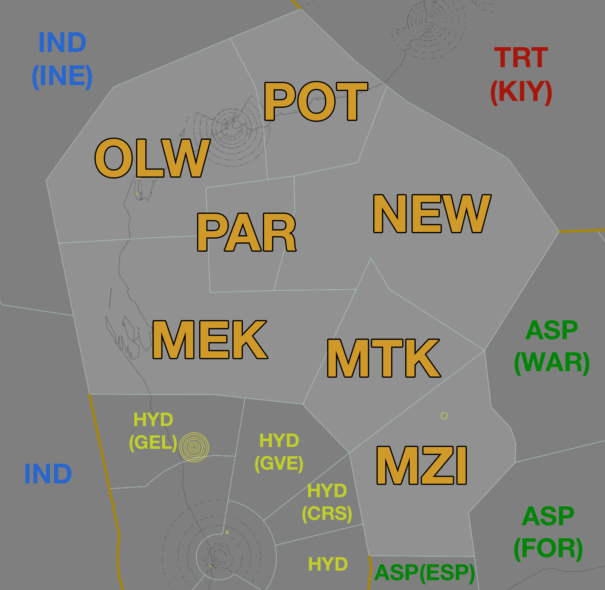

--8<-- "includes/abbreviations.md"

## Positions
| Name | Callsign | Frequency | Login ID |
| ---- | -------- | --------- | -------- |
| **Onslow** | **Melbourne Centre** | **134.000** | **ML-OLW_CTR** |
| Port† | Melbourne Centre | 127.000 | ML-POT_CTR |
| Paraburdoo† | Melbourne Centre | 133.500 | ML-PAR_CTR |
| Newman† | Melbourne Centre | 125.400 | ML-NEW_CTR |
| Meekatharra† | Melbourne Centre | 132.000 | ML-MEK_CTR |
| Mount† | Melbourne Centre | 133.700 | ML-MTK_CTR |
| Menzies† | Melbourne Centre | 134.300 | ML-MZI_CTR |

† *Non-standard positions* may only be used in accordance with [VATPAC Air Traffic Services Policy](https://vatpac.org/publications/policies){target=new}

### CPDLC

The Primary Communication Method for OLW is [CPDLC](../../../client/cpdlc).

The CPDLC Station Code is `YOLW`.

Voice may be used in lieu when applicable.

## Airspace

<figure markdown>
{ width="700" }
  <figcaption>Onslow Airspace</figcaption>
</figure>

OLW is responsible for **POT**, **PAR**, **NEW**, **MEK**, **MTK** and **MZI** when they are offline.  

### Reclassifications
#### KA CTR
When **KA ADC** is offline, KA CTR (Class D `SFC` to `A055`) reverts to Class G, and is administered by OLW. Alternatively, OLW may provide a [top-down procedural service](../../../aerodromes/Karratha) if they wish.

!!! tip
    If choosing *not* to provide a top down service, consider publishing an **ATIS Zulu** for the aerodrome, to inform pilots about the airspace reclassification. The *More ATIS* plugin has a formatted Zulu ATIS message.

## Sector Responsibilities
OLW is responsible for issuing descent and ascertaining arrival intentions for aircraft bound for YPKA.
OLW is also responsible for sequencing and issuing descent to aircraft bound for YPLM.

## STAR Clearance Expectation
### Handoff
Aircraft being transferred to the following sectors shall be told to Expect STAR Clearance on handoff:

| Transferring Sector | Receiving Sector | ADES | Notes |
| ---- | -------- | --------- | --------- |
| MEK, MTK, MZI | PIY(GVE, HYD) | YPPH, YPEA | Jets only |

## Coordination

### Enroute
As per [Standard coordination procedures](../../../controller-skills/coordination/#enr-enr), Voiceless, no changes to route or CFL within **50nm** to boundary.

### OLW Internal
As per [Standard coordination procedures](../../../controller-skills/coordination/#enr-enr), Voiceless, no changes to route or CFL within **50nm** to boundary.

### KA ADC
#### Airspace
KA ADC is responsible for the Class D airspace in the KA CTR `SFC` to `A055`.

Refer to [Reclassifications](#ka-ctr) for operations when KA ADC is offline.

#### Departures
Departures from YPKA in to OLW CTA will be coordinated when ready for departure.  

!!! example
    **KA ADC** -> **OLW**: "Next, OHN"  
    **OLW** -> **KA ADC**: "OHN, Unrestricted"  
    **KA ADC** -> **OLW**: "OHN"  

The Standard Assignable level from KA ADC to OLW is the lower of `A050` or the `RFL`, any other level must be prior coordinated.
#### Arrivals
YPKA arrivals shall be heads-up coordinated to **KA ADC** from OLW prior to **5 mins** from the boundary.

!!! example
    **OLW** -> **KA ADC**: "Via MCNAB, QFA1214 for the RNP U RWY 26”  
    **KA ADC** -> **OLW**: "QFA1214, RNP U RWY 26"  

The Standard Assignable level from OLW to KA ADC is `A060`, any other level must be prior coordinated.

### LM TCU
#### Airspace
The limits of the LM TCU are `SFC` to `F280` within 40 DME LM. This may be amended by NOTAM.

#### Arrivals/Overfliers
The Standard assignable level from OLW to LM TCU is `F130`, tracking via LM VOR.

All other aircraft must be voice coordinated to LM TCU prior to **20nm** from the boundary.

#### Departures
The Standard Assignable level from LM TCU to OLW is `F240`, and tracking via their planned route.

#### LM ADC
When LM TCU is offline, coordination is not required between OLW and LM ADC. Aircraft entering LM ADC airspace shall be handed off, and instructed to contact LM ADC for onwards clearance.

LM ADC owns the Class C airspace within the LM CTR from `SFC` to `A015`.

### IND,INE (Oceanic)
As per [Standard coordination procedures](../../../controller-skills/coordination/#pacific-units), Voiceless, no changes to route or CFL within **15 mins** to boundary.

Aircraft must have their identification terminated and be instructed to make a position report on first contact with the next (procedural) sector.

!!! example
    **OLW**: "QFA121, identification terminated, report position to Brisbane Radio, 129.25"