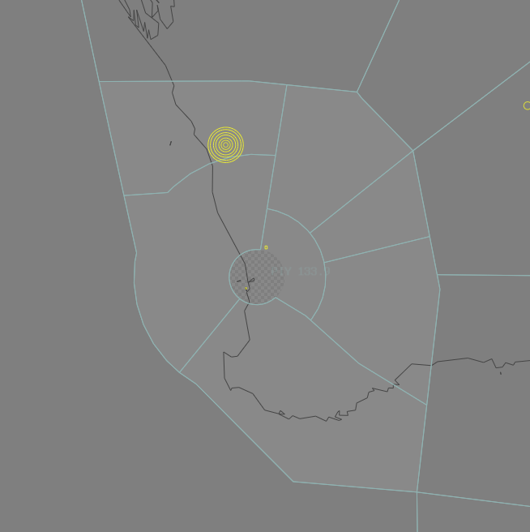

--8<-- "includes/abbreviations.md"
## Positions

| Name | Callsign | Frequency | Login ID |
| ---- | -------- | --------- | -------- |
| **Pingelly** | Melbourne Centre | 133.900 | ML-PIY_CTR |
| Cross† | Melbourne Centre | 135.800 | ML-CRS_CTR |
| Hyden† | Melbourne Centre | 118.200 | ML-HYD_CTR |
| Jarrah† | Melbourne Centre | 120.300 | ML-JAR_CTR |
| Leeman† | Melbourne Centre | 122.400 | ML-LEA_CTR |
| Grove† | Melbourne Centre | 133.800 | ML-GVE_CTR |
| Geraldton† | Melbourne Centre | 134.200 | ML-GEL_CTR |

† *Non-standard positions* may only be used in accordance with [VATPAC Ratings and Controller Positions Policy](https://vatpac.org/publications/policies)
## Airspace

Pingelly assumes responsiblity of the airspace within 36nm of PH DME above `F245`  

<figure markdown>
{ width="700" }
  <figcaption>Pingelly Airspace</figcaption>
</figure>

## Sector Responsibilities
### Pingelly
Pingelly (PIY) will provide final sequencing actions to ensure aircraft comply with their FF times prior to entering the Perth TCU. Pingelly (PIY) shall assign the standard assignable altitude in accordance with the table above. 
For aircraft overflying the PH TCU place 'O/FLY' in the LABEL DATA field.

### Leeman
Leeman (LEA) is responsible for assigning and issueing arrival clearance to aircraft inbound to Perth via WAVES. Leeman (LEA) is also responsible for transiting aircraft outbound from Perth into the Melbourne Oceanic Control Area. Coordination between this non-radar position (ML-IND_FSS) must be completed in accordance with the Coordination procedures.  

!!! note
    Controllers should be aware that VHF coverage near the LEA/IND border may be limited. Controllers should strive to issue HF frequencies and transfer of communications instruction prior to 160 NM PH DME.
### Grove
Grove (GVE) is responsible for assigning and issueing arrival clearance to aircraft inbound to Perth via JULIM and CONNI. 

### Hyden
Hyden (HYD) is responsible for assigning and issueing arrival clearance to aircraft inbound to Perth via BEVLY, DAYLR and GRENE.

### Jarrah
Jarrah (JAR) is responsible for assigning and issueing arrival clearance to aircraft inbound to Perth via SOLUS.

!!! note
    Controllers should be aware there may be limited ADS-B coverage around Albany (YABA). Expect identification to be lost as aircraft descend through `A100`.

## Coordination
## ENR / PH TCU
### Standard Assignable Levels
The Standard assignable level from ENR to PH TCU is:  
`A090` for all arrivals on a STAR.

All other aircraft must be voice coordinated to PH TCU prior to **20nm** from the boundary.
## PIY (ALL) / ENR

As per the enroute coordination requirements, voiceless coordination exists between enroute sectors, with changes permitted up to the boundary with PIY.

Refer to [Perth TCU Airspace Division](../../perth/#airspace-division) for information on airspace divisions when **PHD** is online.
## LEA / IND (Oceanic)

As per [Standard coordination procedures](https://sops.vatpac.org/oceanic/Coordination/){target=new}
