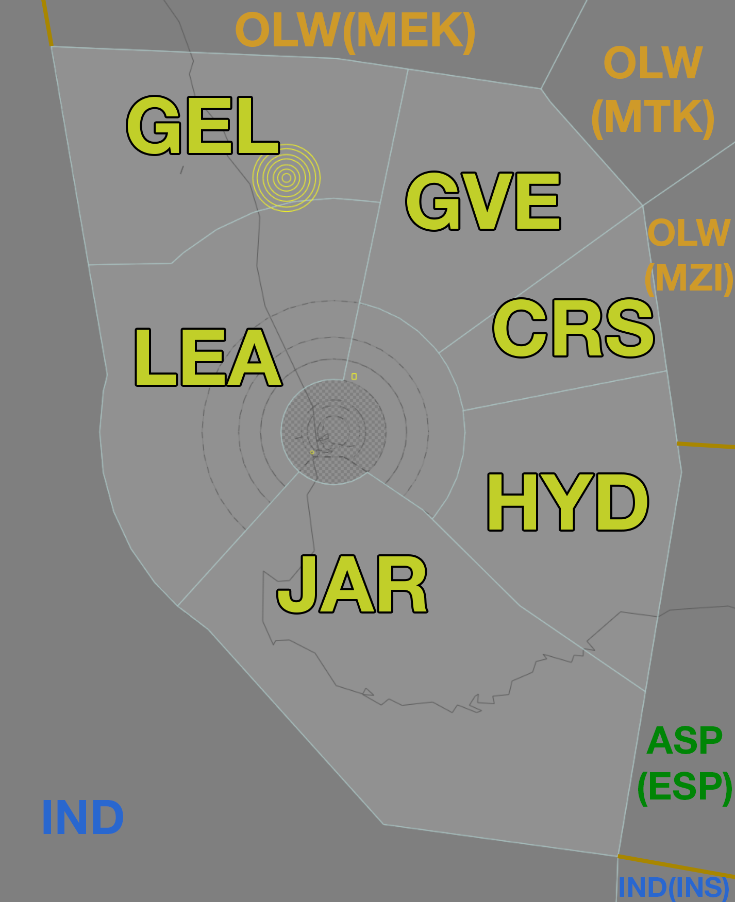

--8<-- "includes/abbreviations.md"
## Positions

| Name | Callsign | Frequency | Login ID |
| ---- | -------- | --------- | -------- |
| **Pingelly** | Melbourne Centre | 133.900 | ML-PIY_CTR |
| Cross† | Melbourne Centre | 135.800 | ML-CRS_CTR |
| Hyden† | Melbourne Centre | 118.200 | ML-HYD_CTR |
| Jarrah† | Melbourne Centre | 120.300 | ML-JAR_CTR |
| Leeman† | Melbourne Centre | 122.400 | ML-LEA_CTR |
| Grove† | Melbourne Centre | 133.800 | ML-GVE_CTR |
| Geraldton† | Melbourne Centre | 134.200 | ML-GEL_CTR |

† *Non-standard positions* may only be used in accordance with [VATPAC Ratings and Controller Positions Policy](https://vatpac.org/publications/policies)
## Airspace
<figure markdown>
{ width="700" }
  <figcaption>Pingelly Airspace</figcaption>
</figure>

## Sector Responsibilities
### Pingelly (PIY)
PIY will provide final sequencing actions to ensure aircraft comply with their FF times prior to entering the Perth TCU. PIY shall assign the standard assignable altitude in accordance with the table above. 
For aircraft overflying the PH TCU place `O/FLY` in the LABEL DATA field.

### Leeman (LEA)
LEA is responsible for assigning and issuing arrival clearance to aircraft inbound to Perth via `WAVES`.

!!! note
    Controllers should be aware that VHF coverage near the LEA/IND border may be limited. Controllers should strive to issue HF frequencies and transfer of communications instruction prior to 160 NM PH DME.
### Grove (GVE)
GVE is responsible for assigning and issuing arrival clearance to aircraft inbound to Perth via `JULIM` and `CONNI`. 

### Hyden (HYD)
HYD is responsible for assigning and issuing arrival clearance to aircraft inbound to Perth via `BEVLY`, `DAYLR` and `GRENE`.

### Jarrah (JAR)
JAR is responsible for assigning and issuing arrival clearance to aircraft inbound to Perth via `SOLUS`.

!!! note
    Controllers should be aware there may be limited ADS-B coverage around Albany (YABA). Expect identification to be lost as aircraft descend through `A100`.

## Coordination
## PIY(All) / PH TCU
The Standard Assignable level from PIY(All) to PH TCU is `A090` and assigned the relevant STAR. 

All other aircraft must be voice coordinated to PH TCU prior to **20nm** from the boundary.

The Standard Assignable level from PH TCU to PIY(All) is the lower of `F240` or the `RFL`.

Refer to [Perth TCU Airspace Division](../../../terminal/perth/#airspace-division) for information on airspace divisions when **PHD** is online.

## PIY(All) / ENR
As per [Standard coordination procedures](../../../controller-skills/coordination/#enr-enr), Voiceless, no changes to route or CFL within **20nm** to boundary.

## PIY/LEA/GVE/HYD/JAR Internal
Changes to CFL are permitted up to the boundary from GVE, CRS and HYD to PIY.

All else is as per [Standard coordination procedures](../../../controller-skills/coordination/#enr-enr), Voiceless, no changes to route or CFL within **20nm** to boundary.

That being said, it is *advised* that PIY(All) gives **Heads-up Coordination** in the following scenarios:  
- JAR to PIY for all aircraft  
- LEA to PIY for all aircraft  
## PIY(All) / IND (Oceanic)
As per [Standard Coordination Procedures](../../../controller-skills/coordination/#enr-oceanic).
