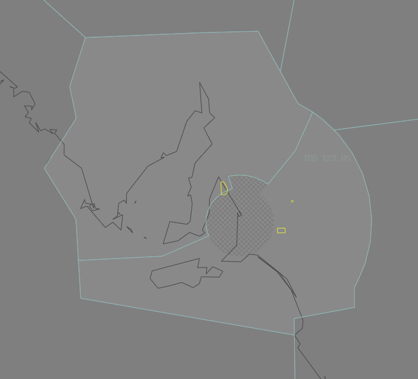

--8<-- "includes/abbreviations.md"
## Positions

| Name | Callsign | Frequency | Login ID |
| ---- | -------- | --------- | -------- |
| **Tailem Bend** | **Melbourne Centre** | **123.050** | **ML-TBD_CTR** |
| Augusta† | Melbourne Centre | 127.050 | ML-AUG_CTR |

† **Non-standard position** – may only be used in accordance with [VATPAC Ratings and Controller Positions Policy](https://cdn.vatpac.org/documents/policy/Controller+Positions+and+Ratings+Policy+v5.2.pdf)

## Airspace

TBD is responsible for the [AD TCU](../../../terminal/adelaide) when **AD APP** is offline.  
TBD is responsible for **AUG** when they are offline.  

<figure markdown>
{ width="700" }
  <figcaption>Tailem Bend Airspace</figcaption>
</figure>

## Sector Responsibilities
TBD and AUG are responsible for Sequencing, issuing STAR Clearances, and issuing descent for aircraft bound for YPAD.

## Coordination

### TBD/AUG / AD TCU
#### Standard Assignable Levels

The Standard assignable level from TBD/AUG to AD TCU is `A090`, and assigned a STAR.

All other aircraft must be voice coordinated to AD TCU prior to **20nm** from the boundary.

The Standard Assignable level from AD TCU to TBD/AUG is the lower of `F240` or the `RFL`, and assigned a SID.

### TBD/AUG / ENR
As per [Standard coordination procedures](../../../controller-skills/coordination/#enr-enr){target=new}, Voiceless, no changes to route or CFL within **20nm** to boundary.

### TBD/AUG Internal
As per [Standard coordination procedures](../../../controller-skills/coordination/#enr-enr){target=new}, Voiceless, no changes to route or CFL within **20nm** to boundary.