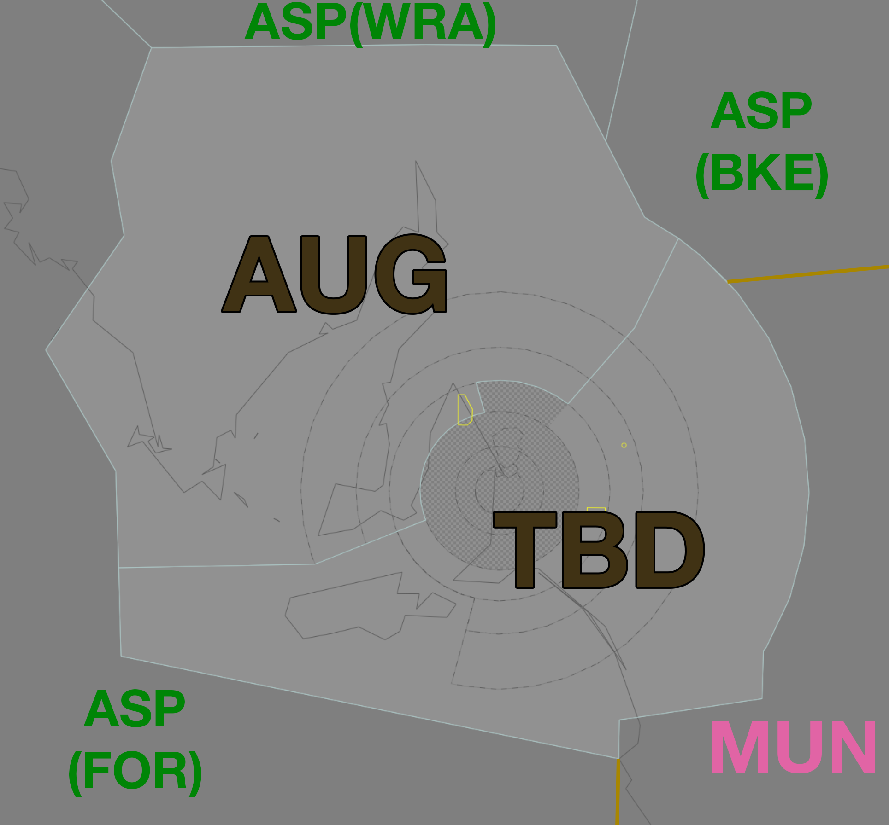

--8<-- "includes/abbreviations.md"
## Positions

| Name | Callsign | Frequency | Login ID |
| ---- | -------- | --------- | -------- |
| **Tailem Bend** | **Melbourne Centre** | **123.050** | **ML-TBD_CTR** |
| Augusta :material-information-outline:{ title="Non-standard position"} | Melbourne Centre | 127.050 | ML-AUG_CTR |

!!! abstract "Non-Standard Positions"
    :material-information-outline: Non-standard positions may only be used in accordance with [VATPAC Air Traffic Services Policy](https://vatpac.org/publications/policies){target=new}.  
    Approval must be sought from the **bolded parent position** prior to opening a Non-Standard Position, unless [NOTAMs](https://vatpac.org/publications/notam){target=new} indicate otherwise (eg, for events).

## Airspace

<figure markdown>
{ width="700" }
  <figcaption>Tailem Bend Airspace</figcaption>
</figure>

### CPDLC
The Primary Communication Method for TBD is Voice.

[CPDLC](../../../client/cpdlc) may be used in lieu when applicable.

The CPDLC Station Code is `YTBD`.

!!! tip
    Even though TBD's Primary Communication Method is Voice, CPDLC may be used for Overfliers.

## Sector Responsibilities
### YPAD Arrivals
TBD and AUG are responsible for sequencing, issuing STAR Clearances, and issuing descent.

Refer to the [Sequencing into YPAD](#sequencing-in-to-ypad) notes below regarding adjacent Feeder Fixes.

### YPPF Arrivals
TBD and AUG are responsible for issuing descent and ascertaining arrival intentions.

### YPED Arrivals
TBD and AUG are responsible for issuing STAR Clearances, descent, and ascertaining arrival intentions.

### Sequencing in to YPAD
Aircraft assigned the **same runway** inbound via:

- MARGO and AGROS 
- ERITH and KLAVA

Must be considered to be on the **same STAR** for sequencing purposes. That is, they must be at least **2 minutes** apart at their respective Feeder fixes.

## YPAD STAR Assignment
Arrivals shall be assigned the STAR in accordance with the tables below, as per the approach expectations on the [ATIS](../../../aerodromes/classc/Adelaide/#approach-expectation).

- `R(rwy)` = Non-Jet Victor STAR
    - *Example:* `R23` via **ATNAR** = GULFS V STAR, ATNAR Transition, Runway 23
- `(rwy)(designator)` = Full-length Jet STAR
    - *Example:* `23A` via **ATNAR** = ATNAR A STAR, Runway 23

These standard runway assignments may be modified strategically by the AD TCU or AFL controller.

!!! note
    Aircraft tracking via OJJAY and MARGO (ie *J251 WHA H84 MARGO*) from the North for Runway 23 shall be assigned the **RAYNA** STAR with the **OJJAY** transition (not the **BUGSU** STAR with the **MARGO** transition)
    
    *vatSys will not necessarily select the correct STAR by default when entering the runway, so ensure the correct STAR is selected.*

### Visual Approaches
All Jets shall be assigned the Runway **05 Zulu** STAR, or Runway **23 Alpha** STAR.

Non-Jets shall be assigned the STAR in accordance with the following table:

| Feeder Fix | 23 & 12  | 05 & 12  |
| ---------- | -------- | -------- |
| INTOG      |   R23    |   R05    |
| DRINA      | No STAR Expect Runway 23 | No STAR Expect Runway 05 |
| KAKLU      |   R23    |   R05    |
| BEVSO      |   R23    |   R12    |
| KLAVA      | No STAR Expect Runway 23 | No STAR Expect Runway 05 |
| MARGO      |   R12    |   R12    |
| ATNAR      |   R12    |   R12    |
| ELROX      |   R12    |   R05    |

### Visual Right Bases
Visual Right Bases is denoted by `ACFT FM THE EAST AND JET ACFT FM THE WEST EXP INSTR APCH` in the ATIS Approach Expectation field.

All Jets shall be assigned the Runway **23 Alpha** STAR.

Non-Jets shall be assigned the STAR in accordance with the following table:

| Feeder Fix | 23 & 12  | 23 Only  |
| ---------- | -------- | -------- |
| INTOG      |    -     |    -     |
| DRINA      |   23A    |   23A    |
| KAKLU      |   23A    |   23A    |
| BEVSO      | No STAR Expect Instrument Approach Runway 23 | No STAR Expect Instrument Approach Runway 23 |
| KLAVA      | No STAR Expect Runway 23 | No STAR Expect Runway 23 |
| MARGO      |   R12    |   R23    |
| ATNAR      |   R12    |   R23    |
| ELROX      |   R12    |   R23    |

### Instrument Approaches
All Jets shall be assigned the Runway **05 Zulu** STAR, or Runway **23 Alpha** STAR.

Non-Jets shall be assigned the STAR in accordance with the following table:

| Feeder Fix | 23 & 12  | 05 & 12  |
| ---------- | -------- | -------- |
| INTOG      |    -     |   05Z    |
| DRINA      |   23A    |    -     |
| KAKLU      |   23A    |   05Z    |
| BEVSO      | No STAR Expect Instrument Approach Runway 23 | No STAR Expect Instrument Approach Runway 12 |
| KLAVA      |   23A    |    05Z   |
| MARGO      | No STAR Expect Instrument Approach Runway 12 | No STAR Expect Instrument Approach Runway 12 |
| ATNAR      | No STAR Expect Instrument Approach Runway 12 | No STAR Expect Instrument Approach Runway 12 |
| ELROX      | No STAR Expect Instrument Approach Runway 12 | No STAR Expect Instrument Approach Runway 05 |

## STAR Clearance Expectation
### Handoff
Aircraft being transferred to the following sectors shall be told to Expect STAR Clearance on handoff:

| Transferring Sector | Receiving Sector | ADES | Notes |
| ---- | -------- | --------- | --------- |
| TBD | MUN | YMML, YMAV | |

### First Contact
Aircraft being transferred from the following sectors shall be given STAR Clearance on first contact:

| Transferring Sector | Receiving Sector | ADES | Notes |
| ---- | -------- | --------- | --------- |
| MUN, ASP(BKE) | TBD | YPAD, YPED| |
| ASP(All) | AUG | YPAD, YPED| Jets only |

## Coordination
### AD TCU
#### Airspace
The Vertical limits of the AD TCU are `SFC` to `F245`.

Refer to [Adelaide TCU Airspace Division](../../../terminal/adelaide/#airspace-division) for information on airspace divisions when **AAW** is online.

#### Arrivals/Overfliers
Voiceless for all aircraft:

- With ADES **YPAD**; and  
- Assigned a STAR; and  
- Assigned `A090`

All other aircraft coming from TBD CTA must be **Heads-up** Coordinated to AD TCU prior to **20nm** from the boundary.

#### Departures
Voiceless for all aircraft:
 
- Tracking via a Procedural SID terminus; and  
- Assigned the lower of `F240` or the `RFL`

All other aircraft going to TBD CTA will be **Heads-up** Coordinated by AD TCU.

### Enroute
As per [Standard coordination procedures](../../../controller-skills/coordination/#enr-enr){target=new}, Voiceless, no changes to route or CFL within **50nm** to boundary.

### TBD Internal
As per [Standard coordination procedures](../../../controller-skills/coordination/#enr-enr){target=new}, Voiceless, no changes to route or CFL within **50nm** to boundary.