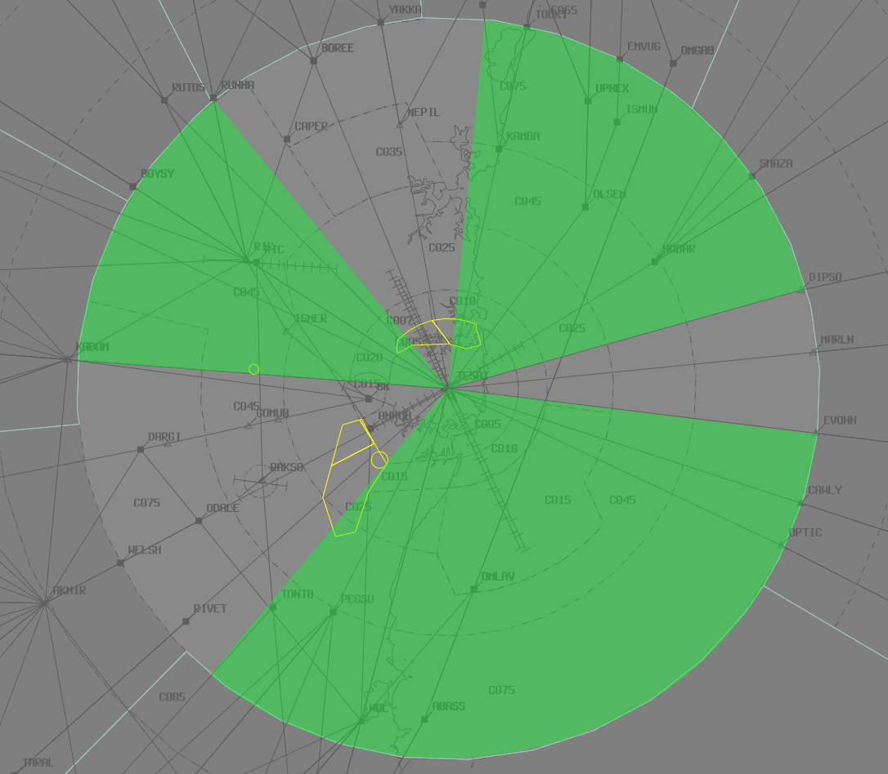

--8<-- "includes/abbreviations.md"
## Positions

| Name | Callsign | Frequency | Login ID |
| ---- | -------- | --------- | -------- |
| **Wollongong** | **Melbourne Centre** | **125.000** | **ML-WOL_CTR** |
| Snowy† | Melbourne Centre | 124.000 | ML-SNO_CTR |

† *Non-standard positions* may only be used in accordance with [VATPAC Air Traffic Services Policy](https://vatpac.org/publications/policies){target=new}

### CPDLC
The Primary Communication Method for WOL is Voice.

[CPDLC](../../../client/cpdlc) may be used in lieu when applicable.

The CPDLC Station Code is `YWOL`.

!!! tip
    Even though WOL's Primary Communication Method is Voice, CPDLC may be used for Overfliers.

## Airspace

<figure markdown>
{ width="700" }
  <figcaption>Bindook Airspace</figcaption>
</figure>

### Reclassifications
#### CB CTR
When **CB TCU** is offline, CB TCU (Class C `SFC` to `A085`) reverts to Class G, and is administered by WOL. Alternatively, WOL may provide a [top-down approach service](../../../terminal/canberra) if they wish.

!!! tip
    If choosing *not* to provide a top down service, consider publishing an **ATIS Zulu** for the aerodrome, to inform pilots about the airspace reclassification. The *More ATIS* plugin has a formatted Zulu ATIS message.

### Nowra Airspace Releases
When **NW TCU** is online, R421 is activated and administered by the TCU controller from `SFC` to `F125`. 

!!! tip
    Display the lateral limits of the NW TCU by activating R421 in the Restricted Areas window.

During times of high traffic, NW TCU may request the release of R420F up to `F300`.

!!! example
    **NW TCU** -> **WOL**: "There's a preplanned military exercise about to commence, request release of R420F up to F300"  
    **WOL** -> **NW TCU**: "R420F released to you F125 to F300"  
    **NW TCU** -> **WOL**: "R420F released F125 to F300" 

With R420F released to NW TCU, transiting aircraft will need to be coordinated or rerouted. Every effort will be made to accommodate these aircraft on track, but if NW TCU can't accommodate them, they must be vertically or laterally rerouted to avoid the restricted area. NW TCU will communicate this requirement.

See [Nowra Airspace](../../terminal/nowra.md#airspace) for more details about the lateral boundaries of the Nowra restricted areas.

## Sector Responsibilities
### Wollongong (WOL)
WOL is reponsible for issuing STAR clearances, initial descent, and sequencing actions for aircraft inbound to YSCB. WOL is also responsible for issuing STAR clearance to Non-jet aircraft for YSSY which depart from an aerodrome within the subsector.
    
### Snowy (SNO)
SNO is reponsible for issuing STAR clearances and initial descent for aircraft bound for YSCB.

## STAR Clearance Expectation
### Handoff
Aircraft being transferred to the following sectors shall be told to Expect STAR Clearance on handoff:

| Transferring Sector | Receiving Sector | ADES | Notes |
| ---- | -------- | --------- | --------- |
| WOL | ELW(BLA) | YMML, YMAV | Jets only |
| WOL | GUN | YSSY | |
| SNO | HUO(WON) | YMML | 
| SNO | HUO | YMHB | |

### First Contact
No STAR Clearances are issued on first contact by WOL or SNO.

## Coordination
### SY TCU
#### Airspace
SY TCU is responsible for the airspace within a 45nm radius of TESAT, `SFC` to `F285`.

Refer to [Sydney TCU Airspace Division](../../../terminal/sydney/#airspace-division) for information on airspace divisions when **SAS**, **SDN**, **SDS** and/or **SRI** are online.

#### Arrivals/Overfliers
**Heads-up** Coordination required for all aircraft entering SY TCU from WOL CTA prior to **20nm** from the boundary.

#### Departures
Voiceless for all aircraft:

- Assigned the lower of `F280` or the `RFL`; and
- that enter WOL airspace via any of the *Green Shaded Corridors* below

<figure markdown>
{ width="700" }
  <figcaption>SY TCU Voiceless Coordination Corridors</figcaption>
</figure>

All other aircraft going to WOL CTA will be **Heads-up** Coordinated by SY TCU.

### CB TCU
#### Airspace
The Vertical limits of the CB TCU are `SFC` to `F245`.

Refer to [Canberra TCU Airspace Division](../../../terminal/canberra/#airspace-division) for information on airspace divisions when **CBW** is online.

Refer to [Reclassifications](#cb-tcu) for operations when CB TCU is offline.

#### Arrivals/Overfliers
Voiceless for all aircraft:

- With ADES **YSCB**; and  
- Assigned a STAR; and  
- Assigned `F130`

All other aircraft coming from WOL CTA must be **Heads-up** Coordinated to CB TCU prior to **20nm** from the boundary.

#### Departures
**Heads-up** Coordination required for all aircraft entering WOL CTA prior to the boundary.

### NW TCU
#### Airspace
The vertical limits of the NW TCU are `SFC` to `F125`, and up to `F300` in R420F when activated.

Refer to [Nowra Airspace Releases](#nowra-airspace-releases) for operations with R421 and/or R420F released.

#### Arrivals/Overfliers
Voiceless for all aircraft:

- With ADES **YSNW**; and   
- Tracking direct to the NWA TACAN or YSNW; and  
- Assigned `F130`

All other aircraft coming from WOL CTA must be **Heads-up** Coordinated to NW TCU prior to **20nm** from the boundary.

!!! note
    With R420F released to NW TCU, the majority of aircraft tracking via the NWA TACAN will need to be heads up coordinated as per above.

#### Departures
Voiceless for all aircraft:
 
- Tracking via a published airway; and  
- Assigned the lower of `F120` or the `RFL`

All other aircraft going to WOL CTA will be **Heads-up** Coordinated by NW TCU.

### Enroute
As per [Standard coordination procedures](../../../controller-skills/coordination/#enr-enr), Voiceless, no changes to route or CFL within **50nm** to boundary.

That being said, it is *advised* that WOL/SNO give **Heads-up Coordination** to the relevant sector, prior to **50nm** from the boundary, for **any aircraft not on the Q29 or V169 airways**. 

#### TSN (Oceanic)
As per [Standard coordination procedures](../../../controller-skills/coordination/#pacific-units), Voiceless, no changes to route or CFL within **15 mins** to boundary.

Aircraft must have their identification terminated and be instructed to make a position report on first contact with the next (procedural) sector.

!!! example
    **SNO**: "QFA121, identification terminated, report position to Brisbane Radio, 124.65"

### WOL Internal
As per [Standard coordination procedures](../../../controller-skills/coordination/#enr-enr), Voiceless, no changes to route or CFL within **50nm** to boundary.

That being said, it is *advised* that WOL/SNO give **Heads-up Coordination** to the relevant sector, prior to **20nm** from the boundary, for **any aircraft not on the Q29 or V169 airways**. 