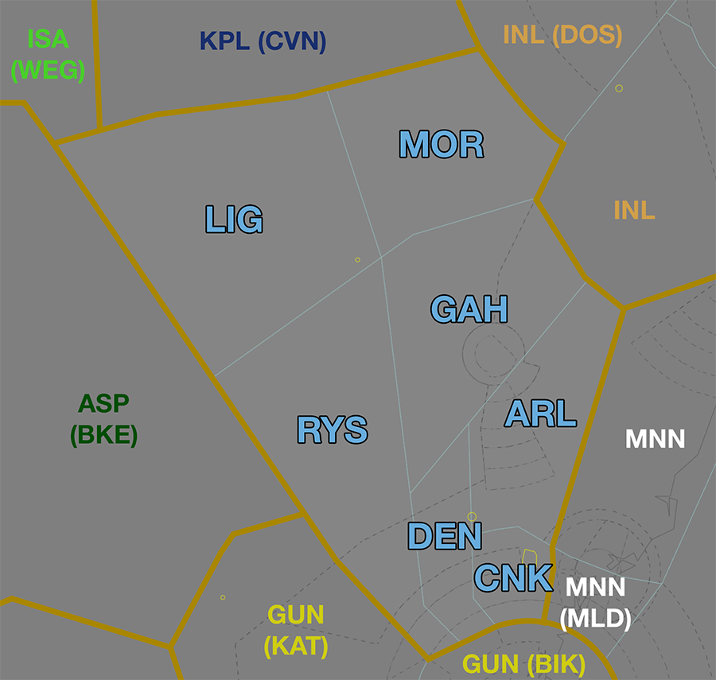
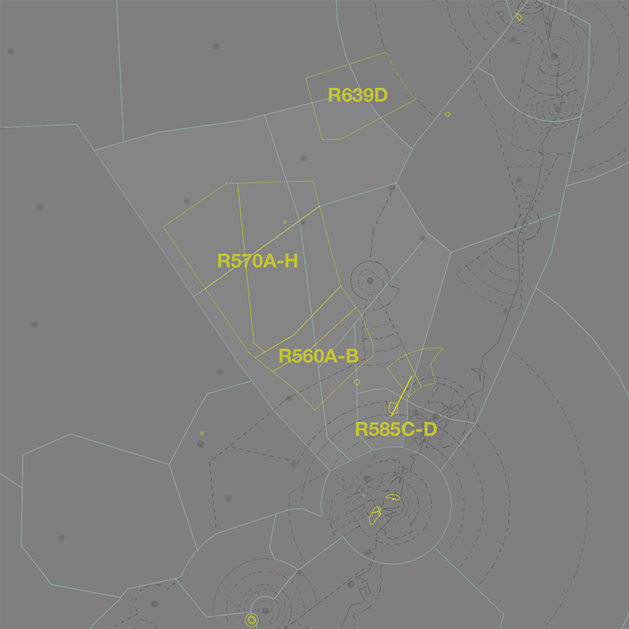
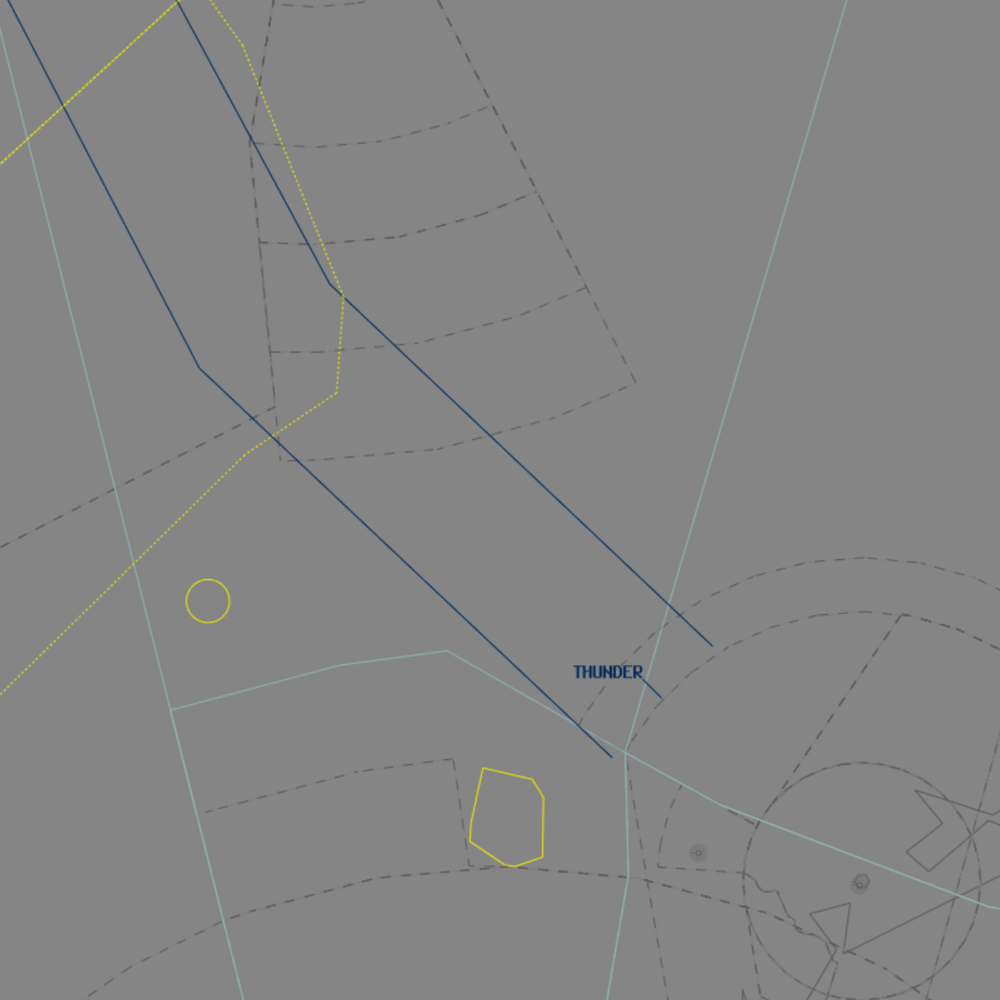
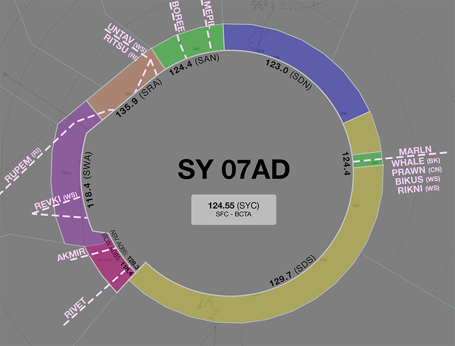
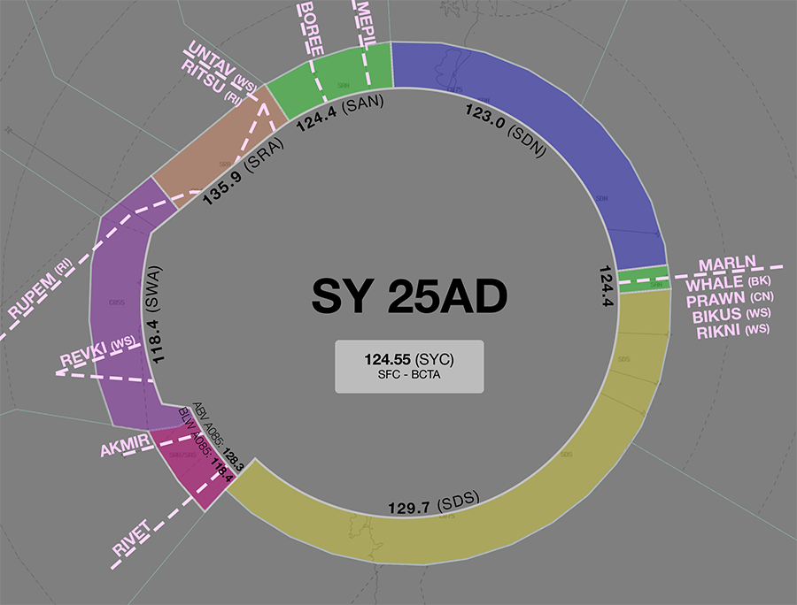
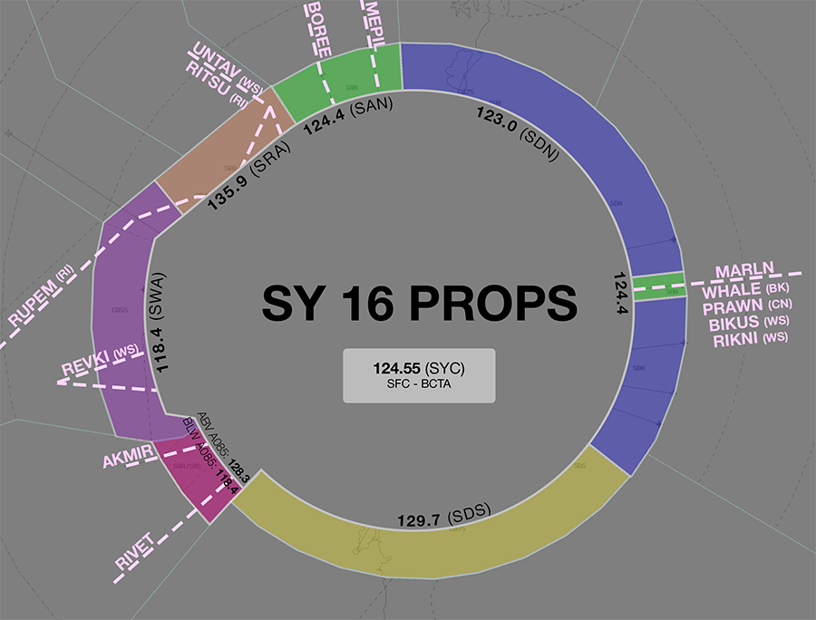
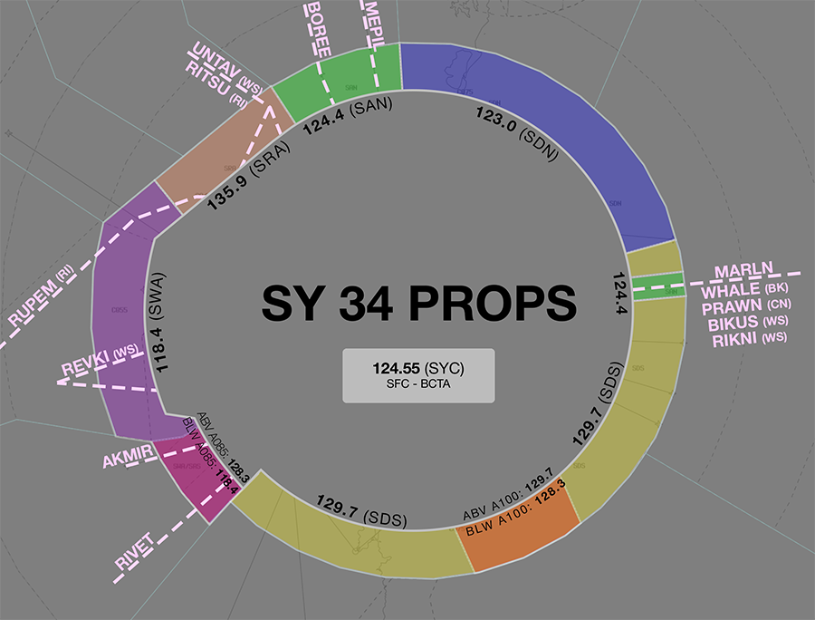
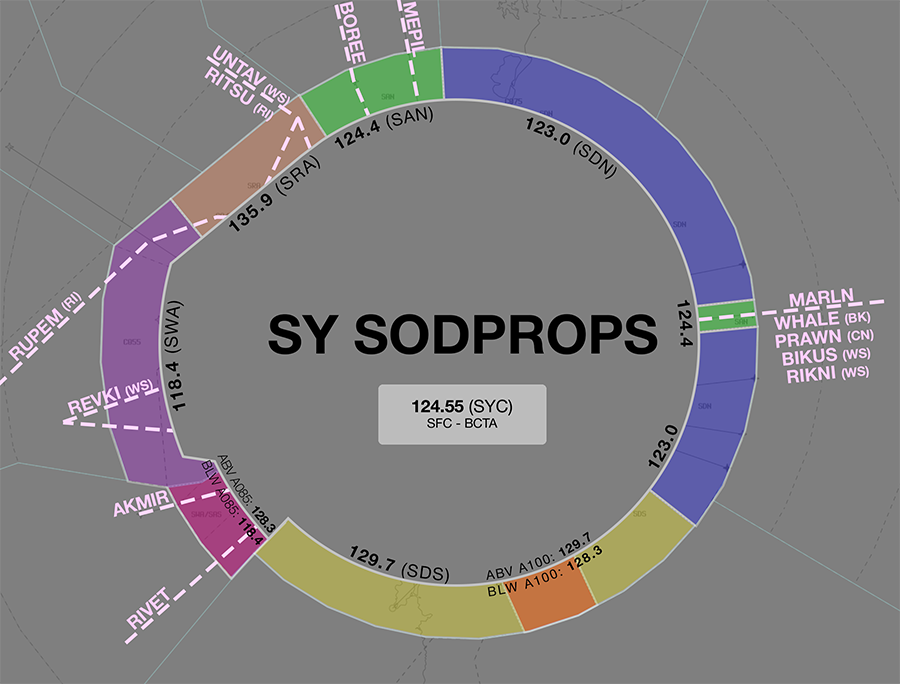
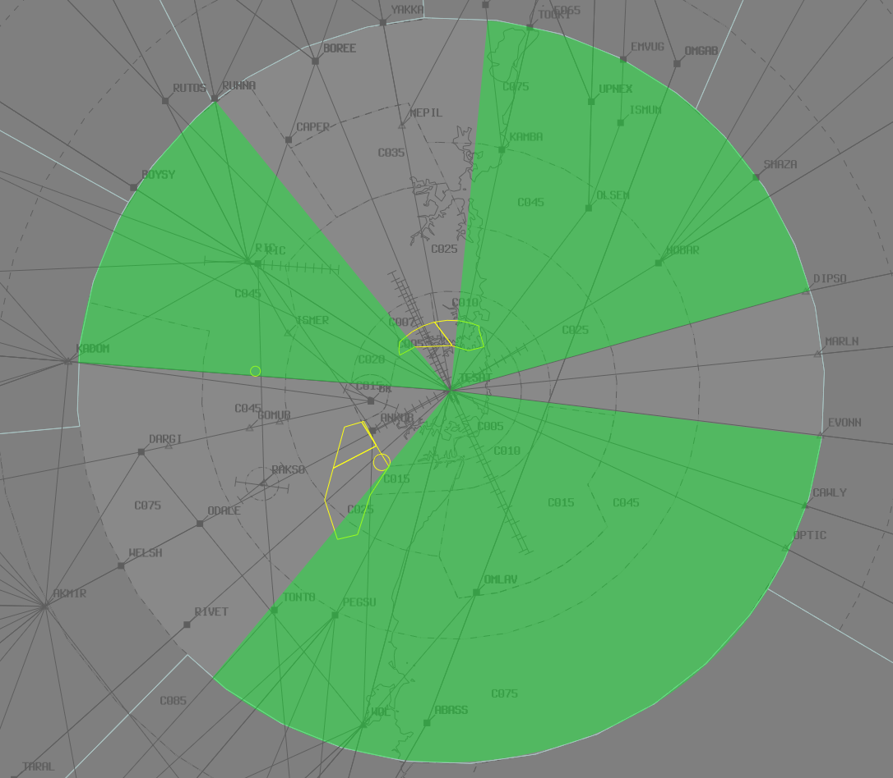

--8<-- "includes/abbreviations.md"
## Positions

| Name              | ID      | Callsign            | Frequency   | Login ID       |
| ----------------- | ------- | ------------------- | ----------- | -------------- |
| **Armidale**      | **ARL** | **Brisbane Centre** | **130.900** | **BN-ARL_CTR** |
| Cessnock :material-information-outline:{ title="Non-standard position"} | CNK | Brisbane Centre | 123.400 | BN-CNK_CTR |
| Maitland :material-information-outline:{ title="Non-standard position"} | MLD | Brisbane Centre | 132.350 | BN-MLD_CTR |
| Manning :material-information-outline:{ title="Non-standard position"}  | MNN | Brisbane Centre | 130.100 | BN-MNN_CTR |
| Mudgee :material-information-outline:{ title="Non-standard position"}   | MDE | Brisbane Centre | 133.000 | BN-MDE_CTR |
| Ocean :material-information-outline:{ title="Non-standard position"}    | OCN | Brisbane Centre | 128.600 | BN-OCN_CTR |

!!! abstract "Non-Standard Positions"
    :material-information-outline: Non-standard positions may only be used in accordance with [VATPAC Air Traffic Services Policy](https://vatpac.org/publications/policies){target=new}.  
    Approval must be sought from the **bolded parent position** prior to opening a Non-Standard Position, unless [NOTAMs](https://vatpac.org/publications/notam){target=new} indicate otherwise (eg, for events).
	
### CPDLC
The Primary Communication Method for ARL is Voice. [CPDLC](../../../client/cpdlc) may be used in lieu when applicable. The CPDLC Station Code is `YARL`.

## Airspace
<figure markdown>
{ width="700" }
  <figcaption>Armidale Airspace</figcaption>
</figure>

### Reclassifications
=== "CFS CTR"
	When **CFS ADC** is offline, CFS CTR (Class D `SFC` to `A045`) reverts to Class G, and is administered by MNN and INL.

	!!! note
		MNN does not assume the CFS CTR in the absence of a CFS ADC controller. Assumption of the CFS CTR is the responsibility of INL. Controllers may choose to verbally coordinate the release of the CFS CTR to either sector/subsector.
    
    !!! tip
        If choosing *not* to provide a top down service, consider publishing a pre-formatted **ATIS Zulu** for the aerodrome, to inform pilots about the airspace reclassification.

=== "TW CTR"
	When **TW ADC** is offline, TW CTR (Class D and C `SFC` to `A085`) reverts to Class G, and is administered by ARL. Alternatively, ARL may provide a [top-down procedural service](../../../aerodromes/procedural/Tamworth) if they wish (not recommended).  
    
    !!! tip
        If choosing *not* to provide a top down service, consider publishing a pre-formatted **ATIS Zulu** for the aerodrome, to inform pilots about the airspace reclassification.

=== "WLM CTR"
	When **WLM TCU** is offline, WLM MIL CTR (Class C `SFC` to `A065`) reverts to Class G, and WLM MIL CTR (Class C `A065` to `F125`) reverts to Class E. This airspace is administered by the appropriate ARL subsector. Alternatively, ARL(MLD) may provide a [top-down service](../../../terminal/williamtown) if they wish.  

    !!! tip
        If choosing *not* to provide a top down service, consider publishing a pre-formatted **ATIS Zulu** for the aerodrome, to inform pilots about the airspace reclassification.

## Departure and Arrival Procedures

### YCFS
[Coffs Harbour (YCFS)](../../../aerodromes/procedural/Coffs) lies under the INL/MNN boundary. MNN is responsible for issuing descent to aircraft arriving into YCFS from the south.

#### Sequencing
MNN and INL share a joint responsibility to build the final sequence of arrivals into YCFS when the tower is open. Coordination with INL should be conducted to ensure that aircraft from each sector are sequenced appropriately with each other.

### YSSY
#### STAR Assignment
The following subsectors are responsible for issuing STAR clearance.

| Subsector | STAR | Type | Notes |
| ---- | ----- | -------- | ----- |
| ARL  | BOREE MEPIL | Jet Non-Jet  | Descent not below `F250` Descent not below `F250` |
| OCN  | MARLN | All      |       |

Arrivals from the north shall be given initial descent to not below `F250`. **CNK** will issue final descent.

!!! tip
    During periods of high traffic flow from the north, it may be beneficial to issue an aircraft with the adjacent STAR (e.g. a jet assigned the MEPIL STAR).  This is most common when assigning the alternate runway to an arrival.  
    
    Either **SY TCU** or **ARL** may propose utilising the adjacent STAR where two aircraft with significantly different cruise/descent speeds will be required to overtake or pass abeam each other to achieve a sequenced landing time, or if assigned different runways. This technique can allow aircraft to be processed for different runways independently with minimal delay by using the built-in separation afforded by the STAR height requirements.

!!! phraseology
    **ARL:** "RXA6417, amended tracking and STAR clearance available"  
    **RXA6417:** "RXA6417, go ahead"  
    **ARL:** "RXA6417, recleared direct BOREE for the BOREE4A arrival, runway 34L, maintain F180"  
    **RXA6417:** "Recleared direct BOREE for the BOREE4A arrival, runway 34L, maintain F180, RXA6417" 
	
#### Sequencing
Sequencing arrivals from the north/east into YSSY is a joint responsibility of the subsectors of ARL. Initial sequencing actions for aircraft from the north should be performed by ARL, with fine tuning and any holding required issued by CNK. 

Aircraft from the north/east shall be assigned **runway 16L/34R** during PROPS. However, some situations may warrant the use of the main runway (16R/34L), such as heavy aircraft operationally requiring the longer runway or large volumes of traffic requiring the use of both runways to minimise delay. In this case, coordination must be conducted with Melbourne Centre or Sydney Flow (if operating) to ensure that the sequence is built in an efficient and orderly way.

!!! phraseology
    **ARL** -> **BIK**: "North of Sydney, CPA21, with your concurrence will be assigned runway 34L due operational requirement"  
    **BIK** -> **ARL**: "Concur, CPA21 runway 34L, required landing time 43 due sequence from the west"  
    **ARL** -> **BIK**: "Runway 34L, landing time 43, CPA21"

##### Adjacent Feeder Fixes
Aircraft assigned the **same runway** inbound via **BOREE** and **MEPIL**, must be considered to be on the **same STAR** for sequencing purposes. That is, they must be at least **2 minutes** apart at their respective Feeder fixes.

##### Predictable Sequencing Waypoints
There are ten [Predictable Sequencing](../../../../controller-skills/sequencing/#predictable-sequencing) waypoints available for aircraft inbound YSSY via **N774** and **M636**.

The table below contains the estimated time from the initial waypoint to the final waypoint **via the CDO waypoint**. 

=== "N774"
    | Initial Waypoint | CDO Waypoint | Final Waypoint | Delay (in mins) |
    | ---------------- | ------------ | -------------- | --------------- |
    | NONID | HARIZ/PORUV | RIKNI | 2 |
    | NONID | AVKIR/ISNET | RIKNI | 4 |
    | NONID | IDAGO/OVMAT | RIKNI | 6 |
    | NONID | ADLIV/FLEMO | RIKNI | 8 |
    | NONID | UDISI/OPEXA | RIKNI | 10 |

=== "M636"
    | Initial Waypoint | CDO Waypoint | Final Waypoint | Delay (in mins) |
    | ---------------- | ------------ | -------------- | --------------- |
    | PLUGA | OLNOT | RIKNI | 2 |
    | PLUGA | ADBOK | RIKNI | 4 | 
    | PLUGA | PEBTU | RIKNI | 6 |
    | PLUGA | GORTA | RIKNI | 8 | 

##### Holding Fixes
Refer to the vatSys Enroute Holds map for details of published holds on the airways inbound to YSSY. Where delays necessitate holding, aircraft should be instructed to hold at the following positions. The listed time should be subtracted from an aircraft's assigned feeder fix time to determine when they should leave the hold.

| Feeder Fix | Holding Fix | Time from Hold to Feeder Fix |
| ---- | ---- | ---- |
| BOREE | SADLO | 4 min |
| YAKKA | MONDO | 3 min |
| MARLN | RIKNI | 4 min |

!!! tip
    Additional holding may be performed at upstream holding fixes to reduce controller workload. This is particularly useful when non-standard child sectors have been opened, allowing aircraft to absorb some of their delay in the previous sector. 

### YSTW
ARL and MDE are responsible for issuing descent.

#### Sequencing
ARL and MDE share a joint responsibility to build the final sequence of arrivals into YSTW when the tower is open. Coordination should be conducted to ensure that aircraft from each sector are sequenced appropriately with each other.

### YWLM
#### STAR Assignment
The following subsectors are responsible for issuing STAR clearance.

| Subsector | STAR | Type | Notes |
| ---- | ----- | -------- | ----- |
| ARL  | LAXUM | All      |       | 
| MNN  | LAXUM | All      |       |
| OCN  | ASUVA | All      |       |

##### Coded Clearances
The ARL subsector is additionally responsible for issuing the **STORM 2** coded clearance to aircraft arriving YWLM via the **[Lightning Corridor](#r560-r70-williamtown)**.

## Local Procedures
### Special Use Airspace
There are multiple volumes of [SUA](../../controller-skills/sua) within ARL airspace, mostly associated with military operations in and out of YWLM.

<figure markdown>
{ width="700" }
  <figcaption>Notable SUA in ARL Airspace</figcaption>
</figure>

WLM TCU must [coordinate](../../terminal/williamtown/#sua-in-enroute-airspace) the activation of these SUAs with the relevant enroute controllers **prior** to any departures.

!!! phraseology
    **WAL** -> **ARL**: "Request activation of M581-M584 from 0300 until 0500, for military flying operations. My onwards with HWE.”  
    **ARL** -> **WAL**: "Activation approved."  
    
Non-participating aircraft intenting to transit an activated SUA should be rerouted, where possible, [subject to the VATSIM Code of Conduct](../../sua/#ad-hoc-activations).
    
!!! note
    In the real world, details of SUA activations are distributed widely to ensure that filed flight plans already include the necessary diversions before they reach ATC. Online, pilots are very unlikely to be aware of the rerouting requirements, and may have difficulty adjusting to a reroute on short notice. Nearby controllers (particularly those performing the role of ACD) are also unlikely to be aware that some flight plans may require adjustments.
    
    Unless an activation has been [advertised by local NOTAM](../../sua/#activation-by-notam), controllers should work with pilots patiently and, where a pilot is unable to comply with a reroute, attempt to facilitate the safe transit of the SUA. Controllers should also follow best practice by announcing activations in vatSys' controller chat, amending voiceless coordination requirements, and proactively assisting other controllers.
    
    In all cases, controllers should display professional behaviour to other controllers and pilots when facilitating SUA operations.

#### M581-M584 Williamtown
The M581-M584 MOAs are located offshore within the MLD, MNN, OCN, and TSN(HWE) subsectors.

The MOAs directly adjoin the WLM TCU, and when WAL is online aircraft will be transferred directly to/from the MOAs. When [WAL is offline](#reclassification), aircraft will contact ARL for transit through the surrounding civilian airspace.

##### Affected Civil Operations
When activated these MOAs significantly disrupt traffic on the busy **A579**, **B450**, **B474**, **B580**, and **H258** high altitude airways, which connect YSSY to the Pacific and North America.

| Planned Airway | ERSA Recommended Rerouting |
| -------------- | -------------------------- |
| A579 | `DIPSO G595 ATNAT DCT DUDEP DCT UPSAD A579 ...` |
| B450 | `DIPSO G595 ATNAT DCT ABARB B450 ...` |
| B474 | `OLSEM Y193 BANDA DCT VEMLA B474 ...` `DIPSO G595 ATNAT DCT DUDEP Y70 BISAB J328 ISTEM B474 ...` (when M670 is also active. |
| B580 | `DIPSO G595 ATNAT DCT DUDEP Y70 BISAB J328 MISLY B580 ...` |

The **W149** and **W768** low altitude airways, connecting YLHI to YWLM and YPMQ, are also affected, requiring extensive rerouting or facilitated transit through the SUA.

#### R560 & R570 Williamtown
The R560A-B and R570A-H restricted areas are located west of YWLM and YSTW within the ARL and MDE subsectors. The restricted areas are connected to the WLM TCU by the **Thunder Corridor**.

<figure markdown>
{ width="700" }
  <figcaption>WLM Thunder Military Corridor</figcaption>
</figure>

Aircraft departing the WLM TCU will be cleared the **STORM 1** coded clearance. Aircraft returning to the TCU will be cleared the **STORM 2** coded clearance by ARL.

!!! phraseology
    *BARN21 has completed their military training operations in R570, and intends to return to base.*
    **BARN21**: "Brisbane Centre, BARN21"  
    **ARL**: "BARN21, Brisbane Centre, identified"  
    **BARN21**: "Brisbane Centre, BARN21, detail complete, for RTB, `F130`"  
    **ARL**: "BARN21, cleared Storm 2. At THNDA, contact Willy Approach, 135.7"  
    **BARN21**: "Cleared Storm 2, at THNDA contact Willy Approach, BARN21"  
    
!!! note
    Aircraft tracking via the STORM coded clearances does **not** constitute a voiceless coordination route between WLM TCU and ARL. Aircraft should still be heads-up coordinated prior to **5 minutes** to the boundary, unless coordinated otherwise.

Aircraft transiting the Thunder Corridor should be assigned the appropriate altitude to ensure separation with opposite direction traffic while transiting to their desired restricted area.

| Coded Clearance | Altitude |
| --------------- | -------- |
| STORM 1         | `F140`   |
| STORM 2         | `F130`   |

##### Affected Civil Operations
When activated these restricted areas distrupt traffic on the **Q16**, **Q235**, **Q293**, and **Y46** high altitude airways, used by aircraft travelling between YPAD-YBBN, and YSSY-North Queensland/East Asia.

| Planned Airway | ERSA Recommended Rerouting |
| -------------- | -------------------------- |
| Q16 | via `Q4` |
| Q235 | `... RIC H530 KABIX ...` |
| Q293 | `... RIC H530 KABIX ...` |
| Y46 | via `Y27` |

Aircraft travelling below `F240` on the **H66**, **H76**, and **Q35** airways are also disrupted, most directly affecting aircraft departing YSBK to the northwest, and aircraft climbing out of YSSY via RIC. These aircraft may be given altitude requirements to assure separation with the restricted areas, where appropriate.
    
#### R585-R586 Williamtown
The R585A-D and R586A-C restricted areas are located north of the WLM TCU in the ARL and MNN subsectors.

The MOAs directly adjoin the WLM TCU, and when WAL is online aircraft will be transferred directly to/from the restricted areas. When [WAL is offline](#reclassification), aircraft will contact ARL for transit through the surrounding civilian airspace.

#### Amberley SUA
There are three SUA associated with military operations at [Amberley](../../terminal/amberleyoakey) which clip ARL airspace: the R639D restricted area, located northeast of MOR VOR partially in the MDE subsector, and the M661A and M670A-B MOAs, which clip MNN airspace offshore east of YCFS.

AMA (or INL(DOS, INL, SDY) on their behalf) will coordinate the activation these SUA **prior** to any activity.

## STAR Clearance Expectation
### Handoff
Aircraft being transferred to the following sectors shall be told to Expect STAR Clearance on handoff:

| Transferring Sector | Receiving Sector | ADES | Notes |
| ---- | -------- | --------- | --------- |
| MNN | INL | YBBN, YBCG | |
| MDE | GUN(KAT) | YSCB | |
| CNK, MLD, OCN | GUN(BIK) | YSCB | Jets only |
| MNN, MDE | ARL | YSSY | |

## Terminal Handover Frequencies
Aircraft being transferred from enroute to a TCU with multiple frequencies shall be given the frequency for the revelant TCU position.

=== "SY TCU"
	=== "07AD"
		<figure markdown>
		{ width="500" }
		  <figcaption>SY TCU Handover Frequencies - 07AD Mode</figcaption>
		</figure>
		
	=== "25AD"
		<figure markdown>
		{ width="500" }
		  <figcaption>SY TCU Handover Frequencies - 25AD Mode</figcaption>
		</figure>
	=== "16 PROPS"
		<figure markdown>
		{ width="500" }
		  <figcaption>SY TCU Handover Frequencies - 16 PROPS Mode</figcaption>
		</figure>
	=== "34 PROPS"
		<figure markdown>
		{ width="500" }
		  <figcaption>SY TCU Handover Frequencies - 34 PROPS Mode</figcaption>
		</figure>
	=== "SODPROPS"
		<figure markdown>
		{ width="500" }
		  <figcaption>SY TCU Handover Frequencies - SODPROPS Mode</figcaption>
		</figure>

	| ADES | STAR  | Frequency (Controller) |
	| ---- | ----- | ---------------------- |
	| YSSY | BOREE | **124.400** (SAN)      |
	| YSSY | MARLN | **124.400** (SAN)      |
	| YSSY | MEPIL | **124.400** (SAN)      |
	| YSSY | ODALE | **128.300** (SAS)      |
	| YSSY | RIVET | **128.300** (SAS)      |

	!!! tip
		The quick reference tables above only include scenarios for which there is [voiceless coordination](#sy-tcu). Refer to the diagram for the appropriate position/frequency for coordination and handoff for all other situations.

## Coordination
### SY TCU
#### Airspace
SY TCU is responsible for the airspace within a 45nm radius of TESAT, `SFC` to `F285`.

Refer to [Sydney TCU Airspace Division](../../../terminal/sydney/#airspace-division) for information on airspace divisions when **SAS**, **SDN**, **SDS** and/or **SRI** are online.

#### Arrivals/Overfliers
Voiceless for all aircraft:

- With ADES **YSSY**; and  
- Assigned a STAR; and  
- Tracking via **MARLN** or **BOREE**, assigned `A100`; or  
- Tracking via **MEPIL**, assigned `A090`

All other aircraft coming from ARL CTA must be **Heads-up** Coordinated to SY TCU prior to **20nm** from the boundary.

#### Departures
Voiceless for all aircraft:

- Assigned the lower of `F280` or the `RFL`; and
- that enter ARL airspace via any of the *Green Shaded Corridors* below, excluding [YWLM Arrivals](#ywlm-arrivals)

<figure markdown>
{ width="700" }
  <figcaption>SY TCU Voiceless Coordination Corridors</figcaption>
</figure>

All other aircraft going to ARL CTA will be **Heads-up** Coordinated by SY TCU.

##### YWLM Arrivals
Additionally, Voiceless Coordination exists from SY TCU for aircraft:

- With ADES **YWLM**; and  
- Assigned a STAR; and  
- Assigned the lower of `F130` or the `RFL`

!!! note
    YWLM arrivals are handed off to MLD, not directly to WLM TCU, unless otherwise coordinated.

### Enroute
As per [Standard coordination procedures](../../../controller-skills/coordination/#enr-enr), Voiceless, no changes to route or CFL within **50nm** to boundary.

### ARL Internal
As per [Standard coordination procedures](../../../controller-skills/coordination/#enr-enr), Voiceless, no changes to route or CFL within **50nm** to boundary.

That being said, due to their small sizes and frequent random-track traffic, it is *advised* that ARL(All) gives **Heads-up Coordination** in the following scenarios:   

- MNN to ARL for all aircraft  
- ARL to MNN for all aircraft  
- CNK to MLD for all aircraft  
- MLD to CNK for all aircraft

### CFS ADC
#### Airspace
CFS ADC is responsible for the Class D airspace in the CFS CTR `SFC` to `A045`.

Refer to [Reclassifications](#reclassifications) for operations when CFS ADC is offline.

#### Departures
[Next](../../controller-skills/coordination.md#next) coordination is required from CFS ADC to MNN for all aircraft **entering MNN CTA**.

The Standard Assignable level from **CFS ADC** to **MNN** is:

| Aircraft | Level |
| ---- | ---- |
| All | The lower of `A070` and `RFL` |

Where possible (and no possible conflict exists), a higher level shall be assigned by MNN for high performance aircraft during next coordination.

#### Arrivals/Overfliers
YCFS arrivals and overfliers shall be heads-up coordinated to **CFS ADC** from MNN prior to **5 mins** from the boundary.

!!! phraseology
    **MNN** -> **CFS ADC**: "Via KADSI, RXA6438"  
    **CFS ADC** -> **MNN**: "RXA6438"  

The Standard Assignable level from MNN to **CFS ADC** is `A080`, any other level must be prior coordinated.

### TW ADC
#### Airspace
TW ADC is responsible for the Class D airspace in the TW CTR `SFC` to `A045`, as well as the Class C airspace between `A045` and `A065`.

Refer to [Reclassifications](#reclassifications) for operations when TW ADC is offline.

#### Departures
[Next](../../controller-skills/coordination.md#next) coordination is required from TW ADC to ARL/MDE for all aircraft **entering ARL/MDE CTA**.

The Standard Assignable level from **TW ADC** to **ARL/MDE** is:

| Aircraft | Level |
| ---- | ---- |
| All | The lower of `A070` and `RFL` |

#### Arrivals/Overfliers
YSTW arrivals and overfliers shall be heads-up coordinated to **TW ADC** from ARL/MDE prior to **5 mins** from the boundary.

!!! phraseology
    **ARL** -> **TW ADC**: "QLK6D, via MATLA DCT ST2WD"  
    **TW ADC** -> **ARL**: "QLK6D"  

The Standard Assignable level from ARL/MDE to **TW ADC** is `A080`, any other level must be prior coordinated.

### WLM TCU
#### Airspace
By default, WLM TCU owns the airspace from `SFC` to `F125`. 

An additional, non-standard TCU position 
For specific military exercises or events, an additional TCU controller may log on, splitting the TCU vertically. In these situations, the controller will negotiate an upper limit with ARL(All) which works for both parties.

When WLM TCU is active above `F125` by ad-hoc release, **WAH** owns the airspace above `F125`.

Refer to [Reclassifications](#reclassifications) for operations when WLM TCU is offline.

#### Departures
Voiceless for all aircraft:

- Tracking via a Procedural SID terminus; and  
- Assigned the lower of `F120` or the `RFL`

All other aircraft going to ARL CTA will be **Heads-up** Coordinated by WLM TCU.

!!! phraseology
    **WAL** -> **MLD**: "QJE1597, request DCT OMGAB"  
    **MLD** -> **WAL**: "QJE1597, concur DCT OMGAB"  

#### Arrivals/Overfliers
Voiceless for all aircraft:

- With ADES **YWLM**; and  
- Assigned a STAR; and  
- Assigned `A090`

All other aircraft coming from ARL CTA must be **Heads-up** Coordinated to WLM TCU prior to **20nm** from the boundary.

!!! phraseology
    **CNK** -> **WAL**: "QFA1968, request DCT UPTEB"  
    **WAL** -> **CNK**: "QFA1968, concur DCT UPTEB"  

### TSN/HWE (Oceanic)
As per [Standard coordination procedures](../../../controller-skills/coordination/#pacific-units), Voiceless, no changes to route or CFL within **15 mins** to boundary.

Aircraft must have their identification terminated and be instructed to make a position report on first contact with the next (procedural) sector.

!!! phraseology
    **ARL**: "QFA121, identification terminated, report position to Brisbane Radio, 126.45"