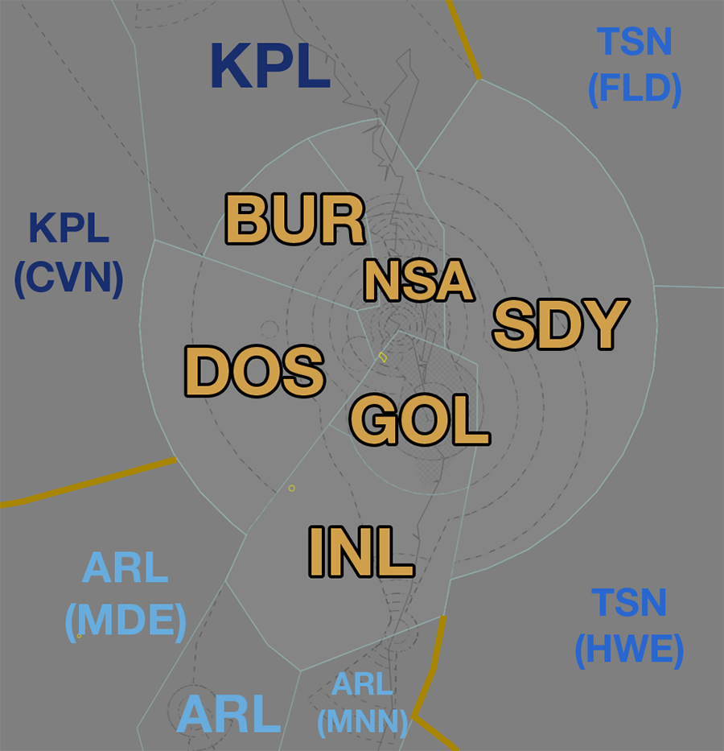
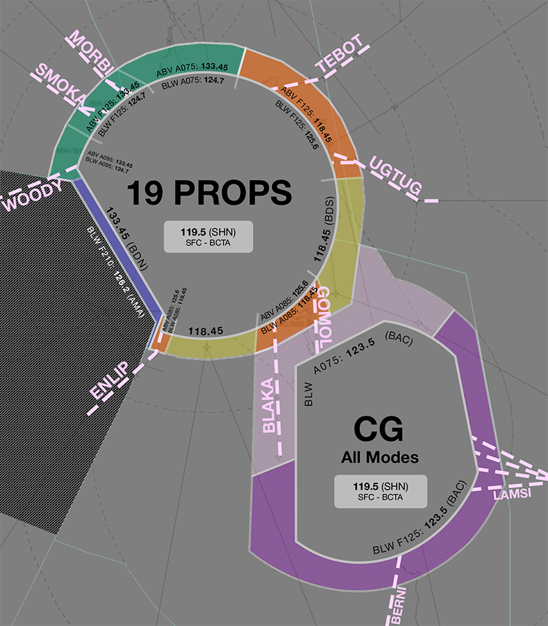

--8<-- "includes/abbreviations.md"
## Positions

| Name              | ID      | Callsign            | Frequency   | Login ID       |
| ----------------- | ------- | ------------------- | ----------- | -------------- |
| **Inverell**      | **INL** | **Brisbane Centre** | **134.200** | **BN-INL_CTR** |
| Burnett :material-information-outline:{ title="Non-standard position"}    | BUR | Brisbane Centre | 123.000 | BN-BUR_CTR |
| Downs :material-information-outline:{ title="Non-standard position"}      | DOS | Brisbane Centre | 135.600 | BN-DOS_CTR |
| Gold Coast :material-information-outline:{ title="Non-standard position"} | GOL | Brisbane Centre | 130.400 | BN-GOL_CTR |
| Noosa :material-information-outline:{ title="Non-standard position"}      | NSA | Brisbane Centre | 124.100 | BN-NSA_CTR |
| Straddy :material-information-outline:{ title="Non-standard position"}    | SDY | Brisbane Centre | 134.300 | BN-SDY_CTR |

!!! abstract "Non-Standard Positions"
    :material-information-outline: Non-standard positions may only be used in accordance with [VATPAC Air Traffic Services Policy](https://vatpac.org/publications/policies){target=new}.  
    Approval must be sought from the **bolded parent position** prior to opening a Non-Standard Position, unless [NOTAMs](https://vatpac.org/publications/notam){target=new} indicate otherwise (eg, for events).
	
### CPDLC
The Primary Communication Method for INL is Voice. [CPDLC](../../../client/cpdlc) may be used in lieu when applicable. The CPDLC Station Code is `YINL`.

## Airspace

<figure markdown>
{ width="700" }
  <figcaption>Inverell Airspace</figcaption>
</figure>

GOL is responsible for the [BN TCU](../../../terminal/brisbane) when **BN TCU** is offline.   
INL is responsible for **DOS**, **GOL**, **SDY**, **BUR**, and **NSA** when they are offline.  

### Reclassifications
=== "AMB/OK CTR"
	When **AMA** is offline, the AMB MIL CTR and associated restricted airspace is deactivated, and the airspace is administered by DOS.
	
	When **OKA** is offline, the OK MIL CTR and associated restricted airspace is deactivated, and the airspace is administered by DOS.
	
	!!! tip
        When either AMA or OKA is offline, consider publishing a pre-formatted **ATIS Zulu** for their respective aerodromes, to inform pilots about the airspace reclassification.

=== "SU CTR"
	When **SU ADC** is offline, SU CTR (Class D `SFC` to `A045`) reverts to Class G, and is administered by NSA and BUR. Alternatively, NSA may provide a [top-down procedural service](../../../aerodromes/Sunshinecoast) if they wish (not recommended), and this must be coordinated to BUR.

    !!! tip
        If choosing *not* to provide a top down service, consider publishing a pre-formatted **ATIS Zulu** for the aerodrome, to inform pilots about the airspace reclassification.

=== "CFS CTR"
	When **CFS ADC** is offline, CFS CTR (Class D `SFC` to `A045`) reverts to Class G, and is administered by MNN and INL. Alternatively, INL may provide a [top-down procedural service](../../../aerodromes/Coffs) if they wish (not recommended), and this must be coordinated to ARL(MNN).

	Due to the low ceiling of CTA, when CFS ADC is offline, INL shall instruct aircraft departing into CTA to report lined up on the runway and issue an airways clearance (traffic pending) at that time.

    !!! tip
        If choosing *not* to provide a top down service, consider publishing a pre-formatted **ATIS Zulu** for the aerodrome, to inform pilots about the airspace reclassification.
        
=== "CG CTR"
    When **CG ADC** is offline, the CG CTR Class C airspace `SFC` to `A035` reverts to Class G and is administered by GOL. Alternatively, GOL may provide a [top-down approach service](../../../terminal/brisbane) if they wish.

    !!! tip
        If choosing *not* to provide a top down service, consider publishing a pre-formatted **ATIS Zulu** for the aerodrome, to inform pilots about the airspace reclassification.

## Departure and Arrival Procedures

### YAMB
#### Coded Clearances
Coded Clearances are available inbound and outbound from the AMB TMA to provided a standardised corridor for fast jet aircraft.

<figure markdown>
{ width="700" }
  <figcaption>YAMB Coded Clearances</figcaption>
</figure>

##### Arrivals
Fast jet aircraft leaving offshore SUA or arriving to YAMB from the east shall be cleared via one of the following coded clearances.

| Sector | Arrival | Type | Notes |
| ------ | ------- | ----- | ----- |
| NSA    | Northern 6 | Military | Descent not below `F200` |
| SDY    | Central 5  | Military | Descent not below `F200` |
| GOL    | Byron 2    | Military | Descent not below `F200` |

!!! phraseology
    *CRNG21 plans to depart M649 and return to YAMB.*  
    **SDY**: "CRNG21, cleared to YAMB via VIRGE thence CENTRAL 6, maintain `F200`"

##### Departures
High performance military jet aircraft with planned operations in offshore SUA, or intending to depart to the east, will be assigned a Coded Clearance departure.

Each coded clearance includes altitude restrictions which can be used to facilitate separation with civilian traffic.

| Departure  | Initial Constraint    | Secondary Constraint  |
| ---------- | --------------------- | --------------------- |
| Northern 5 | Cross BINUP at `F190` | Cross MURJO at `F260` |
| Central 5  | Cross BINUP at `F190` | Cross MURJO at `F260` |
| Byron 1    | Cross COWIE at `F190` | Cross KIWEE at `F260` | 
	
### YBBN
#### STAR Assignment
The following subsectors are responsible for issuing STAR clearance.

| Subsector | STAR | Type | Notes |
| ---- | ----- | -------- | ----- |
| BUR  | SMOKA MORBI | All |       |
| DOS  | ENLIP WOODY ISPON [(SODPROPS)](#sodprops) | All |       |
| INL  | BLAKA GOMOL ISPON [(SODPROPS)](#sodprops) | All | Descent not below `F190` |
| SDY  | TEBOT UGTUB | All |       

Arrivals from the south shall be given initial descent to not below `F190`. **GOL** will issue final descent.

##### Runway Assignment
When operating a PROPS Runway Mode, Aircraft shall be assigned the appropriate 'Alpha' STAR (or other STAR on pilot request), with the following runway selection:

| FF    | Runway  |
| ----- | ------- |
| BLAKA | 01R/19L |
| GOMOL | 01R/19L |
| UGTUG | 01R/19L |
| TEBOT | 01R/**19R** |
| MORBI | 01L/19R |
| SMOKA | 01L/19R |
| WOODY | 01L/19R |
| ENLIP | 01L/**19L** |
| Other aircraft: |
| From the NORTH and WEST | 01L/19R |
| From the SOUTH and EAST | 01R/19L |

These standard runway assignments may be modified strategically by the BAS or BFL controller.

!!! example
    During an event, the vast majority of traffic is coming from **BLAKA** and **GOMOL** feeder fixes. BAS/BFL may elect to assign 19L to **BLAKA** arrivals and 19R to **GOMOL** arrivals, to keep them strategically spearated in the TCU.

    **BFL** -> **INL**: "All arrivals via GOMOL to be assigned 19R until further notice"  
    **INL** -> **BFL**: "Roger, Arrivals via GOMOL to be assigned 19R" 

##### SODPROPS
When operating the SODPROPS Runway Mode, aircraft via **ENLIP**, **BLAKA**, **GOMOL** and **UGTUG**, shall be assigned the **ISPON** STAR with the appropriate transition. Aircraft via other feeder fixes may be assigned the standard STAR.

#### Sequencing
Sequencing arrivals into YBBN is a joint responsibility of the subsectors of ARL. Initial sequencing actions should be performed by all sectors, with fine tuning and any holding required issued by GOL/BUR. 

##### Adjacent Feeder Fixes
Aircraft assigned the **same runway** inbound via:  

- BLAKA and GOMOL  
- SMOKA and MORBI

Must be considered to be on the **same STAR** for sequencing purposes. That is, they must be at least **2 minutes** apart at their respective Feeder fixes.

##### Predictable Sequencing Waypoints
There are nine [Predictable Sequencing](../../../controller-skills/sequencing/#predictable-sequencing) waypoints available for aircraft inbound YBBN via **H66** and **H252**.

The table below contains the estimated time from the initial waypoint to the final waypoint **via the CDO waypoint**. 

=== "H66"
    | Initial Waypoint | CDO Waypoint | Final Waypoint | Delay (in mins) |
    | ---------------- | ------------ | -------------- | --------------- |
    | ADKEK | GUTBI | WHITI | 2 |
    | ADKEK | ISDAG | WHITI | 3 |
    | ADKEK | RULGU | WHITI | 5 |
    | ADKEK | DOVIP | WHITI | 7 |
    | ADKEK | URBAM | WHITI | 9 |
    | ADKEK | ESMIS | WHITI | 11 |
    | ADKEK | UBKEM | WHITI | 13 |

=== "H252"
    | Initial Waypoint | CDO Waypoint | Final Waypoint | Delay (in mins) |
    | ---------------- | ------------ | -------------- | --------------- |
    | RULGU | DOVIP | OMKAK  | 1 |
    | RULGU | ISDAG | OMKAK  | 2 |
    | RULGU | URBAM | OMKAK  | 3 |
    | RULGU | GUTBI | OMKAK | 4 |
    | RULGU | ESMIS | OMKAK | 5 |
    | RULGU | UBKEM | OMKAK | 7 |
    | RULGU | ADKEK | OMKAK | 8 |
    | RULGU | OTBOL | OMKAK | 11 |

##### Holding Fixes
Refer to the vatSys Enroute Holds map for details of published holds on the airways inbound to YBBN. Where delays necessitate holding, aircraft should be instructed to hold at the following positions. The listed time should be subtracted from an aircraft's assigned feeder fix time to determine when they should leave the hold.

| Feeder Fix | Holding Fix | Time from Hold to Feeder Fix |
| ---- | ---- | ---- |
| TEBOT | ATROP | 2 min |
| UGTUG | SAVER | 2 min |
| Others | Feeder Fix | - |

!!! tip
    Additional holding may be performed at upstream holding fixes to reduce controller workload. This is particularly useful when non-standard child sectors have been opened, allowing aircraft to absorb some of their delay in the previous sector. 

### YBCG
#### STAR Assignment
The following subsectors are responsible for issuing STAR clearance.

| Subsector | STAR | Type | Notes |
| ---- | ----- | -------- | ----- |
| BUR  | [No^](#arrivals-via-bn) |     | Descent not below `F190` |
| INL  | BERNI | All | Descent not below `F190` VESOK/OVREX Transition [(when applicable)](#berni-transitions) |
| NSA  | [No^](#arrivals-via-bn)   |     | Descent not below `F190` |
| SDY  | LAMSI | All |       |

Arrivals from the north shall be given initial descent to not below `F190`. **BN TCU** will issue final descent.

Arrivals from other sectors should be issued with descent and tracking instructions appropriate for the runway configuration, following [coordination](#bn-tcu).

##### Arrivals via BN
There is no STAR available to facilitate aircraft arriving from the north west. INL(BUR/NSA) will instruct these aircraft `BN Y177 IDRIL NOPAS GOMOL` prior to handoff to BN TCU, who will then facilitate further descent. Aircraft will then be given further instructions by BAC according to the runway in use.

##### BERNI Transitions
When the Evans Head Military Restricted Areas (R638) are activated, aircraft must be assigned the **BERNI** SID with either the **OVREX** (if tracking via Y54) or **VESOK** (if tracking via Y43) transition. These transitions will ensure the aircraft remains clear of the restricted area.

<figure markdown>
{ width="600" }
  <figcaption>BERNI STAR with no transition *left* and VESOK transition</figcaption>
</figure>

By default, vatSys will select the BERNI STAR with no transition. This can be manually overridden in the aircraft's flight plan.

#### Sequencing
Initial sequencing is performed by all sectors, with the final sequencing action performed by GOL.

<!-- ###YBNA --->

### YBSU
#### STAR Assignment
The following subsectors are responsible for issuing STAR clearance.

| Subsector | STAR | Type | Notes |
| ---- | ----- | -------- | ----- |
| BUR  | SEBVA | All |       |
| GOL  | ITIDE | All | Descent not below `F130` |
| SDY  | ITIDE | All |       |

Arrivals from other sectors should be issued with descent and tracking instructions appropriate for the runway configuration, following [coordination](#su-adc).

Arrivals from the south shall be given initial descent to not below `F130`. **NSA** will issue final descent.

#### Sequencing
BUR, GOL and SDY are responsible for initial sequencing for aircraft arriving from the east, west, and south. KPL is responsible for initial sequencing for aircraft arriving from the north/east. Final sequencing actions are performed by NSA.

Coordination with KPL should be conducted to ensure that aircraft from each sector are sequenced appropriately with each other.

### YCFS
[Coffs Harbour (YCFS)](../../../aerodromes/procedural/Coffs) lies under the INL/ARL(MNN) boundary. INL is responsible for issuing descent to aircraft arriving into YCFS from the north.

#### Sequencing
INL and ARL(MNN) share a joint responsibility to build the final sequence of arrivals into YCFS when the tower is open. Coordination with ARL(MNN) should be conducted to ensure that aircraft from each sector are sequenced appropriately with each other.

<!-- ## Special Use Airspace 
### Restricted Areas
-->

## STAR Clearance Expectation
### Handoff
Aircraft being transferred to the following sectors shall be told to Expect STAR Clearance on handoff:

| Transferring Sector | Receiving Sector | ADES | Notes |
| ---- | -------- | --------- | --------- |
| INL | ARL | YSSY | |
| INL | GOL | YBSU | |
| NSA, BUR | KPL | YBMK, YBRK | |

## Terminal Handover Frequencies
Aircraft being transferred from enroute to a TCU with multiple frequencies shall be given the frequency for the revelant TCU position.

=== "BN TCU"
	=== "01 PROPS"
		<figure markdown>
		{ width="500" }
		  <figcaption>BN TCU Handover Frequencies - 01 PROPS Mode</figcaption>
		</figure>
	
		| ADES | STAR  | Frequency (Controller) |
		| ---- | ----- | ---------------------- |
		| YBBN | BLAKA | **125.600** (BAS)      |
		| YBBN | ENLIP | **124.700** (BAN)      |
		| YBBN | GOMOL | **125.600** (BAS)      |
		| YBBN | MORBI | **124.700** (BAN)      |
		| YBBN | SMOKA | **124.700** (BAN)      |
		| YBBN | TEBOT | **125.600** (BAS)      |
		| YBBN | UGTUG | **125.600** (BAS)      |
		| YBBN | WOODY | **124.700** (BAN)      |
		| YBCG | All   | **123.500** (BAC)      |

		!!! tip
			The quick reference tables above only include scenarios for which there is [voiceless coordination](#bn-tcu). Refer to the diagram for the appropriate position/frequency for coordination and handoff for all other situations.
		
	=== "19 PROPS"
		<figure markdown>
		{ width="500" }
		  <figcaption>BN TCU Handover Frequencies - 19 PROPS Mode</figcaption>
		</figure>
			
		| ADES | STAR  | Frequency (Controller) |
		| ---- | ----- | ---------------------- |
		| YBBN | BLAKA | **125.600** (BAS)      |
		| YBBN | ENLIP | **125.600** (BAS)      |
		| YBBN | GOMOL | **125.600** (BAS)      |
		| YBBN | MORBI | **124.700** (BAN)      |
		| YBBN | SMOKA | **124.700** (BAN)      |
		| YBBN | TEBOT | **125.600** (BAS)      |
		| YBBN | UGTUG | **125.600** (BAS)      |
		| YBBN | WOODY | **124.700** (BAN)      |
		| YBCG | All   | **123.500** (BAC)      |

		!!! tip
			The quick reference tables above only include scenarios for which there is [voiceless coordination](#bn-tcu). Refer to the diagram for the appropriate position/frequency for coordination and handoff for all other situations.
		
	=== "SODPROPS"
		<figure markdown>
		{ width="500" }
		  <figcaption>BN TCU Handover Frequencies - SODPROPS Mode</figcaption>
		</figure>
			
		| ADES | STAR  | Frequency (Controller) |
		| ---- | ----- | ---------------------- |
		| YBBN | BLAKA | **125.600** (BAS)      |
		| YBBN | ENLIP | **125.600** (BAS)      |
		| YBBN | GOMOL | **125.600** (BAS)      |
		| YBBN | MORBI | **124.700** (BAN)      |
		| YBBN | SMOKA | **124.700** (BAN)      |
		| YBBN | TEBOT | **125.600** (BAS)      |
		| YBBN | UGTUG | **125.600** (BAS)      |
		| YBBN | WOODY | **124.700** (BAN)      |
		| YBCG | All   | **123.500** (BAC)      |

		!!! tip
			The quick reference tables above only include scenarios for which there is [voiceless coordination](#bn-tcu). Refer to the diagram for the appropriate position/frequency for coordination and handoff for all other situations.

## Coordination
### BN TCU/BAC
#### Airspace
The Vertical limits of the BN TCU are `SFC` to `F180`, except in BAC airspace, where it is `SFC` to `A075` in the northwest, and `SFC` to `F125` in the southeast.

Refer to [Brisbane TCU Airspace Division](../../../terminal/brisbane/#airspace-division) for information on airspace divisions when **BAS**, **BDN** and/or **BDS** are online.

#### Arrivals/Overfliers
Voiceless for all aircraft:

- With ADES **YBBN**:
    - Assigned a STAR; and
	- Assigned `A090`.
- With ADES **YBCG**:
	- Assigned a STAR, and assigned `F130`; or
	- Tracking via **`BN Y177 IDRIL NOPAS GOMOL`**, and assigned `F190`.

Additionally, voiceless coordination exists between INL and BN TCU for **YBCG** arrivals tracking via **BN** and assigned `F190`.

All other aircraft coming from INL CTA must be **Heads-up** Coordinated to BN TCU/BAC prior to **20nm** from the boundary.

#### Departures
Voiceless for aircraft:

- With ADEP **YBBN**  
    - Tracking via a Procedural SID terminus^; and  
    - Assigned the lower of `F180` or the `RFL`  
- With ADEP **YBCG**  
    - Tracking via **APAGI** and assigned the lower of `F120` or the `RFL`; or  
    - Tracking via **BN** and assigned the lower of `F180` or the `RFL`  
- With ADES **YBSU**  
    - Assigned the **ITIDE** STAR; and  
    - Assigned `F130`

!!! note
    ^Aircraft are *not required* to be tracking via the **SID procedure**, simply tracking via any of the terminus waypoints (Regardless of *departure airport* or *assigned SID*) is sufficient to meet the criteria for **voiceless coordination**
	
All other aircraft going to INL CTA will be **Heads-up** Coordinated by BN TCU/BAC.

### Enroute
As per [Standard coordination procedures](../../../controller-skills/coordination/#enr-enr), Voiceless, no changes to route or CFL within **50nm** to boundary.

### INL Internal
As per [Standard coordination procedures](../../../controller-skills/coordination/#enr-enr), Voiceless, no changes to route or CFL within **20nm** (reduced from 50nm) to boundary.

That being said, it is *advised* that INL(All) give **Heads-up Coordination** to the relevant sector prior to **20nm** from the boundary in the following scenarios:

- INL to DOS for all aircraft  
- DOS to BUR, NSA, GOL and INL for all aircraft  
- SDY to NSA, GOL and INL for all aircraft  

### CFS ADC
#### Airspace
CFS ADC is responsible for the Class D airspace in the CFS CTR `SFC` to `A045`.

Refer to [Reclassifications](#reclassifications) for operations when CFS ADC is offline.

#### Departures
[Next](../../controller-skills/coordination.md#next) coordination is required from CFS ADC to INL for all aircraft **entering INL CTA**.

The Standard Assignable level from **CFS ADC** to **INL** is:

| Aircraft | Level |
| ---- | ---- |
| All | The lower of `A070` and `RFL` |

Where possible (and no possible conflict exists), a higher level shall be assigned by for high performance aircraft during next coordination.

#### Arrivals/Overfliers
YCFS arrivals and overfliers shall be coordinated to **CFS ADC** from INL prior to **5 mins** from the boundary.

!!! phraseology
    **INL** -> **CFS ADC**: "via IDNER, VET"  
    **CFS ADC** -> **INL**: "VET"  

The Standard Assignable level from INL to **CFS ADC** is `A080`, any other level must be prior coordinated.

### SU ADC
#### Airspace
SU ADC is responsible for the Class D airspace in the SU CTR `SFC` to `A045`.

Refer to [Reclassifications](#reclassifications) for operations when SU ADC is offline.

#### Departures
[Next](../../controller-skills/coordination.md#next) coordination is required from SU ADC to NSA/BUR for all aircraft **entering NSA/BUR CTA**.

The Standard Assignable level from **SU ADC** to **NSA/BUR** is:

| Aircraft | Level |
| ---- | ---- |
| All | The lower of `A040` and `RFL` |

Where possible (and no possible conflict exists), a higher level shall be assigned by NSA/BUR for high performance aircraft during next coordination.

#### Arrivals/Overfliers
NSA must ensure all YBSU arrivals have been assigned a STAR, unless the pilot is unable to accept one.

YBSU arrivals and overfliers shall be coordinated to **SU ADC** from NSA prior to **5 mins** from the boundary.

!!! phraseology
    **NSA** -> **SU ADC**: "via ITIDE2W Arrival, JST731"  
    **SU ADC** -> **NSA**: "JST731"

The Standard Assignable level from NSA to **SU ADC** is `A060`, any other level must be prior coordinated.

### OK TCU / AMB TCU
#### Airspace
By default, **OK TCU** owns the airspace within the **R654A-D** restricted areas from `SFC` to `F125`, and **AMB TCU** owns the airspace within the **R625A-D** restricted areas from `SFC` to `F210`, unless stated otherwise by ad-hoc release or NOTAM.

#### Departures
All aircraft from AMB/OK TCU to INL(All) require Heads-up coordination prior to the boundary. Expect this coordination to be completed a short time after the aircraft becomes airborne (pending controller workload).

!!! phraseology 
    **AMA** -> **NSA**: "via COWIE, BUCK03."  
    **NSA** -> **AMA**: "BUCK03, `F190`"  

#### Arrivals/Overfliers
All aircraft transiting from INL(All) to **OK TCU** and **AMB TCU** must be heads-up coordinated prior to **20nm** from the boundary. Operations within **OK TCU** and **AMB TCU** are fairly ad-hoc, so there are no standard assignable levels. ENR and TCU controllers should coordinate to determine the most suitable level.

!!! phraseology
    **GOL** -> **AMA**: "via HUUGO, STAL13, what level can I assign?"  
    **AMA** -> **GOL**: "STAL13, `A090`"  
    **GOL** -> **AMA**: "`A090`, STAL13"   

### TSN(HWE/FLD) (Oceanic)
As per [Standard coordination procedures](../../../controller-skills/coordination/#pacific-units), Voiceless, no changes to route or CFL within **15 mins** to boundary.

Aircraft must have their identification terminated and be instructed to make a position report on first contact with the next (procedural) sector.

!!! phraseology
    **INL**: "QFA121, identification terminated, report position to Brisbane Radio, 126.45"
