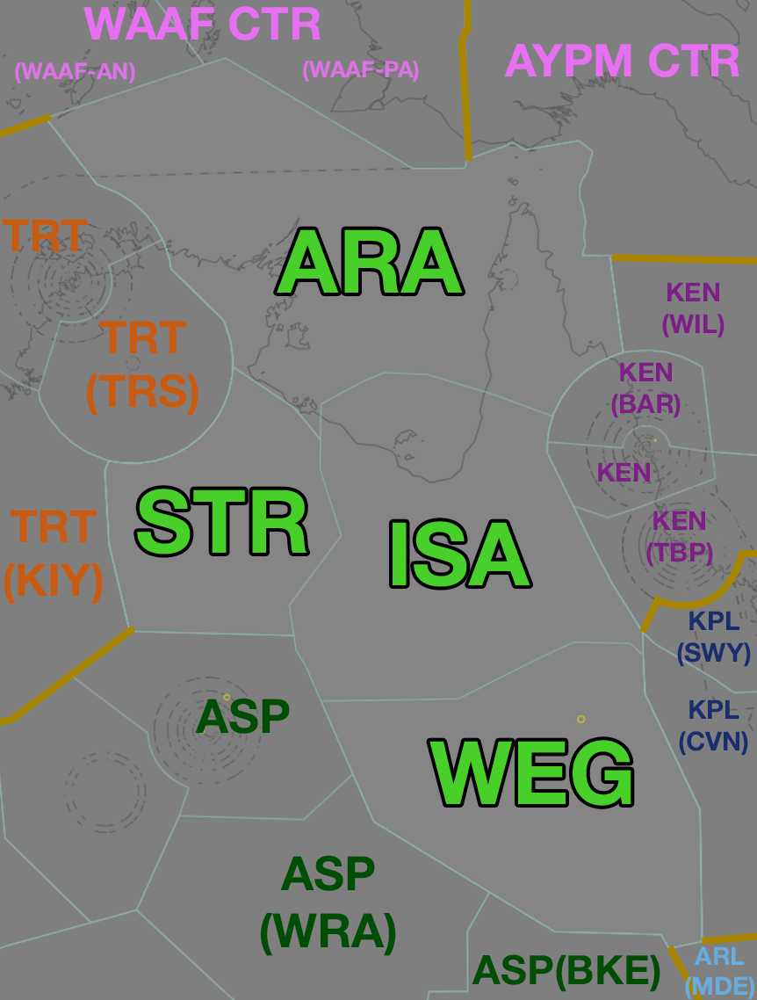

--8<-- "includes/abbreviations.md"

## Positions

| Name | Callsign | Frequency | Login ID |
| ---- | -------- | --------- | -------- |
| **Isa** | **Brisbane Centre** | **125.700** | **BN-ISA_CTR** |
| Arafura :material-information-outline:{ title="Non-standard position"} | Brisbane Centre | 133.700 | BN-ARA_CTR |
| Sturt :material-information-outline:{ title="Non-standard position"} | Brisbane Centre | 134.400 | BN-STR_CTR |
| Warrego :material-information-outline:{ title="Non-standard position"} | Brisbane Centre | 132.450 | BN-WEG_CTR |

!!! abstract "Non-Standard Positions"
    :material-information-outline: Non-standard positions may only be used in accordance with [VATPAC Air Traffic Services Policy](https://vatpac.org/publications/policies){target=new}.  
    Approval must be sought from the **bolded parent position** prior to opening a Non-Standard Position, unless [NOTAMs](https://vatpac.org/publications/notam){target=new} indicate otherwise (eg, for events).

### CPDLC
The Primary Communication Method for ISA is [CPDLC](../../../client/cpdlc). Voice may be used in lieu when applicable. The CPDLC Station Code is `YISA`.

## Airspace

<figure markdown>
{ width="700" }
  <figcaption>Mt Isa Airspace</figcaption>
</figure>

ISA is responsible for **ARA**, **STR**, and **WEG** when they are offline.  

## Extending
!!! warning "Important"
    Due to the large geographical area covered by this sector and it's neighbours, controllers are reminded of their obligations under the [ATS Policy](https://vatpac.org/publications/policies) when extending. Ensure that you have sufficiently placed visibility points to cover your primary sector and any secondary, extended sectors in their entirety.

## Departure and Arrival Procedures

### YBSG
#### Sequencing
All sequencing is performed by ARA.

<!-- ## Special Use Airspace 
### Restricted Areas
-->

## STAR Clearance Expectation
### Handoff
Aircraft being transferred to the following sectors shall be told to Expect STAR Clearance on handoff:

| Transferring Sector | Receiving Sector | ADES | Notes |
| ---- | -------- | --------- | --------- |
| ARA | TRT(TRS) | YPDN | |
| ARA, ISA | KEN(BAR, KEN) | YBCS | |
| ISA | KEN(TBP) | YBTL | |

## Coordination
### Enroute
As per [Standard coordination procedures](../../../controller-skills/coordination/#enr-enr), Voiceless, no changes to route or CFL within **50nm** to boundary.

### SG TCU
#### Airspace
The limits of the SG TCU are `SFC` to `F245` within 40 NM of the YBSG ARP. This may be amended by NOTAM.

#### Arrivals/Overfliers
The Standard assignable level from ARA to SG TCU is `F130`, tracking via WP VOR.

All other aircraft must be voice coordinated to SG TCU prior to **20nm** from the boundary.

#### Departures
The Standard Assignable level from SG TCU to ARA is `F240`, and tracking via their planned route.

#### SG ADC
When SG TCU is offline, coordination is not required between ISA(ARA) and SG ADC. Aircraft entering SG ADC airspace shall be handed off, and instructed to contact SG ADC for onwards clearance.

SG ADC owns the Class C airspace within the SG CTR from `SFC` to `A015`.

### ISA Internal
As per [Standard coordination procedures](../../../controller-skills/coordination/#enr-enr), Voiceless, no changes to route or CFL within **50nm** to boundary.

### International (AYPM)
As per [Standard coordination procedures](../../../controller-skills/coordination/#enr-enr), Voiceless, no changes to route or CFL within **50nm** to boundary.

### International (WAAF)
As per [Standard coordination procedures](../../../controller-skills/coordination/#other-units), Heads-up Coordination required for all aircraft prior to **30 mins** from boundary.

!!! phraseology
    **ARA** -> **WAAF CTR**: "Estimate, CEB40, TOREX time 59, F360"  
    **WAAF CTR** -> **ARA**: "CEB40, F360"