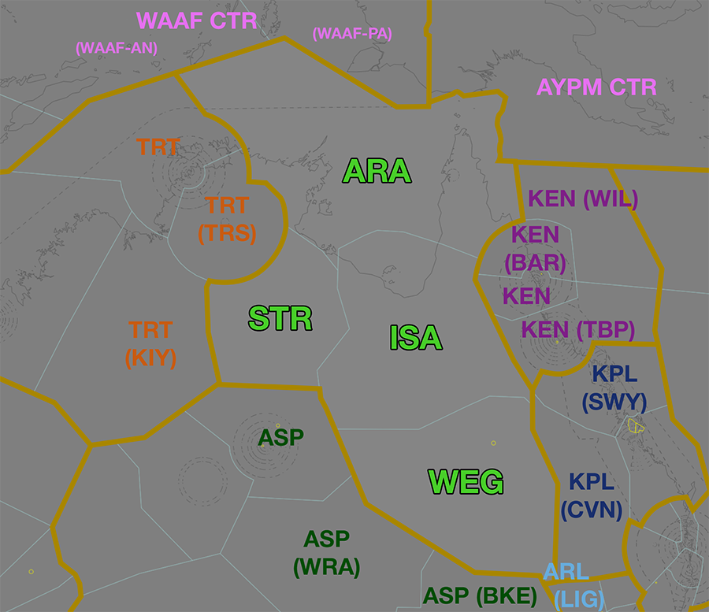
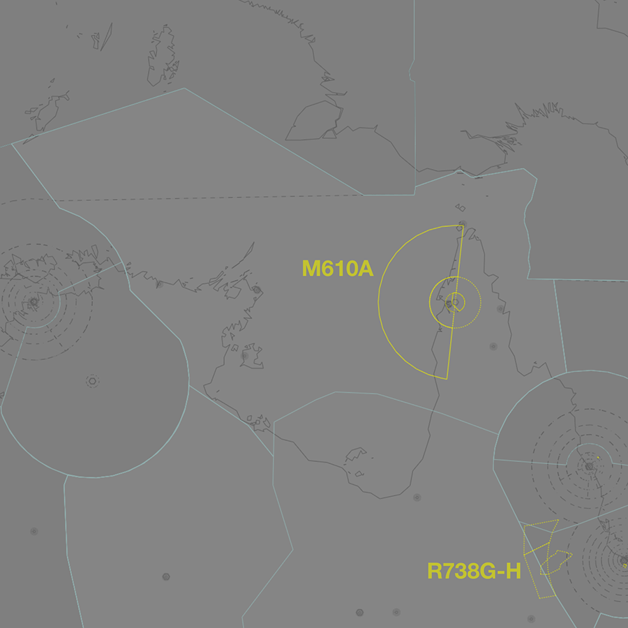

--8<-- "includes/abbreviations.md"

## Positions

| Name              | ID      | Callsign            | Frequency   | Login ID       |
| ----------------- | ------- | ------------------- | ----------- | -------------- |
| **Isa**           | **ISA** | **Brisbane Centre** | **125.700** | **BN-ISA_CTR** |
| Arafura :material-information-outline:{ title="Non-standard position"} | ARA | Brisbane Centre | 133.700 | BN-ARA_CTR |
| Sturt :material-information-outline:{ title="Non-standard position"}   | STR | Brisbane Centre | 134.400 | BN-STR_CTR |
| Warrego :material-information-outline:{ title="Non-standard position"} | WEG | Brisbane Centre | 132.450 | BN-WEG_CTR |

!!! abstract "Non-Standard Positions"
    :material-information-outline: Non-standard positions may only be used in accordance with [VATPAC Air Traffic Services Policy](https://vatpac.org/publications/policies){target=new}.  
    Approval must be sought from the **bolded parent position** prior to opening a Non-Standard Position, unless [NOTAMs](https://vatpac.org/publications/notam){target=new} indicate otherwise (eg, for events).

### CPDLC
The Primary Communication Method for ISA is [CPDLC](../../../client/cpdlc). Voice may be used in lieu when applicable. The CPDLC Station Code is `YISA`.

## Airspace

<figure markdown>
{ width="700" }
  <figcaption>Mt Isa Airspace</figcaption>
</figure>

ISA is responsible for **ARA**, **STR**, and **WEG** when they are offline.  

#### Extending
!!! warning "Important"
    Due to the large geographical area covered by this sector and its neighbours, controllers are reminded of their obligations under the [ATS Policy](https://vatpac.org/publications/policies) when extending. Ensure that you have sufficiently placed visibility points to cover your primary sector and any secondary, extended sectors in their entirety.
	
### Reclassifications
=== "SG CTR"
	The restricted airspace around YPWR is classified as Class G by default, and is only reclassified as controlled airspace when **SGA** is online. When **SGA** is offline, the area remains Class G, and is administered by ARA.

## Departure and Arrival Procedures

### YBSG
ARA is responsibile for facilitating operations in and out of YBSG.

## Local Procedures
### Special Use Airspace
There are multiple volumes of [SUA](../../controller-skills/sua) within ISA airspace, mostly associated with military operations in and out of YBSG.

<figure markdown>
{ width="700" }
  <figcaption>Notable SUA in ISA Airspace</figcaption>
</figure>

SG TCU must [give heads up coordination](../../terminal/scherger/#sua-in-enroute-airspace) with the relevant enroute controllers **prior** to any departures intending to operate in a currently inactive SUA.

!!! phraseology
    **SGA** -> **ARA**: "On the groud YBSG, FBED14, requests activation of M610A `F125-F245`, from 0300 until 0500.”  
    **ARA** -> **SGA**: "FBED14, expect activation of M610A `F125-F245` at 0300 until 0500."   
    **SGA** -> **ARA**: "FBED14."   

Non-participating aircraft intending to transit an activated SUA should be rerouted, where possible, [subject to the VATSIM Code of Conduct](../../sua/#ad-hoc-activations).

#### M610A Scherger
The M610A Scherger [MOA](../../controller-skills/sua/#military-operating-areas) is located over western coast of North Queensland and the Gulf of Carpentaria, `F125-F245`, located entirely in ARA airspace. 

The MOAs directly adjoin the SG TMA and when SGA is online aircraft will be transferred directly to/from the MOAs. When [WAL is offline](#reclassifications), aircraft will contact ARA for transit through the surrounding civilian airspace.

Aircraft will generally enter and exit the MOA via the appropriate [military gate](../../terminal/scherger/#military-gates).

#### Townsville SUA
There are two SUA associated with military operations at Townsville which clip ISA airspace: the R738G-H Townsville (Land) restricted areas.

TLA (or KEN(KEN, TBP) on their behalf) will coordinate the activation these SUA prior to any activity.

## STAR Clearance Expectation
### Handoff
Aircraft being transferred to the following sectors shall be told to Expect STAR Clearance on handoff:

| Transferring Sector | Receiving Sector | ADES | Notes |
| ---- | -------- | --------- | --------- |
| ARA | TRT(TRS) | YPDN | |
| ARA, ISA | KEN(BAR, KEN) | YBCS | |
| ISA | KEN(TBP) | YBTL | |

## Coordination
### Enroute
As per [Standard coordination procedures](../../../controller-skills/coordination/#enr-enr), Voiceless, no changes to route or CFL within **50nm** to boundary.

### SG TCU
#### Airspace
The limits of the SG TCU are `SFC` to `F245` within 40 NM of the YBSG ARP.

#### Arrivals/Overfliers
Voiceless for all aircraft:

- With ADES **YBSG**; and
- Tracking via **WP VOR**; and
- Assigned `F130`.

All other aircraft coming from ARA CTA must be **Heads-up** Coordinated to SGA prior to **20nm** from the boundary.

#### Departures
Voiceless for all aircraft:

- Assigned the lower of `F240` or the `RFL`.

All other aircraft going into ARA CTA will be **Heads-up** Coordinated by SGA prior to the boundary.

### ISA Internal
As per [Standard coordination procedures](../../../controller-skills/coordination/#enr-enr), Voiceless, no changes to route or CFL within **50nm** to boundary.

### International (AYPM)
As per [Standard coordination procedures](../../../controller-skills/coordination/#enr-enr), Voiceless, no changes to route or CFL within **50nm** to boundary.

### International (WAAF)
As per [Standard coordination procedures](../../../controller-skills/coordination/#other-units), Heads-up Coordination required for all aircraft prior to **30 mins** from boundary.

!!! phraseology
    **ARA** -> **WAAF CTR**: "Estimate, CEB40, TOREX time 59, F360"  
    **WAAF CTR** -> **ARA**: "CEB40, F360"