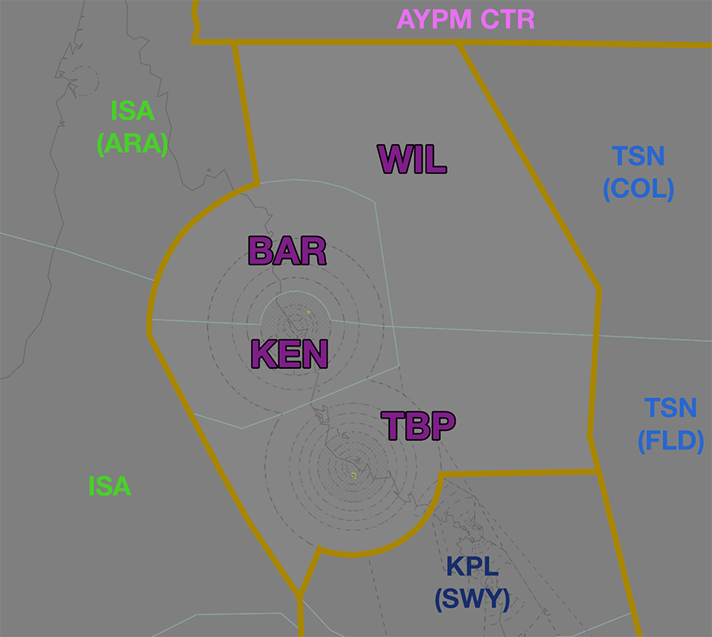
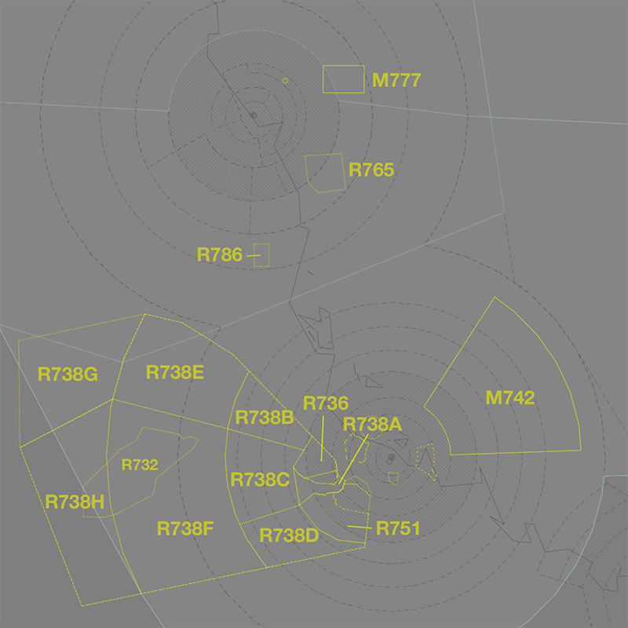
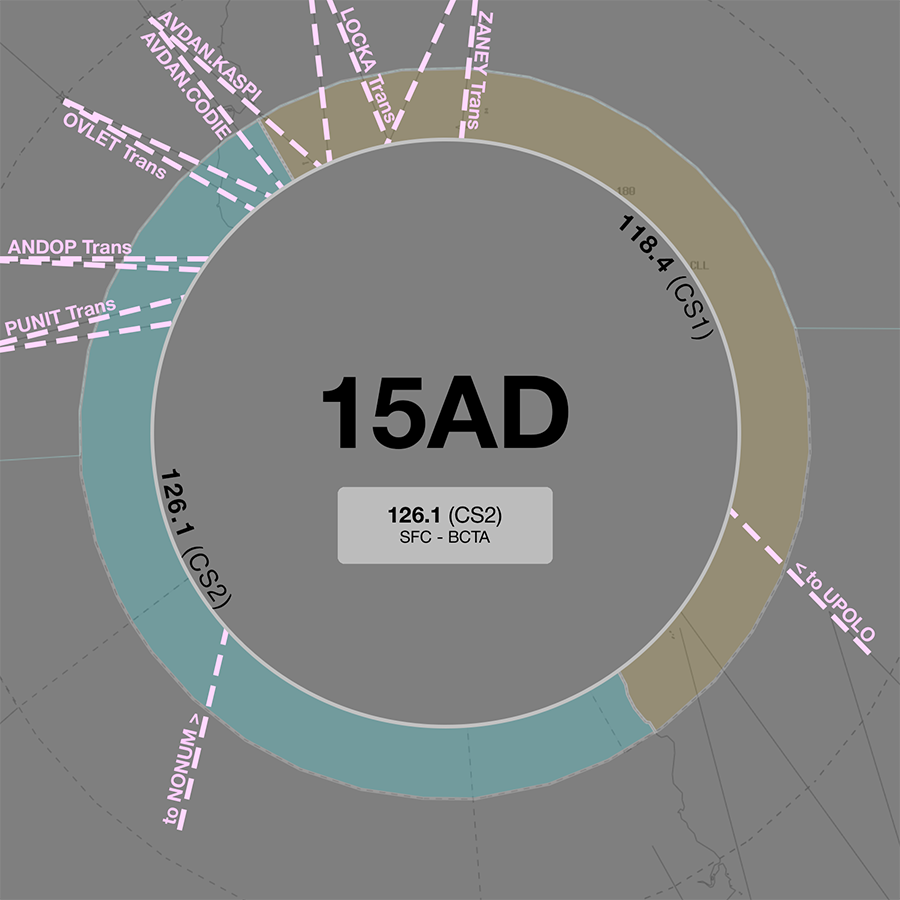
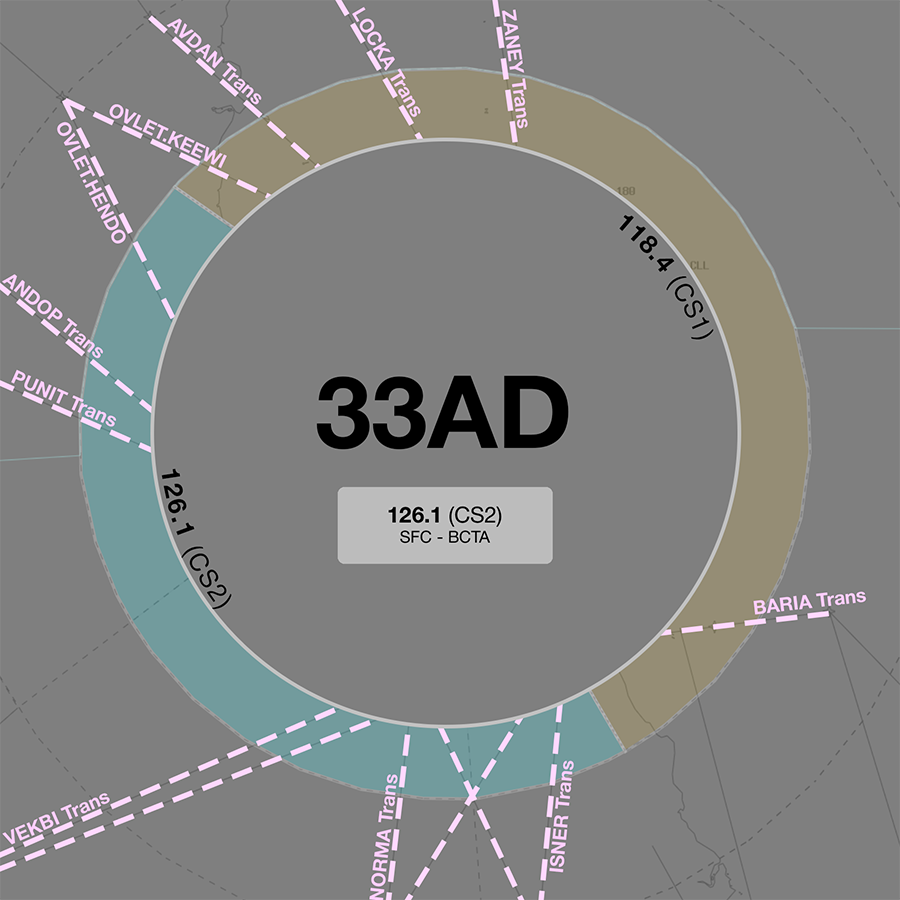

--8<-- "includes/abbreviations.md"

## Positions
| Name              | ID      | Callsign            | Frequency   | Login ID       |
| ----------------- | ------- | ------------------- | ----------- | -------------- |
| **Kennedy**       | **KEN** | **Brisbane Centre** | **120.150** | **BN-KEN_CTR** |
| Barra :material-information-outline:{ title="Non-standard position"}    | BAR | Brisbane Centre | 123.800 | BN-BAR_CTR |
| Tabletop :material-information-outline:{ title="Non-standard position"} | TBP | Brisbane Centre | 120.550 | BN-TBP_CTR |
| Willis :material-information-outline:{ title="Non-standard position"}   | WIL | Brisbane Centre | 127.600 | BN-WIL_CTR |

!!! abstract "Non-Standard Positions"
    :material-information-outline: Non-standard positions may only be used in accordance with [VATPAC Air Traffic Services Policy](https://vatpac.org/publications/policies){target=new}.  
    Approval must be sought from the **bolded parent position** prior to opening a Non-Standard Position, unless [NOTAMs](https://vatpac.org/publications/notam){target=new} indicate otherwise (eg, for events).

### CPDLC
The Primary Communication Method for KEN is Voice. [CPDLC](../../../client/cpdlc) may be used in lieu when applicable. The CPDLC Station Code is `YKEN`.

## Airspace

<figure markdown>
{ width="700" }
  <figcaption>Kennedy Airspace</figcaption>
</figure>

KEN is responsible for **BAR**, **TBP**, and **WIL** when they are offline.  
BAR is responsible for the [CS TCU](../../../terminal/cairns) when **CS TCU** is offline.  

### Reclassifications
=== "TL TCU"
	When **TL TCU** is offline, TL CTR (Class C `SFC` to `A085`) reverts to Class G, and is administered by TBP. Alternatively, TBP may provide a [top-down approach service](../../../aerodromes/classc/Townsville) if they wish.

	!!! tip
        If choosing *not* to provide a top down service, consider publishing a pre-formatted **ATIS Zulu** for the aerodrome, to inform pilots about the airspace reclassification.

## Departure and Arrival Procedures
### YBCS
#### STAR Assignment
YBCS has specific visual approach procedures for use when VMC exists below `A030` in the terminal area. As such, **light & medium category aircraft (B737/A320 and below)** shall be issued the relevant Victor STAR.

Heavy aircraft must be issued the Instrument STAR.

!!! note
    Due to the complex nature of the visual procedures, it may be helpful to ask inexperienced pilots if they are familiar with the Creek Corridor (runway 15) or are able to accept a visual circuit (runway 33), and otherwise issue the Instrument STAR.

The following subsectors are responsible for issuing STAR clearance.

=== "RWY 15"
	| Subsector | STAR | Type | Notes |
	| ---- | ----- | -------- | ----- |
	| BAR  | CODIE KASPI   | All   | INST APCH VISUAL APCH |
	| KEN  | NONUM | All      |       |
	| TBP  | NONUM UPOLO   | All   | Descent not below `F190`| 
	
=== "RWY 33"
	| Subsector | STAR | Type | Notes |
	| ---- | ----- | -------- | ----- |
	| BAR  | HENDO KEEWI TOTTY | All | INST APCH VISUAL APCH RNP-W |
	| KEN  | HENDO TOTTY | All   | INST APCH RNP-W |
	| TBP  | HENDO TOTTY | All   | Descent not below `F190` |

Arrivals from the south shall be given initial descent to not below `F190`. **KEN** will issue final descent.

##### Adjacent Feeder Fixes
Aircraft assigned the **same runway** inbound via:

- ANDOP and PUNIT  
- OVLET, AVDAN and LOCKA

Must be considered to be on the **same STAR** for sequencing purposes. That is, they must be at least **2 minutes** apart at their respective Feeder fixes.

#### Sequencing
Sequencing arrivals into YBCG is a joint responsibility of the subsectors of KEN. Initial sequencing actions should be performed by all sectors, with fine tuning and any holding required issued by KEN/BAR. 

### YBTL
#### STAR Assignment
The following subsectors are responsible for issuing STAR clearance.

| Subsector | STAR | Type | Notes |
| ---- | ----- | -------- | ----- |
| KEN  | IBUXI IGIKI | All   | Descent not below `F190` |

Arrivals from the north shall be given initial descent to not below `F190`. **TBP** will issue final descent.

#### Sequencing
KEN and TBP share responsbility for initial sequencing for aircraft arriving from the north, east, and west. KPL(SWY) is responsible for initial sequencing for aircraft arriving from the south. Final sequencing actions are performed by TBP.

Coordination with KPL(SWY) should be conducted to ensure that aircraft from each sector are sequenced appropriately with each other.

## Local Procedures
### Special Use Airspace

There are multiple volumes of [SUA](../../controller-skills/sua) within KEN airspace, mostly associated with military operations in and out of YBTL.

<figure markdown>
{ width="700" }
  <figcaption>Notable SUA in KEN Airspace</figcaption>
</figure>

TL TCU must [give heads up coordination](../../terminal/townsville/#sua-in-enroute-airspace) with the relevant enroute controllers **prior** to any departures intending to operate in a currently inactive SUA.

!!! phraseology
    **TLA** -> **TBP**: "On the groud YBTL, PSSM31, requests activation of M742 `A040-F240`, from 0300 until 0500.”  
    **TBP** -> **TLA**: "PSSM31, expect activation of M742 `A040-F240` at 0300 until 0500."   
    **TLA** -> **TBP**: "PSSM31."   
    
Non-participating aircraft intending to transit an activated SUA should be rerouted, where possible, [subject to the VATSIM Code of Conduct](../../sua/#ad-hoc-activations).

#### M742 Tiger
The M742 Tiger [MOA](../../controller-skills/sua/#military-operating-areas) is located off the coast, `A040-F240`, spanning both TL TCU and KEN(TBP) airspace. Activation of the M742 MOA is a [shared responsibility](../../controller-skills/sua/#activation-of-SUA), and both TAL and KEN(TBP) must coordinate before activation.

Aircraft will generally enter and exit the MOA via the appropriate [military gate](../../terminal/townsville/#military-gates).

##### Affected Civil Operations
Activation of the MOA disrupts traffic on the infrequently used **R213** high altitude airway. Aircraft travelling on thie airway should kept above `F250` to ensure separation.

#### R732 Greenvale Training Area
The R732 Greenvale Training Area [restricted area](../../controller-skills/sua/#restricted-areas) is located west of YBTL within TBP and ISA airspace.

##### Affected Civil Operations
When activated the restricted area disrupts traffic on the **J184**, **W152**, **W528**, and **Z51** low altitude airways, which connect YBTL to western Queensland.

| Planned Airway | ERSA Recommended Rerouting |
| -------------- | -------------------------- |
| J184           | `... OKODU DCT THOMO W265 ...` |
| W152           | `... HUG DCT YKID DCT NONUM W152 ...` |
| W528           | `... KIPPA DCT THOMO W265 ...` |
| Z51            | `... W841 DOTTE DCT KADMU ...` |

!!! note
	Aircraft tracking via a recommended rerouting must still be [separated from the SUA](../../sua/#separation-from-sua)  laterally and vertically. After amending flight plans for the purposes of rerouting around SUA, controllers should ensure the route is displayed visually and the BRL is used to measure for [>2.5nm](../../sua/#controlled-airspace) clearance with all parts of the SUA.

#### R736 & R739 Townsville (Star)
The R736 and R739 Townsville (Star) [restricted areas](../../controller-skills/sua/#restricted-areas) straddle the border of the TL TCU and KEN(TBP) airspace. 

It is predominantly used for military training operations, including operations at the Star Landing Area ALA (YSTD).

Aircraft will generally enter and exit the MOA via the appropriate [military gate](../../terminal/townsville/#military-gates).

##### Affected Civil Operations
When activated, the restricted areas distrupt traffic on the **J184**, **W265**, **W528**, and **W637** low altitude airways, which connect YBTL to Western Queensland. Aircraft travelling on these airways should be manually rerouted around the SUA.

#### R738A-H Townsville (Land)
The R738A-H Townsville (Land) [restricted areas](../../controller-skills/sua/#restricted-areas), also known  as the Townsville Field Training Area, is a series of defined airspace volumes west of YBTL, `A070-NOTAM`. R738A and R738B are in both TL TCU and TBP airspace, while R738C-H is wholly located in TBP.

The area is used for a wide array of military training operations, including supersonic flight, air-to-air combat training, and live fire exercises. The extent of activation required will vary according to each operation, but will generally include R738A or R738B, along with an additional larger subsection.

##### Affected Civil Operations
When activated, the restricted areas significantly disrupts traffic on the west of YBTL.

Aircraft should be rerouted via either the recommended northern or southern diversion.

| Diversion | Planned Airways | ERSA Recommended Rerouting |
| --------- | --------------- | -------------------------- |
| Northern  | J138 W841 Z51 | `CARMN DCT KIBOP`     |
| Southern  | J184 W265 W469 W528 W637 | `ANDUB Q71 DOBGO` |

## STAR Clearance Expectation
### Handoff
Aircraft being transferred to the following sectors shall be told to Expect STAR Clearance on handoff:

| Transferring Sector | Receiving Sector | ADES | Notes |
| ---- | -------- | --------- | --------- |
| TBP | KPL(SWY) | YBRK, YBMK | |
| BAR | KEN | YBTL | |
| WIL | BAR | YBCS | |

## Terminal Handover Frequencies
Aircraft being transferred from enroute to a TCU with multiple frequencies shall be given the frequency for the revelant TCU position.

=== "CS TCU"
	=== "15AD"
		<figure markdown>
		{ width="500" }
		  <figcaption>CS TCU Handover Frequencies - 15AD Mode</figcaption>
		</figure>
		
		| ADES | STAR  | Transition | Frequency (Controller) |
		| ---- | ----- | ---------- | ---------------------- |
		| YBCS | CODIE | ANDOP AVDAN OVLET PUNIT | **126.100** (CS2) |
		|      |       | LOCKA ZANEY | **118.400** (CS1) |
		| YBCS | KASPI | ANDOP OVLET PUNIT | **126.100** (CS2) |
		|      |       | AVDAN LOCKA ZANEY | **118.400** (CS1) |
		| YBCS | NONUM | **126.100** (CS2)      |
		| YBCS | UPOLO | **118.400** (CS1)      |
		
	=== "33AD"
		<figure markdown>
		{ width="500" }
		  <figcaption>CS TCU Handover Frequencies - 33AD Mode</figcaption>
		</figure>
		
		| ADES | STAR  | Transition | Frequency (Controller) |
		| ---- | ----- | ---------- | ---------------------- |
		| YBCS | HENDO | ANDOP ISNER NORMA OVLET PUNIT VEKBI | **126.100** (CS2) |
		|      |       | BARIA | **118.400** (CS1) |
		| YBCS | KEEWI | ANDOP PUNIT VEKBI ISNER  | **126.100** (CS2) |
		|      |       | AVDAN LOCKA OVLET ZANEY | **118.400** (CS1) |
		| YBCS | TOTTY | All | **126.100** (CS2) |
		
	!!! tip
		The quick reference tables above only include scenarios for which there is [voiceless coordination](#cs-tcu). Refer to the diagram for the appropriate position/frequency for coordination and handoff for all other situations.

## Coordination
### CS TCU
#### Airspace
The vertical limits of the CS TCU are `SFC` to `F180`.  

Refer to [Cairns TCU Airspace Division](../../../terminal/cairns/#airspace-division) for information on airspace divisions when **CS2** is online.

#### Arrivals/Overfliers
Voiceless for all aircraft:

- With ADES **YBCS**; and  
- Assigned a STAR; and  
- Assigned the Standard Assignable level of:  
    - Radials 055° clockwise through to 355°: `A070`  
    - Radials 355° clockwise to 055°: `A090`

All other aircraft coming from KEN CTA must be **Heads-up** Coordinated to CS TCU prior to **20nm** from the boundary.

#### Departures
Voiceless for all aircraft:

- Tracking via a Procedural SID terminus; and  
- Assigned the lower of `F180` or the `RFL`

All other aircraft going to KEN CTA will be **Heads-up** Coordinated by CS TCU.

### TL TCU
#### Airspace
TL TCU owns the Class C and G airspace within 36 DME TL from `SFC` to `F180`.

Refer to [Reclassifications](#reclassifications) for operations when TL TCU is offline.

#### Arrivals/Overfliers
Voiceless for all aircraft:

- With ADES **YBTL**; and  
- Assigned a STAR; and  
- Assigned `A090`

All other aircraft coming from TBP CTA must be **Heads-up** Coordinated to TL TCU prior to **20nm** from the boundary.

#### Departures
Voiceless for all aircraft:

- Tracking via a Procedural SID terminus; and  
- Assigned the lower of `F180` or the `RFL`

All other aircraft going to TBP CTA will be **Heads-up** Coordinated by TL TCU.

### Enroute
As per [Standard coordination procedures](../../../controller-skills/coordination/#enr-enr), Voiceless, no changes to route or CFL within **50nm** to boundary.

### KEN Internal
As per [Standard coordination procedures](../../../controller-skills/coordination/#enr-enr), Voiceless, no changes to route or CFL within **50nm** to boundary.

TBP may make changes to CFL up to the boundary with KEN for the purposes of issuing descent for YBCS.

### TSN(FLD/COL) (Oceanic)
As per [Standard coordination procedures](../../../controller-skills/coordination/#pacific-units), Voiceless, no changes to route or CFL within **15 mins** to boundary.

Aircraft must have their identification terminated and be instructed to make a position report on first contact with the next (procedural) sector.

!!! phraseology
    **ISA**: "QFA121, identification terminated, report position to Brisbane Radio, 126.45"

### International (AYPM)
As per [Standard coordination procedures](../../../controller-skills/coordination/#enr-enr), Voiceless, no changes to route or CFL within **50nm** to boundary.