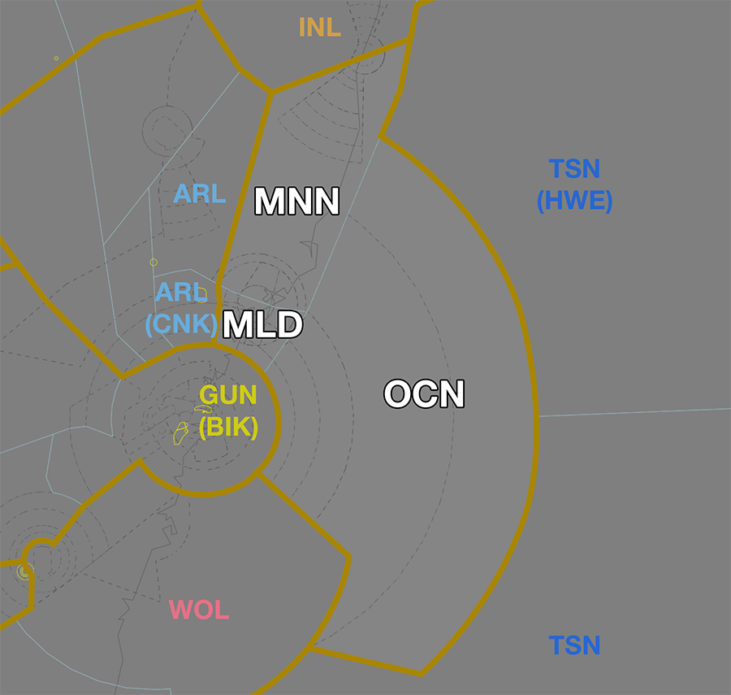
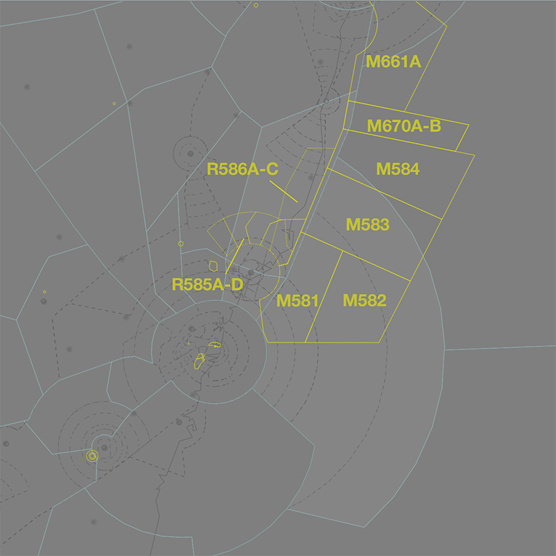

--8<-- "includes/abbreviations.md"
## Positions

| Name              | ID      | Callsign            | Frequency   | Login ID       |
| ----------------- | ------- | ------------------- | ----------- | -------------- |
| **Manning**       | **MNN** | **Brisbane Centre** | **130.100** | **BN-MNN_CTR** |
| Maitland :material-information-outline:{ title="Non-standard position"} | MLD | Brisbane Centre | 132.350 | BN-MLD_CTR |
| Ocean :material-information-outline:{ title="Non-standard position"}    | OCN | Brisbane Centre | 128.600 | BN-OCN_CTR |

!!! abstract "Non-Standard Positions"
    :material-information-outline: Non-standard positions may only be used in accordance with [VATPAC Air Traffic Services Policy](https://vatpac.org/publications/policies){target=new}.  
    Approval must be sought from the **bolded parent position** prior to opening a Non-Standard Position, unless [NOTAMs](https://vatpac.org/publications/notam){target=new} indicate otherwise (eg, for events).

## Airspace
<figure markdown>
{ width="700" }
  <figcaption>Manning Airspace</figcaption>
</figure>

### Reclassifications
=== "CFS CTR"
	When **CFS ADC** is offline, CFS CTR (Class D `SFC` to `A045`) reverts to Class G, and is administered by MNN and INL.

	!!! note
		MNN does not assume the CFS CTR in the absence of a CFS ADC controller. Assumption of the CFS CTR is the responsibility of INL. Controllers may choose to verbally coordinate the release of the CFS CTR to either sector/subsector.
    
    !!! tip
        If choosing *not* to provide a top down service, consider publishing a pre-formatted **ATIS Zulu** for the aerodrome, to inform pilots about the airspace reclassification.

=== "WLM CTR"
	When **WLM TCU** is offline, WLM MIL CTR (Class C `SFC` to `A065`) reverts to Class G, and WLM MIL CTR (Class C `A065` to `F125`) reverts to Class E. This airspace is administered by the appropriate MNN subsector. Alternatively, MLD may provide a [top-down service](../../../terminal/williamtown) if they wish.  

    !!! tip
        If choosing *not* to provide a top down service, consider publishing a pre-formatted **ATIS Zulu** for the aerodrome, to inform pilots about the airspace reclassification.

## Departure and Arrival Procedures

### YCFS
[Coffs Harbour (YCFS)](../../../aerodromes/procedural/coffs) lies under the INL/MNN boundary. MNN is responsible for issuing descent to aircraft arriving into YCFS from the south.

#### Sequencing
MNN and INL share a joint responsibility to build the final sequence of arrivals into YCFS when the tower is open. Coordination with INL should be conducted to ensure that aircraft from each sector are sequenced appropriately with each other.

### YSSY
#### STAR Assignment
The following subsectors are responsible for issuing STAR clearance.

| Subsector | STAR | Type | Notes |
| ---- | ----- | -------- | ----- |
| OCN  | MARLN | All      |       |
	
#### Sequencing
Sequencing arrivals from the east into YSSY is the responsibility of OCN. Aircraft from the north/east shall be assigned **runway 16L/34R** during PROPS. However, some situations may warrant the use of the main runway (16R/34L), such as heavy aircraft operationally requiring the longer runway or large volumes of traffic requiring the use of both runways to minimise delay. In this case, coordination must be conducted with Melbourne Centre or Sydney Flow (if operating) to ensure that the sequence is built in an efficient and orderly way.

!!! phraseology
    **OCN** -> **BIK**: "West of Sydney, QFA12, with your concurrence will be assigned runway 34L due operational requirement"  
    **BIK** -> **OCN**: "Concur, QFA12 runway 34L, required landing time 43 due sequence from the west"  
    **OCN** -> **BIK**: "Runway 34L, landing time 43, QFA12"

##### Predictable Sequencing Waypoints
There are ten [Predictable Sequencing](../../../../controller-skills/sequencing/#predictable-sequencing) waypoints available for aircraft inbound YSSY via **N774** and **M636**.

The table below contains the estimated time from the initial waypoint to the final waypoint **via the CDO waypoint**. 

=== "N774"
    | Initial Waypoint | CDO Waypoint | Final Waypoint | Delay (in mins) |
    | ---------------- | ------------ | -------------- | --------------- |
    | NONID | HARIZ/PORUV | RIKNI | 2 |
    | NONID | AVKIR/ISNET | RIKNI | 4 |
    | NONID | IDAGO/OVMAT | RIKNI | 6 |
    | NONID | ADLIV/FLEMO | RIKNI | 8 |
    | NONID | UDISI/OPEXA | RIKNI | 10 |

=== "M636"
    | Initial Waypoint | CDO Waypoint | Final Waypoint | Delay (in mins) |
    | ---------------- | ------------ | -------------- | --------------- |
    | PLUGA | OLNOT | RIKNI | 2 |
    | PLUGA | ADBOK | RIKNI | 4 | 
    | PLUGA | PEBTU | RIKNI | 6 |
    | PLUGA | GORTA | RIKNI | 8 | 

##### Holding Fixes
Refer to the vatSys Enroute Holds map for details of published holds on the airways inbound to YSSY. Where delays necessitate holding, aircraft should be instructed to hold at the following positions. The listed time should be subtracted from an aircraft's assigned feeder fix time to determine when they should leave the hold.

| Feeder Fix | Holding Fix | Time from Hold to Feeder Fix |
| ---- | ---- | ---- |
| MARLN | RIKNI | 4 min |

!!! tip
    Additional holding may be performed at upstream holding fixes to reduce controller workload. This is particularly useful when non-standard child sectors have been opened, allowing aircraft to absorb some of their delay in the previous sector. 

### YSWS
#### STAR Assignment
The following subsectors are responsible for issuing STAR clearance.

| Subsector | STAR | Type | Notes |
| ---- | ----- | -------- | ----- |
| OCN  | BIKUS RIKNI | All      |       |

The **default STAR** from the east is the **BIKUS A STAR**. At night, the **RIKNI N STAR** shall be assigned instead.

#### Sequencing
OCN is responsible for sequencing arrivals into YSWS.

### YSRI
#### STAR Assignment
The following subsectors are responsible for issuing STAR clearance.

| Subsector | STAR | Type | Notes |
| ---- | ----- | -------- | ----- |
| OCN  | DIPPA | All      |       |

#### Sequencing
OCN is responsible for sequencing arrivals into YSRI.

### YSBK
#### STAR Assignment
The following subsectors are responsible for issuing STAR clearance.

| Subsector | STAR | Type | Notes |
| ---- | ----- | -------- | ----- |
| OCN  | WHALE | All      |       |

#### Sequencing
OCN is responsible for sequencing arrivals into YSBK.

### YSCN
#### STAR Assignment
The following subsectors are responsible for issuing STAR clearance.

| Subsector | STAR | Type | Notes |
| ---- | ----- | -------- | ----- |
| OCN  | PRAWN | All      |       |

#### Sequencing
OCN is responsible for sequencing arrivals into YSCN.

### YWLM
#### STAR Assignment
The following subsectors are responsible for issuing STAR clearance.

| Subsector | STAR | Type | Notes |
| ---- | ----- | -------- | ----- |
| ARL  | LAXUM | All      |       | 
| MNN  | LAXUM | All      |       |
| OCN  | ASUVA | All      |       |

## Local Procedures
### Special Use Airspace
There are multiple volumes of [SUA](../../controller-skills/sua) within MNN airspace, mostly associated with military operations in and out of YWLM.

<figure markdown>
{ width="700" }
  <figcaption>Notable SUA in MNN Airspace</figcaption>
</figure>

WLM TCU must [give heads up coordination](../../terminal/williamtown/#sua-in-enroute-airspace) with the relevant enroute controllers **prior** to any departures intending to operate in a currently inactive SUA.

!!! phraseology
    **WAL** -> **MNN**: "On the groud YWLM, PTHR11, requests activation of M583 `A085-F240`, from 0300 until 0500.”  
    **MNN** -> **WAL**: "PTHR11, expect activation of M583 `A085-F240` at 0300 until 0500."   
    **WAL** -> **MNN**: "PTHR11."  
    
Non-participating aircraft intending to transit an activated SUA should be rerouted, where possible, [subject to the VATSIM Code of Conduct](../../controller-skills/sua/#ad-hoc-activations).

#### M581-M584 Williamtown
The M581-M584 MOAs are located offshore within the MLD, MNN, OCN, and TSN(HWE) subsectors.

The MOAs directly adjoin the WLM TCU, and when WAL is online aircraft will be transferred directly to/from the MOAs. When [WAL is offline](#reclassifications), aircraft will contact MNN for transit through the surrounding civilian airspace.

##### Affected Civil Operations
When activated these MOAs significantly disrupt traffic on the busy **A579**, **B450**, **B474**, **B580**, and **H258** high altitude airways, which connect YSSY to the Pacific and North America.

| Planned Airway | ERSA Recommended Rerouting |
| -------------- | -------------------------- |
| A579 | `DIPSO G595 ATNAT DCT DUDEP DCT UPSAD A579 ...` |
| B450 | `DIPSO G595 ATNAT DCT ABARB B450 ...` |
| B474 | `OLSEM Y193 BANDA DCT VEMLA B474 ...` `DIPSO G595 ATNAT DCT DUDEP Y70 BISAB J328 ISTEM B474 ...` (when M670 is also active) |
| B580 | `DIPSO G595 ATNAT DCT DUDEP Y70 BISAB J328 MISLY B580 ...` |

The **W149** and **W768** low altitude airways, connecting YLHI to YWLM and YPMQ, are also affected, requiring extensive rerouting or facilitated transit through the SUA.

!!! note
	 Aircraft tracking via a recommended rerouting must still be [separated from the SUA](../../controller-skills/sua/#separation-from-sua)  laterally and vertically. After amending flight plans for the purposes of rerouting around SUA, controllers should ensure the route is displayed visually and the BRL is used to measure for [>2.5nm](../../controller-skills/sua/#controlled-airspace) clearance with all parts of the SUA.
    
#### R585-R586 Williamtown
The R585A-D and R586A-C restricted areas are located north of the WLM TCU in the ARL and MNN subsectors.

The MOAs directly adjoin the WLM TCU, and when WAL is online aircraft will be transferred directly to/from the restricted areas. When [WAL is offline](#reclassifications), aircraft will contact MNN for transit through the surrounding civilian airspace.

#### Amberley SUA
There are three SUA associated with military operations at [Amberley](../../terminal/amberleyoakey) which clip MNN airspace: the R639D restricted area, located northeast of MOR VOR partially in the MDE subsector, and the M661A and M670A-B MOAs, which clips MNN airspace offshore east of YCFS.

AMA (or INL(DOS, INL, SDY) on their behalf) will coordinate the activation these SUA **prior** to any activity.

## STAR Clearance Expectation
### Handoff
Aircraft being transferred to the following sectors shall be told to Expect STAR Clearance on handoff:

| Transferring Sector | Receiving Sector | ADES | Notes |
| ---- | -------- | --------- | --------- |
| MNN  | INL | YBBN, YBCG | |
| MLD, OCN | GUN(BIK) | YSCB | Jets only |
| MNN  | ARL | YSSY | |

!!! note
    MNN shall perform an early handoff to ARL for aircraft inbound to YSSY departing within MNN airspace. This is to allow ARL to issue STAR clearance provide sequencing instructions in a timely manner.

## Terminal Handover Frequencies
Aircraft being transferred from enroute to a TCU with multiple frequencies shall be given the frequency for the revelant TCU position.

=== "SY TCU"
	=== "07AD"
		<figure markdown>
		{ width="500" }
		  <figcaption>SY TCU Handover Frequencies - 07AD Mode</figcaption>
		</figure>
		
	=== "25AD"
		<figure markdown>
		{ width="500" }
		  <figcaption>SY TCU Handover Frequencies - 25AD Mode</figcaption>
		</figure>
	=== "16 PROPS"
		<figure markdown>
		{ width="500" }
		  <figcaption>SY TCU Handover Frequencies - 16 PROPS Mode</figcaption>
		</figure>
	=== "34 PROPS"
		<figure markdown>
		{ width="500" }
		  <figcaption>SY TCU Handover Frequencies - 34 PROPS Mode</figcaption>
		</figure>
	=== "SODPROPS"
		<figure markdown>
		{ width="500" }
		  <figcaption>SY TCU Handover Frequencies - SODPROPS Mode</figcaption>
		</figure>

	| ADES | STAR  | Frequency (Controller) |
	| ---- | ----- | ---------------------- |
	| YSSY | BOREE | **124.400** (SAN)      |
	| YSSY | MARLN | **124.400** (SAN)      |
	| YSSY | MEPIL | **124.400** (SAN)      |
	| YSSY | AKMIR | **128.300** (SAS)      |
	| YSSY | RIVET | **128.300** (SAS)      |
    | YSCN | PRAWN | **124.400** (SAN)      |
    | YSBK | WHALE | **124.400** (SAN)      |
    | YSRI | RITSU | **135.900** (SRA)      |
    | YSRI | RUPEM | **118.400** (SWA)      |
    | YSWS | BIKUS | **124.400** (SAN)      |
    | YSWS | RIKNI | **124.400** (SAN)      |
    | YSWS | REVKI | **118.400** (SWA)      |
    | YSWS | UNTAV | **135.900** (SRA)      |

	!!! tip
		The quick reference tables above only include scenarios for which there is [voiceless coordination](#sy-tcu). Refer to the diagram for the appropriate position/frequency for coordination and handoff for all other situations.

## Coordination
### SY TCU
#### Airspace
SY TCU is responsible for the airspace within a 45nm radius of TESAT, `SFC` to `F285`.

Refer to [Sydney TCU Airspace Division](../../../terminal/sydney/#airspace-division) for information on airspace divisions when **SAS**, **SDN**, **SDS** and/or **SRI** are online.

#### Arrivals/Overfliers
Voiceless for all aircraft:

- With ADES **YSSY**:  
    - Assigned a STAR; and  
    - Tracking via **MARLN** assigned `A100`
- With ADES **YSWS**, or **YSRI**:
	- Assigned a STAR; and
    - Assigned `A090`.
- With ADES **YSBK**, **YSCN**:
    - Assigned a STAR; and
    - Assigned `A080`

All other aircraft coming from MNN CTA must be **Heads-up** Coordinated to SY TCU prior to **20nm** from the boundary.

#### Departures
Voiceless for all aircraft:

- Assigned the lower of `F280` or the `RFL`; and
- that enter MNN airspace via any of the *Green Shaded Corridors* below, excluding [YWLM Arrivals](#ywlm-arrivals)

<figure markdown>
{ width="700" }
  <figcaption>SY TCU Voiceless Coordination Corridors</figcaption>
</figure>

All other aircraft going to MNN CTA will be **Heads-up** coordinated by SY TCU.

##### YWLM Arrivals
Additionally, Voiceless Coordination exists from SY TCU for aircraft:

- With ADES **YWLM**; and  
- Assigned a STAR; and  
- Assigned the lower of `F130` or the `RFL`

!!! note
    YWLM arrivals are handed off to MLD, not directly to WLM TCU, unless otherwise coordinated.

### Enroute
As per [Standard coordination procedures](../../../controller-skills/coordination/#enr-enr), Voiceless, no changes to route or CFL within **50nm** to boundary.

### MNN Internal
As per [Standard coordination procedures](../../../controller-skills/coordination/#enr-enr), Voiceless, no changes to route or CFL within **50nm** to boundary.

### CFS ADC
#### Airspace
CFS ADC is responsible for the Class D airspace in the CFS CTR `SFC` to `A045`.

Refer to [Reclassifications](#reclassifications) for operations when CFS ADC is offline.

#### Departures
[Next](../../controller-skills/coordination.md#next) coordination is required from CFS ADC to MNN for all aircraft **entering MNN CTA**.

The standard assignable level from **CFS ADC** to **MNN** is:

| Aircraft | Level |
| ---- | ---- |
| All | The lower of `A070` and `RFL` |

Where possible (and no possible conflict exists), a higher level shall be assigned by MNN for high performance aircraft during next coordination.

#### Arrivals/Overfliers
YCFS arrivals and overfliers shall be heads-up coordinated to **CFS ADC** from MNN prior to **5 mins** from the boundary.

!!! phraseology
    **MNN** -> **CFS ADC**: "Via KADSI, RXA6438"  
    **CFS ADC** -> **MNN**: "RXA6438"  

The standard assignable level from MNN to **CFS ADC** is `A080`, any other level must be prior coordinated.

### WLM TCU
#### Airspace
By default, WLM TCU owns the airspace from `SFC` to `F125`. 

An additional, non-standard TCU position may be activated for specific military exercises or events to control airspace above `F125`. When this happens, **WAH** owns the airspace above `F125` to the agreed upper limit.

!!! note
    The upper limit of **WAH** must be coordinated with MNN *prior* to the position logging on.

Refer to [Reclassifications](#reclassifications) for operations when WLM TCU is offline.

#### Departures
Voiceless for all aircraft:

- Tracking via a Procedural SID terminus; and  
- Assigned the lower of `F120` or the `RFL`

All other aircraft going to MNN CTA will be **Heads-up** Coordinated by WLM TCU.

!!! phraseology
    **WAL** -> **MLD**: "QJE1597, request DCT OMGAB"  
    **MLD** -> **WAL**: "QJE1597, concur DCT OMGAB"  

#### Arrivals/Overfliers
Voiceless for all aircraft:

- With ADES **YWLM**; and  
- Assigned a STAR; and  
- Assigned `A090`

All other aircraft coming from MNN CTA must be **Heads-up** Coordinated to WLM TCU prior to **20nm** from the boundary.

### TSN/HWE (Oceanic)
As per [Standard coordination procedures](../../../controller-skills/coordination/#pacific-units), Voiceless, no changes to route or CFL within **15 mins** to boundary.

Aircraft must have their identification terminated and be instructed to make a position report on first contact with the next (procedural) sector.

!!! phraseology
    **MNN**: "QFA121, identification terminated, report position to Brisbane Radio, 126.45"