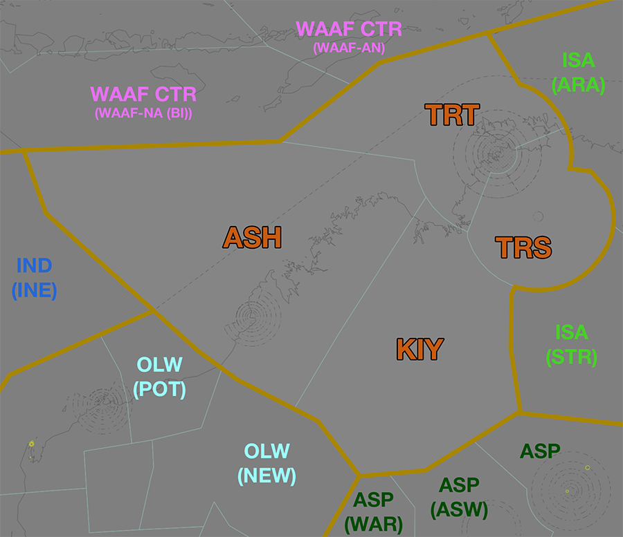
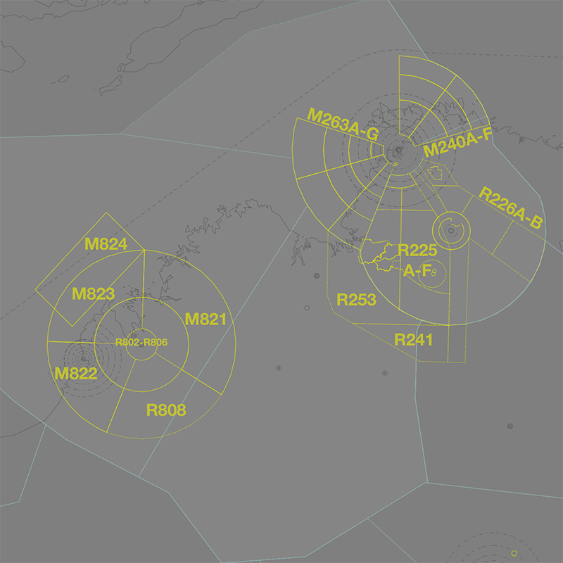
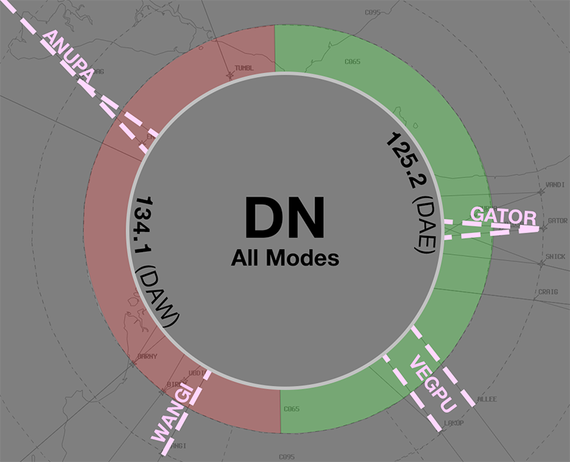

--8<-- "includes/abbreviations.md"

## Positions
| Name                | ID      | Callsign            | Frequency   | Login ID       |
| ------------------- | ------- | ------------------- | ----------- | -------------- |
| **Territory North** | **TRT** | **Brisbane Centre** | **123.850** | **BN-TRT_CTR** |
| Ashmore :material-information-outline:{ title="Non-standard position"}         | ASH | Brisbane Centre | 133.400 | BN-ASH_CTR |
| Kimberley :material-information-outline:{ title="Non-standard position"}       | KIY | Brisbane Centre | 132.100 | BN-KIY_CTR |
| Territory South :material-information-outline:{ title="Non-standard position"} | TRS | Brisbane Centre | 133.200 | BN-TRS_CTR |

!!! abstract "Non-Standard Positions"
    :material-information-outline: Non-standard positions may only be used in accordance with [VATPAC Air Traffic Services Policy](https://vatpac.org/publications/policies){target=new}.  
    Approval must be sought from the **bolded parent position** prior to opening a Non-Standard Position, unless [NOTAMs](https://vatpac.org/publications/notam){target=new} indicate otherwise (eg, for events).

## Airspace

<figure markdown>
{ width="700" }
  <figcaption>Territory Airspace</figcaption>
</figure>

TRT is responsible for **TRS**, **ASH**, and **KIY** when they are offline.  

#### Extending
!!! warning "Important"
    Due to the large geographical area covered by this sector and its neighbours, controllers are reminded of their obligations under the [ATS Policy](https://vatpac.org/publications/policies) when extending. Ensure that you have sufficiently placed visibility points to cover your primary sector and any secondary, extended sectors in their entirety.

### Reclassifications
=== "BRM CTR"
	When **BRM ADC** is offline, BRM CTR (Class D/E `SFC` to `A055`) reverts to Class G, and is administered by ASH. Alternatively, ASH may provide a [top-down procedural service](../../../aerodromes/procedural/Broome) if they wish.

	!!! tip
		If choosing *not* to provide a top down service, consider publishing a pre-formatted **ATIS Zulu** for the aerodrome, to inform pilots about the airspace reclassification.

=== "CIN TCU"
	The restricted airspace around YCIN is classified as Class G by default, and is only reclassified as controlled airspace when **CIA** is online. When **CIA** is offline, the area remains Class G, and is administered by ASH.

=== "TN TCU"
	When **TN TCU** is offline the TN MIL CTR and associated restricted airspace is deactivated, and the airspace is administered by TRS.

	!!! tip
        Consider publishing a pre-formatted **ATIS Zulu** for the aerodrome, to inform pilots about the airspace reclassification.

## Departure and Arrival Procedures
### YBRM
#### Sequencing
All sequencing is performed by ASH.

### YCIN
WRA is responsibile for facilitating operations in and out of YCIN.

### YPDN
#### STAR Assignment
The following subsectors are responsible for issuing STAR clearance.

| Subsector | STAR | Type | Notes |
| ---- | ----- | -------- | ----- |
| TRT  | ANUPA WANGI | All   | |
| TRS  | GATOR VEGPU | All   | Descent not below `F200` until clear of TN TCU |

#### Sequencing
TRT is responsible for sequencing aircraft arriving from the north/west. TRS is responsible for sequencing aircraft arriving from the south/east. Coordination between TRT/TRS should be conducted to ensure that aircraft from each sector are sequenced appropriately with each other.

##### LAHSO
!!! warning "Important"
    Due to its operational complexity, LAHSO **must be authorised by a senior VATPAC staff member or a nominated event coordinator**.

In accordance with the authorisation requirements above, YPDN may utilise LAHSO during exceptionally busy events. Detailed procedures exist to ensure that controllers are aware of their responsibilities when performing LAHSO. See [Controller Skills](../../../controller-skills/runwaymanagement/#lahso) for more information.

### YPTN
#### Sequencing
All sequencing is performed by TRS.

## Local Procedures
### Special Use Airspace

There are multiple volumes of [SUA](../../../controller-skills/sua) within TRT airspace associated with military operations in and out of YCIN, YPDN, and YPTN.

<figure markdown>
{ width="700" }
  <figcaption>Notable SUA in TRT Airspace</figcaption>
</figure>

Each TCU must [give heads up coordination](../../../controller-skills/coordination/#airways-clearance) with the relevant enroute controllers **prior** to any departures intending to operate in a currently inactive SUA.

!!! phraseology
    **TNA** -> **TRS**: "On the groud YPTN, CLAS35, requests activation of R225D `A095-F600`, from 0300 until 0500.”  
    **TRS** -> **TNA**: "CLAS35, expect activation of R225D `A095-F600` at 0300 until 0500."   
    **TNA** -> **TRS**: "CLAS35."   

Non-participating aircraft intending to transit an activated SUA should be rerouted, where possible, [subject to the VATSIM Code of Conduct](../../../sua/#ad-hoc-activations).

#### Bradshaw Field Training Area SUA
The Bradshaw Field Training Area is contained within three volumes of SUA: R268 Koolendong, R269 Angalarri North, and R270 Angalarri South; all `SFC-NOTAM`. The area is used for extensive army training and operations based at Nackaroo Airfield (YNKR). R269 and R270 are wholly located in the TRS subsector, while R268 extends slightly into KIY.

When all three restricted areas are activated, they are referred to collectively as *'Bradshaw'*. Aircraft intending to operate in adjoining SUA should be notified *'[Bradshaw Active](../../terminal/tindal/#bradshaw-delamere-active)'* with their clearance.

#### Delamere Air Weapons Range SUA
The Delamere Air Weapons Range is contained within three volumes of SUA: 

- R211 Delamere (`SFC-A095`)
- R212 Delamere (`SFC-A095`)
- R232 Delamere (`SFC-NOTAM`)

The range is used for a variety of bombing and live-firing training exercises, and is wholly located within the TRS subsector.

When all three restricted areas are activated, they are referred to collectively as *'Delamere'*. Aircraft intending to operate in adjoining SUA should be notified *'[Delamere Active](../../terminal/tindal/#bradshaw-delamere-active)'* with their clearance.

#### M821-M824 Curtin
The M821-M824 Curtin [MOAs](../../../controller-skills/sua/#military-operating-areas) are located over YCIN, `F200-F600`, located entirely in ASH airspace. 

The MOAs directly adjoin the CIN TMA and when CIA is online aircraft will be transferred directly to/from the MOAs. When [CIA is offline](#reclassifications), aircraft will contact ASH for transit through the surrounding civilian airspace.

Aircraft will generally enter and exit the MOA via the appropriate [military gate](../../../terminal/curtin/#military-gates).

##### Affected Civil Operations
When activated, the restricted areas disrupt traffic on the busy **A339**, **A576**,  **T20**, and **T29** high altitude airways which are used by aircraft travelling between Australia and south-east Asia.

Activation also significantly distrupts traffic travelling in and out of YBRM. Aircraft may be given an additional requirement to climb above, or descend below the vertical limits of the activation, or rerouted manually to avoid the area.

#### M277A-H Darwin
The M277A-H Darwin [MOAs](../../controller-skills/sua/#military-operating-areas) are located southwest of YPDN, `NOTAM-NOTAM`. M277A and M277E are entirely within DN TCU airspace, while M277B-D and M277F-H are in TRT airspace.

Aircraft will generally enter and exit the MOA via the appropriate [military gate](../../../terminal/darwin/#military-gates).

##### Affected Civil Operations
Activation of the MOA disrupts traffic on the **J151** high altitude airway, and aircraft departing via the HELLI SID. Aircraft may be given an additional requirement to climb above the vertical limits of the activation, or rerouted manually to avoid the area.

#### M278A-H Darwin
The M278A-H Darwin [MOAs](../../controller-skills/sua/#military-operating-areas) are located northeast of YPDN, `NOTAM-NOTAM`. M278A and M278E are entirely within DN TCU airspace, while M278B-D and M278F-H are in TRT and TRS airspace.

Aircraft will generally enter and exit the MOA via the appropriate [military gate](../../../terminal/darwin/#military-gates).

#### R225A-F and R250 Tindal
The R225A-F and R250 Tindal restricted areas form the western part of the Tindal Flying Training Area, and are located entirely within the TRS subsector. The areas are used for a variety of training purposes, including supersonic flight.

The restricted areas directly adjoin the TN TMA, and aircraft will generally enter and exit the areas via the appropriate [military gate](../../../terminal/tindal/#military-gates)

##### Affected Civil Operations
When activated, the restricted areas distrupt traffic on the **A461** high altitude airway which connects YPDN and YBAS. Aircraft may be given an additional requirement to climb above the vertical limits of the activation, or rerouted manually to avoid the area.

#### R226A-B Tindal
The R226A-B restricted areas are the easternmost segments of the Tindal Flying Training Area, entirely within the TRS subsector.

These areas are rarely activated, with nearly all operations being preferentially conducted in the western [R225A-F and R250 Tindal](#r225a-f-and-r250-tindal) restricted areas.

#### R276B-D Darwin
The R276B-D Darwin [restricted areas](../../controller-skills/sua/#restricted-areas) are located southwest of YPDN, `NOTAM-NOTAM`, in TRT airspace

Aircraft will generally enter and exit the restricted areas via the appropriate [military gate](../../../terminal/darwin/#military-gates).

##### Affected Civil Operations
Activation of the restricted areas disrupts traffic on the **J72** high altitude airway, and aircraft arriving via the WANGI STAR. Aircraft may be given an additional requirement to remain above the vertical limits of the activation, or rerouted manually to avoid the area.

!!! phraseology
	*QFA848 has been assigned the WANGI STAR for Runway 11 into YPDN, and is approaching their top of descent. The R276B-C restricted area has been activated `SFC-F150`.*   
    **TRT**: "QFA848, descend via STAR to `F160`, cancel level restriction at KIGOS."   
    **QFA848**: "Descend via STAR to `F160`, cancel level restriction at KIGOS, QFA848."  

!!! warning "Important"
    Before cancelling a STAR level restriction, coordinate with **DN TCU** to ensure no additional conflicts are inadvertently created.

## STAR Clearance Expectation
### Handoff
Aircraft being transferred to the following sectors shall be told to Expect STAR Clearance on handoff:

| Transferring Sector | Receiving Sector | ADES | Notes |
| ---- | -------- | --------- | --------- |
| ASH, KIY | TRT, TRS | YPDN | |

## Terminal Handover Frequencies
Aircraft being transferred from enroute to a TCU with multiple frequencies shall be given the frequency for the revelant TCU position.
		
=== "DN TCU"
	<figure markdown>
	{ width="500" }
	  <figcaption>DN TCU Handover Frequencies</figcaption>
	</figure>

	| STAR  | Frequency (Controller) |
	| ----- | ---------------------- |
	| ANUPA | **134.100** (DAW)      |
	| GATOR | **125.200** (DAE)      |
	| VEGPU | **125.200** (DAE)      |
	| WANGI | **134.100** (DAW)      |
	
	!!! tip
		The quick reference tables above only include scenarios for which there is [voiceless coordination](#dn-tcu). Refer to the diagram for the appropriate position/frequency for coordination and handoff for all other situations.

## Coordination
### Enroute
As per [Standard coordination procedures](../../../controller-skills/coordination/#enr-enr), Voiceless, no changes to route or CFL within **50nm** to boundary.

### TRT Internal
As per [Standard coordination procedures](../../../controller-skills/coordination/#enr-enr), Voiceless, no changes to route or CFL within **50nm** to boundary.

### DN TCU
#### Airspace
#### Airspace
DN TCU owns the Class C and G airspace within 40 DME DN from `SFC` to `F180`.

#### Arrivals/Overfliers
Voiceless for all aircraft:

- With ADES **YPDN**; and  
- Assigned a STAR; and  
- Assigned `A100`

All other aircraft coming from TRT CTA must be **Heads-up** Coordinated to DN TCU prior to **20nm** from the boundary.

#### Departures
Voiceless for all aircraft:

- Tracking via a Procedural SID terminus; and  
- Assigned the lower of `F180` or the `RFL`

All other aircraft going to TRT CTA will be **Heads-up** Coordinated by DN TCU.

### BRM ADC
#### Airspace
BRM ADC is responsible for the Class D airspace `SFC` to `A055`, as well as the Class E airspace `1200ft AGL` to `A055`, within the BRM CTR.

#### Departures
[Next](../../../controller-skills/coordination/#next) coordination is required from BRM ADC to TRT(ASH) for all aircraft **entering TRT(ASH) CTA**.

The Standard Assignable level from **BRM ADC** to **TRT(ASH)** is:

| Aircraft | Level |
| ---- | ---- |
| All | The lower of `A050` and `RFL` |

#### Arrivals/Overfliers
YBRM arrivals and overfliers shall be heads-up coordinated to **BRM ADC** from TRT prior to **5 mins** from the boundary.

!!! phraseology
    **TRT** -> **BRM ADC**: "Via SAFIR, FD621”  
    **BRM ADC** -> **TRT**: "FD621"  

The Standard Assignable level from TRT(ASH) to BRM ADC is `A060`, any other level must be prior coordinated.

### CIN TCU
#### Airspace
The limits of the CIN TCU are `SFC` to `F200` within 25 DME CIN. This may be amended by NOTAM.

#### Arrivals/Overfliers
The Standard assignable level from ASH to CIN TCU is `F130`, tracking via CIN VOR.

All other aircraft must be voice coordinated to CIN TCU prior to **20nm** from the boundary.

#### Departures
The Standard Assignable level from CIN TCU to ASH is `F190`, and tracking via their planned route.

#### CIN ADC
When CIN TCU is offline, coordination is not required between ASH and CIN ADC. Aircraft entering CIN ADC airspace shall be handed off, and instructed to contact CIN ADC for onwards clearance.

CIN ADC owns the Class C airspace within the CIN MIL CTR from `SFC` to `A015`.

### TN TCU
#### Airspace
Any airspace releases from the default setup must be coordinated and agreed upon with TRT(TRS). It is also good practice to remind them of any airspace releases that may be active due to NOTAMs.

#### Departures
Voiceless for all aircraft:

- Tracking via a Procedural SID terminus; and  
- Assigned the lower of `F180` or the `RFL`

All other aircraft going to TRS CTA must be **Heads-up** Coordinated by TN TCU prior to the boundary.

!!! phraseology
    **TN TCU** -> **TRS**: "DRGN48, request DCT BEBEX"  
    **TRS** -> **TN TCU**: "DRGN48, concur DCT BEBEX"  

#### Arrivals/Overfliers
Voiceless for all aircraft:

- Tracking via **TN**; and  
- Assigned the lower of `F130` or the `RFL`.

All other aircraft coming from TRS CTA will be **Heads-up** Coordinated to TN TCU.

!!! phraseology
    **TRS** -> **TN TCU**: "via NOLEK, FD858"  
    **TN TCU** -> **TRS**: "FD858, F150" 

### IND(INE) (Oceanic)
As per [Standard coordination procedures](../../../controller-skills/coordination/#pacific-units), Voiceless, no changes to route or CFL within **15 mins** to boundary.

Aircraft must have their identification terminated and be instructed to make a position report on first contact with the next (procedural) sector.

!!! phraseology
    **ISA**: "QFA121, identification terminated, report position to Brisbane Radio, 129.25"

### International (WAAF)
As per [Standard coordination procedures](../../../controller-skills/coordination/#other-units), Heads-up Coordination required for all aircraft prior to **30 mins** from boundary.

!!! phraseology
    **TRT** -> **WAAF CTR**: "Estimate, SIA236, KIKEM time 21, F320"  
    **WAAF CTR** -> **TRT**: "SIA236, F320"