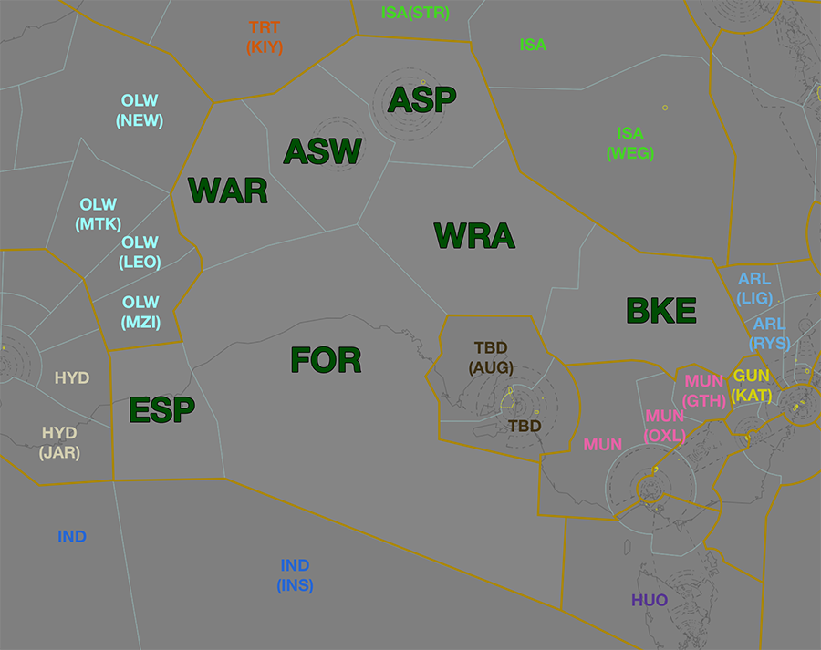
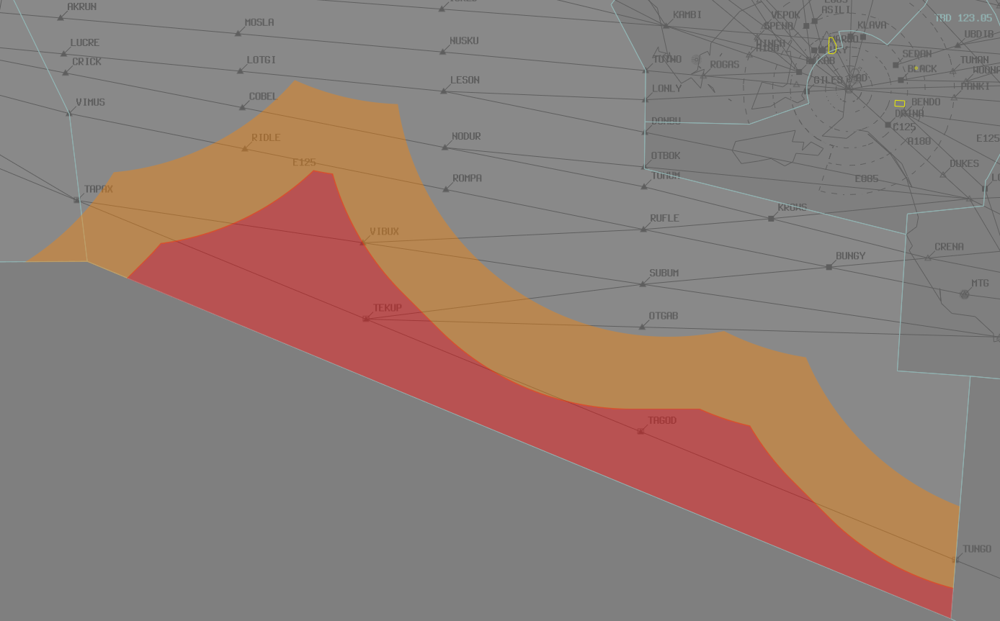
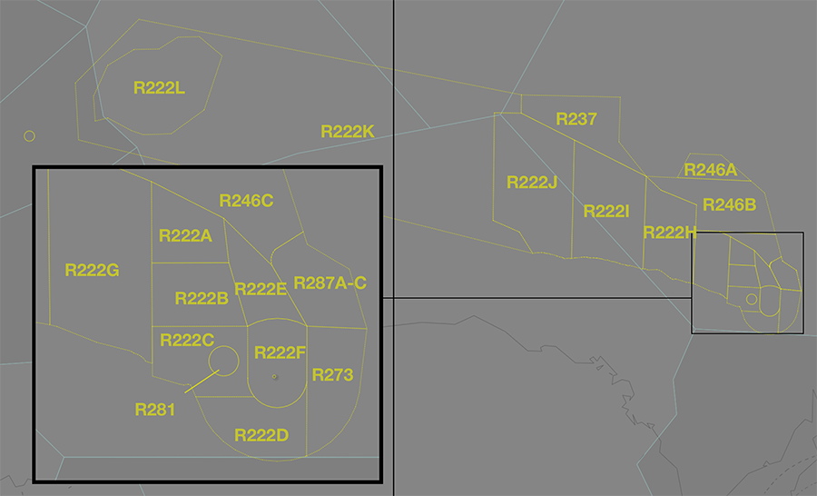

--8<-- "includes/abbreviations.md"
## Positions

| Name                | ID      | Callsign             | Frequency   | Login ID       |
| ------------------- | ------- | -------------------- | ----------- | -------------- |
| **Alice Springs**   | **ASP** | **Melbourne Centre** | **128.850** | **ML-ASP_CTR** |
| Alice Springs West :material-information-outline:{ title="Non-standard position"} | ASW | Melbourne Centre | 131.800 | ML-ASW_CTR |
| Bourke :material-information-outline:{ title="Non-standard position"}             | BKE | Melbourne Centre | 128.200 | ML-BKE_CTR |
| Esperance :material-information-outline:{ title="Non-standard position"}          | ESP | Melbourne Centre | 123.950 | ML-ESP_CTR |
| Forrest :material-information-outline:{ title="Non-standard position"}            | FOR | Melbourne Centre | 132.700 | ML-FOR_CTR |
| Warburton :material-information-outline:{ title="Non-standard position"}          | WAR | Melbourne Centre | 124.900 | ML-WAR_CTR |
| Woomera :material-information-outline:{ title="Non-standard position"}            | WRA | Melbourne Centre | 132.900 | ML-WRA_CTR |

!!! abstract "Non-Standard Positions"
    :material-information-outline: Non-standard positions may only be used in accordance with [VATPAC Air Traffic Services Policy](https://vatpac.org/publications/policies){target=new}.  
    Approval must be sought from the **bolded parent position** prior to opening a Non-Standard Position, unless [NOTAMs](https://vatpac.org/publications/notam){target=new} indicate otherwise (eg, for events).

### CPDLC
The Primary Communication Method for ASP is [CPDLC](../../../client/cpdlc). Voice may be used in lieu when applicable. The CPDLC Station Code is `YASP`.

## Airspace

<figure markdown>
{ width="700" }
  <figcaption>Alice Springs Airspace</figcaption>
</figure>

**AS ADC** is responsible for the Class D airspace `SFC` to `A045`, as well as the Class C airspace `A045` to `A065`, within the AS CTR.

## Extending
!!! warning "Important"
    Due to the large geographical area covered by this sector and it's neighbours, controllers are reminded of their obligations under the [ATS Policy](https://vatpac.org/publications/policies) when extending. Ensure that you have sufficiently placed visibility points to cover your primary sector and any secondary, extended sectors in their entirety.

### Reclassifications
=== "AS CTR"
	When **AS ADC** is offline, AS CTR (Class D and C `SFC` to `F125`) within 80 DME AS reverts to Class G, and AS CTA (Class C `F125` to `F245`) within 80 DME AS reverts to Class E, and both are administered by ASP. Alternatively, ASP may provide a [top-down procedural service](../../../aerodromes/Alice) if they wish.

	!!! tip
		If choosing *not* to provide a top down service, consider publishing a pre-formatted **ATIS Zulu** for the aerodrome, to inform pilots about the airspace reclassification.

=== "WR CTR"
	The restricted airspace around YPWR is classified as Class G by default, and is only reclassified as controlled airspace when **WR ADC** is online. When **WR ADC** is offline, the area remains Class G, and is administered by WRA.

## Surveillance Coverage
Limited surveillance coverage exists in the FOR sector greater than **250nm** from ADSB stations. [Procedural Standards](../../../separation-standards/procedural/) must be implemented **prior** to losing surveillance coverage

The **Orange** shaded areas will have limited surveillance coverage **Below F330**.  
The **Red** shaded areas will have limited surveillance coverage at **All Levels**.

<figure markdown>
{ width="700" }
  <figcaption>Forrest Surveillance Coverage</figcaption>
</figure>

## Departure and Arrival Procedures
### YBAS
#### Sequencing
All sequencing is performed by ASP.

### YPWR
WRA is responsibile for facilitating operations in and out of YPWR.

## Local Procedures
### Special Use Airspace
There are multiple volumes of [SUA](../../controller-skills/sua) within ASP airspace, mostly associated with military operations in and out of YPWR.

<figure markdown>
{ width="700" }
  <figcaption>Notable SUA in ASP Airspace</figcaption>
</figure>

When **WR ADC** is online, **R222F** Restricted Area is activated `SFC` to `F120` by default. WR ADC must [give heads up coordination](../../aerodrome/procedural/Woomera/#sua-in-enroute-airspace) with the relevant enroute controllers **prior** to any departures intending to operate in a currently inactive SUA.

!!! phraseology
    **WAL** -> **ARL**: "On the groud YWLM, PTHR11, requests activation of R560A `A085-F240`, from 0300 until 0500.”  
    **ARL** -> **WAL**: "PTHR11, expect activation of R560A `A085-F240` at 0300 until 0500."   
    **WAL** -> **ARL**: "PTHR11."  

Non-participating aircraft intenting to transit an activated SUA should be rerouted, where possible, [subject to the VATSIM Code of Conduct](../../sua/#ad-hoc-activations).

#### Woomera SUA
There are multiple restricted areas associated with military operations at [YPWR](../../../aerodromes/procedural/Woomera): R222A-J, R237, R246A-C, R273, R281, and R287A-C. All restricted areas are located with the WRA subsector, and two (R22I and R22J) extend into FOR airspace.

These restricted areas directly adjoin the jurisdiction of WR ADC, and when WR ADC is online aircraft will be transferred directly to/from the MOAs.

##### Affected Civil operations
When activated these restricted areas distrupt traffic on the **J141**, **J251**, **T20**, **T21** and **T29** high airways, which connect YPAD to the Northern Territory and are often used by transcontinental flights to and from the east coast. Activation also significantly distrupts traffic on the **W238**, **W274**, **W617**, **W764** low airways and traffic around YCBP and YOLD.

Aircraft transiting the area should be rerouted via the **Z90**, **Z91**, **Z92**, and **Z93** as required.

## STAR Clearance Expectation
### Handoff
Aircraft being transferred to the following sectors shall be told to Expect STAR Clearance on handoff:

| Transferring Sector | Receiving Sector | ADES | Notes |
| ---- | -------- | --------- | --------- |
| FOR, WRA, BKE | TBD(AUG) | YPAD, YPED | Jets only |
| BKE | TBD | YPAD, YPED | |
| ESP | HYD | YPPH, YPEA | Jets only |
| BKE | GUN(KAT), MUN(GTH) | YSSY | |

## Coordination
### Enroute
As per [Standard coordination procedures](../../../controller-skills/coordination/#enr-enr), Voiceless, no changes to route or CFL within **50nm** to boundary.

### ASP Internal
As per [Standard coordination procedures](../../../controller-skills/coordination/#enr-enr), Voiceless, no changes to route or CFL within **50nm** to boundary.

### AS ADC
#### Airspace
AS ADC is responsible for the Class D airspace `SFC` to `A045`, as well as the Class C airspace `A045` to `A065`, within the AS CTR.

Refer to [Reclassifications](#reclassifications) for operations when AS ADC is offline.

#### Departures
[Next](../../controller-skills/coordination.md#next) coordination is required from AS ADC to ASP for all aircraft **entering ASP CTA**.

The Standard Assignable level from **AS ADC** to **ASP** is:

| Aircraft | Level |
| ---- | ---- |
| All | The lower of `A070` and `RFL` |

#### Arrivals/Overfliers
YBAS arrivals and overfliers shall be heads-up coordinated to **AS ADC** from ASP prior to **5 mins** from the boundary.

!!! phraseology
    **ASP** -> **AS ADC**: "Via SADEL, QFA1956”  
    **AS ADC** -> **ASP**: "QFA1956"  

The Standard Assignable level from ASP to **AS ADC** is `A080`, any other level must be prior coordinated.

### WR ADC
#### Airspace
WR ADC is responsible for the Class D airspace `SFC` to `F120` within the R222F [restricted area](../../../sua/#restricted-areas).

Refer to [Reclassifications](#reclassifications) for operations when WR ADC is offline.

### Departures
Next coordination is not required from WR ADC to ASP(WRA). 

Aircraft leaving WR ADC airspace both **laterally** and **vertically** will enter ASP(WRA) uncontrolled airspace. However, it is good practice for WR ADC to provide [heads-up](../../controller-skills/coordination/#heads-up) coordination for aircraft leaving WR ADC airspace **vertically** to help faciltiate an uninterrupted climb.

!!! phraseology
    **WR ADC** -> **WRA**: "via WR 180 bearing outbound, LYBD11.”  
    **WRA** -> **WR ADC**: "LYBD11, `F240`, no reported traffic."   
    **WR ADC** -> **WRA**: "`F240`, LYBD11."  

    **WR ADC**: "LYBD11, leave and re-enter controlled airspace on climb to `F240`, no reported IFR traffic"  
    **LYBD11**: "Leave and re-enter controlled airspace on climb to `F240`, LYBD11" 
 
### Arrivals/Overfliers
As with departures, there is no inherent requirement for ASP(WRA) to coordinate arrivals or overfliers with WR ADC. However, it is good practice for ASP(WRA) to provide [heads-up](../../controller-skills/coordination/#heads-up) coordination for aircraft arriving into directly into WR ADC airspace. 

Arriving aircraft shall be instructed to leave CTA descending (if appropriate) and to contact WR ADC for clearance.

### IND(INS) (Oceanic)
As per [Standard coordination procedures](../../../controller-skills/coordination/#pacific-units), Voiceless, no changes to route or CFL within **15 mins** to boundary.

Aircraft must have their identification terminated and be instructed to make a position report on first contact with the next (procedural) sector.

!!! phraseology
    **ASP**: "QFA121, identification terminated, report position to Brisbane Radio, 129.25"