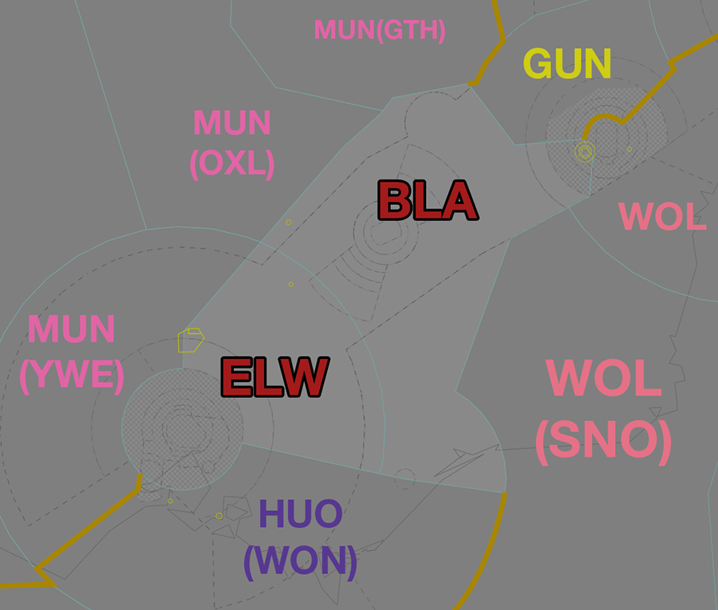
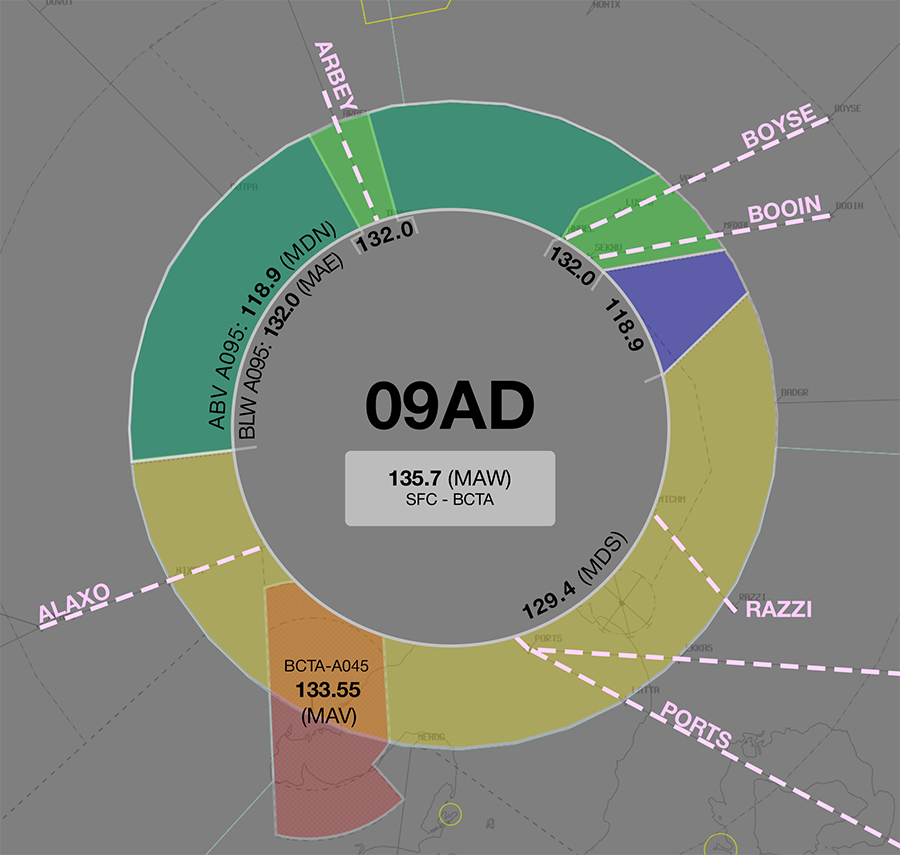
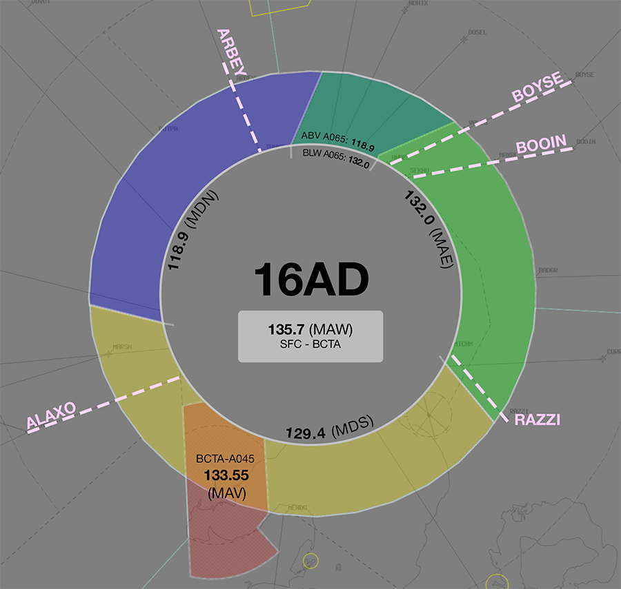
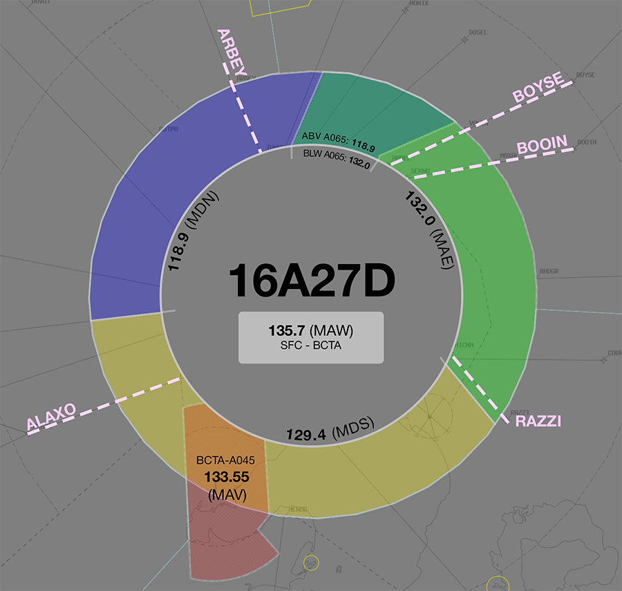
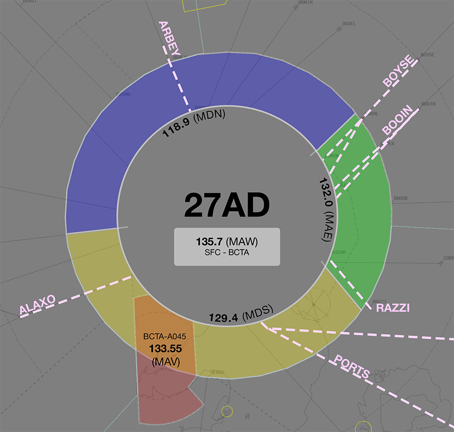
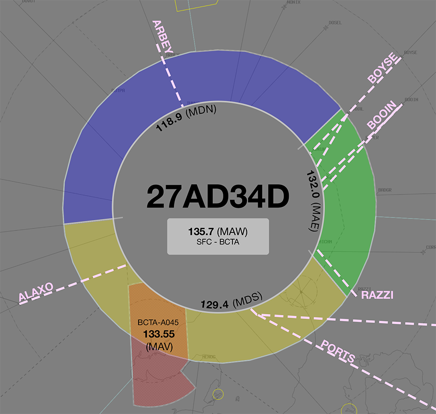
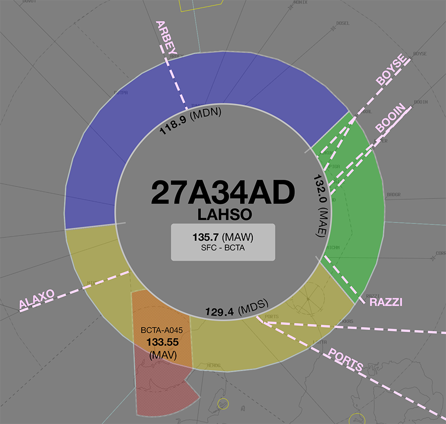

--8<-- "includes/abbreviations.md"
## Positions

| Name                | ID      | Callsign             | Frequency   | Login ID       |
| ------------------- | ------- | -------------------- | ----------- | -------------- |
| **Benalla**         | **BLA** | **Melbourne Centre** | **132.200** | **ML-BLA_CTR** |
| Eildon Weir :material-information-outline:{ title="Non-standard position"} | Melbourne Centre | ELW | 123.750 | ML-ELW_CTR |

!!! abstract "Non-Standard Positions"
    :material-information-outline: Non-standard positions may only be used in accordance with [VATPAC Air Traffic Services Policy](https://vatpac.org/publications/policies){target=new}.  
    Approval must be sought from the **bolded parent position** prior to opening a Non-Standard Position, unless [NOTAMs](https://vatpac.org/publications/notam){target=new} indicate otherwise (eg, for events).

### CPDLC
The Primary Communication Method for BLA is Voice. [CPDLC](../../../client/cpdlc) may be used in lieu when applicable. The CPDLC Station Code is `YBLA`.

## Airspace

<figure markdown>
{ width="700" }
  <figcaption>Benalla Airspace</figcaption>
</figure>

### Reclassifications
=== "AY CTR"
	When **AY ADC** is offline, AY CTR (Class D and C `SFC` to `A085`) reverts to Class G, and is administered by BLA. Alternatively, BLA may provide a [top-down procedural service](../../../aerodromes/Albury) if they wish.

	!!! tip
		If choosing *not* to provide a top down service, consider publishing a pre-formatted **ATIS Zulu** for the aerodrome, to inform pilots about the airspace reclassification.
	
=== "CB TCU"
	When **CB TCU** is offline, CB TCU (Class C `SFC` to `A085`) reverts to Class G, and is administered by WOL.

	!!! note
		BLA does not assume the CB TCU in the absence of a CB TCU controller. Assumption of the CB TCU is the responsibility of WOL. Controllers may choose to verbally coordinate the release of the CB TCU to either sector/subsector.
	
=== "ES TCU"
	When **ESA** is offline, the restricted airspace within R360 is deactivated and the airspace is administered by BLA and HUO(WON). 

	!!! note
		BLA does not assume the ES TCU in the absence of ESA. Assumption of the ES TCU is the responsibility of HUO(WON). Controllers may choose to verbally coordinate the release of the ES TCU to either sector/subsector.

## Departure and Arrival Procedures
### YMAV
#### STAR Assignment
The following subsectors are responsible for issuing STAR clearance.

| Subsector | STAR | Type | Notes |
| ---- | ----- | -------- | ----- |
| BLA  | JAYBI, ML Trans | Jet     | Descent not below `F250` |
| ELW  | JAYBI, ML Trans | Non-Jet |       |

Arrivals from the northeast shall be given initial descent to not below `F250`. **ELW** will issue final descent.

#### Sequencing
Sequencing arrivals from the northeast into YMAV is a joint responsibility of BLA and ELW. Initial sequencing actions for aircraft from the north should be performed by BLA, with fine tuning and any holding required issued by ELW.

### YMAY
#### Sequencing
All sequencing is performed by BLA.

### YMEN
#### Sequencing
All sequencing, including ascertaining arrival intentions, is performed by ELW.

### YMES
BLA and ELW share responsibility for facilitating operations at YMES departing to/arriving from the north.

### YMML
#### STAR Assignment
The following subsectors are responsible for issuing STAR clearance.

| Subsector | STAR | Type | Notes |
| ---- | ----- | -------- | ----- |
| BLA  | BOOIN | Jet     | Descent not below `F250` |
| ELW  | BOYSE | Non-Jet |       |

Arrivals from the northeast shall be given initial descent to not below `F250`. **ELW** will issue final descent.

#### Sequencing
Sequencing arrivals from the northeast into YMML is a joint responsibility of BLA and ELW. Initial sequencing actions for aircraft from the north should be performed by BLA, with fine tuning and any holding required issued by ELW. 

##### Adjacent Feeder Fixes
Aircraft assigned the **same runway** inbound via **BOOIN** and **BOYSE**, must be considered to be on the **same STAR** for sequencing purposes. That is, they must be at least **2 minutes** apart at their respective Feeder fixes.

##### Predictable Sequencing Waypoints
There are four [Predictable Sequencing](../../../controller-skills/sequencing/#predictable-sequencing) waypoints available for aircraft inbound YMML via **Q29**, located south of the airway.

The table below contains the estimated time from the initial waypoint to the final waypoint **via the CDO waypoint**.

=== "Q29"
    | Initial Waypoint | CDO Waypoint | Final Waypoint | Delay (in mins) |
    | ---------------- | ------------ | -------------- | --------------- |
    | ANLID | DOVEX | BULLA | 2 |
    | ANLID | TOPUL | BULLA | 4 |
    | ANLID | UNSIG | BULLA | 6 |
    | ANLID | NILEV | BULLA | 8 | 

##### Holding Fixes
Refer to the vatSys Enroute Holds map for details of published holds on the airways inbound to YMML. Where delays necessitate holding, aircraft should be instructed to hold at the following positions. The listed time should be subtracted from an aircraft's assigned feeder fix time to determine when they should leave the hold.

| Feeder Fix | Holding Fix | Time from Hold to Feeder Fix |
| ---- | ---- | ---- |
| BOOIN | LUVAS | 3 min |
| BOYSE | TEMIS | 2 min |

!!! tip
    Additional holding may be performed at upstream holding fixes to reduce controller workload. This is particularly useful when non-standard child sectors have been opened, allowing aircraft to absorb some of their delay in the previous sector. 

##### LAHSO
!!! warning "Important"
    Due to its operational complexity, LAHSO **must be authorised by a senior VATPAC staff member or a nominated event coordinator**.

In accordance with the authorisation requirements above, YMML may utilise LAHSO during exceptionally busy events. Detailed procedures exist to ensure that controllers are aware of their responsibilities when performing LAHSO. See [Controller Skills](../../controller-skills/runwaymanagement.md#lahso) for more information.

### YSCB
#### STAR Assignment
The following subsectors are responsible for issuing STAR clearance.

| Subsector | STAR | Type | Notes |
| ---- | ----- | -------- | ----- |
| BLA  | MANDA (RWY 17) POLLI (RWY 35) | All |      |

##### POLLI Transitions
When Runway 35 is in use at YSCB, by default, vatSys will select the POLLI STAR with the **ARRAN** transition. Aircraft that have planned via EBONY and ARRAN (ie, aircraft on the Y59 airway) need to be assigned the POLLI STAR with the **EBONY** transition. This can be manually overridden in the aircraft's flight plan as shown below:

<figure markdown>
{ width="500" }
  <figcaption>POLLI STAR with ARRAN transition</figcaption>
</figure>

<figure markdown>
{ width="500" }
  <figcaption>POLLI STAR with EBONY transition</figcaption>
</figure>

#### Sequencing
Sequencing arrivals from the southwest into YSCB is a responsibility of BLA.

##### Holding Fixes
Refer to the vatSys Enroute Holds map for details of published holds on the airways inbound to YSCB. Where delays necessitate holding, aircraft should be instructed to hold at the following positions. The listed time should be subtracted from an aircraft's assigned feeder fix time to determine when they should leave the hold.

| Feeder Fix | Holding Fix | Time from Hold to Feeder Fix |
| ---- | ---- | ---- |
| MANDA | NONUP | Jets: 3 min Non-Jets: 4 min |
| Others | Feeder Fix | - |

## STAR Clearance Expectation
### Handoff
Aircraft being transferred to the following sectors shall be told to Expect STAR Clearance on handoff:

| Transferring Sector | Receiving Sector | ADES | Notes |
| ---- | -------- | --------- | --------- |
| BLA | GUN | YSSY | |
| ELW | BLA | YSCB | |
| BLA | ELW | YMML | Non-Jets only |

## Terminal Handover Frequencies
Aircraft being transferred from enroute to a TCU with multiple frequencies shall be given the frequency for the revelant TCU position.

=== "ML TCU"
	=== "09AD"
		<figure markdown>
		{ width="500" }
		  <figcaption>ML TCU Handover Frequencies - 09AD Mode</figcaption>
		</figure>

		| ADES | STAR  | Frequency (Controller) |
		| ---- | ----- | ---------------------- |
		| YMML | ALAXO | **129.400** (MDS)      |
		| YMML | ARBEY | **132.000** (MAE)      |
		| YMML | BOOIN | **132.000** (MAE)      |
		| YMML | BOYSE | **132.000** (MAE)      |
		| YMML | PORTS | **129.400** (MDS)      |
		| YMML | RAZZI | **129.400** (MDS)      | 

	=== "09A16D"
		<figure markdown>
		{ width="500" }
		  <figcaption>ML TCU Handover Frequencies - 09A16D Mode</figcaption>
		</figure>
		
		| ADES | STAR  | Frequency (Controller) |
		| ---- | ----- | ---------------------- |
		| YMML | ALAXO | **129.400** (MDS)      |
		| YMML | ARBEY | **132.000** (MAE)      |
		| YMML | BOOIN | **132.000** (MAE)      |
		| YMML | BOYSE | **132.000** (MAE)      |
		| YMML | PORTS | **129.400** (MDS)      |
		| YMML | RAZZI | **129.400** (MDS)      | 

	=== "16AD"
		<figure markdown>
		{ width="500" }
		  <figcaption>ML TCU Handover Frequencies - 16AD Mode</figcaption>
		</figure>
		
		| ADES | STAR  | Frequency (Controller) |
		| ---- | ----- | ---------------------- |
		| YMML | ALAXO | **129.400** (MDS)      |
		| YMML | ARBEY | **118.900** (MDN)      |
		| YMML | BOOIN | **132.000** (MAE)      |
		| YMML | BOYSE | **132.000** (MAE)      |
		| YMML | RAZZI | **132.000** (MAE)      | 

	=== "16A27D"
		<figure markdown>
		{ width="500" }
		  <figcaption>ML TCU Handover Frequencies - 16A27D Mode</figcaption>
		</figure>
		
		| ADES | STAR  | Frequency (Controller) |
		| ---- | ----- | ---------------------- |
		| YMML | ALAXO | **129.400** (MDS)      |
		| YMML | ARBEY | **118.900** (MDN)      |
		| YMML | BOOIN | **132.000** (MAE)      |
		| YMML | BOYSE | **132.000** (MAE)      |
		| YMML | RAZZI | **132.000** (MAE)      | 

	=== "27AD"
		<figure markdown>
		{ width="500" }
		  <figcaption>ML TCU Handover Frequencies - 27AD Mode</figcaption>
		</figure>
		
		| ADES | STAR  | Frequency (Controller) |
		| ---- | ----- | ---------------------- |
		| YMML | ALAXO | **129.400** (MDS)      |
		| YMML | ARBEY | **118.900** (MDN)      |
		| YMML | BOOIN | **132.000** (MAE)      |
		| YMML | BOYSE | **132.000** (MAE)      |
		| YMML | RAZZI | **132.000** (MAE)      | 

	=== "27AD34D"
		<figure markdown>
		{ width="500" }
		  <figcaption>ML TCU Handover Frequencies - 27AD34D Mode</figcaption>
		</figure>
		
		| ADES | STAR  | Frequency (Controller) |
		| ---- | ----- | ---------------------- |
		| YMML | ALAXO | **129.400** (MDS)      |
		| YMML | ARBEY | **118.900** (MDN)      |
		| YMML | BOOIN | **132.000** (MAE)      |
		| YMML | BOYSE | **132.000** (MAE)      |
		| YMML | RAZZI | **132.000** (MAE)      | 

	=== "34AD"
		<figure markdown>
		{ width="500" }
		  <figcaption>ML TCU Handover Frequencies - 34AD Mode</figcaption>
		</figure>
		
		| ADES | STAR  | Frequency (Controller) |
		| ---- | ----- | ---------------------- |
		| YMML | ALAXO | **129.400** (MDS)      |
		| YMML | ARBEY | **118.900** (MDN)      |
		| YMML | BOOIN | **132.000** (MAE)      |
		| YMML | BOYSE | **132.000** (MAE)      |
		| YMML | PORTS | **129.400** (MDS)      |
		| YMML | RAZZI | **132.000** (MAE)      | 

	=== "27A34AD (LAHSO)"
		<figure markdown>
		{ width="500" }
		  <figcaption>ML TCU Handover Frequencies - 27A34AD Mode</figcaption>
		</figure>
		
		| ADES | STAR  | Frequency (Controller) |
		| ---- | ----- | ---------------------- |
		| YMML | ALAXO | **129.400** (MDS)      |
		| YMML | ARBEY | **118.900** (MDN)      |
		| YMML | BOOIN | **132.000** (MAE)      |
		| YMML | BOYSE | **132.000** (MAE)      |
		| YMML | PORTS | **129.400** (MDS)      |
		| YMML | RAZZI | **132.000** (MAE)      |

	!!! tip
		The quick reference tables above only include scenarios for which there is [voiceless coordination](#ml-tcu). Refer to the diagram for the appropriate position/frequency for coordination and handoff for all other situations.
		
=== "CB TCU"
	=== "All"
		<figure markdown>
		{ width="500" }
		  <figcaption>CB TCU Handover Frequencies</figcaption>
		</figure>

		| STAR  | Frequency (Controller) |
		| ----- | ---------------------- |
		| AVBEG | **125.900** (CBW)      |
		| BUNGO | **124.500** (CBE)      |
		| LEECE | **124.500** (CBE)      |
		| MANDA | **125.900** (CBW)      |
		| POLLI | **125.900** (CBW)      |
	
	!!! tip
		The quick reference tables above only include scenarios for which there is [voiceless coordination](#cb-tcu). Refer to the diagram for the appropriate position/frequency for coordination and handoff for all other situations.

## Coordination
### CB TCU
#### Airspace
The Vertical limits of the CB TCU are `SFC` to `F245`.

Refer to [Canberra TCU Airspace Division](../../../terminal/canberra/#airspace-division) for information on airspace divisions when **CBW** is online.

Refer to [Reclassifications](#cb-ctr) for operations when CB TCU is offline.

#### Arrivals/Overfliers
Voiceless for all aircraft:

- With ADES **YSCB**; and  
- Assigned a STAR; and  
- Assigned `F130`

All other aircraft coming from BLA CTA must be **Heads-up** Coordinated to CB TCU prior to **20nm** from the boundary.

!!! note
    These coordination requirements apply to aircraft entering the CB TCU, even if the airspace is owned by WOL

#### Departures
Voiceless for all aircraft:
 
- Tracking via a Procedural SID terminus; and  
- Assigned the lower of `F240` or the `RFL`

All other aircraft going to BLA CTA will be **Heads-up** Coordinated by CB TCU.

### ML TCU
#### Airspace
The Vertical limits of the ML TCU are `SFC` to `F245`.

Refer to [Melbourne TCU Airspace Division](../../../terminal/melbourne/#airspace-division) for information on airspace divisions when **MDN** and/or **MDS** are online.

#### Arrivals/Overfliers
Voiceless for all aircraft:

- With ADES **YMML**; and  
- Assigned a STAR; and  
- Assigned `A090`

All other aircraft coming from ELW CTA must be **Heads-up** Coordinated to ML TCU prior to **20nm** from the boundary.

#### Departures
Voiceless for all aircraft:

- Tracking via **MNG**, **NONIX**, or **DOSEL**; and  
- Assigned the lower of `F240` or the `RFL`

All other aircraft going to ELW CTA will be **Heads-up** Coordinated by ML TCU.

### Enroute
As per [Standard coordination procedures](../../../controller-skills/coordination/#enr-enr), Voiceless, no changes to route or CFL within **50nm** to boundary.

That being said, it is *advised* that BLA give **Heads-up Coordination** prior to **50nm** from the boundary in the following scenarios:  
- BLA to GUN for aircraft **not** on the Y59 or W817 airway*  
- ELW to MUN(YWE) and HUO(WON) for all aircraft  
- BLA to MUN(OXL/GTH) and WOL for all aircraft  

!!! tip
    **BLA** should aim to handoff aircraft as soon as possible to **GUN**, so they can issue STAR clearance and commence sequencing. Remember, As per [Standard coordination procedures](../../../controller-skills/coordination/#handoffs), the Receiving sector may turn the aircraft 45° left or right and climb/descend to any level. So if required, nominate a restriction.

### BLA Internal
As per [Standard coordination procedures](../../../controller-skills/coordination/#enr-enr), Voiceless, no changes to route or CFL within **20nm** (reduced from 50nm) to boundary.

That being said, it is *advised* that ELW/BLA give **Heads-up Coordination** prior to **20nm** from the boundary in the following scenarios:  
- ELW to BLA for aircraft **not** on the Y59, H66, or W569 airway (Changes permitted up to boundary for sequencing/descent purposes)  
- BLA to ELW for aircraft **not** on the Q29 or V169 airway (Changes permitted up to boundary for sequencing/descent purposes)  

### ES TCU
#### Departures
Voiceless for all aircraft:

- Tracking via a Procedural SID terminus; and  
- Assigned the lower of `F200` or the `RFL`

All other aircraft going to ELW CTA must be **Heads-up** Coordinated by ES TCU prior to the boundary. 

#### Arrivals
Voiceless for all aircraft:

- With ADES **YMES**; and
- Assigned `A100`

All other aircraft coming from ELW CTA will be **Heads-up** Coordinated to ES TCU.

### AY ADC
#### Airspace
AY ADC is responsible for the Class D airspace in the AY CTR `SFC` to `A045`.

Refer to [Reclassifications](#ay-ctr) for operations when AY ADC is offline.

#### Departures
[Next](../../controller-skills/coordination.md#next) coordination is required from AY ADC to BLA for all aircraft **entering BLA CTA**.

The Standard Assignable level from **AY ADC** to **BLA** is:

| Aircraft | Level |
| ---- | ---- |
| All | The lower of `A070` and `RFL` |

#### Arrivals
YMAY arrivals shall be heads-up coordinated to **AY ADC** from BLA prior to **5 mins** from the boundary.

!!! phraseology
    **BLA** -> **AY ADC**: "via VEGRU1 arrival, QLK38"  
    **AY ADC** -> **BLA**: "QLK38, VEGRU1 arrival" 

The Standard Assignable level from BLA to **AY ADC** is `A080`.