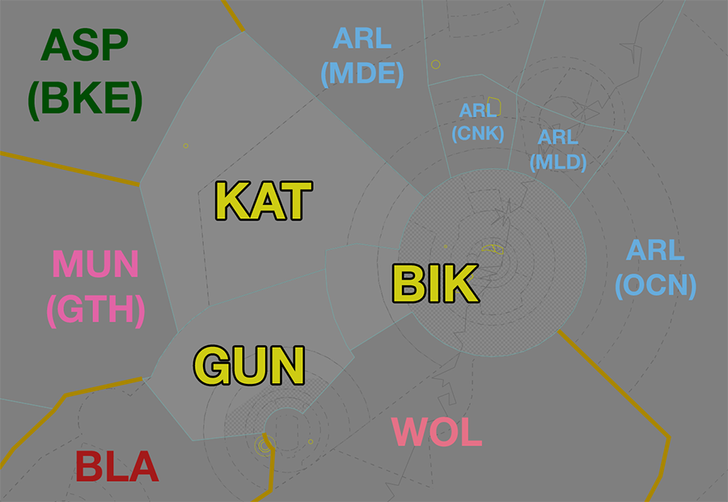

--8<-- "includes/abbreviations.md"
## Positions

| Name                | ID      | Callsign             | Frequency   | Login ID       |
| ------------------- | ------- | -------------------- | ----------- | -------------- |
| **Gundagai**        | **GUN** | **Melbourne Centre** | **133.150** | **ML-GUN_CTR** |
| Bindook :material-information-outline:{ title="Non-standard position"}  | BIK | Melbourne Centre | 129.800 | ML-BIK_CTR |
| Katoomba :material-information-outline:{ title="Non-standard position"} | KAT | Melbourne Centre | 133.500 | ML-KAT_CTR |

!!! abstract "Non-Standard Positions"
    :material-information-outline: Non-standard positions may only be used in accordance with [VATPAC Air Traffic Services Policy](https://vatpac.org/publications/policies){target=new}.  
    Approval must be sought from the **bolded parent position** prior to opening a Non-Standard Position, unless [NOTAMs](https://vatpac.org/publications/notam){target=new} indicate otherwise (eg, for events).

### CPDLC
The Primary Communication Method for GUN is Voice. [CPDLC](../../../client/cpdlc) may be used in lieu when applicable. The CPDLC Station Code is `YGUN`.

## Airspace

<figure markdown>
{ width="700" }
  <figcaption>Gundagai Airspace</figcaption>
</figure>

BIK assumes responsibility of the airspace within 45nm of SY DME above `F285`.  
GUN assumes responsibility of the airspace to the North-West of the CB TCU above `F245`.

### Reclassifications
=== "CB TCU"
	When **CB TCU** is offline, CB TCU (Class C `SFC` to `A085`) reverts to Class G, and is administered by WOL.

	!!! note
		GUN does not assume the CB TCU in the absence of a CB TCU controller. Assumption of the CB TCU is the responsibility of WOL. Controllers may choose to verbally coordinate the release of the CB TCU to either sector/subsector.

## Departure and Arrival Procedures
### YSBK
#### Sequencing
All sequencing, including ascertaining arrival intentions, is performed by BIK.

### YSCN
#### Sequencing
All sequencing, including ascertaining arrival intentions, is performed by BIK.

### YSCB
#### STAR Assignment
The following subsectors are responsible for issuing STAR clearance.

| Subsector | STAR | Type | Notes |
| ---- | ----- | -------- | ----- |
| BIK  | LEECE | Jet      | Descent not below `F290` |
| GUN  | AVBEG | Non-Jet  |       |
| KAT  | AVBEG | Jet      |       |

Arrivals from the northeast shall be given initial descent to not below `F290`. **WOL** will issue final descent.

!!! tip
	For aircraft overflying the SY TMA, place *'O/FLY'* in the LABEL DATA field.

#### Sequencing
Sequencing arrivals into YSCB is a joint responsibility of the subsectors of GUN. For aircraft arriving from the north, initial sequencing actions should be performed by KAT, with fine tuning and any holding required issued by GUN. NIK should perform initial sequencing actions for aircraft arriving from the northeast, before being handed off to WOL for final sequencing actions

##### Holding Fixes
Refer to the vatSys Enroute Holds map for details of published holds on the airways inbound to YSCB. Where delays necessitate holding, aircraft should be instructed to hold at the following positions. The listed time should be subtracted from an aircraft's assigned feeder fix time to determine when they should leave the hold.

| Feeder Fix | Holding Fix | Time from Hold to Feeder Fix |
| ---- | ---- | ---- |
| MANDA | NONUP | Jets: 3 min Non-Jets: 4 min |
| Others | Feeder Fix | - |

### YSRI
GUN and KAT share responsibility for facilitating operations at YSRI departing to/arriving from the west/southwest.

### YSSY
#### STAR Assignment
The following subsectors are responsible for issuing STAR clearance.

| Subsector | STAR | Type | Notes |
| ---- | ----- | -------- | ----- |
| BIK  | [RIVET^](#rivet-odale-assignment) ODALE | Non-Jet |  |
| GUN  | RIVET [ODALE^](#rivet-odale-assignment) | Jet | Descent not below `F250` |
| KAT  | RIVET [ODALE^](#rivet-odale-assignment) | Jet |       |

Arrivals from the southwest shall be given initial descent to not below `F250`. **BIK** will issue final descent.

##### RIVET & ODALE Assignment
By default, Jets should be assigned the **RIVET** STAR, while non-jets should be assigned the **ODALE** STAR.

However, there are situations where the sequence may be improved by assigning the adjacent STAR (e.g. a non-jet assigned the RIVET STAR). This is most common when assigning the alternate runway to an arrival.   
    
Either **SY TCU** or **GUN** may propose utilising the adjacent STAR where two aircraft with significantly different cruise/descent speeds will be required to overtake or pass abeam each other to achieve a sequenced landing time, or if assigned different runways. This technique can allow aircraft to be processed for different runways independently with minimal delay by using the built-in separation afforded by the STAR height requirements.  

In this case, coordination should be conducted to ensure that both controllers agree and no additional conflicts are created as a result (particularly with aircraft inbound from the north/east).

!!! phraseology
    **GUN:** "JST421, amended tracking and STAR available"  
    **JST421:** "JST421, go ahead"  
    **GUN:** "JST421, recleared direct AKMIR thence WELSH, ODALE, for the ODALE7 arrival, runway 34R, maintain FL350"  
    **JST421:** "Recleared direct AKMIR, WELSH, ODALE, for the ODALE7 arrival, runway 34R, maintain FL350, JST421"
	
#### Sequencing
Sequencing arrivals from the west into YSSY is a joint responsibility of GUN and BIK. Initial sequencing actions should be performed by GUN, with fine tuning and any holding required issued by BIK.

Aircraft from the south/west shall be assigned **runway 16R/34L** during PROPS. However, some situations may warrant the use of the alternate runway (16L/34R), such as heavy aircraft operationally requiring the longer runway from the north or large volumes of traffic requiring the use of both runways to minimise delay. In this case, coordination must be conducted with Brisbane Centre or Sydney Flow (if operating) to ensure that the sequence is built in an efficient and orderly way.

!!! phraseology
    **GUN** -> **ARL**: "Southwest of Sydney, VOZ421, with your concurrence will be assigned runway 34R for sequencing"  
    **ARL** -> **GUN**: "Concur, VOZ421 runway 34R, required landing time 22 due sequence from the north"  
    **GUN** -> **ARL**: "Runway 34R, landing time 22, VOZ421"
	
##### Adjacent Feeder Fixes
Aircraft assigned the **same runway** inbound via **RIVET** and **ODALE**, must be considered to be on the **same STAR** for sequencing purposes. That is, they must be at least **2 minutes** apart at their respective Feeder fixes.

##### Holding Fixes
Refer to the vatSys Enroute Holds map for details of published holds on the airways inbound to YSSY. Where delays necessitate holding, aircraft should be instructed to hold at the following positions. The listed time should be subtracted from an aircraft's assigned feeder fix time to determine when they should leave the hold.

| Feeder Fix | Holding Fix | Time from Hold to Feeder Fix |
| ---- | ---- | ---- |
| RIVET | TARAL | 4 min |
| WELSH | AKMIR | 2 min |

!!! tip
    Additional holding may be performed at upstream holding fixes to reduce controller workload. This is particularly useful when non-standard child sectors have been opened, allowing aircraft to absorb some of their delay in the previous sector.

<!--### YSWS--->
### YWLM
[SY TCU is responsible](../../../terminal/sydney/#ywlm-stars) for issuing STARs to aircraft inbound to YWLM via **EKIPU** and **OVLUX**. BIK/KAT shall conduct heads-up coordination with the relevant SY TCU controller to facilitate initial descent.

!!! phraseology
    **BIK** -> **SAS**: "via RIVET, JST472, will be assigned F250"  
    **SAS** -> **BIK**: "JST472, F250" 

## STAR Clearance Expectation
### Handoff
Aircraft being transferred to the following sectors shall be told to Expect STAR Clearance on handoff:

| Transferring Sector | Receiving Sector | ADES | Notes |
| ---- | -------- | --------- | --------- |
| GUN | BLA | YMML | |
| GUN | BLA | YMAV | Jets |

## Terminal Handover Frequencies
Aircraft being transferred from enroute to a TCU with multiple frequencies shall be given the frequency for the revelant TCU position.

=== "SY TCU"
	=== "07AD"
		<figure markdown>
		{ width="500" }
		  <figcaption>SY TCU Handover Frequencies - 07AD Mode</figcaption>
		</figure>
		
	=== "25AD"
		<figure markdown>
		{ width="500" }
		  <figcaption>SY TCU Handover Frequencies - 25AD Mode</figcaption>
		</figure>
	=== "16 PROPS"
		<figure markdown>
		{ width="500" }
		  <figcaption>SY TCU Handover Frequencies - 16 PROPS Mode</figcaption>
		</figure>
	=== "34 PROPS"
		<figure markdown>
		{ width="500" }
		  <figcaption>SY TCU Handover Frequencies - 34 PROPS Mode</figcaption>
		</figure>
	=== "SODPROPS"
		<figure markdown>
		{ width="500" }
		  <figcaption>SY TCU Handover Frequencies - SODPROPS Mode</figcaption>
		</figure>

	| ADES | STAR  | Frequency (Controller) |
	| ---- | ----- | ---------------------- |
	| YSSY | BOREE | **124.400** (SAN)      |
	| YSSY | MARLN | **124.400** (SAN)      |
	| YSSY | MEPIL | **124.400** (SAN)      |
	| YSSY | ODALE | **128.300** (SAS)      |
	| YSSY | RIVET | **128.300** (SAS)      |

	!!! tip
		The quick reference tables above only include scenarios for which there is [voiceless coordination](#sy-tcu). Refer to the diagram for the appropriate position/frequency for coordination and handoff for all other situations.
		
=== "CB TCU"
	=== "All"
		<figure markdown>
		{ width="500" }
		  <figcaption>CB TCU Handover Frequencies</figcaption>
		</figure>

		| STAR  | Frequency (Controller) |
		| ----- | ---------------------- |
		| AVBEG | **125.900** (CBW)      |
		| BUNGO | **124.500** (CBE)      |
		| LEECE | **124.500** (CBE)      |
		| MANDA | **125.900** (CBW)      |
		| POLLI | **125.900** (CBW)      |
	
	!!! tip
		The quick reference tables above only include scenarios for which there is [voiceless coordination](#cb-tcu). Refer to the diagram for the appropriate position/frequency for coordination and handoff for all other situations.
		
## Coordination
### SY TCU
#### Airspace
SY TCU is responsible for the airspace within a 45nm radius of TESAT, `SFC` to `F285`.

Refer to [Sydney TCU Airspace Division](../../../terminal/sydney/#airspace-division) for information on airspace divisions when **SAN**, **SDN**, **SDS** and/or **SRI** are online.

#### Arrivals/Overfliers
Voiceless for all aircraft:

- With ADES **YSSY**; and  
- Assigned a STAR; and  
- Tracking via **RIVET**, assigned `A100`; or  
- Tracking via **ODALE**, assigned `A090`

All other aircraft coming from BIK/KAT CTA must be **Heads-up** Coordinated to SY TCU prior to **20nm** from the boundary.

#### Departures
Voiceless for all aircraft:

- Assigned the lower of `F280` or the `RFL`; and
- that enter BIK/KAT airspace via any of the *Green Shaded Corridors* below

<figure markdown>
{ width="700" }
  <figcaption>SY TCU Voiceless Coordination Corridors</figcaption>
</figure>

All other aircraft going to BIK/KAT CTA will be **Heads-up** Coordinated by SY TCU.

### CB TCU
#### Airspace
The Vertical limits of the CB TCU are `SFC` to `F245`.

Refer to [Canberra TCU Airspace Division](../../../terminal/canberra/#airspace-division) for information on airspace divisions when **CBW** is online.

Refer to [Reclassifications](#reclassifications) for operations when CB TCU is offline.

#### Arrivals/Overfliers
Voiceless for all aircraft:

- With ADES **YSCB**; and  
- Assigned the **AVBEG** STAR; and  
- Assigned `F130`

All other aircraft coming from GUN CTA must be **Heads-up** Coordinated to CB TCU prior to **20nm** from the boundary.

!!! note
    These coordination requirements apply to aircraft entering the CB TCU, even if the airspace is owned by WOL

#### Departures
Voiceless for all aircraft:
 
- Tracking via **AVBEG**, **AKMIR**, or **CULIN**; and  
- Assigned the lower of `F240` or the `RFL`

All other aircraft going to GUN CTA will be **Heads-up** Coordinated by CB TCU.

### Enroute
As per [Standard coordination procedures](../../../controller-skills/coordination/#enr-enr), Voiceless, no changes to route or CFL within **50nm** to boundary.

### GUN Internal
Changes to the CFL are permitted up to the boundary for aircraft transiting BIK/GUN airspace internally. It is *advised* that BIK/GUN give **Heads-up Coordination** to the relevant sector, prior to **20nm** from the boundary, for **any aircraft not on the Y59 or W113 airways**. 

It is also advised that KAT give Heads-up Coordination to BIK/GUN for aircraft **not** planned via MAKKA, prior to **20nm** from boundary.