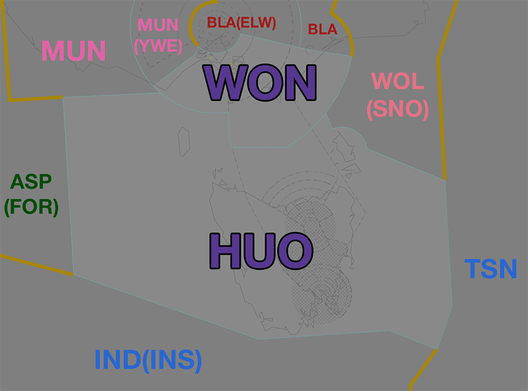
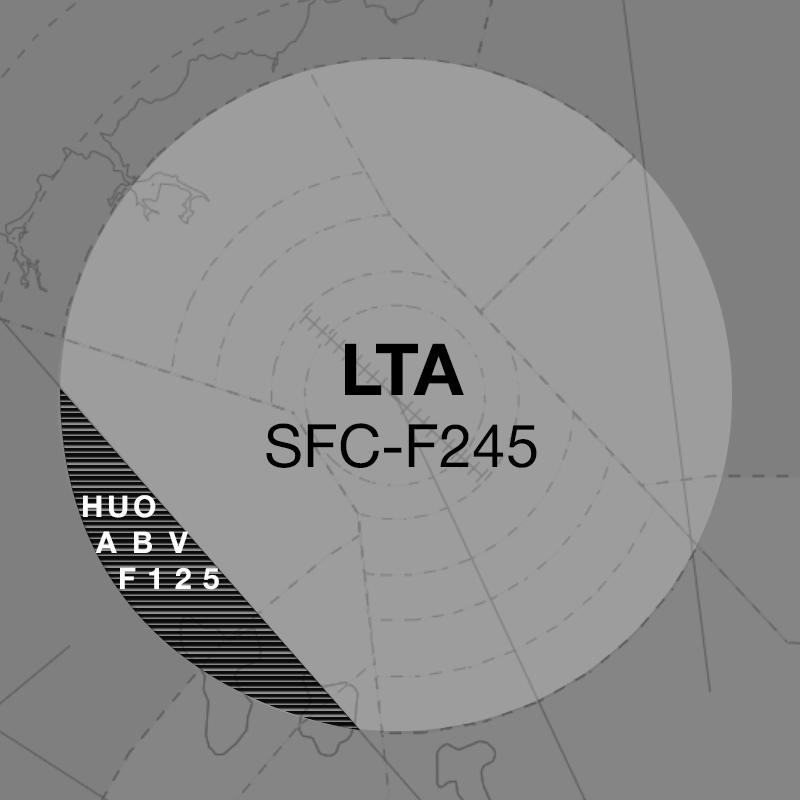

--8<-- "includes/abbreviations.md"
## Positions

| Name                | ID      | Callsign             | Frequency   | Login ID       |
| ------------------- | ------- | -------------------- | ----------- | -------------- |
| **Huon**            | **HUO** | **Melbourne Centre** | **122.600** | **ML-HUO_CTR** |
|  Wonthaggi :material-information-outline:{ title="Non-standard position"} | HUO | Melbourne Centre | 135.300 | ML-WON_CTR |

!!! abstract "Non-Standard Positions"
    :material-information-outline: Non-standard positions may only be used in accordance with [VATPAC Air Traffic Services Policy](https://vatpac.org/publications/policies){target=new}.  
    Approval must be sought from the **bolded parent position** prior to opening a Non-Standard Position, unless [NOTAMs](https://vatpac.org/publications/notam){target=new} indicate otherwise (eg, for events).

### CPDLC
The Primary Communication Method for HUO is Voice. [CPDLC](../../../client/cpdlc) may be used in lieu when applicable. The CPDLC Station Code is `YHUO`.

## Airspace

<figure markdown>
{ width="700" }
  <figcaption>Huon Airspace</figcaption>
</figure>

### Reclassifications
=== "ES TCU"
	When **ESA** is offline, the restricted airspace within R360 is deactivated and the airspace is administered by BLA and WON. Alternatively, WON may provide a [top-down service](../../../aerodromes/classc/EastSale) if they wish (not recommended), and this must be coordinated to BLA.

	!!! tip
		If choosing *not* to provide a top down service, consider publishing a pre-formatted **ATIS Zulu** for the aerodrome, to inform pilots about the airspace reclassification.
	
=== "TAS TCU"
	When **HBA** and/or **LTA** are offline, the class C and D airspace `SFC` to `A085` in the relevant TMA is reclassified as class G.

	HUO may choose to operate either YMHB or YMLT (or both) aerodromes top down, including the terminal airspace within the Tasmania TMA. Due to limited surveillence coverage and the complex airspace setup, **extending top down to one or both aerodromes is not compulsory.**

	If HUO chooses to operate top down to either aerodrome, they must administer all relevant airspace within the appropriate TMA, including the class D CTR.

	!!! warning "Important"
		Ensure you are familiar with the aerodrome procedures for [Launceston](../../../aerodromes/Launceston) and [Hobart](../../../aerodromes/Hobart) before extending top down, and are aware of the limited surveillence coverage available in the lower levels of the TMA.

	!!! tip
		If choosing *not* to provide a top down service, consider publishing a pre-formatted **ATIS Zulu** for the aerodrome, to inform pilots about the airspace reclassification.

## Departure and Arrival Procedures
### YMES
WON is responsible for facilitating operations at YMES departing to/arriving from the south.

### YMHB
#### STAR Assignment
The following subsectors are responsible for issuing STAR clearance.

| Subsector | STAR | Type | Notes |
| ---- | ----- | -------- | ----- |
| HUO  | IPLET MORGO | All     | |
| ELW  | BOYSE | Non-Jet |       |

#### Sequencing
All sequencing is performed by HUO.

### YMLT
#### Sequencing
All sequencing is performed by HUO.

### YMML
#### STAR Assignment
The following subsectors are responsible for issuing STAR clearance.

| Subsector | STAR | Type | Notes |
| ---- | ----- | -------- | ----- |
| WON  | PORTS RAZZI | All     | |

Aircraft should primarily be assigned the RAZZI STAR. The PORTS STAR may be issued in lieu of the RAZZI STAR to reduce track miles and [assist with the flow](../../../terminal/melbourne/#flow).

#### Sequencing
HUO is responsbile for sequencing arrivals from the south into YMML.

##### Predictable Sequencing Waypoints
There are four [Predictable Sequencing](../../../controller-skills/sequencing/#predictable-sequencing) waypoints available for aircraft inbound YMML via **H215**, **P753**, **L508** and **M625**. These waypoints are perpendicular to **M625** and **H215**.

The table below contains the estimated time from the initial waypoint to the final waypoint **via the CDO waypoint**. 

=== "M625"
    | Initial Waypoint | CDO Waypoint | Final Waypoint | Delay (in mins) |
    | ---------------- | ------------ | -------------- | --------------- |
    | ELNIV | OTGUN | RAZZI | 2 |
    | ELNIV | OSEMI | RAZZI | 4 |
    | ELNIV | UGITO | RAZZI | 6 |
    | ELNIV | SEBLU | RAZZI | 8 | 

=== "H215"
    | Initial Waypoint | CDO Waypoint | Final Waypoint | Delay (in mins) |
    | ---------------- | ------------ | -------------- | --------------- |
    | AKTAM | SEBLU | RAZZI | 2 |
    | AKTAM | UGITO | RAZZI | 4 |
    | AKTAM | OSEMI | RAZZI | 6 |
    | AKTAM | OTGUN | RAZZI | 8 |

##### Holding Fixes
Refer to the vatSys Enroute Holds map for details of published holds on the airways inbound to YMML. Where delays necessitate holding, aircraft should be instructed to hold at the following positions. The listed time should be subtracted from an aircraft's assigned feeder fix time to determine when they should leave the hold.

| Feeder Fix | Holding Fix | Time from Hold to Feeder Fix |
| ---- | ---- | ---- |
| RAZZI | TASIS ONAGI | 6 min 6 min |

!!! tip
    Additional holding may be performed at upstream holding fixes to reduce controller workload. This is particularly useful when non-standard child sectors have been opened, allowing aircraft to absorb some of their delay in the previous sector. 

##### LAHSO
!!! warning "Important"
    Due to its operational complexity, LAHSO **must be authorised by a senior VATPAC staff member or a nominated event coordinator**.

In accordance with the authorisation requirements above, YMML may utilise LAHSO during exceptionally busy events. Detailed procedures exist to ensure that controllers are aware of their responsibilities when performing LAHSO. See [Controller Skills](../../../controller-skills/runwaymanagement/#lahso) for more information.

## STAR Clearance Expectation
### Handoff
Aircraft being transferred to the following sectors shall be told to Expect STAR Clearance on handoff:

| Transferring Sector | Receiving Sector | ADES | Notes |
| ---- | -------- | --------- | --------- |
| HUO | WON | YMML | |
| WON | HUO | YMHB | |

## Terminal Handover Frequencies
Aircraft being transferred from enroute to a TCU with multiple frequencies shall be given the frequency for the revelant TCU position.

=== "ML TCU"
	=== "09AD"
		<figure markdown>
		{ width="500" }
		  <figcaption>ML TCU Handover Frequencies - 09AD Mode</figcaption>
		</figure>

		| ADES | STAR  | Frequency (Controller) |
		| ---- | ----- | ---------------------- |
		| YMML | ALAXO | **129.400** (MDS)      |
		| YMML | ARBEY | **132.000** (MAE)      |
		| YMML | BOOIN | **132.000** (MAE)      |
		| YMML | BOYSE | **132.000** (MAE)      |
		| YMML | PORTS | **129.400** (MDS)      |
		| YMML | RAZZI | **129.400** (MDS)      | 

	=== "09A16D"
		<figure markdown>
		{ width="500" }
		  <figcaption>ML TCU Handover Frequencies - 09A16D Mode</figcaption>
		</figure>
		
		| ADES | STAR  | Frequency (Controller) |
		| ---- | ----- | ---------------------- |
		| YMML | ALAXO | **129.400** (MDS)      |
		| YMML | ARBEY | **132.000** (MAE)      |
		| YMML | BOOIN | **132.000** (MAE)      |
		| YMML | BOYSE | **132.000** (MAE)      |
		| YMML | PORTS | **129.400** (MDS)      |
		| YMML | RAZZI | **129.400** (MDS)      | 

	=== "16AD"
		<figure markdown>
		{ width="500" }
		  <figcaption>ML TCU Handover Frequencies - 16AD Mode</figcaption>
		</figure>
		
		| ADES | STAR  | Frequency (Controller) |
		| ---- | ----- | ---------------------- |
		| YMML | ALAXO | **129.400** (MDS)      |
		| YMML | ARBEY | **118.900** (MDN)      |
		| YMML | BOOIN | **132.000** (MAE)      |
		| YMML | BOYSE | **132.000** (MAE)      |
		| YMML | RAZZI | **132.000** (MAE)      | 

	=== "16A27D"
		<figure markdown>
		{ width="500" }
		  <figcaption>ML TCU Handover Frequencies - 16A27D Mode</figcaption>
		</figure>
		
		| ADES | STAR  | Frequency (Controller) |
		| ---- | ----- | ---------------------- |
		| YMML | ALAXO | **129.400** (MDS)      |
		| YMML | ARBEY | **118.900** (MDN)      |
		| YMML | BOOIN | **132.000** (MAE)      |
		| YMML | BOYSE | **132.000** (MAE)      |
		| YMML | RAZZI | **132.000** (MAE)      | 

	=== "27AD"
		<figure markdown>
		{ width="500" }
		  <figcaption>ML TCU Handover Frequencies - 27AD Mode</figcaption>
		</figure>
		
		| ADES | STAR  | Frequency (Controller) |
		| ---- | ----- | ---------------------- |
		| YMML | ALAXO | **129.400** (MDS)      |
		| YMML | ARBEY | **118.900** (MDN)      |
		| YMML | BOOIN | **132.000** (MAE)      |
		| YMML | BOYSE | **132.000** (MAE)      |
		| YMML | RAZZI | **132.000** (MAE)      | 

	=== "27AD34D"
		<figure markdown>
		{ width="500" }
		  <figcaption>ML TCU Handover Frequencies - 27AD34D Mode</figcaption>
		</figure>
		
		| ADES | STAR  | Frequency (Controller) |
		| ---- | ----- | ---------------------- |
		| YMML | ALAXO | **129.400** (MDS)      |
		| YMML | ARBEY | **118.900** (MDN)      |
		| YMML | BOOIN | **132.000** (MAE)      |
		| YMML | BOYSE | **132.000** (MAE)      |
		| YMML | RAZZI | **132.000** (MAE)      | 

	=== "34AD"
		<figure markdown>
		{ width="500" }
		  <figcaption>ML TCU Handover Frequencies - 34AD Mode</figcaption>
		</figure>
		
		| ADES | STAR  | Frequency (Controller) |
		| ---- | ----- | ---------------------- |
		| YMML | ALAXO | **129.400** (MDS)      |
		| YMML | ARBEY | **118.900** (MDN)      |
		| YMML | BOOIN | **132.000** (MAE)      |
		| YMML | BOYSE | **132.000** (MAE)      |
		| YMML | PORTS | **129.400** (MDS)      |
		| YMML | RAZZI | **132.000** (MAE)      | 

	=== "27A34AD (LAHSO)"
		<figure markdown>
		{ width="500" }
		  <figcaption>ML TCU Handover Frequencies - 27A34AD Mode</figcaption>
		</figure>
		
		| ADES | STAR  | Frequency (Controller) |
		| ---- | ----- | ---------------------- |
		| YMML | ALAXO | **129.400** (MDS)      |
		| YMML | ARBEY | **118.900** (MDN)      |
		| YMML | BOOIN | **132.000** (MAE)      |
		| YMML | BOYSE | **132.000** (MAE)      |
		| YMML | PORTS | **129.400** (MDS)      |
		| YMML | RAZZI | **132.000** (MAE)      |

	!!! tip
		The quick reference tables above only include scenarios for which there is [voiceless coordination](#ml-tcu). Refer to the diagram for the appropriate position/frequency for coordination and handoff for all other situations.

=== "Tasmania TCU"
	Each of the Tasmania TCUs has its own frequency. When a controller is [extending](../../../controller-skills/extending/#terminal-area) to cover both TCUs both frequencies will be primed but the callsign remains the same.

	| TCU | Frequency (Controller) |
	| ---- | ---------------------- |
	| LT | **123.800** (LTA)      |
	| HB | **125.550** (HBA)      |

## Coordination
### TAS TCU
#### Airspace
**LTA** owns the airspace `SFC` to `F245` within a 30nm radius of the LT VOR. LT ADC owns the Class D airspace within LT CTR `SFC` to `A015` when open.  

**HBA** owns the airspace `SFC` to `F245` within the remainder of the Tasmania TMA (shown below). HB ADC owns the Class D airspace within HB CTR `SFC` to `A015` (north of runway centreline) and `A025` (south of runway centreline) when open. 

Refer to [Reclassifications](#tas-tcu) for operations when HBA and/or LTA are offline.

##### LTA Release
The Airspace on and west of the IRSOM-MORGO track `F125`-`F245` is permanently released from LTA to HUO, unless coordinated otherwise. [Boundary Coordination](../../../controller-skills/coordination/#boundary) is not required to LTA for aircraft on this track assigned at or above `F130`.

<figure markdown>
{ width="500" }
  <figcaption>LTA Release</figcaption>
</figure>

#### Arrivals/Overfliers
Voiceless for all aircraft:

- With ADES **YMLT** 
  - Tracking from **IRSOM** or **NUNPA** DCT **LT**; and  
  - Assigned `A090`  
- With ADES **YMHB** 
  - Assigned the **IPLET** or **MORGO** STAR; and  
  - Assigned `F130`  

All other aircraft coming from HUO CTA must be **Heads-up** Coordinated to TAS TCU prior to **20nm** from the boundary.

#### Departures
Voiceless for all aircraft:

- Assigned the lower of `F240` or the `RFL`; and  
- Tracking via a Procedural SID terminus

All other aircraft going to HUO CTA will be **Heads-up** Coordinated by TAS TCU.

### ES TCU
#### Departures
Voiceless for all aircraft:

- Tracking via a Procedural SID terminus; and  
- Assigned the lower of `F200` or the `RFL`

All other aircraft going to HUO(WON) CTA must be **Heads-up** Coordinated by ESA prior to the boundary. 

#### Arrivals
Voiceless for all aircraft:

- With ADES **YMES**; and
- Assigned `A100`

All other aircraft coming from HUO(WON) CTA will be **Heads-up** Coordinated to ESA.

### ML TCU
#### Airspace
The Vertical limits of the ML TCU are `SFC` to `F245`.

Refer to [Melbourne TCU Airspace Division](../../../terminal/melbourne/#airspace-division) for information on airspace divisions when **MDN** and/or **MDS** are online.

#### Arrivals/Overfliers
Voiceless for all aircraft:

- With ADES **YMML**; and  
- Assigned a STAR; and  
- Assigned `A090`

All other aircraft coming from WON CTA must be **Heads-up** Coordinated to ML TCU prior to **20nm** from the boundary.

#### Departures
Voiceless to all surrounding Enroute sectors for all aircraft:
 
- Assigned the lower of `F240` or the `RFL`; and
- Tracking via any of the following:
    - a Procedural SID terminus
    - **MENOG**
    - **AV**

All other aircraft going to WON CTA will be **Heads-up** Coordinated by ML TCU.

### Enroute
As per [Standard coordination procedures](../../../controller-skills/coordination/#enr-enr), Voiceless, no changes to route or CFL within **50nm** to boundary.

That being said, it is *advised* that WON gives **Heads-up Coordination** prior to **50nm** in the following scenarios:  
- to YWE for all aircraft  
- to ELW/BLA for all aircraft  

### TSN/IND(INS) (Oceanic)
As per [Standard coordination procedures](../../../controller-skills/coordination/#pacific-units), Voiceless, no changes to route or CFL within **15 mins** to boundary.

Aircraft must have their identification terminated and be instructed to make a position report on first contact with the next (procedural) sector.

!!! phraseology
    **HUO**: "QFA121, identification terminated, report position to Brisbane Radio, 129.25"