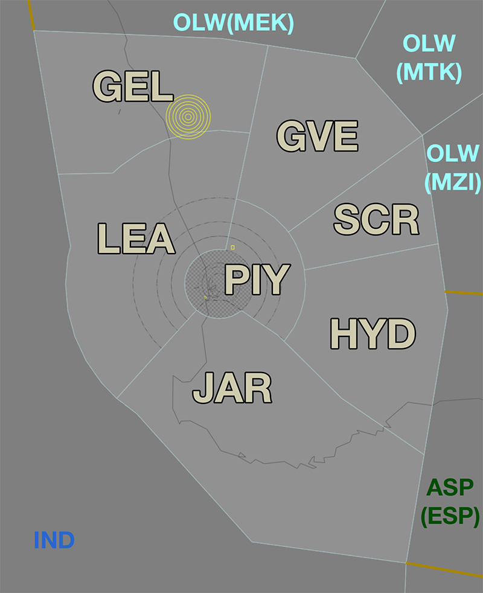

--8<-- "includes/abbreviations.md"
## Positions

| Name                | ID      | Callsign             | Frequency   | Login ID       |
| ------------------- | ------- | -------------------- | ----------- | -------------- |
| **Hyden**           | **HYD** | **Melbourne Centre** | **118.200** | **ML-HYD_CTR** |
| Cross :material-information-outline:{ title="Non-standard position"}     | SCR | Melbourne Centre | 135.800 | ML-CRS_CTR |
| Geraldton :material-information-outline:{ title="Non-standard position"} | GEL | Melbourne Centre | 134.200 | ML-GEL_CTR |
| Grove :material-information-outline:{ title="Non-standard position"}     | GVE | Melbourne Centre | 133.800 | ML-GVE_CTR |
| Jarrah :material-information-outline:{ title="Non-standard position"}    | JAR | Melbourne Centre | 120.300 | ML-JAR_CTR |
| Leeman :material-information-outline:{ title="Non-standard position"}    | LEA | Melbourne Centre | 122.400 | ML-LEA_CTR |
| Pingelly :material-information-outline:{ title="Non-standard position"}  | PIY | Melbourne Centre | 133.900 | ML-PIY_CTR |

!!! abstract "Non-Standard Positions"
    :material-information-outline: Non-standard positions may only be used in accordance with [VATPAC Air Traffic Services Policy](https://vatpac.org/publications/policies){target=new}.  
    Approval must be sought from the **bolded parent position** prior to opening a Non-Standard Position, unless [NOTAMs](https://vatpac.org/publications/notam){target=new} indicate otherwise (eg, for events).

### CPDLC
The Primary Communication Method for HYD is Voice. [CPDLC](../../../client/cpdlc) may be used in lieu when applicable. The CPDLC Station Code is `YHYD`.

## Airspace
<figure markdown>
{ width="700" }
  <figcaption>Pingelly Airspace</figcaption>
</figure>

### Reclassifications
=== "PE TCU"
	When **PEA** is offline, the PE MIL CTR, GIG MIL CTR, and restricted airspace within R155 is deactivated and the airspace is administered by LEA, PIY and PH TCU.

	!!! tip
        Consider publishing a pre-formatted **ATIS Zulu** for the aerodrome, to inform pilots about the airspace reclassification.

## Departure and Arrival Procedures
### YGIG
LEA and PIY share responsibility for facilitating operations in and out of YGIG

### YPEA
#### STAR Assignment
The STARs at YPEA have different variations designed to facilitate separation with PH TCU traffic, dependant on the runway mode in use at YPPH.

The following subsectors are responsible for issuing STAR clearance.

=== "RWY 03/06 at YPPH"

	| Subsector | STAR | Type | Notes |
	| ---- | --------- | ---- | ----- |
	| HYD  | PEA **GOLF**, KABLI Trans | Jet     | Descent not below `F190` |
	| PIY  | PEA **GOLF**, LAVEX Trans PEA **WHISKEY**, MALUP Trans | Non-Jet |      |

=== "RWY 21/24 at YPPH"
	| Subsector | STAR | Type | Notes |
	| ---- | --------- | ---- | ----- |
	| HYD  | PEA **ROMEO**, KABLI Trans | Jet     | Descent not below `F190` |
	| PIY  | PEA **ROMEO**, LAVEX Trans | Non-Jet |      |
	
Arrivals from the east and north shall be given initial descent to not below `F190`. **PIY** will issue final descent.

### YPJT
#### STAR Assignment
The STARs at YPEA have different variations designed to facilitate separation with PH TCU traffic, dependant on the runway mode in use at YPPH.

The following subsectors are responsible for issuing STAR clearance.

=== "RWY 03/06 at YPPH"

	| Subsector | STAR | Type | Notes |
	| ---- | --------- | ---- | ----- |
	| GVE  | JT **GOLF**, WOORA Trans | Jet | Descent not below `F190` |
	| HYD  | JT **GOLF**, KABLI Trans | Jet | Descent not below `F190` |
	| PIY  | JT **GOLF**, LAVEX Trans JT **WHISKEY**, MALUP Trans JT **GOLF**, WOORA Trans | Non-Jet |      |

=== "RWY 21/24 at YPPH"
	| Subsector | STAR | Type | Notes |
	| ---- | --------- | ---- | ----- |
	| HYD  | JT **ROMEO**, KABLI Trans | Jet     | Descent not below `F190` |
	| PIY  | JT **ROMEO**, LAVEX Trans | Non-Jet |      |

Arrivals from the east and north shall be given initial descent to not below `F190`. **PIY** will issue final descent.

### YPPH
#### STAR Assignment
The following subsectors are responsible for issuing STAR clearance.

| Subsector | STAR | Type | Notes |
| ---- | ----- | -------- | ----- |
| GVE  | JULIM | Jet      | Descent not below `F190` | 
| HYD  | KABLI | Jet      | Descent not below `F190` |
| JAR  | SOLUS | All      |       |
| LEA  | IPMOR | All      |       |
| PIY  | DAYLR LAVEX SAPKO | Non-Jet |       |

Arrivals from the east and north shall be given initial descent to not below `F190`. **PIY** will issue final descent.

##### Runway Assignment
When the [Southwest Plan](../../../aerodromes/classc/Perth/#runway-modes) active, arrivals shall be processed to either Runway 21 or 24 based on their feeder fix (subject to any operational requirements).

| FF    | Runway |
| ----- | ------ |
| JULIM | 21 |
| SAPKO | 21 |
| IPMOR | 21 |
| KABLI | 24 |
| LAVEX | 24 |
| SOLUS | 24 |

#### Sequencing
Sequencing arrivals into YPPH is a joint responsibility of multiple subsectors:

- GVE and HYD will perform initial sequencing actions for aircraft arriving from the north and east, with final sequencing performed by PIY.
- LEA is responsible for all sequencing actions for aircraft arriving from the west.
- JAR is responsible for all sequencing actions for aircraft arriving from the south.

##### Adjacent Feeder Fixes
Aircraft assigned the **same runway** inbound via **JULIM** and **SAPKO**, must be considered to be on the **same STAR** for sequencing purposes. That is, they must be at least **2 minutes** apart at their respective Feeder fixes.

##### Predictable Sequencing Waypoints
There are ten [Predictable Sequencing](../../../controller-skills/sequencing/#predictable-sequencing) waypoints available for aircraft inbound YPPH via  **Q10**, **Q32**, **Q27**, **Q41** and **Z38**, located south of **Q10** and north of **Q27**. There are also eight waypoints available for aicraft inbound via **Q9**, **Q31**, **Q38**, **Q73** and **Q181** located east of the **Q38**.

The table below contains the estimated time from the initial waypoint to the final waypoint **via the CDO waypoint**. 

=== "L514"
    | Initial Waypoint | CDO Waypoint | Final Waypoint | Delay (in mins) |
    | ---------------- | ------------ | -------------- | --------------- |
    | OTGOM | ELGAT | AVPAL | +2 |
    | OTGOM | VEKBO | AVPAL | +4 |
    | OTGOM | DUBUL | AVPAL | +5 |
    | OTGOM | SOVTO | AVPAL | +6 |
    | OTGOM | ASEBI | AVPAL | +8 |
    | OTGOM | LEDAB | AVPAL | +11 |
    | OTGOM | NURPA | AVPAL | +13 |
    | OTGOM | BEPKI | AVPAL | +15 |
    | OTGOM | IGOKO | AVPAL | +17 |

=== "Q9"
    | Initial Waypoint | CDO Waypoint | Final Waypoint | Delay (in mins) |
    | ---------------- | ------------ | -------------- | --------------- |
    | ELGAT | VEKBO | AVPAL | +1 |
    | ELGAT | DUBUL | AVPAL | +2 |
    | ELGAT | SOVTO | AVPAL | +3 |
    | ELGAT | ASEBI | AVPAL | +5 |
    | ELGAT | LEDAB | AVPAL | +7 |
    | ELGAT | NURPA | AVPAL | +9 |
    | ELGAT | BEPKI | AVPAL | +11 |
    | ELGAT | IGOKO | AVPAL | +13 |

=== "Q10"
    | Initial Waypoint | CDO Waypoint | Final Waypoint | Delay (in mins) |
    | ---------------- | ------------ | -------------- | --------------- |
    | URGEX | TEKUD | MALUP | +1 |
    | URGEX | BEMPI | MALUP | +2 |
    | URGEX | AGTOD | MALUP | +4 |
    | URGEX | DUKOR | MALUP | +6 |
    | URGEX | IPGER | MALUP | +8 |
    | URGEX | TODOS | MALUP | +10 |
    | URGEX | IVPIL | MALUP | +13 |
 
=== "Q27"
    | Initial Waypoint | CDO Waypoint | Final Waypoint | Delay (in mins) |
    | ---------------- | ------------ | -------------- | --------------- |
    | IVPIL | TODOS | MALUP | +1 |
    | IVPIL | IPGER | MALUP | +2 |
    | IVPIL | DUKOR | MALUP | +3 |
    | IVPIL | AGTOD | MALUP | +4 |
    | IVPIL | BEMPI | MALUP | +5 |
    | IVPIL | TEKUD | MALUP | +6 |
    | IVPIL | URGEX | MALUP | +8 |
    
=== "Q31"
    | Initial Waypoint | CDO Waypoint | Final Waypoint | Delay (in mins) |
    | ---------------- | ------------ | -------------- | --------------- |
    | VEKBO | DUBUL | AVPAL | +1 |
    | VEKBO | SOVTO | AVPAL | +2 |
    | VEKBO | ASEBI | AVPAL | +4 |
    | VEKBO | LEDAB | AVPAL | +6 |
    | VEKBO | NURPA | AVPAL | +8 |
    | VEKBO | BEPKI | AVPAL | +11 |
    | VEKBO | IGOKO | AVPAL | +12 |
 
=== "Q32"
    | Initial Waypoint | CDO Waypoint | Final Waypoint | Delay (in mins) |
    | ---------------- | ------------ | -------------- | --------------- |
    | TEKUD | BEMPI | MALUP | +1 |
    | TEKUD | AGTOD | MALUP | +3 |
    | TEKUD | DUKOR | MALUP | +5 |
    | TEKUD | IPGER | MALUP | +7 |
    | TEKUD | TODOS | MALUP | +9 |
	
=== "Q38"
    | Initial Waypoint | CDO Waypoint | Final Waypoint | Delay (in mins) |
    | ---------------- | ------------ | -------------- | --------------- |
    | SOVTO | ASEBI | AVPAL | +2 |
    | SOVTO | LEDAB | AVPAL | +4 |
    | SOVTO | NURPA | AVPAL | +6 |
    | SOVTO | BEPKI | AVPAL | +8 |
    | SOVTO | IGOKO | AVPAL | +10 |
 
=== "Q41"
    | Initial Waypoint | CDO Waypoint | Final Waypoint | Delay (in mins) |
    | ---------------- | ------------ | -------------- | --------------- |
    | NALAR | URGEX | MALUP | +5 |
    | NALAR | TEKUD | MALUP | +7 |
    | NALAR | BEMPI | MALUP | +8 |
    | NALAR | AGTOD | MALUP | +10 |
    | NALAR | DUKOR | MALUP | +12 |
    | NALAR | IPGER | MALUP | +14 |
    | NALAR | TODOS | MALUP | +16 |
    | NALAR | IVPIL | MALUP | +20 |
	
=== "Q73"
    | Initial Waypoint | CDO Waypoint | Final Waypoint | Delay (in mins) |
    | ---------------- | ------------ | -------------- | --------------- |
    | IGOKO | OTGOM | AVPAL | +12 |
    | IGOKO | ELGAT | AVPAL | +9 |
    | IGOKO | VEKBO | AVPAL | +7 |
    | IGOKO | DUBUL | AVPAL | +6 |
    | IGOKO | SOVTO | AVPAL | +5 |
    | IGOKO | ASEBI | AVPAL | +3 |
    | IGOKO | LEDAB | AVPAL | +2 |
    | IGOKO | NURPA | AVPAL | +1 |

=== "Q181"
    | Initial Waypoint | CDO Waypoint | Final Waypoint | Delay (in mins) |
    | ---------------- | ------------ | -------------- | --------------- |
    | DUBUL | SOVTO | AVPAL | +1 |
    | DUBUL | ASEBI | AVPAL | +3 |
    | DUBUL | LEDAB | AVPAL | +5 |
    | DUBUL | NURPA | AVPAL | +7 |
    | DUBUL | BEPKI | AVPAL | +9 |
    | DUBUL | IGOKO | AVPAL | +11 |

=== "T12"
    | Initial Waypoint | CDO Waypoint | Final Waypoint | Delay (in mins) |
    | ---------------- | ------------ | -------------- | --------------- |
	| OPEGA | TUTRU | DAKPO | +4 |
    | OPEGA | BEKIG | DAKPO | +2 |
    | DAKPO | MIGEP | KAGMI | +2 |
    | DAKPO | AVMEK | KAGMI | +4 |
    | DAKPO | GOPLO | KAGMI | +6 |
	
=== "Z38"
    | Initial Waypoint | CDO Waypoint | Final Waypoint | Delay (in mins) |
    | ---------------- | ------------ | -------------- | --------------- |
    | BUNGL | MALUP | MALUP | +3 |
    | BUNGL | IGROB | MALUP | +5 |
    | BUNGL | KINAB | MALUP | +7 |

##### Holding Fixes
Refer to the vatSys Enroute Holds map for details of published holds on the airways inbound to YPPH. Where delays necessitate holding, aircraft should be instructed to hold at the following positions. The listed time should be subtracted from an aircraft's assigned feeder fix time to determine when they should leave the hold.

| Feeder Fix | Holding Fix | Time from Hold to Feeder Fix |
| ---- | ---- | ---- |
| JULIM | CALIG | Jets: 4 min Non-Jets: 6 min |
| Others | Feeder Fix | - |

!!! tip
    Additional holding may be performed at upstream holding fixes to reduce controller workload. This is particularly useful when non-standard child sectors have been opened, allowing aircraft to absorb some of their delay in the previous sector. 

## STAR Clearance Expectation
### Handoff
Aircraft being transferred to the following sectors shall be told to Expect STAR Clearance on handoff:

| Transferring Sector | Receiving Sector | ADES | Notes |
| ---- | -------- | --------- | --------- |
| GVE, CRS, HYD | PIY | YPPH, YPEA | Non-jets only |
| GVE, CRS, HYD | PIY | YPJT | |
| GEL | LEA | YPPH | |

## Terminal Handover Frequencies
Aircraft being transferred from enroute to a TCU with multiple frequencies shall be given the frequency for the revelant TCU position.

=== "PH TCU"
	=== "03AD06D"
		<figure markdown>
		{ width="500" }
		  <figcaption>PH TCU Handover Frequencies - 03AD06D Mode</figcaption>
		</figure>

		| ADES | STAR  | Frequency (Controller) |
		| ---- | ----- | ---------------------- |
		| YPPH | DAYLR | **123.600** (PHA)      |
		| YPPH | IPMOR | **118.700** (PHD)      |
		| YPPH | JULIM | ABV `A065`: **123.600** (PHA) BLW `A065`: **118.700** (PHD) |
		| YPPH | KABLI | **123.600** (PHA)      |
		| YPPH | LAVEX | **123.600** (PHA)      |
		| YPPH | SAPKO | ABV `A065`: **123.600** (PHA) BLW `A065`: **118.700** (PHD) | 
		| YPPH | SOLUS | **123.600** (PHA)      | 

	=== "24A21AD"
		<figure markdown>
		{ width="500" }
		  <figcaption>PH TCU Handover Frequencies - 24A21AD Mode</figcaption>
		</figure>
		
		| ADES | STAR  | Frequency (Controller) |
		| ---- | ----- | ---------------------- |
		| YPPH | IPMOR | ABV `A065`: **123.600** (PHA) BLW `A065`: **118.700** (PHD) |
		| YPPH | JULIM | **123.600** (PHA)      |
		| YPPH | KABLI | ABV `A065`: **123.600** (PHA) BLW `A065`: **118.700** (PHD) |
		| YPPH | LAVEX | ABV `A065`: **123.600** (PHA) BLW `A065`: **118.700** (PHD) |
		| YPPH | SAPKO | **123.600** (PHA)      | 
		| YPPH | SOLUS | **118.700** (PHD)      | 

## Coordination
### PH TCU
#### Airspace
The PH TCU is responsible for the airspace within 36 DME of the PH VOR, `SFC` to `F245`. 

Refer to [Perth TCU Airspace Division](../../../terminal/perth/#airspace-division) for information on airspace divisions when **PHD** is online.

!!! note
    A significant portion of the TMA airspace south of the PH VOR (roughly 20 DME onwards) is classified Class E with a lower limit of `F125`. Aircraft arriving from this direction from `F130` and above shall be instructed to leave and re-enter controlled airspace on descent to the standard assignable level (or other appropriate altitude).
	
#### Departures
Voiceless for all aircraft:
 
- Tracking via a Procedural SID procedure‡; and  
- Assigned the lower of `F180` or the `RFL`
	
!!! note
    ‡ In contrast to many other TCUs, aircraft are *required* to be tracking via the **SID procedure**. Aircraft simply tracking via any of the terminus waypoints (including aircraft given track shortening) **is not** sufficient to meet the criteria for voiceless coordination.

All other aircraft going to PIY CTA will be **Heads-up** Coordinated by PH TCU.

#### Arrivals/Overfliers
Voiceless for all aircraft:

- With ADES **YPPH**; and  
- Assigned a STAR; and  
- Assigned `A090`

All other aircraft coming from PIY CTA must be **Heads-up** Coordinated to PH TCU prior to **20nm** from the boundary.

### PE TCU
#### Airspace
PEA is responsible for the restricted airspace within R155A and R155B. This airspace is reclassified to **Class C** when PEA is online. Additional airspace may be released by NOTAM, or coordinated between PEA, PH TCU, and LEA/PIY to facilitate military operations.

!!! phraseology
    **PEA** -> **PH TCU**: "Request release of M166, SFC to F160, for Military Operations. My onwards with LEA"   
    **PH TCU** -> **PEA**: "M166, SFC to F160, released to you. Your onwards with LEA"  

    **PEA** -> **LEA**: "Request release of M166, SFC to F160, for Military Operations. My onwards with PH TCU"   
    **LEA** -> **PEA**: "M166, SFC to F160, released to you. Your onwards with PH TCU"  

#### Departures
All aircraft from PE TCU to HYD require [Heads-up](../../../controller-skills/coordination/#heads-up) coordination prior to the boundary, however, as soon as practical (when is the aircraft becomes airborne) is preferred. 

#### Arrivals/Overfliers
All aircraft transiting from HYD to **PE TCU** must be [Heads-up](../../../controller-skills/coordination/#heads-up) coordinated prior to **20nm** from the boundary. There are no standard assignable levels; HYD and **PEA** controller must agree on a suitable level during coordination.

!!! phraseology
    **LEA** -> **PEA**: "via AVNEX, EGLE9, will be assigned A090"  
    **PEA** -> **LEA**: "EGLE9, A090"
	
### Enroute
As per [Standard coordination procedures](../../../controller-skills/coordination/#enr-enr), Voiceless, no changes to route or CFL within **50nm** to boundary.

### HYD Internal
Changes to CFL are permitted up to the boundary from GVE, CRS and HYD to PIY.

All else is Voiceless, no changes to route or CFL within **20nm** (reduced from 50nm) to boundary.

That being said, it is *advised* that HYD(All) gives **Heads-up Coordination** prior to **20nm** in the following scenarios:  
- JAR to PIY for all aircraft  
- LEA to PIY for all aircraft  

### IND (Oceanic)
As per [Standard coordination procedures](../../../controller-skills/coordination/#pacific-units), Voiceless, no changes to route or CFL within **15 mins** to boundary.

Aircraft must have their identification terminated and be instructed to make a position report on first contact with the next (procedural) sector.

!!! phraseology
    **LEA**: "QFA121, identification terminated, report position to Brisbane Radio, 129.25"

!!! note
    Controllers should be aware that VHF coverage near the LEA/IND border may be limited. Controllers should strive to issue HF frequencies and transfer of communications instruction prior to 160 NM PH DME.