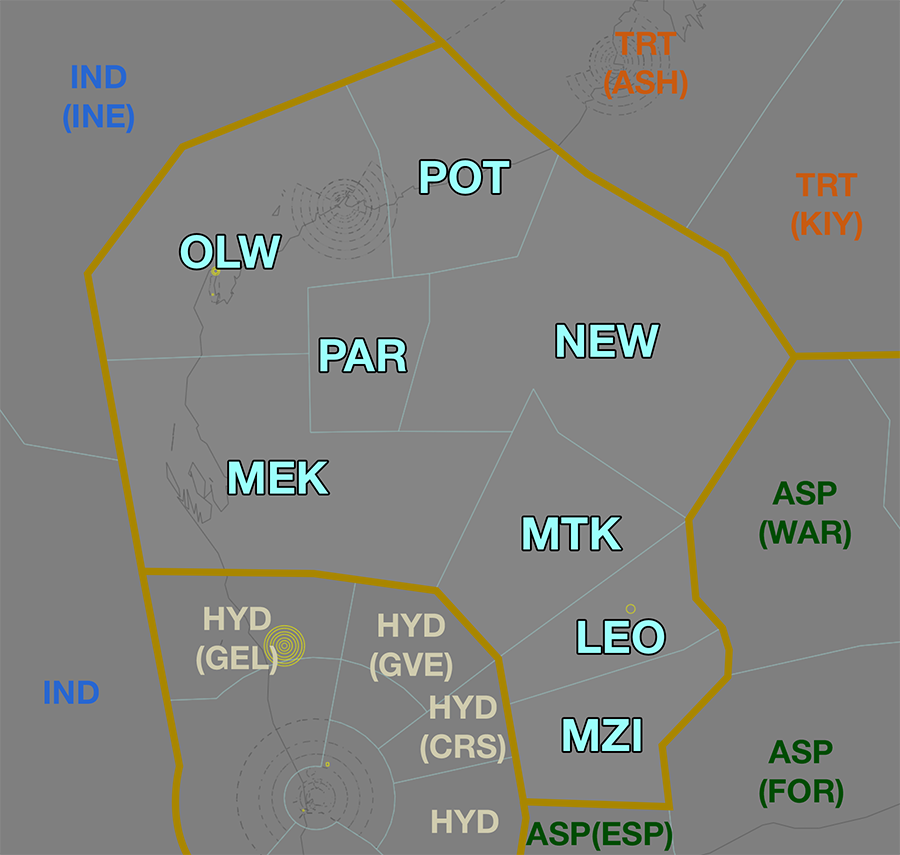
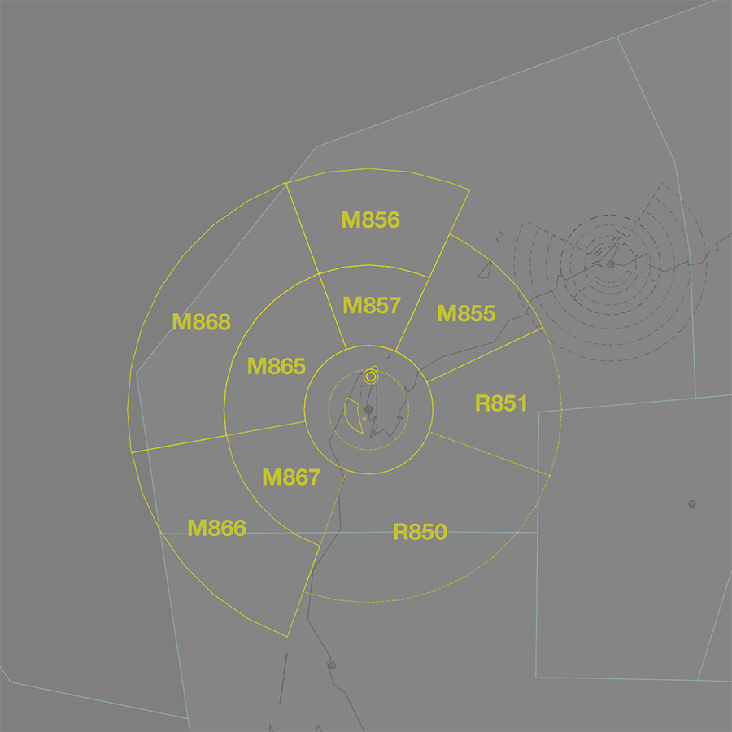

--8<-- "includes/abbreviations.md"

## Positions
| Name                | ID      | Callsign             | Frequency   | Login ID       |
| ------------------- | ------- | -------------------- | ----------- | -------------- |
| **Onslow**          | **OLW** | **Melbourne Centre** | **134.000** | **ML-OLW_CTR** |
| Meekatharra :material-information-outline:{ title="Non-standard position"} | MEK | Melbourne Centre | 132.000 | ML-MEK_CTR |
| Menzies :material-information-outline:{ title="Non-standard position"}     | MZI | Melbourne Centre | 134.300 | ML-MZI_CTR |
| Mount :material-information-outline:{ title="Non-standard position"}       | MTK | Melbourne Centre | 133.700 | ML-MTK_CTR |
| Newman :material-information-outline:{ title="Non-standard position"}      | NEW | Melbourne Centre | 125.400 | ML-NEW_CTR |
| Paraburdoo :material-information-outline:{ title="Non-standard position"}  | PAR | Melbourne Centre | 133.500 | ML-PAR_CTR |
| Port :material-information-outline:{ title="Non-standard position"}        | POT | Melbourne Centre | 127.000 | ML-POT_CTR |

!!! abstract "Non-Standard Positions"
    :material-information-outline: Non-standard positions may only be used in accordance with [VATPAC Air Traffic Services Policy](https://vatpac.org/publications/policies){target=new}.  
    Approval must be sought from the **bolded parent position** prior to opening a Non-Standard Position, unless [NOTAMs](https://vatpac.org/publications/notam){target=new} indicate otherwise (eg, for events).

## Airspace

<figure markdown>
{ width="700" }
  <figcaption>Onslow Airspace</figcaption>
</figure>

OLW is responsible for **POT**, **PAR**, **NEW**, **MEK**, **MTK** and **MZI** when they are offline.  

### Reclassifications
=== "KA CTR"
	When **KA ADC** is offline, KA CTR (Class D `SFC` to `A055`) reverts to Class G, and is administered by OLW. Alternatively, OLW may provide a [top-down procedural service](../../../aerodromes/procedural/Karratha/) if they wish.

	!!! tip
		If choosing *not* to provide a top down service, consider publishing a pre-formatted **ATIS Zulu** for the aerodrome, to inform pilots about the airspace reclassification.
		
=== "LM TCU"
	The restricted airspace around YPLM is classified as Class G by default, and is only reclassified as controlled airspace when **LMA** is online. When **LMA** is offline, the area remains Class G, and is administered by OLW.

## Departure and Arrival Procedures
### YPKA
OLW is responsible for issuing descent.

### YPLM
OLW is responsibile for facilitating operations in and out of YPLM.

## Local Procedures
### Special Use Airspace

There are multiple volumes of [SUA](../../../controller-skills/sua) within OLW airspace associated with military operations in and out of YPLM.

<figure markdown>
{ width="700" }
  <figcaption>Notable SUA in OLW Airspace</figcaption>
</figure>

LM TCU must [give heads up coordination](../../../controller-skills/coordination/#airways-clearance) with the relevant enroute controllers **prior** to any departures intending to operate in a currently inactive SUA.

    **LMA** -> **OLW**: "On the groud YPLM, PHNX11, requests activation of M855A `A100-F280`, from 0300 until 0500.”  
    **OLW** -> **LMA**: "PHNX11, expect activation of M855A `A100-F280` at 0300 until 0500."   
    **LMA** -> **OLW**: "PHNX11."  

Non-participating aircraft intending to transit an activated SUA should be rerouted, where possible, [subject to the VATSIM Code of Conduct](../../../sua/#ad-hoc-activations).

#### M855-M857 and M865-M868 Learmonth
The M855-M857 and M865-M868 Learmonth [MOAs](../../../controller-skills/sua/#military-operating-areas) are located over YPLM, `A100-F950`, located in OLW, MEK, and IND(INE) airspace. 

The MOAs directly adjoin the LM TMA and when LMA is online aircraft will be transferred directly to/from the MOAs. When [LMA is offline](#reclassifications), aircraft will contact OLW for transit through the surrounding civilian airspace.

Aircraft will generally enter and exit the MOA via the appropriate [military gate](../../../terminal/learmonth/#military-gates).

##### Affected Civil Operations
When activated, the restricted areas disrupt traffic on the busy **B649**, **J93**, **H126**, **N640**, **T41**, **Q587**, and **Y208** high altitude airways which are used by aircraft travelling between Australia and the Middle East, and between Indonesia and Perth.

Aircraft may be given an additional requirement to climb above the vertical limits of the activation, or rerouted manually to avoid the area.

## STAR Clearance Expectation
### Handoff
Aircraft being transferred to the following sectors shall be told to Expect STAR Clearance on handoff:

| Transferring Sector | Receiving Sector | ADES | Notes |
| ---- | -------- | --------- | --------- |
| MEK, MTK, MZI | HYD/GVE | YPPH, YPEA | Jets only |

## Coordination

### Enroute
As per [Standard coordination procedures](../../../controller-skills/coordination/#enr-enr), Voiceless, no changes to route or CFL within **50nm** to boundary.

### OLW Internal
As per [Standard coordination procedures](../../../controller-skills/coordination/#enr-enr), Voiceless, no changes to route or CFL within **50nm** to boundary.

### KA ADC
#### Airspace
KA ADC is responsible for the Class D airspace in the KA CTR `SFC` to `A055`.

Refer to [Reclassifications](#reclassifications) for operations when KA ADC is offline.

#### Departures
[Next](../../controller-skills/coordination.md#next) coordination is required from KA ADC to OLW for all aircraft **entering OLW CTA**.

The Standard Assignable level from **KA ADC** to **OLW** is:

| Aircraft | Level |
| ---- | ---- |
| All | The lower of `A050` and `RFL` |

#### Arrivals/Overfliers
YPKA arrivals and overfliers shall be heads-up coordinated to **KA ADC** from OLW prior to **5 mins** from the boundary.

!!! phraseology
    **OLW** -> **KA ADC**: "Via MCNAB, QFA1214 for the RNP U RWY 26”  
    **KA ADC** -> **OLW**: "QFA1214, RNP U RWY 26"  

The Standard Assignable level from OLW to KA ADC is `A060`, any other level must be prior coordinated.

### LM TCU
#### Airspace
The limits of the LM TCU are `SFC` to `F280` within 40 DME LM.

#### Arrivals/Overfliers
The Standard assignable level from OLW to LM TCU is `F130`, tracking via LM VOR.

All other aircraft must be voice coordinated to LM TCU prior to **20nm** from the boundary.

#### Departures
The Standard Assignable level from LM TCU to OLW is `F240`, and tracking via their planned route.

### IND,INE (Oceanic)
As per [Standard coordination procedures](../../../controller-skills/coordination/#pacific-units), Voiceless, no changes to route or CFL within **15 mins** to boundary.

Aircraft must have their identification terminated and be instructed to make a position report on first contact with the next (procedural) sector.

!!! phraseology
    **OLW**: "QFA121, identification terminated, report position to Brisbane Radio, 129.25"