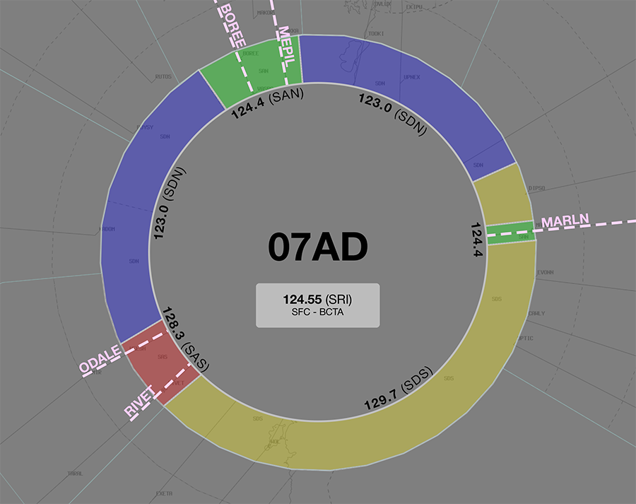

--8<-- "includes/abbreviations.md"
## Positions

| Name                | ID      | Callsign             | Frequency   | Login ID       |
| ------------------- | ------- | -------------------- | ----------- | -------------- |
| **Wollongong**      | **WOL** | **Melbourne Centre** | **125.000** | **ML-WOL_CTR** |
| Snowy :material-information-outline:{ title="Non-standard position"} | SNO | Melbourne Centre | 124.000 | ML-SNO_CTR |

!!! abstract "Non-Standard Positions"
    :material-information-outline: Non-standard positions may only be used in accordance with [VATPAC Air Traffic Services Policy](https://vatpac.org/publications/policies){target=new}.  
    Approval must be sought from the **bolded parent position** prior to opening a Non-Standard Position, unless [NOTAMs](https://vatpac.org/publications/notam){target=new} indicate otherwise (eg, for events).

### CPDLC
The Primary Communication Method for WOL is Voice. [CPDLC](../../../client/cpdlc) may be used in lieu when applicable. The CPDLC Station Code is `YWOL`.

## Airspace

<figure markdown>
{ width="500" }
  <figcaption>Bindook Airspace</figcaption>
</figure>

### Reclassifications
=== "CB CTR"
	When **CB TCU** is offline, CB TCU (Class C `SFC` to `A085`) reverts to Class G, and is administered by WOL. Alternatively, WOL may provide a [top-down approach service](../../../terminal/canberra) if they wish.

	!!! tip
		If choosing *not* to provide a top down service, consider publishing a pre-formatted **ATIS Zulu** for the aerodrome, to inform pilots about the airspace reclassification.

=== "NW CTR"
	When **NWA** is offline, the NW MIL CTR and restricted airspace within R421 is deactivated and the airspace is administered by WOL.

	!!! tip
        Consider publishing a pre-formatted **ATIS Zulu** for the aerodrome, to inform pilots about the airspace reclassification.

## Departure and Arrival Procedures
### YMES
SNO is responsible for facilitating operations at YMES departing to/arriving from the east.

### YSCB
#### STAR Assignment
The following subsectors are responsible for issuing STAR clearance.

| Subsector | STAR | Type | Notes |
| ---- | ----- | -------- | ----- |
| WOL  | BUNGO LEECE | Non-Jet Jet^ | |

!!! note
	^ GUN(BIK) will issue STAR clearances to jet aircraft overflying the SY TCU en route to YSCB. WOL will issue STAR clearances to all other jet aircraft.

#### Sequencing
Sequencing arrivals from the east and northeast into YSCB is a responsibility of WOL.

##### Holding Fixes
Refer to the vatSys Enroute Holds map for details of published holds on the airways inbound to YSCB. Where delays necessitate holding, aircraft should be instructed to hold at the following positions. The listed time should be subtracted from an aircraft's assigned feeder fix time to determine when they should leave the hold.

| Feeder Fix | Holding Fix | Time from Hold to Feeder Fix |
| ---- | ---- | ---- |
| MANDA | NONUP | Jets: 3 min Non-Jets: 4 min |
| Others | Feeder Fix | - |

##### Adjacent Feeder Fixes
Aircraft assigned the **same runway** inbound via **LEECE** and **BUNGO**, must be considered to be on the **same STAR** for sequencing purposes. That is, they must be at least **2 minutes** apart at their respective Feeder fixes.

### YSNW
WOL is responsibile for facilitating operations in and out of YSNW.

## Special Use Airspace
### Restricted Areas
#### Nowra R420F
During times of high traffic, NW TCU may request the release of R420F up to `F300`.

!!! phraseology
    **NWA** -> **WOL**: "There's a preplanned military exercise about to commence, request release of R420F up to F300"  
    **WOL** -> **NWA**: "R420F released to you F125 to F300"  
    **NWA** -> **WOL**: "R420F released F125 to F300" 

With R420F released to NW TCU, transiting aircraft will need to be coordinated or rerouted. Every effort will be made to accommodate these aircraft on track, but if NW TCU can't accommodate them, they must be vertically or laterally rerouted to avoid the restricted area. NW TCU will communicate this requirement.

See [Nowra Airspace](../../terminal/nowra#airspace) for more details about the lateral boundaries of the Nowra restricted areas.

## STAR Clearance Expectation
### Handoff
Aircraft being transferred to the following sectors shall be told to Expect STAR Clearance on handoff:

| Transferring Sector | Receiving Sector | ADES | Notes |
| ---- | -------- | --------- | --------- |
| WOL | BLA | YMML, YMAV | Jets only |
| WOL | GUN | YSSY | |
| SNO | HUO(WON) | YMML | 
| SNO | HUO | YMHB | |

## Terminal Handover Frequencies
Aircraft being transferred from enroute to a TCU with multiple frequencies shall be given the frequency for the revelant TCU position.

=== "SY TCU"
	=== "07AD"
		<figure markdown>
		{ width="500" }
		  <figcaption>SY TCU Handover Frequencies - 07AD Mode</figcaption>
		</figure>
		
	=== "25AD"
		<figure markdown>
		{ width="500" }
		  <figcaption>SY TCU Handover Frequencies - 25AD Mode</figcaption>
		</figure>
	=== "16 PROPS"
		<figure markdown>
		{ width="500" }
		  <figcaption>SY TCU Handover Frequencies - 16 PROPS Mode</figcaption>
		</figure>
	=== "34 PROPS"
		<figure markdown>
		{ width="500" }
		  <figcaption>SY TCU Handover Frequencies - 34 PROPS Mode</figcaption>
		</figure>
	=== "SODPROPS"
		<figure markdown>
		{ width="500" }
		  <figcaption>SY TCU Handover Frequencies - SODPROPS Mode</figcaption>
		</figure>

	| ADES | STAR  | Frequency (Controller) |
	| ---- | ----- | ---------------------- |
	| YSSY | BOREE | **124.400** (SAN)      |
	| YSSY | MARLN | **124.400** (SAN)      |
	| YSSY | MEPIL | **124.400** (SAN)      |
	| YSSY | ODALE | **128.300** (SAS)      |
	| YSSY | RIVET | **128.300** (SAS)      |

	!!! tip
		The quick reference tables above only include scenarios for which there is [voiceless coordination](#sy-tcu). Refer to the diagram for the appropriate position/frequency for coordination and handoff for all other situations.
		
=== "CB TCU"
	=== "All"
		<figure markdown>
		{ width="500" }
		  <figcaption>CB TCU Handover Frequencies</figcaption>
		</figure>

		| STAR  | Frequency (Controller) |
		| ----- | ---------------------- |
		| AVBEG | **125.900** (CBW)      |
		| BUNGO | **124.500** (CBE)      |
		| LEECE | **124.500** (CBE)      |
		| MANDA | **125.900** (CBW)      |
		| POLLI | **125.900** (CBW)      |
	
	!!! tip
		The quick reference tables above only include scenarios for which there is [voiceless coordination](#cb-tcu). Refer to the diagram for the appropriate position/frequency for coordination and handoff for all other situations.

## Coordination
### SY TCU
#### Airspace
SY TCU is responsible for the airspace within a 45nm radius of TESAT, `SFC` to `F285`.

Refer to [Sydney TCU Airspace Division](../../../terminal/sydney/#airspace-division) for information on airspace divisions when **SAN**, **SDN**, **SDS** and/or **SRI** are online.

#### Arrivals/Overfliers
**Heads-up** Coordination required for all aircraft entering SY TCU from WOL CTA prior to **20nm** from the boundary.

#### Departures
Voiceless for all aircraft:

- Assigned the lower of `F280` or the `RFL`; and
- that enter WOL airspace via any of the *Green Shaded Corridors* below

<figure markdown>
{ width="700" }
  <figcaption>SY TCU Voiceless Coordination Corridors</figcaption>
</figure>

All other aircraft going to WOL CTA will be **Heads-up** Coordinated by SY TCU.

### CB TCU
#### Airspace
The Vertical limits of the CB TCU are `SFC` to `F245`.

Refer to [Canberra TCU Airspace Division](../../../terminal/canberra/#airspace-division) for information on airspace divisions when **CBW** is online.

Refer to [Reclassifications](#cb-tcu) for operations when CB TCU is offline.

#### Arrivals/Overfliers
Voiceless for all aircraft:

- With ADES **YSCB**; and  
- Assigned a STAR; and  
- Assigned `F130`

All other aircraft coming from WOL CTA must be **Heads-up** Coordinated to CB TCU prior to **20nm** from the boundary.

#### Departures
**Heads-up** Coordination required for all aircraft entering WOL CTA prior to the boundary.

### NW TCU
#### Airspace
The vertical limits of the NW TCU are `SFC` to `F125`, and up to `F300` in R420F when activated.

Refer to [Nowra Airspace Releases](#nowra-r420f) for operations with R421 and/or R420F released.

#### Arrivals/Overfliers
Voiceless for all aircraft:

- With ADES **YSNW**; and   
- Tracking direct to the NWA TACAN or YSNW; and  
- Assigned `F130`

All other aircraft coming from WOL CTA must be **Heads-up** Coordinated to NW TCU prior to **20nm** from the boundary.

!!! note
    With R420F released to NW TCU, the majority of aircraft tracking via the NWA TACAN will need to be heads up coordinated as per above.

#### Departures
Voiceless for all aircraft:
 
- Tracking via a published airway; and  
- Assigned the lower of `F120` or the `RFL`

All other aircraft going to WOL CTA will be **Heads-up** Coordinated by NW TCU.

### Enroute
As per [Standard coordination procedures](../../../controller-skills/coordination/#enr-enr), Voiceless, no changes to route or CFL within **50nm** to boundary.

That being said, it is *advised* that WOL/SNO give **Heads-up Coordination** to the relevant sector, prior to **50nm** from the boundary, for **any aircraft not on the Q29 or V169 airways**. 

#### TSN (Oceanic)
As per [Standard coordination procedures](../../../controller-skills/coordination/#pacific-units), Voiceless, no changes to route or CFL within **15 mins** to boundary.

Aircraft must have their identification terminated and be instructed to make a position report on first contact with the next (procedural) sector.

!!! phraseology
    **SNO**: "QFA121, identification terminated, report position to Brisbane Radio, 124.65"

### WOL Internal
As per [Standard coordination procedures](../../../controller-skills/coordination/#enr-enr), Voiceless, no changes to route or CFL within **50nm** to boundary.
