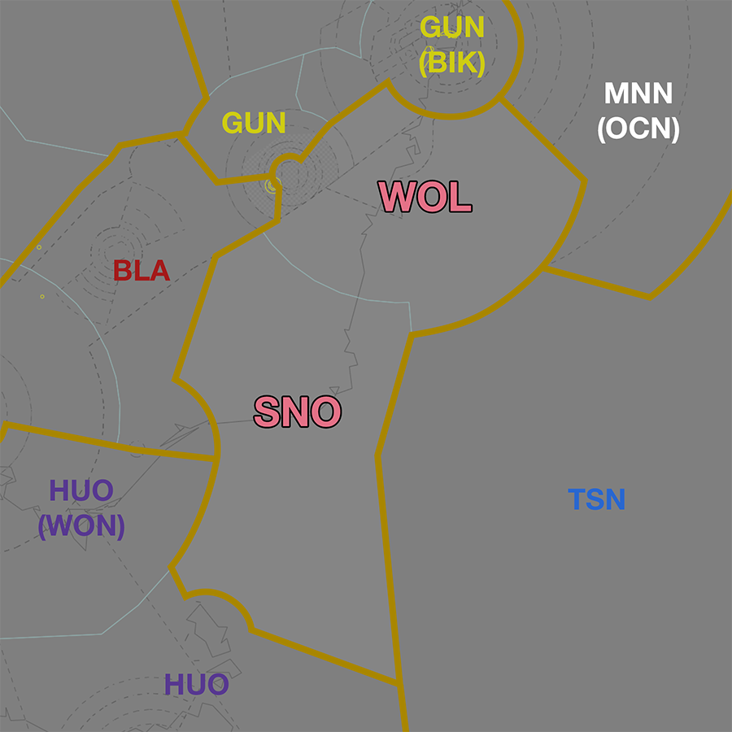
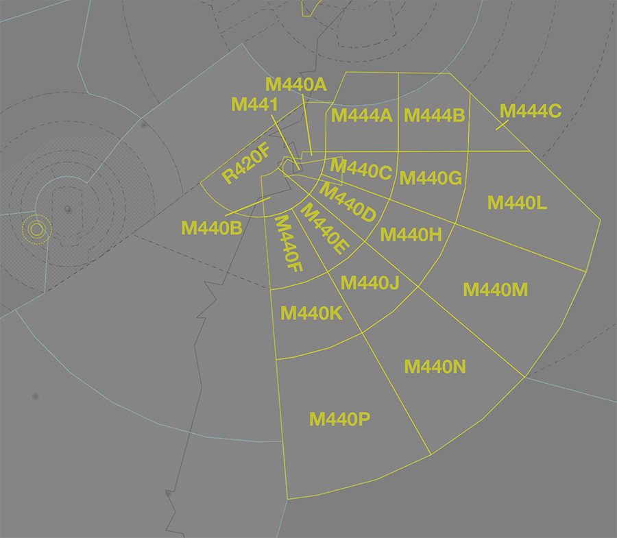
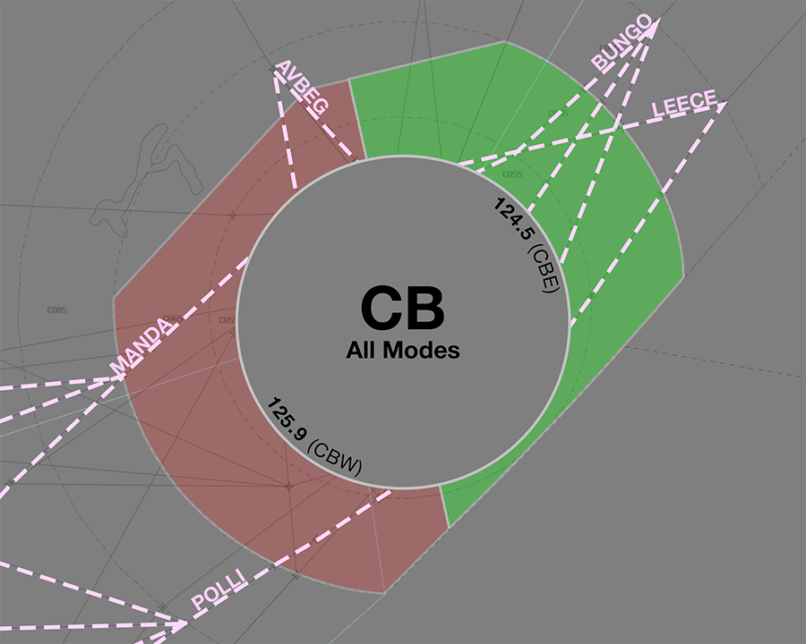

--8<-- "includes/abbreviations.md"
## Positions

| Name                | ID      | Callsign             | Frequency   | Login ID       |
| ------------------- | ------- | -------------------- | ----------- | -------------- |
| **Wollongong**      | **WOL** | **Melbourne Centre** | **125.000** | **ML-WOL_CTR** |
| Snowy :material-information-outline:{ title="Non-standard position"} | SNO | Melbourne Centre | 124.000 | ML-SNO_CTR |

!!! abstract "Non-Standard Positions"
    :material-information-outline: Non-standard positions may only be used in accordance with [VATPAC Air Traffic Services Policy](https://vatpac.org/publications/policies){target=new}.  
    Approval must be sought from the **bolded parent position** prior to opening a Non-Standard Position, unless [NOTAMs](https://vatpac.org/publications/notam){target=new} indicate otherwise (eg, for events).

## Airspace

<figure markdown>
{ width="500" }
  <figcaption>Wollongong Airspace</figcaption>
</figure>

### Reclassifications
=== "CB CTR"
	When **CB TCU** is offline, CB TCU (Class C `SFC` to `A085`) reverts to Class G, and is administered by WOL. Alternatively, WOL may provide a [top-down approach service](../../../terminal/canberra) if they wish.

	!!! tip
		If choosing *not* to provide a top down service, consider publishing a pre-formatted **ATIS Zulu** for the aerodrome, to inform pilots about the airspace reclassification.

=== "NW CTR"
	The restricted airspace around YSNW is classified as Class G by default, and is only reclassified as controlled airspace when **NWA** is online. When **NWA** is offline, the area remains Class G, and is administered by WOL.

## Departure and Arrival Procedures
### YMES
#### STAR Assignment
The following subsectors are responsible for issuing STAR clearance.

| Subsector | STAR | Type | Notes |
| ---- | ----- | -------- | ----- |
| SNO  | LAREX TREVR | All     | |

#### Sequencing
SNO is responsible for sequencing arrivals at YMES arriving from the east.

### YSCB
#### STAR Assignment
The following subsectors are responsible for issuing STAR clearance.

| Subsector | STAR | Type | Notes |
| ---- | ----- | -------- | ----- |
| WOL  | BUNGO LEECE | Non-Jet Jet^ | |

!!! note
	^ GUN(BIK) will issue STAR clearances to jet aircraft overflying the SY TCU en route to YSCB. WOL will issue STAR clearances to all other jet aircraft.

#### Sequencing
Sequencing arrivals from the east and northeast into YSCB is a responsibility of WOL.

##### Holding Fixes
Refer to the vatSys Enroute Holds map for details of published holds on the airways inbound to YSCB. Where delays necessitate holding, aircraft should be instructed to hold at the following positions. The listed time should be subtracted from an aircraft's assigned feeder fix time to determine when they should leave the hold.

| Feeder Fix | Holding Fix | Time from Hold to Feeder Fix |
| ------ | ---------- | ---- |
| MANDA  | NONUP      | Jets: 3 min Non-Jets: 4 min |
| Others | Feeder Fix | - |

##### Adjacent Feeder Fixes
Aircraft assigned the **same runway** inbound via **LEECE** and **BUNGO**, must be considered to be on the **same STAR** for sequencing purposes. That is, they must be at least **2 minutes** apart at their respective Feeder fixes.

### YSNW
WOL is responsibile for facilitating operations in and out of YSNW.

## Local Procedures
### Special Use Airspace

There are multiple volumes of [SUA](../../../controller-skills/sua) within WOL airspace associated with military operations in and out of YSNW.

<figure markdown>
{ width="700" }
  <figcaption>Notable SUA in WOL Airspace</figcaption>
</figure>

Each TCU must [give heads up coordination](../../../controller-skills/coordination/#airways-clearance) with the relevant enroute controllers **prior** to any departures intending to operate in a currently inactive SUA.

!!! phraseology
    **NWA** -> **WOL**: "On the groud YSNW, SWFH12, requests activation of R420F `F125-F300`, from 0300 until 0500.”  
    **WOL** -> **NWA**: "SWFH12, expect activation of R420F `F125-F300` at 0300 until 0500."   
    **NWA** -> **WOL**: "SWFH12."   

Non-participating aircraft intending to transit an activated SUA should be rerouted, where possible, [subject to the VATSIM Code of Conduct](../../../sua/#ad-hoc-activations).

#### R420F Nowra
The R420F Nowra [restricted area](../../../controller-skills/sua/#restricted-areas) is located over YSNW, `F125-F300`, located entirely in WOL airspace. 

The resricted area sits directly above the NWA TMA and when NWA is online aircraft will be transferred directly to/from the SUA. When [NWA is offline](#reclassifications), aircraft will contact WOL for transit through the surrounding civilian airspace.

##### Affected Civil Operations
When activated, the restricted areas disrupt traffic on the **H20** and **H536** high altitude airways which are used by aircraft travelling between YSSY and Tasmania.

Aircraft may be given an additional requirement to climb above the vertical limits of the activation, or rerouted manually to avoid the area.

!!! tip  
    Activation of the R420F **significantly increases** the workload for **WOL** and **SDS**, as the airspace available for YSSY departures via WOL. During peak periods (such as [Milk Run Monday](../../../events/milkrun)), activation of the restricted area should not be approved.
    
#### M440-P Tasman Sea
The M440-P Tasman Sea [MOAs](../../../controller-skills/sua/#military-operating-areas) are located east of YSNW and extend into the Tasman Sea, `NOTAM-NOTAM`, located entirely in WOL airspace. 

The restricted area sits directly above the NWA TMA and when NWA is online aircraft will be transferred directly to/from the SUA. When [NWA is offline](#reclassifications), aircraft will contact WOL for transit through the surrounding civilian airspace.

## STAR Clearance Expectation
### Handoff
Aircraft being transferred to the following sectors shall be told to Expect STAR Clearance on handoff:

| Transferring Sector | Receiving Sector | ADES | Notes |
| ---- | -------- | --------- | --------- |
| WOL | BLA | YMML, YMAV | Jets only |
| WOL | GUN | YSSY | |
| SNO | HUO(WON) | YMML | 
| SNO | HUO | YMHB | |

## Terminal Handover Frequencies
Aircraft being transferred from enroute to a TCU with multiple frequencies shall be given the frequency for the revelant TCU position.

=== "SY TCU"
	=== "07AD"
		<figure markdown>
		{ width="500" }
		  <figcaption>SY TCU Handover Frequencies - 07AD Mode</figcaption>
		</figure>
		
	=== "25AD"
		<figure markdown>
		{ width="500" }
		  <figcaption>SY TCU Handover Frequencies - 25AD Mode</figcaption>
		</figure>
	=== "16 PROPS"
		<figure markdown>
		{ width="500" }
		  <figcaption>SY TCU Handover Frequencies - 16 PROPS Mode</figcaption>
		</figure>
	=== "34 PROPS"
		<figure markdown>
		{ width="500" }
		  <figcaption>SY TCU Handover Frequencies - 34 PROPS Mode</figcaption>
		</figure>
	=== "SODPROPS"
		<figure markdown>
		{ width="500" }
		  <figcaption>SY TCU Handover Frequencies - SODPROPS Mode</figcaption>
		</figure>

	| ADES | STAR  | Frequency (Controller) |
	| ---- | ----- | ---------------------- |
	| YSSY | BOREE | **124.400** (SAN)      |
	| YSSY | MARLN | **124.400** (SAN)      |
	| YSSY | MEPIL | **124.400** (SAN)      |
	| YSSY | AKMIR | **128.300** (SAS)      |
	| YSSY | RIVET | **128.300** (SAS)      |
    | YSCN | PRAWN | **124.400** (SAN)      |
    | YSBK | WHALE | **124.400** (SAN)      |
    | YSRI | RITSU | **135.900** (SRA)      |
    | YSRI | RUPEM | **118.400** (SWA)      |
    | YSWS | BIKUS | **124.400** (SAN)      |
    | YSWS | RIKNI | **124.400** (SAN)      |
    | YSWS | REVKI | **118.400** (SWA)      |
    | YSWS | UNTAV | **135.900** (SRA)      |

	!!! tip
		The quick reference tables above only include scenarios for which there is [voiceless coordination](#sy-tcu). Refer to the diagram for the appropriate position/frequency for coordination and handoff for all other situations.
		
=== "CB TCU"
	=== "All"
		<figure markdown>
		{ width="500" }
		  <figcaption>CB TCU Handover Frequencies</figcaption>
		</figure>

		| STAR  | Frequency (Controller) |
		| ----- | ---------------------- |
		| AVBEG | **125.900** (CBW)      |
		| BUNGO | **124.500** (CBE)      |
		| LEECE | **124.500** (CBE)      |
		| MANDA | **125.900** (CBW)      |
		| POLLI | **125.900** (CBW)      |
	
	!!! tip
		The quick reference tables above only include scenarios for which there is [voiceless coordination](#cb-tcu). Refer to the diagram for the appropriate position/frequency for coordination and handoff for all other situations.

## Coordination
### SY TCU
#### Airspace
SY TCU is responsible for the airspace within a 45nm radius of TESAT, `SFC` to `F285`.

Refer to [Sydney TCU Airspace Division](../../../terminal/sydney/#airspace-division) for information on airspace divisions when any child position of **SAS** is online.

#### Arrivals/Overfliers
**Heads-up** Coordination required for all aircraft entering SY TCU from WOL CTA prior to **20nm** from the boundary.

#### Departures
Voiceless for all aircraft:

- Assigned the lower of `F280` or the `RFL`; and
- that enter WOL airspace via any of the *Green Shaded Corridors* below

<figure markdown>
{ width="700" }
  <figcaption>SY TCU Voiceless Coordination Corridors</figcaption>
</figure>

All other aircraft going to WOL CTA will be **Heads-up** Coordinated by SY TCU.

### CB TCU
#### Airspace
The Vertical limits of the CB TCU are `SFC` to `F245`.

Refer to [Canberra TCU Airspace Division](../../../terminal/canberra/#airspace-division) for information on airspace divisions when **CBW** is online.

Refer to [Reclassifications](#cb-tcu) for operations when CB TCU is offline.

#### Arrivals/Overfliers
Voiceless for all aircraft:

- With ADES **YSCB**; and  
- Assigned a STAR; and  
- Assigned `F130`

All other aircraft coming from WOL CTA must be **Heads-up** Coordinated to CB TCU prior to **20nm** from the boundary.

#### Departures
**Heads-up** Coordination required for all aircraft entering WOL CTA prior to the boundary.

### NW TCU
#### Airspace
NW TCU owns the Class C airspace within the R421A and R421B restricted areas `SFC` to `F125`.

#### Arrivals/Overfliers
Voiceless for aircraft:

- With ADES **YSNW**; and 
- Tracking via **NWA** or **NWR**; and  
- Assigned `F130`

All other aircraft coming from WOL CTA will be **heads-up** coordinated to NW TCU.

#### Departures
Voiceless for aircraft:

- Tracking via a Procedural SID terminus; and
- Assigned the lower of `A100` or the `RFL`

!!! note
    Aircraft are *not required* to be tracking via the **SID procedure**, simply tracking via any of the terminus waypoints (regardless of *departure airport* or *assigned SID*) is sufficient to meet the criteria for **voiceless coordination**.

All other aircraft going to WOL CTA must be **heads-up** coordinated by NW TCU prior to the boundary.

### Enroute
As per [Standard coordination procedures](../../../controller-skills/coordination/#enr-enr), Voiceless, no changes to route or CFL within **50nm** to boundary.

That being said, it is *advised* that WOL/SNO give **Heads-up Coordination** to the relevant sector, prior to **50nm** from the boundary, for **any aircraft not on the Q29 or V169 airways**. 

#### TSN (Oceanic)
As per [Standard coordination procedures](../../../controller-skills/coordination/#pacific-units), Voiceless, no changes to route or CFL within **15 mins** to boundary.

Aircraft must have their identification terminated and be instructed to make a position report on first contact with the next (procedural) sector.

!!! phraseology
    **SNO**: "QFA121, identification terminated, report position to Brisbane Radio, 124.65"

### WOL Internal
As per [Standard coordination procedures](../../../controller-skills/coordination/#enr-enr), Voiceless, no changes to route or CFL within **50nm** to boundary.
