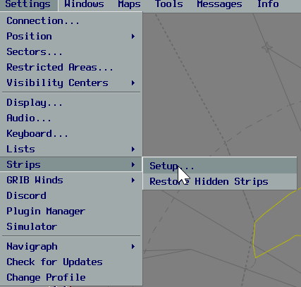
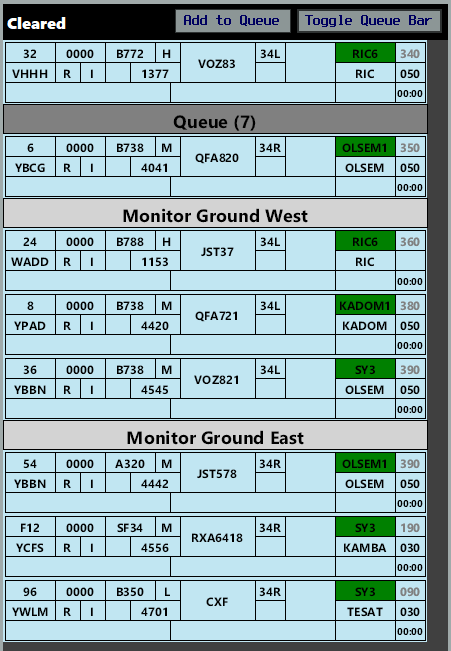

--8<-- "includes/abbreviations.md"

## Positions
An additional Non-Standard position for Sydney ACD will be used

| Name               | ID      | Callsign       | Frequency        | Login ID              |
| ------------------ | --------------| -------------- | ---------------- | --------------------------------------|
| [Sydney (Assistant) Delivery](#dual-acd-controller-operations)     | SY-C_DEL | N/A             | N/A | SY-C_DEL                              |

## Runway Modes
**16 PROPS** and **34 PROPS** are the available Runway Modes, with equal preference. Any other Runway Mode may **only** be used with approval from the Events Coordinator.

## Workload Management
Due to the extreme workload expected for all positions, the use of the OzStrips plugin for managing aerodrome positions is **mandatory**. Controllers should familiarise themselves with the plugin and the VATPAC [recommended workflow](../../../../client/towerstrips/#recommended-workflow). 

## Airways Clearance Delivery (ACD)
### Flight Plan Compliance
Ensure **all flight plans** are checked for compliance with the approved WF Route:

`DCT TESAT A576 KADOM H44 MAXEM Q60 KAKLU H309 AD DCT`

**OzStrips** will flag any *non-compliant* WF route.

If an aircraft has filed an *incorrect* route and you need to give an amended clearance, this amendment must be specified by **individual private message**, prior to the PDC.

!!! phraseology
    **SY-C_DEL:** *"AMENDED ROUTE CLEARANCE. CLEARED TO YPAD VIA KADOM H44 MAXEM Q60 KAKLU H309 AD DCT. READBACK AMENDED ROUTE IN FULL DURING PDC READBACK. STANDBY FOR PDC."*

### WorldFlight Teams
[WorldFlight Teams](../../#official-team-callsigns) shall have `STS/STATE` added to their remarks, and `WF TEAM` added to their Global Ops Field, to ensure they receive priority.

!!! tip
    The [vatSys Events Plugin](https://github.com/badvectors/EventsPlugin){target=new} will also highlight WF Teams, as shown below. Click on the link to install it, or alternatively, use the [Plugin Manager](https://github.com/badvectors/PluginManager){target=new}

    <figure markdown>
    { width="400" }
    <figcaption>WF Team Highlight with Events Plugin</figcaption>
    </figure>

### Strip Setup
By default, vatSys strips will be set to show in *Alphabetical* Order.  
This must be changed to be ordered by **Time**, as shown below.

<figure markdown>
{ width="500" }
    <figcaption>Strips Menu</figcaption>
</figure>

<figure markdown>
{ width="500" }
    <figcaption>Change to Time</figcaption>
</figure>

By default, the OzStrips Preactive bay will already be ordered by when the aircraft connected to VATSIM, from bottom to top.

### Dual ACD Controller Operations
YSSY will have a non-standard second ACD Controller.

#### SY-C_DEL
**SY-C_DEL** will be responsible for:

- Checking [Flight Plan compliance](#flight-plan-compliance)
- Entering Flight Data (Setting [Runway](#runway-selection), [SID](#sid-selection) and [CFL](../../../../aerodromes/classc/Sydney/#auto-release))
- Sending [PDCs](#pdcs)

SY-C_DEL has *no frequency*, and will not talk to aircraft by voice.

Work through the OzStrips Preactive bay from *bottom to top* when sending PDCs.

#### SY_DEL
**SY_DEL** will be responsible for:

- Handling [PDC](#pdcs) Readbacks
- All the tasks of [SY-C_DEL](#sy-c_del) for aircraft that call for clearance

### Runway Selection
By default, assign aircraft the departure runway that corresponds to their departure apron (ie, **16L/34R** on *East* Apron, **16R/34L** on *West* Apron).

### SID Selection
Non-Standard SIDs are in use for Runway 16L and 34R.

| Runway | SID |
| ---------- | --- |
|  16R  | GROOK1KADOM |
|  34L  | KADOM1 |
|  16L/34R  | SY3 |

### Departure Frequency
Departures from Runway 16R and 34L shall be given the SDN frequency (123.0).  
Departures from Runway 16L and 34R shall be given the SDS frequency (129.7).

### PDCs
PDCs will be in use by default, to avoid frequency congestion. ACD shall send a PDC to each aircraft as they connect, prioritising those who connected first. Upon successful readback of the PDC, ACD shall direct the pilot to contact Coordinator when ready for pushback or taxi.

!!! tip
    OzStrips displays strips in the Preactive bay ordered by connection time. Aircraft who connected first are shown down the bottom of the bay.

## Coordinator
Coordinator operations shall be conducted in accordance with the Sydney Aerodrome [Coordinator](../../../../aerodromes/classc/Sydney/#sydney-coordinator) procedures, using the OzStrips plugin.

!!! warning "Important"
    Official WorldFlight teams should be afforded priority when requesting pushback or taxi (if no pushback required), and placed ahead of other non-official aircraft.

### OzStrips
All aerodrome controllers must be familiar with the VATPAC [recommended workflow](../../../../client/towerstrips/#recommended-workflow) for OzStrips.

Coordinator must place a `MONITOR GROUND EAST` & `MONITOR GROUND WEST` bar in the **Cleared Bay Queue** and queue any aircraft who request pushback or taxi (if no pushback required) in the Cleared Bay.

<figure markdown>
{ width="500" }
</figure>

When less than **three** strips are present below a particular `MONITOR GROUND` bar, Coordinator may instruct the bottom most aircraft in the queue to monitor that SMC frequency.

A Custom `PDC SENT` bar should be created in the Preactive window, to keep track of who has and hasn't received a PDC.

<figure markdown>
{ width="500" }
    <figcaption>An example of the Coordinator layout</figcaption>
</figure>

If three strips are already present below a respective bar, any subsequent aircraft who request pushback must be instructed to remain on the Coordinator frequency, and an estimated delay given if known. Place these strips in the **Cleared Bay Queue**, but above the respective `MONITOR GROUND` bars. The bottom-most strip is always at the front of any queue.

!!! phraseology
    **QFA452**: "Sydney Coordinator, Qantas 452, bay 5, request pushback"  
    **SY COORD**: "Qantas 452, Sydney Coordinator, monitor ground 121.7"  
    ...  
    **VOZ318**: "Sydney Coordinator, Velocity 318, bay 39, request pushback"  
    **SY COORD**: "Velocity 318, Coordinator, remain this frequency, approximate 5 minute delay due traffic congestion"

!!! warning "Important"
    Ensure aircraft are [squawking mode C and the correct code](../../../../client/towerstrips/#strips) before instructing them to monitor ground.

### Delay Expectation
Aircraft can expect **extensive** delays for Pushback during the event, possibly *multiple hours*. Try to keep pilots informed of their delay expectation, either by providing a figure in minutes, or a position in the queue.

!!! phraseology
    **JST764**: "Sydney Coordinator, JST764, bay 55, request pushback"  
    **SY COORD**: "JST764, Coordinator, remain this frequency, number 62 in the queue"

## Surface Movement Control (SMC)
### OzStrips
With two SMC controllers online, utilise [strip bay bars](../../../../client/towerstrips/#multiple-adcsmc-positions) to keep the **Taxi** and **Holding Point** strip bays organised.

### Departures
With Coordinator online, aircraft will request pushback on the Coordinator frequency and be told to monitor the applicable SMC frequency when appropriate. These pilots will be waiting for you to initiate contact with them.

When workload (and holding point congestion) allows, issue pushback to the **bottom most** aircraft below the `MONITOR GROUND EAST` or `MONITOR GROUND WEST` bar (as appropriate) and move the strip to the **Pushback Bay**.

!!! warning "Important"
    It is preferable to hold aircraft on the bay (where they aren't blocking taxiways or burning their holding fuel) when congestion leads to blocked holding points. Issue pushback with enough lead time to prevent large gaps in the departure sequence.

### A388 Taxi Routes
[YSSY Aerodrome Ground Movement Chart](https://www.airservicesaustralia.com/aip/current/dap/SSYAG01-175_05SEP2024.pdf){target=new} specifies taxi routes for A388 aircraft. These must be **disregarded** for the event, and standard taxiways must be used for A388 aircraft to facilitate orderly flow of traffic.

### Separation Assurance
Both SMC positions must be careful to ensure separation is assured at all times, particularly through the complex taxiway intersections at Sydney.

With runways 34L/R in use for departures, SMC East should consider instructing aircraft taxiing southbound on Charlie to initially hold short of Golf (to avoid conflict with aircraft taxiing from DOM2 and eastward). After crossing the runway, consider instructing aircraft to hold short of Bravo 10 (to avoid conflict with inbound aircraft from 34R). Inbound aircraft should be instructed to hold short of Bravo 8 (to give way to aircraft vacating 34L at the rapid exit).

During PROPS, maximum use of runway 07/25 should be utilised to enable an east/westbound split between taxiway Golf and the runway.

SMC West should protect the Alpha 2 rapid exit and utilise taxiways Yankee and Juilet as a second path for aircraft when Golf and Alpha are already occupied. Be careful taxiing outbound aircraft south of Juliet while an aircraft is landing on runway 34L, as they will plan to vacate via Alpha 2.

## Tower Control (ADC)
### OzStrips
With two SMC controllers online, utilise [strip bay bars](../../../../client/towerstrips/#multiple-adcsmc-positions) to keep the **Holding Point** and **Runway** strip bays organised.

### Departure Spacing
While PROPS are in use, subsequent departures from the same runway **must** be spaced by **3 minutes**, to assist with arrival flow in to YPAD.

If a single runway is in use for departures, subsequent departures **must** be spaced by **90 seconds**.

### SY3 Assigned Heading
Runway 16L/34R Departures will be assigned the **SY3** RADAR SID, with an Assigned Heading of **H120**.

### Runway Vacating Instructions
To avoid creating conflict for SMC, ADC shall instruct all arriving aircraft to vacate via the following exits when issued a landing clearance:

| Landing Runway | Exit |
| -------------- | ---- |
| 16R | B7 (left) or A4 (right) |
| 16L | T3 or T4 |
| 34L | A2 (left) or B9 (right) |
| 34R | T2 or U1 |

!!! phraseology
    **SY ADC**: "JST554, vacate via B9 to the right, runway 34L, cleared to land"

## ATIS
The ATIS OPR INFO shall include:  
`EXP CLR VIA PDC, ALL ACFT EXP INTERSECTION DEPARTURE`

## Coordination
### SY TCU
#### Auto Release
Standard as per [YSSY Local Instructions](../../../../aerodromes/classc/Sydney/#auto-release), with the exception of auto-release being available for the following:

- 16L/34R Departure SID: **SY3** RADAR
- 16L/34R Standard Assignable Departure Heading: **H120**

#### Departures Controller
Departures from Runway 16R and 34L shall be handed off to SDN.  
Departures from Runway 16L and 34R shall be handed off to SDS.