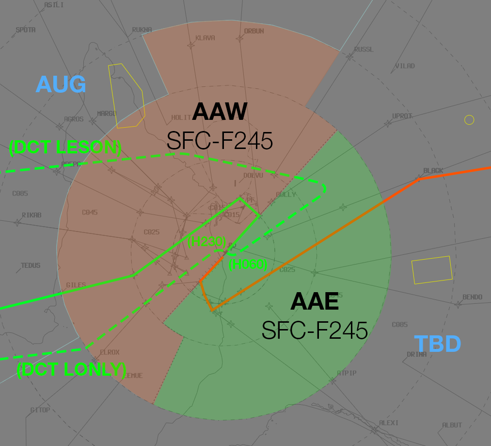
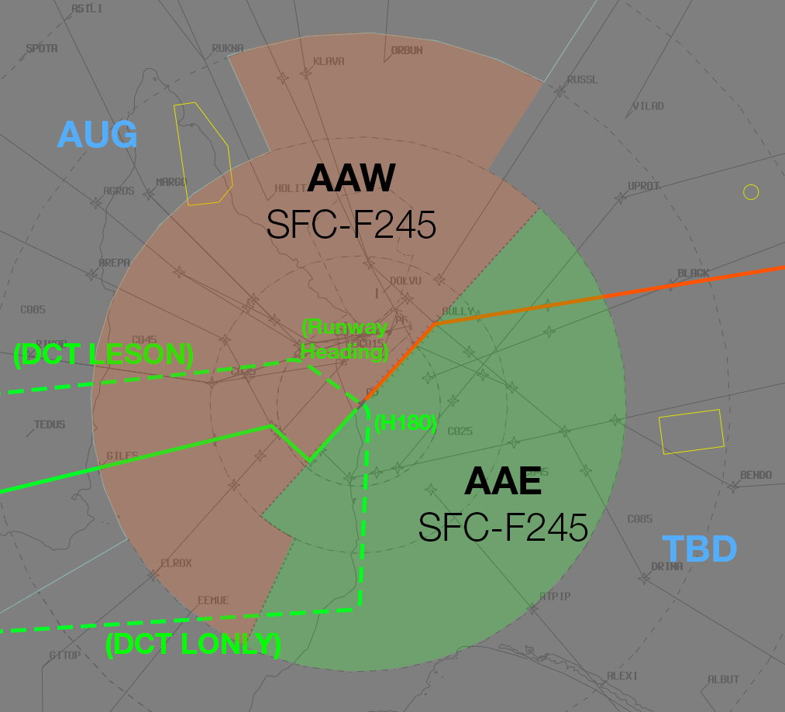

--8<-- "includes/abbreviations.md"

## Airspace Division
Standard airspace division will be in use as per [AD TCU Local Instructions](../../../../../../terminal/adelaide/#airspace-division).

## Runway Modes
Depending on wind limitations, there are four possible Runway Modes in use at YPAD:

- 23A30AD
- 23A12D
- 05A30AD
- 05A12D

The **red** line represents the STAR to the arrival runway.  
The **solid green** line represents the SID to **GILES**.  
The **dashed green** line represents the *suggested vectors* for [12/30 departures](#1230-departures).

### 05

<figure markdown>
{ width="700" }
  <figcaption>05 Arrival/Departure Routes</figcaption>
</figure>

All arrivals on Runway 05 will be cleared for the **RNP Z** Approach.  
All arrivals on Runway 30 will be cleared for the **RNP** Approach. Visual approach may be availale on request, weather permitting.

### 23

<figure markdown>
{ width="700" }
  <figcaption>23 Arrival/Departure Routes</figcaption>
</figure>

All arrivals on Runway 23 will be cleared for the **ILS** Approach.  
All arrivals on Runway 30 will be cleared for the **RNP** Approach. Visual approach may be availale on request, weather permitting.

### 12/30 Departures
Not all aircraft will be able to accept 12/30 for Departure. AAW/AAE must vector 12/30 Departures clear of the 05/23 Arrivals and Departures.

Aircraft **north** of the GILES SID will be cleared DCT **LESON**.  
Aircraft **south** of the GILES SID will be cleared DCT **LONLY**.

## Flow
AFL will formulate the sequence in accordance with the [AD TCU Flow Table](../../../../../../terminal/adelaide/#flow). Ensure that event traffic gets priority over non-event traffic.

AFL will construct the sequence via the [Arrivals List Window](../../../../../../controller-skills/sequencing/#arrivals-list).

Appropriate annotations for the Arrivals List Window can be found [here](../../../../../../client/annotations/#sequencingflow).

### Runway 30 Spacing
When Runway 30 is in use for arrivals, arrivals shall be spaced out in a **+2/+2/+1** pattern.

| Number | Runway | Gap (mins) | Example Landing Time |
| ---------- | --- | --- | --- |
| 1      | 30 | | L00 |
| 2      | 05/23 | +2 | L02 |
| 3      | 05/23 | +2 | L04 |
| 4      | 30 | +1 | L05 |
| 5      | 05/23 | +2 | L07 |
| 6      | 05/23 | +2 | L09 |
| 7      | 30 | +1 | L10 |

That is, two arrivals in to Runway 05/23 spaced out by 2 minutes each, followed by 1 arrival in to Runway 30 spaced out by 1 minute, and repeated.

#### Times
**DRINA** to Runway 30 Threshold via **PADEL** is **12 minutes**. Subtract **1 minute** if assigned MX or CSR.

### Wake Turbulence Separation
Due to the tight sequence, there are times that [Wake Turbulence Separation](../../../../../../separation-standards/waketurb/#airspace) cannot practically be applied.

When a following aircraft is of a *lighter* [Wake Turbulence Category](../../../../../../separation-standards/waketurb/#categories) than the preceding aircraft, a traffic statement and wake turbulence **caution** shall be issued.

!!! phraseology
    **AAE:** "JST762, Traffic is BAW47C, a 747 4nm ahead. Caution Wake Turbulence"  
    **JST762:** "JST762"

### Speeds
TBD will instruct all arrivals to cross **KAKLU**/**DRINA** at **250 knots**, then *published STAR speeds*.

## Coordination
### AD ADC
#### Auto Release
Standard as per [AD TCU Local Instructions](../../../../../../terminal/adelaide/#ad-adc), with the exception of auto-release being available for **12/30 Departures** assigned the following *Standard Assignable Departure Headings*:

| Runway Mode | Runway 12/30 Assigned Heading |
| ---------- | --- |
| 23A30AD      | Runway Heading |
| 23A12D      | H180 |
| 05A30AD      | H230 |
| 05A12D      | H060 |

### AD TCU Internal
Departures from **Runway 12** will transit both AAE and AAW airspace.

Voiceless coordination is in use from AAE to AAW for aircraft:

- Assigned the lower of `F240` or the `RFL`; and  
- Assigned a *Heading* clear of 05/23 Arrivals/Departures

### AAW to AUG
Voiceless for all aircraft:

- Assigned the lower of `F240` or the `RFL`; and  
- Tracking via **GILES**; or  
- North of **GILES**, DCT **LESON**; or  
- South of **GILES**, DCT **LONLY**

All other aircraft going to AUG CTA will be **Heads-up** Coordinated.

### TBD to AAE
Voiceless for all aircraft:

- With ADES **YPAD**; and  
- Assigned `A090`; and
- Assigned the **KAKLU1A/23** STAR; or
- Assigned the **KAKLU1Z/05** STAR; or
- Tracking **DRINA** DCT **PADEL**

TBD has *no Restrictions or Requirements* on YPAD departures tracking DCT **LONLY**

#### Between TBD and AFL
AFL must **voice coordinate** any changes to instructions after TBD has put a `<` on it.

TBD must **voice coordinate** any requests for *Track Shortening*, *CSR*, or *Victor/Xray STARs*, to AFL.