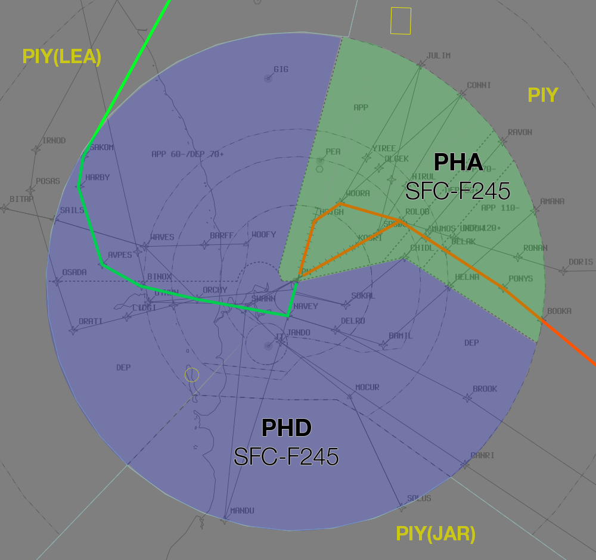
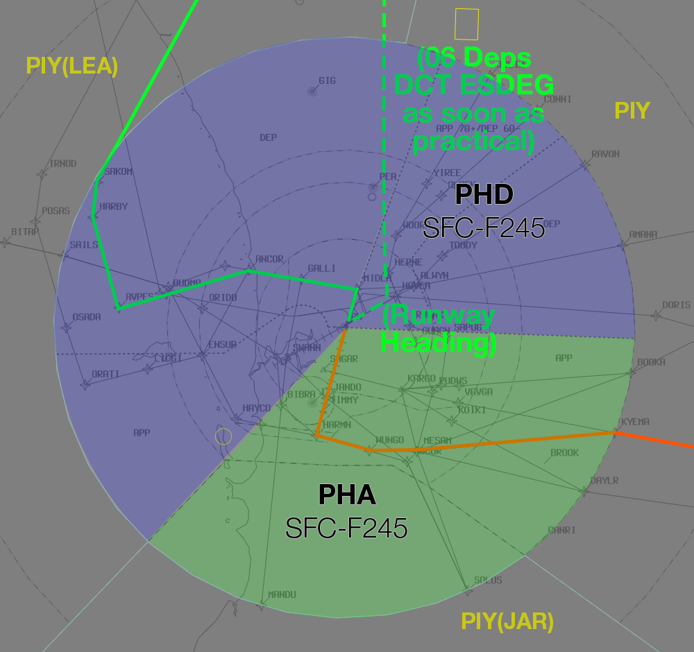
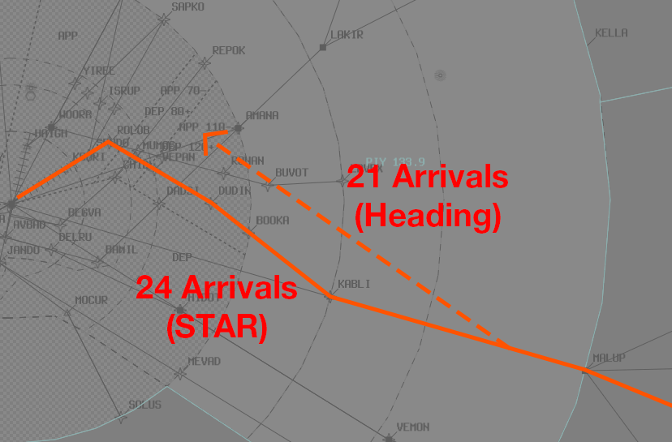

--8<-- "includes/abbreviations.md"

## Runway Modes
Depending on wind limitations, there are two possible Runway Modes in use at YPPH:

### 24A21D
Enroute will assign **Runway 21** to arrivals that *operationally require* it

All arrivals on Runway 21/24 will be cleared for the **ILS** Approach.

#### Airspace Division
Non-Standard airspace division will be in use.

The **red** line represents the STAR to the arrival runway.  
The **solid green** line represents the SID to **AVNEX**.  

<figure markdown>
{ width="700" }
  <figcaption>24A21D Airspace Division</figcaption>
</figure>

### 03A06D
Enroute will enter `XX` in the scratchpad for arrivals that are *unable* to Land and Hold Short of **Runway 06**.

Departures from **Runway 06** will depart on *Runway Heading*, and may be cleared DCT **ESDEG** when practical.

Departures that *operationally require* **Runway 03** will be assigned the **AVNEX5** SID.

All arrivals on Runway 03 will be cleared for the **ILS** Approach.

#### Airspace Division
Non-Standard airspace division will be in use.

The **red** line represents the STAR to the arrival runway.  
The **solid green** line represents the SID to **AVNEX**.  
The **dashed green** line represents the *suggested vectors* for 06 departures.

<figure markdown>
{ width="700" }
  <figcaption>03A06D Airspace Division</figcaption>
</figure>

## Flow
PFL will formulate the sequence in accordance with the [Flow Times](#times) below. Ensure that event traffic gets priority over non-event traffic.

PFL will construct the sequence via the [Arrivals List Window](../../../../../../controller-skills/sequencing/#arrivals-list).

Appropriate annotations for the Arrivals List Window can be found [here](../../../../../../client/annotations/#sequencingflow).

### Times
The times below indicate the number of minutes from **KABLI** to the Runway Threshold on the Alpha STAR.

| Runway | Time |
| ---------- | --- |
| 03      | 16|
| 21      | 16 |
| 24     | 14 |

Subtract **1 minute** if assigned MX or CSR.

### Wake Turbulence Separation
Due to the tight sequence, there are times that [Wake Turbulence Separation](../../../../../../separation-standards/waketurb/#airspace) cannot practically be applied.

When a following aircraft is of a *lighter* [Wake Turbulence Category](../../../../../../separation-standards/waketurb/#categories) than the preceding aircraft, a traffic statement and wake turbulence **caution** shall be issued.

!!! phraseology
    **PHA:** "VOZ721, Traffic is QFA25, a 747 4nm ahead. Caution Wake Turbulence"  
    **VOZ721:** "VOZ721"

### Speeds
PIY will instruct all arrivals to cross **KABLI** at **250 knots**, then *published STAR speeds*.

### Runway 21 vs Runway 24 Arrivals
The **KABLI1A** STAR is approximately **2 minutes** *longer* on Runway 21 vs Runway 24. Take this in to account when building the sequence.

## Coordination
### PH ADC
#### Auto Release
Standard as per [PH TCU Local Instructions](../../../../../../terminal/perth/#ph-adc), with the exception of auto-release being available for **06 Departures** assigned **Runway Heading** during the the [03A06D Runway Mode](#03a06d)

### PHD to LEA
Voiceless for all aircraft:

- Assigned the lower of `F180` or the `RFL`; and  
- Tracking via **AVNEX** or **ESDEG**

All other aircraft going to LEA CTA will be **Heads-up** Coordinated.

### PIY to PHA
Standard as per [PH TCU Local Instructions](../../../../../../terminal/perth/#arrivals), with the exception of:

- During the [24A21D Runway Mode](#24a21d), arrivals assigned **Runway 21** may be handed off to PHA on a **Heading** *north* of the Runway 24 arrivals, without coordination.

<figure markdown>
{ width="700" }
  <figcaption>PIY to PHA 24A21D</figcaption>
</figure>

#### Between PIY/HYD and PFL
PFL will construct the sequence via the [Arrivals List Window](../../../../../../controller-skills/sequencing/#arrivals-list).

Appropriate annotations for the Arrivals List Window can be found [here](../../../../../../client/annotations/#sequencingflow).

PFL must **voice coordinate** any changes to instructions after PIY/HYD has put a `<` on it.

PIY/HYD must **voice coordinate** any requests for *Track Shortening*, *CSR*, or *Victor/Xray STARs*, to PFL.