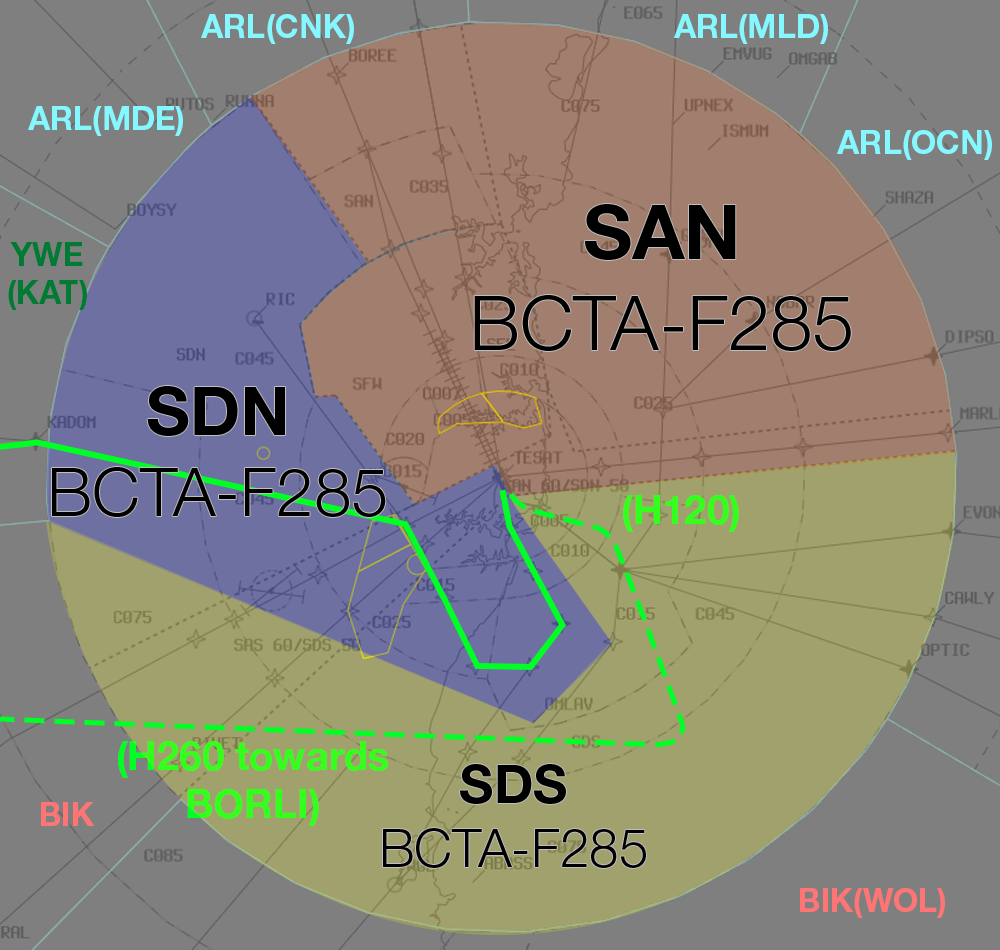
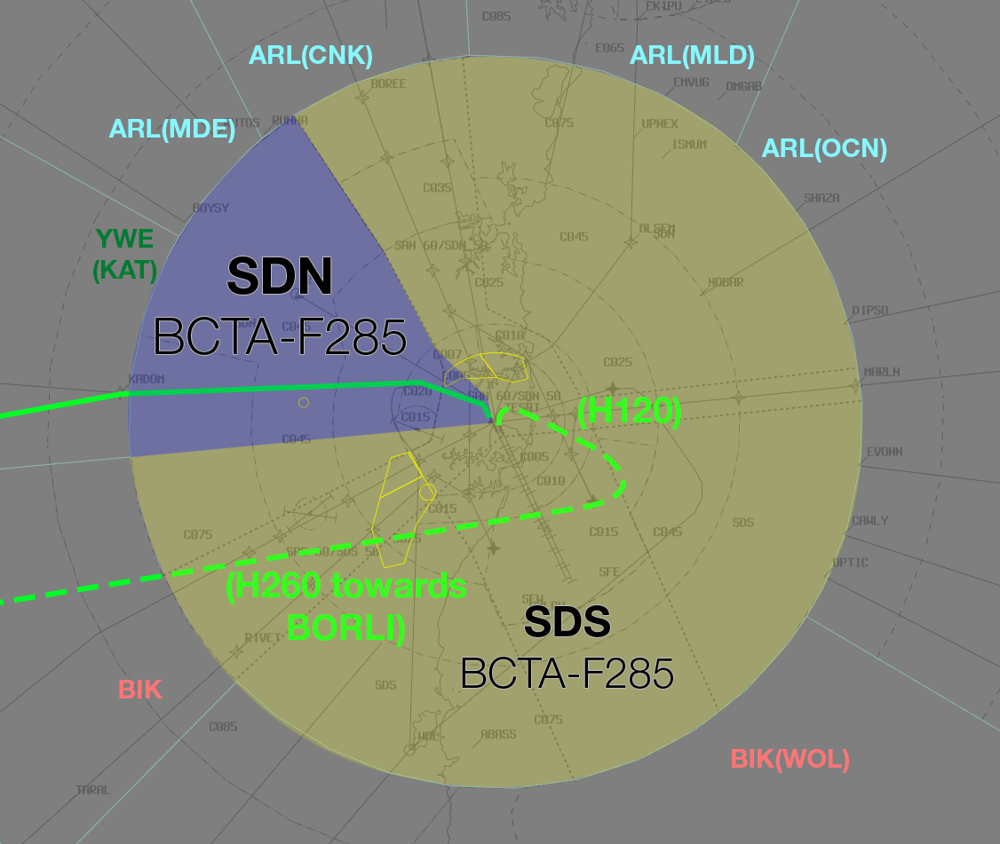

--8<-- "includes/abbreviations.md"

## Airspace Division
Non-Standard airspace division will be in use.

The **solid** green line represents the SID to **KADOM**.  
The **dashed** green line represents the *suggested vectors* for [16L/34R departures](#16l34r-departures).

### 16 PROPS

<figure markdown>
{ width="700" }
  <figcaption>16 PROPS Airspace Division</figcaption>
</figure>

### 34 PROPS

<figure markdown>
{ width="700" }
  <figcaption>34 PROPS Airspace Division</figcaption>
</figure>

## 16L/34R Departures
Departures from 16L/34R will be assigned the **SY3** SID with a heading of **H120**. SDS must then vector the aircraft south of the 16R/34L Departures. Aircraft will be handed off to KAT on a Heading of **H260**.

## Coordination
### SY ADC
#### Auto Release
Standard as per [SY TCU Local Instructions](../../../../../../terminal/sydney/#sy-adc), with the exception of:

- 16L/34R Departure SID: **SY3** RADAR
- 16L/34R Standard Assignable Departure Heading: **H120**

### KAT
KAT will be extending to the BIK subsector.

Voiceless for all aircraft:

- Assigned the lower of `F280` or the `RFL`; and  
- Tracking via **KADOM**; or  
- South of **KADOM**, Assigned **H260**

All other aircraft going to KAT CTA will be **Heads-up** Coordinated.