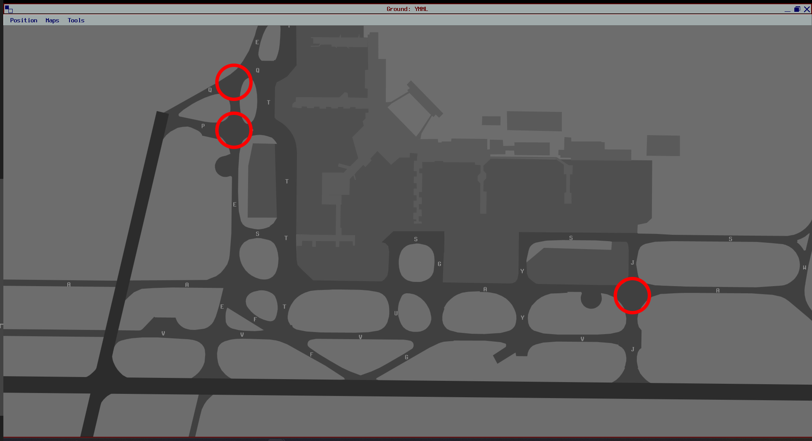
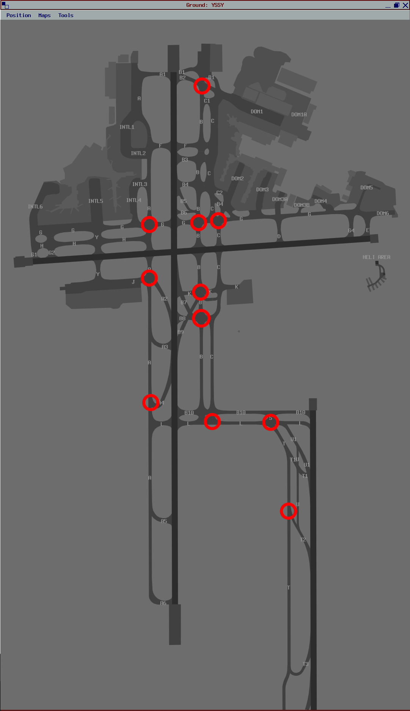

--8<-- "includes/abbreviations.md"

## ACD
The job of the ACD controller during Milk Run is a fairly straight-forward one, however there are a couple of things to be mindful of.

Ensure that all flight plans are correct, nothing like `DOSEL DCT RIVET`, `GPS DIRECT`, or anything else unusual like that, just stick to the pre-approved Jet and Non-Jet routes. This helps reduce workload on Enroute controllers down the line.

### 16 Off Mode Departures at YMML
A Reminder that [Off Mode Departures from Runway 16](../../../aerodromes/classc/Melbourne/#off-mode-departures) to the North East and West during the 16A27D Runway Mode must be assigned the **ISPEG** SID, **NOT** the DOSEL SID. The **ISPEG** SID deconflicts concurrent 16 and 27 departures, whereas the DOSEL SID does not.

### ACD/Coordinator Pushback Requests
Specific procedures apply to the use of [Pushback Requests on ACD](../../aerodromes/classc/Melbourne.md#pushback-requests-on-acd) at YMML and [Coordinator](../../aerodromes/classc/Sydney.md#sydney-coordinator) at YSSY. Ensure that all relevant controllers are following these procedures accurately.

## SMC
### Standard Taxi Routes
[YSSY](../../../aerodromes/classc/Sydney/#standard-taxi-routes) and [YMML](../../../aerodromes/classc/Melbourne/#standard-taxi-routes) both have Published Standard Taxi Routes that can be used to facilitate the orderly flow of traffic on the ground, but this does not preclude the SMC controller from using alternate routing if they deem it neccessary.

### Queuing
When giving taxi clearance, the SMC controller shall consider holding aircraft short of taxiways when in a long queue for a holding point, so that blockages are not caused on crossing taxiways. The Hotspots to pay the most attention to are circled below

<figure markdown>
{ width="700" }
  <figcaption>YMML Taxiway Hotspots</figcaption>
</figure>

<figure markdown>
{ width="700" }
  <figcaption>YSSY Taxiway Hotspots</figcaption>
</figure>

### Protecting Runway Exits
Arriving aircraft *should* hold short of any crossing taxiways upon exiting the runway, but that doesn't mean they always will! Hold short instructions should be used to protect exit taxiways where practical.

#### YMML
In order to protect common Runway Exit Taxiways, Consider instructing aircraft taxiing:  

- Northbound on Taxiway `V`, to Hold Short of Taxiways `F` and `E`  
- Southbound on Taxiway `V`, to Hold Short of Taxiways `G` and `J`

#### YSSY
In order to protect common Runway Exit Taxiways, Consider instructing aircraft taxiing:  

- Northbound on Taxiway `B`, to Hold Short of Taxiway `B8`  
- Southbound on Taxiway `A`, to Hold Short of `Runway 25` *(34 in use)*, or avoid Taxiway `A` if an aircraft is landing on Runway 16R and will be vacating to the right *(16 in use)*

!!! note
    Utilising these hold short instructions also opens up the availability of taxiways `J` and `Y` as alternative taxi routes on the International terminal side

### ACD/Coordinator Pushback Requests
Specific procedures apply to the use of [Pushback Requests on ACD](../../aerodromes/classc/Melbourne.md#pushback-requests-on-acd) at YMML and [Coordinator](../../aerodromes/classc/Sydney.md#sydney-coordinator) at YSSY. Ensure that all relevant controllers are following these procedures accurately.

## ADC
### Runway Modes
Careful selection of the duty runway at an aerodrome is important to ensure safe, expeditious traffic flow. When considering runway configuration, be mindful of the following operational considerations:
<ol>
    <li>Wind direction and speed</li>
    <li>SOP-dictated preferred runway modes</li>
    <li>Traffic flow and efficiency</li>
</ol>

Runway Modes should be selected for maximum aircraft movements, if the winds permit. That is:  

- at YSSY:  
    - **16 PROPS**; or  
    - **34 PROPS**  
- at YMML:  
    - **LAHSO** (with the proper approvals); or
    - **09A16D**; or
    - **27AD34D**; or  
    - **16A27D**

!!! info "Reminder"
    For dry runways, the crosswind limitation is 20kt, and the tailwind limitation is 5kt. For wet runways, no tailwind component is permitted. Remember these limitations in selecting the runway mode which is best optimised and works within these limitations

#### Non-Standard Runway Modes
The usage of non-standard runway modes is **strongly not recommended**, unless approved by a Senior Controller for use in major events. Non-Standard runway modes can cause unintended conflicts in TCU and Enroute airspace that may only slightly reduce an ADC controller's workload, but *dramatically* increase that of the affected TCU or Enroute controller.

!!! example
    At YMML, one of the Preferred Runway Modes is 16A27D. If ADC were to add 16 as a departure runway (16AD27D), this may allow them to get more aircraft to depart. However, Subsequent departures from Runway 16, then via 27, both assigned a DOSEL SID, would be pointed directly at each other in TCU airspace, with no separation assurance. This creates a high workload environment for the TCU controller.

#### Approach Types
At YMML, the approach type in use has neglible affect on the traffic flow.

However, at YSSY, the use of Instrument Approaches vs Independent Visual Approaches during Parallel Runway operations has a big effect on the workload of the Sydney TCU controller, and how close they can run aircraft together on parallel runways. Refer to [YSSY Approach Types](../../aerodromes/classc/Sydney/#approach-types) for more information.

#### Runway Changes
Refer to [Runway Management SOPs](../../../controller-skills/runwaymanagement/#runway-changes) for advice on limiting Runway Mode changes during busy events.

### Departure Spacing
ADC should be aiming for **90 second** spacing between subsequent departures in the same direction (Obviously for Milk Run, almost all departures will be going the same way). Ensure that [Wake Turbulence Separation](../../../separation-standards/runway/#wake-turbulence) is applied when the lead aircraft is of a **heavier** Wake Turbulence category than the following aircraft. It does not need to be applied between two aircraft of the **same** Wake Turbulence category.

### Line Up
It is best practice for ADC to line-up aircraft on the runway as soon as possible, ie, as soon as the landing aircraft has passed them, or as soon as the departing aircraft has started to roll. This minimises time spent waiting for aircraft to taxi in to position, and potentially cause gaps in the sequence and/or go-arounds.

!!! success "Suggestion"
    Appending the phrase "Be ready immediate" to the end of a line up instruction can ensure the pilot has all checklists completed, and is ready to commence takeoff roll as soon as the clearance is given. This reduces airborne delays, and potential go-around situations