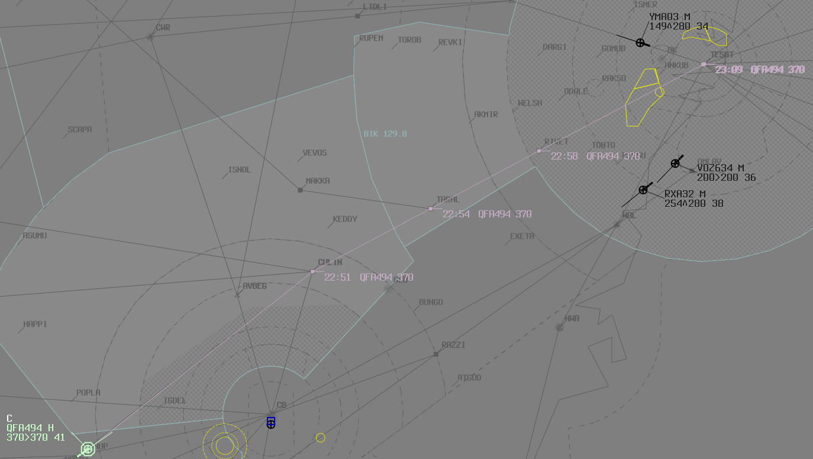
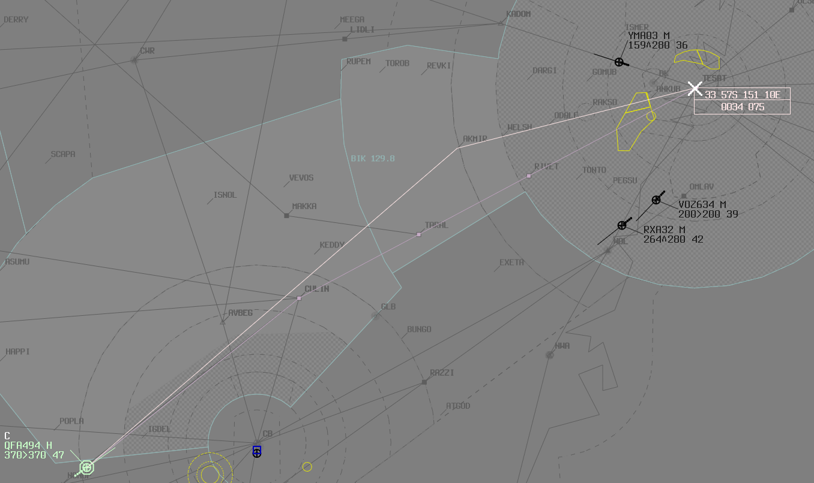
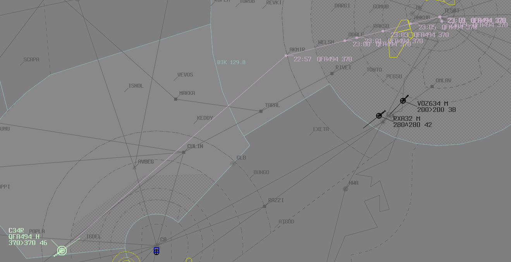

--8<-- "includes/abbreviations.md"

## Early Handoffs
The most important job of the ELW/BLA controller is the sequencing for YMML. Likewise, the most important job of the GUN/BIK controller is the sequencing for YSSY. In order to make the job of these controllers easier, it is beneficial for them to receive aircraft ***as early as possible***, so they can start to execute all the required actions, like assigning a STAR, amending route if required, enacting speed control, and issuing delay vectors or holding if required.

This is most important for the BLA transfer to GUN, as GUN does not have a lot of airspace to complete the YSSY sequence.  
BLA should aim to handoff aircraft to GUN approximately **50nm** to the boundary, unless there is a restriction (which is quite rare). Note that other aircraft going to GUN airspace (ie: Other aircraft on the YMML-YSSY route) are **not** considered a 'Restriction', as the GUN controller can already see them as Blue (Announced) on their display.

!!! info "Reminder"
    [Handoff Rules](../../../controller-skills/coordination/#handoffs) permit turns of up to **45 degrees left/right**, and **climb/descent to any level** after handoff. Keep this in mind when considering how early you can handoff aircraft to the next sector

## Arrival Sequencing
Enroute controllers should be aiming for **2 minute** spacing at the feeder fix between subsequent arrivals. This can be reduced slightly to no less than **10nm**, unless **single runway operations** are in use.

!!! info "Reminder"
    At YMML, aircraft on the BOOIN and BOYSE STARs are considered to be on the same STAR for sequencing purposes. Ie, an aircraft via BOYSE must be sequenced 2 minutes behind an aircraft via BOOIN, and vice versa

### Speed Control
The most common descent profile to expect for a B738/A320 like aircraft is close to **Mach .78, transitioning in to 280kts**. Keep this in mind when applying speed control to aircraft. That being said, when taking control of an aircraft's speed, it is **always** best practice to ask the pilot what their current speed is first, rather than blindly launching in to an assigned speed with no idea what effect it will have.

If applying speed control to multiple aircraft in a sequence, there are some handy rules of thumb to be mindful of:  
- If the lead aircraft is doing the **same IAS** as the following aircraft, the distance between them will **close** at about **0.5nm per minute**  
- If the lead aircraft is going **20kt IAS faster** than the following aircraft, the distance between them will **hold steady**

### Responsibilities
**GUN** and **BIK** are responsible for Sequencing in to **YSSY**. **ELW** and **BLA** are responsible for sequencing in to **YMML**. Although it may seem helpful for other sectors to start to apply speed control to assist with the sequence, sometimes this may hinder natural overtakes from occurring, and create bigger gaps in the sequence, making the job harder for the next controller. It also may not take in to consideration aircraft inbound to the arrival airport from other directions, or that the next controller can create multiple arrival streams.

Best practice is to just focus on providing separation between aircraft (whether that be vertically, laterally, or longitudinally), and only start to apply sequencing techniques once the aircraft reaches the airspace of the responsible sector.

### YSSY Arrivals
#### Runway Assignment
Although the standard runway assignment for arrivals via RIVET is the Western Parallel Runway, eventually, the airspace will get busy enough to warrant distributing arrivals between both the Western and Eastern runways.

#### Amended routing via ODALE
In order to segregate aircraft inbound to different parallel runways, [Amended routing via ODALE](../../../enroute/Melbourne Centre/GUN/#sequencing-into-yssy) should be used for aircraft assigned the Eastern parallel runway (16L/34R). This keeps aircraft segregated in to two distinct arrival streams, and allows a higher volume of arrivals.

Aircraft can be rerouted on first contact via AKMIR, ODALE, then assigned the **ODALE STAR** for 16L/34R.

<figure markdown>
{ width="700" }
  <figcaption>Original Flight Planned Route</figcaption>
</figure>

<figure markdown>
{ width="700" }
  <figcaption>Graphical Reroute via AKMIR, ODALE</figcaption>
</figure>

<figure markdown>
{ width="700" }
  <figcaption>Final routing with Assigned STAR</figcaption>
</figure>

Although this action may be beneficial to the arrival flow for both Enroute and Approach, it goes against the [Standard runway and STAR assignment](../../enroute/Melbourne Centre/GUN/#sequencing-into-yssy) for YSSY Arrivals from the South-west, so must still be coordinated to SAS or SFL (if online)

!!! phraseology
    **GUN** -> **SFL**: "QFA494 will be via ODALE for 34R"  
    **SFL** -> **GUN**: "QFA494 via ODALE, 34R, Roger"  

In order to reduce this coordination, GUN/BIK and SFL/SAS may organise blanket coordination to allow this rerouting at the discretion of the GUN/BIK controller.

<video style="max-width: 100%;" controls>
  <source src="https://vatpac-home.s3.ap-southeast-2.amazonaws.com/ODALE_Reroute_112233f1d1.mp4" type="video/mp4">
  Your browser does not support the video tag.
</video>

<figcaption style="text-align: center;">Demonstration of the ODALE Reroute</figcaption>
