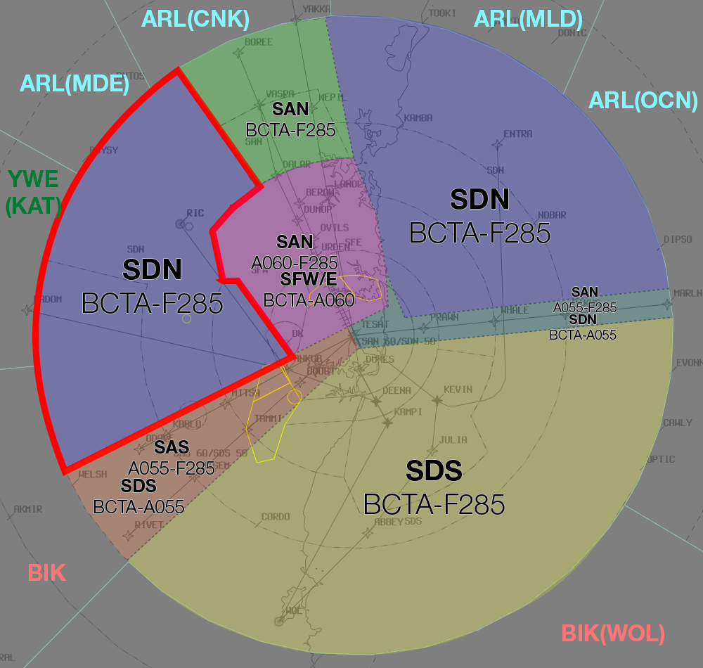

--8<-- "includes/abbreviations.md"

In theory, aircraft should already be nicely sequenced when they enter your airspace, however, this is not always the case. There can also be additional aircraft that come in from other directions that need to be added to the sequence, which can make things challenging.

In general, try to keep any sequencing actions in the TMA as subtle as possible. Hard vectors, if not managed well, can be detrimental to the rest of the sequence, and have a knock-on effect that creates additional workload for quite a while.

Try to use techniques like **30 degree vectors**, and **gentle speed control** to achieve the sequence as required in the TMA.

## SY TMA Roles
When there are multiple controllers online in the Sydney TMA, the workload can be balanced between them as required based on the traffic scenario.

The *recommended* division of duties for **2** controllers is:  

- **Controller 1:**  
    - SAS  
    - SFW  
    - SFE  
- **Controller 2:**  
    - SAN  
    - SDN  
    - SDS  
    - SRI  

The *recommended* division of duties for **3** controllers is:  
- **Controller 1:**  
    - SAS  
    - SAN  
- **Controller 2:**  
    - SFW  
    - SFE  
- **Controller 3:**  
    - SDN  
    - SDS  
    - SRI  

Depending on the Runway Mode, additional portions of airspace may be released between controllers as required to help facilitate the orderly flow of traffic. For example, during the **16 PROPS** Mode, it would be beneficial for SDN to release this portion of airspace to the Approach/Director controller, to facilitate aircraft positioning for a final for Runway 16L/R.

<figure markdown>
{ width="700" }
  <figcaption>SDN West Release</figcaption>
</figure>

## Go-arounds
When there is a go-around in the middle of a bumper-to-bumper sequence, a fair bit of work needs to be done. Obviously there is the additional work of having to vector the aircraft that has gone around back for an approach, but also trying to find a gap for them in the sequence, where none such gap currently exists. This is an important time to use coordination, and get the Enroute controller to create one for you.

!!! phraseology
    **MAE** -> **ELW**: "We've had a Go around. Additional 2 minute delay for all aircraft in this sequence please."  
    **ELW** -> **MAE**: "Copy, additional 2 minute delay for all aircraft in this sequence."  